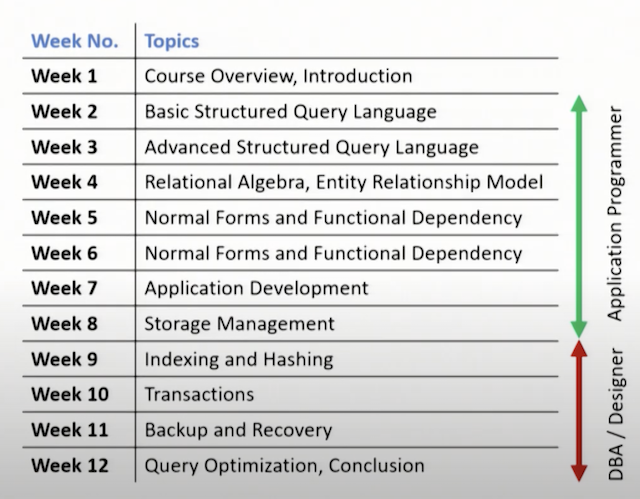
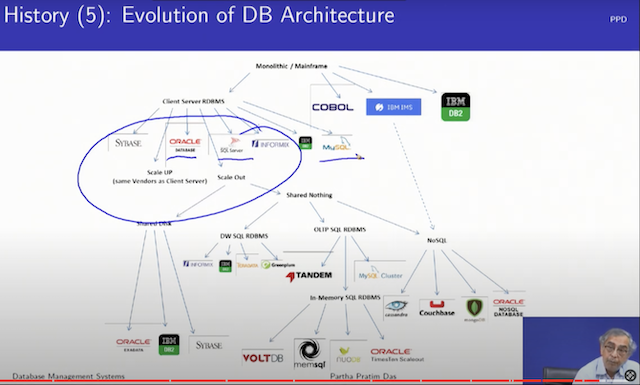
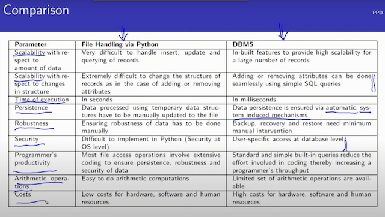
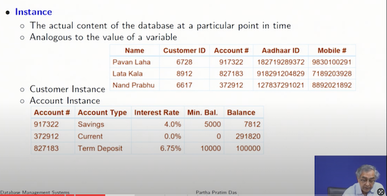
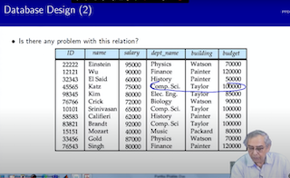
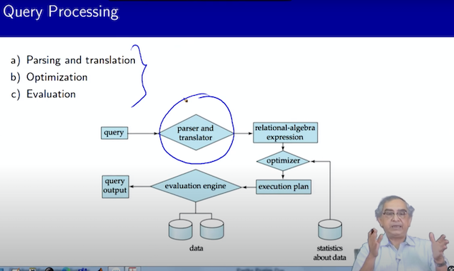

# Week 1 Notes - DBMS

*Prof. Partha Pratham Das, IIT KGP*

## Module 1 (Duration 00:25:39)
[Link](https://www.youtube.com/watch?v=OMHbGm9SQuE&list=PLZ2ps__7DhBYc4jkUk_yQAjYEVFzVzhdU&index=1)

1. DBMS contains information of an enterprise
2. Problems with data in file system:
   1. inconsistencies, redundencies
   2. slow to access, find data
   3. lack of data integrity constraints (you have to write it in code)
      1. hard to maintain integrity constraints
   4. data isolation: hard to separate data and keep them in consistent
   5. Unavailablility of ACID properties
      1. Atomicity
      2. Consistancy
      3. Isolation
      4. Durability
3. Requirements:
   1. Set Theory
   2. Demorgans law, union, intersection, complement, difference, cartesian product
   3. Membership: reflexive, symmetric, asymmetric,transitive, total
   4. Functions: injective, surjective, bijective, composition, inverse
   5. Proposition Logic
      1. truth tables
      2. conjunction (and), disjunction (or), negation (not), implication, equivalence
      3. Closure under operations
   6. Predicate logic
      1. predicates
      2. quantification
         1. existential
         2. universal
   7. Data Structures
      1. Array
      2. List
      3. Binary Search Tree
         1. Balanced Tree
      4. B-Tree
      5. HashMap/Map
   8. Object Oriented Analysis and Design

## Module 2 (Duration 00:28.57)

Electronics Data Management Parameters
1. Durability
2. Scalability
3. Security
4. Retrieval
5. Ease To Use
6. Consistancy
7. Efficiency
8. Cost

## Module 3 (Duration 00:29.02)

[Github: CSV based Banking system](https://github.com/bhaskariitm/transition-from-files-to-db/blob/main/app.py)

### File Vs DBMS

## Module 4 (Duration 00:24.27)
### Levels of abstraction
1. Physical Level defines how the record is stored on Hard disk
2. Logical Level defines how data is stored in DB. Defines relationship, fields
3. View Level:
   1. Hides datatype
   2. Hides information like salary
4. Schema and Instance
   1. Schema is the way the data is organized
   2. Data is the value of the data
   3. Schema:
      1. Physical Schema: Overall physical structure of DB
      2. Logical Schema: overall logical structure of DB
         1. ex: Customer schema: {name, customer_id, account_id, aadhar_id, mobile}
         2. ex: Account Schema: {account_number, account_type, interest_rate, balance}
      3. Looks like schema is the definition of the table... `create table`. It is the structure of the table
   4. Instance is the actual values of the table... from the lecture it appears to be collection of the table records.
   5. instances can be added/removed but schema remains the same unless `alter table`
   6. `Attributes` are field names in a schema.. like account_number, account_type
   

   7. Physical data independence
      1. What Prof. Das is saying is you should be able to modify the physical schema (using `alter table`) without setting the logical table on fire. He is indicating - do not change attribute/field types.
### Data Model
   Is a description of the following
   1. Data (fields, attributes, data types)
   2. Data relationships (like how is this table related to other tables?)
   3. Data semantics (like meaning of this table)
   4. Data Constraints (like what kind of values can a field/attribute take?)
1. `Relational Algebra`!!
### DDL and DML
   1. Data Definition Language
      1. Basically the notation to define schema
      2. `create table` uses it
      3. primary/foreign keys are defined in it
      4. You can also add ACL (Access Control List) to decide who can read/write these tables.
      5. integrity constraints
      6. DDL compiler generates a set of table templates stored in `Data Dictionary`.
      7. All these schema information is also stored in a table. this table is called `Data Dictionary`
   2. Data Manipulation Language or Query Language
      1. insert, update, delete, select
      2. Two classes of language
         1. `Pure` basically its some mathematical way of querying the DB
            1. Relational Algebra
            2. Tuple relational Algebra
            3. Domain relational Algebra
            4. This could be fast, but hard to craft
         2. `Commercial`
            1. Something like SQL (Structured Query Language)
            2. SQL is a DDL and a DML as it can create database schemas and also query the database tables.
### SQL (Structured Query Language)
1. SQL is not turing complete language like C, C#
2. SQL could be embedded in High Level Languages, you can use a JDBC/ODBC driver
### Good design of DB relations and bad designs
1. Basically Prof. Das is talking of not duplicating data by separating entities and keeping a relation between them
2. Normalizing a DB (Normalization Theory)
## Module 5 (Duration 00:29.12)
### Database Design

Database design has 2 components
1. Logical Design
   1. What is the schema?
   2. What are the attributes/fields? What data-type ?
   3. What relational schema ?
      1. Flat schema ?
      2. How to normalize it?
      3. FK, PK ? Indices ?
2. Physical Design
   1. How do you layout the files, the b-trees, transactions in memory

The Database engine can change the physical design while retaining the logical design. This could be possible by physical design conversion.

Database Migration refers to changing the Logical Design Schema and/or migrating old data

### Good or Bad design ?

1. look's like `dept_name` and `building` are categorical variables, `budget` is numeric and all three are redundant. Redundant means a tuple of all the three are identical and repeated!
   1. Also looks like the above variables are tuples.
   2. can you group all these 3 fields/attributes into a single table?
2. Can `ID` be indexed for faster retrieval?
3. You need to factor it 2 tables.
   1. Two ways to do this
      - Entity Relationship Model (ER Model)
      - Normalization Theory
### Object Relational Data Models
   1. Relational Model: this applies to RDBMS. They are flat, and composed of primary types (atom values like char, varchar, int, datetime, string).
      1. Do not compose it with a composite type 🤣
   2. Object Relational Model: These are models that you write in your code. They map to Relational Models.
      1. These can have complex/composite types. Like Person, Company.
      2. Preserves the basic Relational Model foundation.
### Storage Management
1. This is a layer, or interface that does `Physical Level` jobs.
2. uses the Operating System File calls to efficiently store and retrieve data
   1. efficiency means block writes (after transaction) are preferred they are faster of the disk is a magnetic seeking disk or if it's a SSD, it would improve the life (lesser writes is a happy SSD).. ignore this
   2. Issues (just ignore for now, will be covered later)
      1. Storage Access
      2. File Organization
      3. Indexing and Hashing

### Query Processing
1. Parsing and translation
2. Optimization
3. Evaluation

1. Whatever query language you use (SQL or say a custom one) has to be translated to the `Pure`/mathematical/relational algebra expression.
2. The relative algebra expression is optimized and an execution plan is made.
3. `Evaluation Engine` basically records execution plan vs execution timing for the `Statistics about query`
   1. `Optimizer` uses `Statistics about query` engine to chose Execution Plan Strategy

### Transaction Management
1. Transaction is a collection of operations, where success is achieved if all the operations succeed.
   1. If even 1 operation fails, the transaction fails and a rollback is done. The state of the record is NOT changed
   2. If all operations within the transaction block succeeds, then the state of the record is modified.
   3. Transaction ensures that your DB is always consistent.
   4. Think of it as "All or Nothing"
#### Concurrency Transactional Manager
   1. Controls concurrent transactions
      1. Uses `Concurrency Control Mechanisms` of the host OS.
      2. Makes sure that your data is consistent!
      3. Transactions include multiple R-DB tables!
      4. Please research further on this concept, because the same concept can turn up in distributed systems (like in your field of work)
      5. Prof: uses the word `serialize` in the train case. He says
         1. A gets the berth or B gets the berth - but not both A and B
            1. Somehow lock the **entity** in question!
         2. So the R-DB system somehow manages to achieve the above. This is Concurrency Control 
### Database Systems Internal
