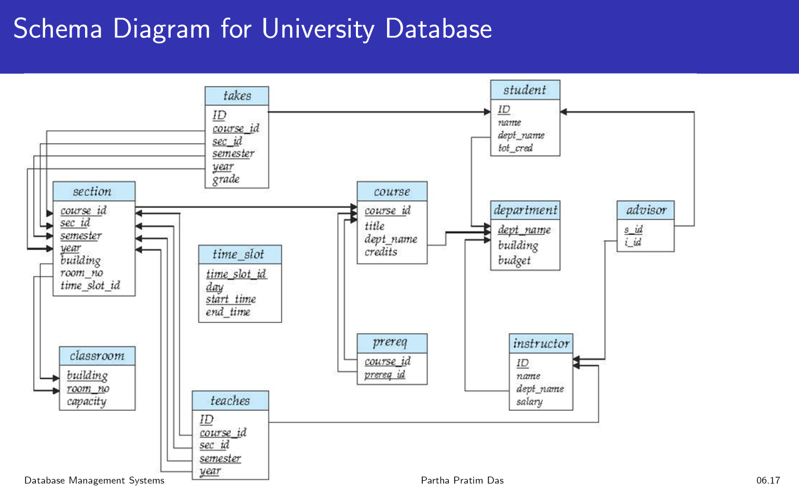
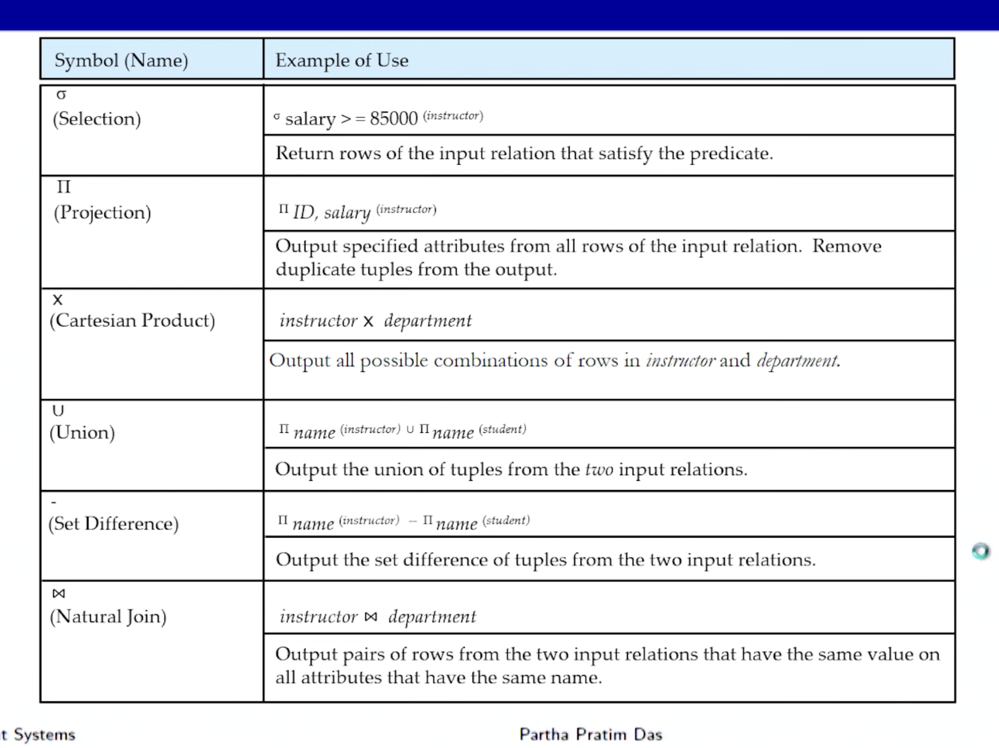
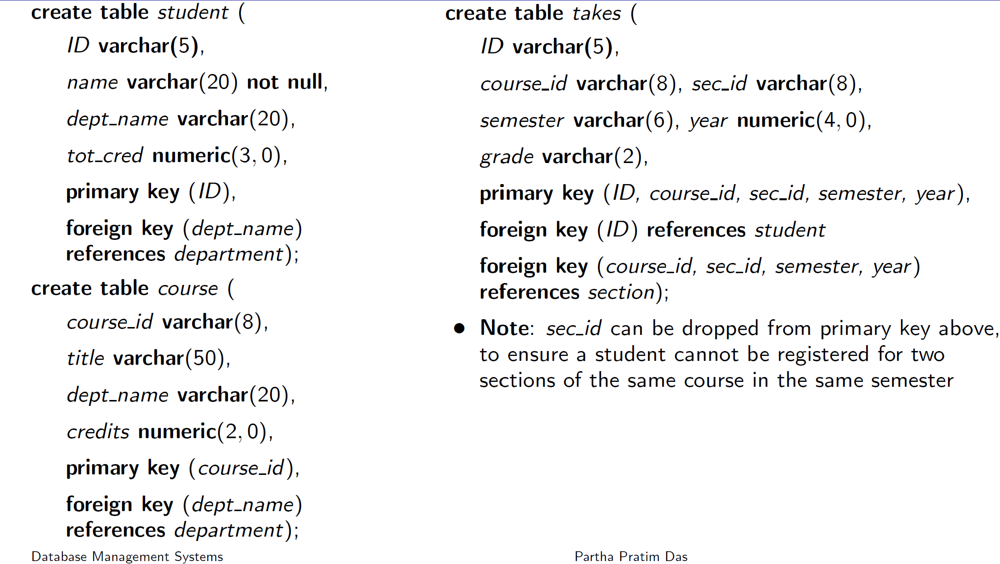

# Week 2 Notes - DBMS

*Prof. Partha Pratham Das, IIT KGP*

*Notes by Adarsh (23f2003570)*  

## [Introduction to Relational Models/1 (00:31:44)](https://www.youtube.com/watch?v=B3cCQagcoao&list=PLZ2ps__7DhBYc4jkUk_yQAjYEVFzVzhdU&index=6&pp=iAQB)

### Attribute type
    1. Attributes are fields or columns of a table
    2. set of values allowed for each attribute is called Domain of the attribute
    3. Attribute values are supposed to be *atomic* that is non divisible.
    4. Attributes can be defined as nullable. - I guess for non value types
### Relation Schema and Instance
   
   Schema can be expressed mathematically as a relation.

   $A_1$, $A_2$ ,..., $A_n$ are attributes
   1. these attributes can be line name, employee-id, date_of_birth etc

   $R=(A_1, A_2, A_3,....,A_n)$ is a *relationship schema*.
   Example instructor = (ID, name, dept_name, salary)  
   instructor = $(String(5) \times String \times String \times Number)$

   $D_1$, $D_2$ ,..., $D_n$ are domains of attibutes $A_1$, $A_2$ ,..., $A_n$

   Then $R \subset D_1 \times D_2 \times D_3 \times ..... \times D_n$

   A relation is a set of n-tuples $(a_1, a_2, ..., a_n)$ where $a_i \in  D_i$

Current values (relation instance) of a relation are specified by a table
### Order of relations
1. Order of tuples/rows are not important
2. No 2 tuples or rows may be identical. They have to be distinct
3. Relation is a set and a set has no order
### Keys
Keys cannot be nullable !!!

**Super Key** is any combination of columns that ensures uniqueness for rows in the table.

**Surrogate Key** is an artificial or synthetic key used to uniquely identify rows in a table. It is created specifically for the purpose of serving as a unique identifier, rather than being derived from the data itself. Also called **Synthetic Key**

**Simple Key** also called primary key. Uses one attribute or field.

**Composite Key** Do not confuse with multiple foreign keys. Uses more than one fields

#### Surrogate Key vs. Natural Key

1. **Natural Key:** A key that is derived from the data itself, such as a Social Security Number or email address, which inherently has meaning and is used to uniquely identify records.
2. **Surrogate Key:** A key created for the sole purpose of uniquely identifying records, with no inherent meaning or relationship to the actual data.

Good examples of surrogate key are like **JobID**, **Serial Number**. These have nothing to do with the line of business.

**Candidate Key** is a set of one or more columns (attributes) in a table that can uniquely identify each row in that table. 

**Conditions for Candidate Keys**

1. Uniqueness: The values of the candidate key must be unique for each row in the table. No two rows can have the same value for the candidate key.
2. Minimality: The candidate key must be minimal, meaning that if any column is removed from the key, it will no longer be able to uniquely identify each row. In other words, a candidate key is the smallest possible combination of columns that can uniquely identify a row.

A table can have multiple candidate keys, and each one is a potential choice for the primary key of the table. 

#### Secondary Keys

A **secondary key** is a set of one or more attributes (columns) used to create an additional indexing mechanism to enhance search performance. A secondary key is different from a primary key or unique key because it is not required to be unique and is mainly used to improve query efficiency. 

### Key Concepts:

1. **Primary Key**: 
   - Uniquely identifies each record in a table.
   - Cannot be `NULL`.
   - There is only one primary key per table.

2. **Secondary Key**:
   - A field or combination of fields that are used to create indexes.
   - Helps in optimizing data retrieval operations, especially when searching using non-primary key columns.
   - Can have duplicate values.
   - A table can have multiple secondary keys.

3. **Usage of Secondary Keys**:
   - Often implemented as **indexes** in an RDBMS.
   - Example: If the primary key of a table is `EmployeeID`, but you frequently search the database by `Email` or `PhoneNumber`, you could create a secondary index on `Email` or `PhoneNumber` to speed up these queries.

### Example:
Suppose you have an `Employees` table:
| EmployeeID | Name    | Email           | Department |
|------------|---------|-----------------|------------|
| 1          | Alice   | alice@company.com | HR        |
| 2          | Bob     | bob@company.com   | IT        |

- **Primary Key**: `EmployeeID` (unique for each employee).
- **Secondary Key**: `Email` (if users often search for employees by email, indexing on `Email` would improve the query performance).

### Key Points:
- Secondary keys do not enforce uniqueness or non-null constraints.
- They enhance query performance but do not change the logical design or integrity of the database.


#### Foreign Keys

Foreign key is a column or a set of columns in one table that creates a link between data in two or more tables. It establishes a relationship between the current table (the child table) and another table (the parent table) by referencing the primary key of the parent table.

- Reference to Primary Key: The foreign key in the child table refers to the primary key of the parent table. This means that the values in the foreign key column(s) must match values in the primary key column(s) of the parent table or be null.
- Data Integrity: Foreign keys are used to enforce referential integrity, ensuring that the relationship between tables remains consistent. For example, if a row in the child table has a foreign key value, that value must correspond to an existing primary key value in the parent table, if the foreign key is not null.
- Relationship Types: Foreign keys help define the type of relationship between tables:
  - One-to-One: Each row in the child table relates to one and only one row in the parent table.
  - One-to-Many: Each row in the parent table can relate to multiple rows in the child table.
  - Many-to-Many: Typically, this is implemented using a junction table (or associative table) with two foreign keys, each pointing to the primary keys of the related tables.
- Cascading Actions: Foreign keys can also specify cascading actions for updates and deletions. For instance, if a row in the parent table is deleted or updated, the foreign key constraints can automatically handle these changes in the child table based on defined rules (e.g., CASCADE, SET NULL, RESTRICT, or NO ACTION).



### Recapture on Keys of a R.D.B.M.S

In a **Relational Database Management System (RDBMS)**, various types of keys are used to ensure data integrity, uniquely identify records, and establish relationships between tables. Each key has a specific role in the database design. Below are the most common types of keys:

#### 1. **Primary Key**
   - **Definition**: A column or a set of columns that uniquely identifies each row in a table.
   - **Characteristics**:
     - Must contain unique values.
     - Cannot contain `NULL` values.
     - A table can have only one primary key.
   - **Example**: In an `Employees` table, the `EmployeeID` column is the primary key because it uniquely identifies each employee.

#### 2. **Candidate Key**
   - **Definition**: A column or a combination of columns that can uniquely identify any record in a table. Every candidate key is a potential primary key.
   - **Characteristics**:
     - Can have more than one candidate key in a table.
     - Each candidate key must contain unique and non-`NULL` values.
     - A candidate key is a minimal super key, meaning it has no unnecessary attributes—just the minimum number of columns required to uniquely identify a row. In other words, it is a super key with no redundancy.
     - A Candidate Key is always a Super Key!!
   - **Example**: In the `Employees` table, both `EmployeeID` and `Email` could be candidate keys if both are unique and non-null.

#### 3. **Super Key**
   - **Definition**: A set of one or more columns that can uniquely identify a row in a table.
   - **Characteristics**:
     - A super key may contain extra attributes that are not necessary for uniqueness.
     - Every primary key is a super key, but not every super key is a primary key.
     - A super key is a set of one or more attributes (columns) that can uniquely identify a row in a table. It may contain extra or redundant attributes beyond what is necessary for uniqueness.
     - A Candidate Key is always a Super Key!!
     - A Foreign Key can be Super Key
     - A Primary Key is always a Super Key

   - **Example**: In the `Employees` table, the combination of `EmployeeID` and `Name` could form a super key, even though `EmployeeID` alone is enough to uniquely identify a row.

#### 4. **Foreign Key**
   - **Definition**: A column or set of columns in one table that refers to the primary key of another table, establishing a relationship between the two tables.
   - **Characteristics**:
     - It enforces referential integrity.
     - Allows linking data between tables.
     - The values of a foreign key must match values in the referenced table’s primary key or be `NULL`.
   - **Example**: In an `Orders` table, the `CustomerID` can be a foreign key that references the `CustomerID` in the `Customers` table.

  ```sql
  CREATE TABLE Customers (
    CustomerID INT PRIMARY KEY,
    CustomerName VARCHAR(100),
    ContactNumber VARCHAR(15),
    Email VARCHAR(100)
  );
  CREATE TABLE Orders (
    OrderID INT PRIMARY KEY,
    OrderDate DATE,
    CustomerID INT,
    Amount DECIMAL(10, 2),
    FOREIGN KEY (CustomerID) REFERENCES Customers(CustomerID)
  );
  ```

#### 5. **Composite Key**
   - **Definition**: A primary key that consists of more than one column.
   - **Characteristics**:
     - It is used when a single column is not sufficient to uniquely identify records.
     - All columns in the composite key together must be unique, but individual columns may not be unique.
   - **Example**: In an `Enrollment` table, the combination of `StudentID` and `CourseID` could be used as a composite key to uniquely identify a student's enrollment in a course.

  ```sql
  CREATE TABLE Orders (
    OrderID INT,
    ProductID INT,
    Quantity INT,
    OrderDate DATE,
    PRIMARY KEY (OrderID, ProductID)
  );
  ```
  

#### 6. **Alternate Key**
   - **Definition**: A candidate key that is not selected as the primary key.
   - **Characteristics**:
     - Alternate keys are still unique and can be used to identify records, but they are not the primary identifier.
   - **Example**: If `EmployeeID` is the primary key, then `Email` could be an alternate key, assuming both fields are unique.

#### 7. **Unique Key**
   - **Definition**: A column or set of columns that must have unique values across all rows in a table.
   - **Characteristics**:
     - Unlike a primary key, a unique key can contain a single `NULL` value.
     - A table can have multiple unique keys.
   - **Example**: In the `Employees` table, the `Email` field could be defined as a unique key to ensure no two employees have the same email address.

#### 8. **Secondary Key**
   - **Definition**: A non-unique key used for indexing purposes to improve query performance.
   - **Characteristics**:
     - It is not required to have unique or non-null values.
     - It is often used in queries to quickly retrieve data based on non-primary key columns.
   - **Example**: In the `Products` table, `Category` could be a secondary key if queries are frequently run based on product categories.

---

#### Summary of Key Types:

| **Key Type**        | **Uniqueness**  | **Can Contain NULL?**  | **Purpose**                                                                 |
|---------------------|-----------------|------------------------|------------------------------------------------------------------------------|
| **Primary Key**      | Must be unique  | No                     | Uniquely identifies each record.                                             |
| **Candidate Key**    | Must be unique  | No                     | Potential primary key.                                                       |
| **Super Key**        | May be unique   | No                     | Set of attributes that uniquely identify a row, possibly with redundant attributes. |
| **Foreign Key**      | No              | Yes                    | Links tables and enforces referential integrity.                             |
| **Composite Key**    | Must be unique  | No                     | Combines multiple columns to uniquely identify a record.                     |
| **Alternate Key**    | Must be unique  | No                     | Candidate key not chosen as the primary key.                                 |
| **Unique Key**       | Must be unique  | Yes (single NULL)      | Ensures column values are unique.                                            |
| **Secondary Key**    | No              | Yes                    | Used for indexing and speeding up data retrieval.                            | 


### Relational Programming Languages
#### Procedural vs Relational Programming

- Procedural programming is based on the concept of procedure calls
- Procedures, also known as functions or routines, are a sequence of instructions that operate on data. The main idea is to structure the program as a set of procedures that manipulate data.
- Relational programming is based on the principles of relational databases and logic. It involves working with data in the form of relations (tables) and using logical queries to manipulate and retrieve data.
- In procedural programming style, the programmer specifies how to achieve the output.
- In declarative programming style, the programmer must know what relationships hold between various entities.


#### Procedural vs Declarative

Prof. Das says finding a square root using code is procedural

but finding a x such that $X^2 = Y$ is declarative

WIP Let's explore this later, This is the end of Module 6/Module 1/week 2

- In procedural programming style, the programmer specifies how to achieve the output.
- In declarative programming style, the programmer must know what relationships hold between various entities.
- Relational algebra is an example of declarative programming style.

#### Turing Machine steps

The **Turing Steps** are specific actions that define how a Turing machine operates during its computation. Alan Turing's theoretical model of computation involves a machine that manipulates symbols on an infinite tape based on a set of rules. Here’s a brief outline of the key steps in the operation of a Turing machine:

##### 1. **Initial State**

- **Description:** The Turing machine starts in a designated initial state. This is the state from which the computation begins, and it may be specifically defined in the problem or computation setup.

##### 2. **Read Symbol**

- **Description:** The machine reads the symbol currently under the tape head. The symbol is used to determine the next action according to the machine’s transition function.

##### 3. **Transition Function**

- **Description:** Based on the current state and the symbol read from the tape, the transition function specifies the machine’s next actions:
  - **Write Symbol:** The machine writes a new symbol on the tape in place of the old symbol.
  - **Move Head:** The machine moves the tape head either to the left or right.
  - **Change State:** The machine transitions to a new state based on the current state and the symbol it has read.

##### 4. **Update Tape**

- **Description:** After performing the write operation and moving the head, the tape is updated. This can involve writing a new symbol and adjusting the position of the head.

##### 5. **Repeat**

- **Description:** The machine continues executing the above steps, moving between states and updating the tape, until it reaches a halting condition. This loop continues as long as the machine’s transition rules dictate.

##### 6. **Halting Condition**

- **Description:** The computation stops when the Turing machine reaches a halting state or if no applicable transition function is defined for the current state and symbol. This marks the end of the computation and the final result is represented on the tape.
## [L2.2: Introduction to Relational Model/2 (29:49)](https://youtu.be/D8e1-apWxo8)


### Relational Operators

**Relational operators** are used to perform operations on relations (tables) to retrieve or manipulate data. These operators are fundamental to the relational algebra, which is the theoretical foundation for relational databases and query languages like SQL. They help in manipulating relations and generating new relations as output.

#### Common Relational Operators in RDBMS:

- `AND` operator is written as $\bigwedge$
  - $\sigma A=B\bigwedge D > 4$
    - `SELECT * FROM TABLE WHERE A=B AND D > 4`
- `OR` operator is written as $\bigvee$
  -  $\sigma A=B\bigvee D > 4$
     -  `SELECT * FROM TABLE WHERE A=B OR D > 4`
-  Renaming a TABLE
   -  $\rho_{X}(E)$
      -  renames expression **E** under name **X**
-  Composing Operations
   -  $\sigma_{A = C}(r \times s)$
   -  SELECT WHERE A = C the cartesian product $r \times s$
-  Natural Join/Inner Join
   -  $\pi_{A,r.B,C,r.d, E}(\sigma_{r.B = s.B}\bigwedge r.D=s.D (r \times s))$
      -  `SELECT a, r.B, C, r.D WHERE r.B = s.B AND r.D = s.D` from the cartesian product $r \times s$
-  $\displaystyle \large \pi \neg_{(A=B \bigvee C > 2)}(r)$
   -  This means find all records where A == B OR C > 2 and then find its inverse

**NOTE** if 2 relations are not UNION compatible, then you cannot do INTERSECTION, UNION and DIFFERENCE. But you can surely do CARTESIAN PRODUCT

1. **Selection (σ)**
   - **Operation**: Selects rows from a table that satisfy a given condition.
   - **SQL Equivalent**: `SELECT ... WHERE ...`
   - **Example**: Given a `Customers` table, if you want to select customers from the "USA":
     ```sql
     SELECT * FROM Customers WHERE Country = 'USA';
     ```
   - **Notation**: `σ_condition (Table)`
   - **Example**: `σ_Country='USA'(Customers)`

2. **Projection (π)**
   - **Operation**: Selects specific columns from a table, effectively reducing the number of columns.
   - **SQL Equivalent**: `SELECT column1, column2, ...`
   - **Example**: To get only the `CustomerName` and `Country` from the `Customers` table:
     ```sql
     SELECT CustomerName, Country FROM Customers;
     ```
   - **Notation**: `π_column1, column2 (Table)`
   - **Example**: `π_CustomerName, Country(Customers)`

3. **Union (⋃)**
   - **Operation**: Combines the results of two relations (tables) and removes duplicates. Both relations must have the same number of columns and corresponding data types.
   - **SQL Equivalent**: `SELECT ... UNION SELECT ...`
   - **Example**: Combine two tables `Customers_USA` and `Customers_Canada`:
     ```sql
     SELECT * FROM Customers_USA
     UNION
     SELECT * FROM Customers_Canada;
     ```
   - **Notation**: `Table1 ⋃ Table2`

4. **Set Difference (−)**
   - **Operation**: Returns the rows that are present in the first table but not in the second.
   - **SQL Equivalent**: `SELECT ... EXCEPT SELECT ...` (in some databases, `MINUS` is used instead of `EXCEPT`)
   - **Example**: To find customers who made orders in `2023`, but not in `2024`:
     ```sql
     SELECT * FROM Orders_2023
     EXCEPT
     SELECT * FROM Orders_2024;
     ```
   - **Notation**: `Table1 − Table2`

5. **Intersection (⋂)**
   - **Operation**: Returns only the rows that are present in both tables.
   - **SQL Equivalent**: `SELECT ... INTERSECT SELECT ...`
   - **Example**: To find common customers between two regions:
     ```sql
     SELECT * FROM Customers_USA
     INTERSECT
     SELECT * FROM Customers_Canada;
     ```
   - **Notation**: `Table1 ⋂ Table2`

6. **Cartesian Product (×)**
   - **Operation**: Combines every row of the first table with every row of the second table, resulting in all possible combinations.
   - **SQL Equivalent**: Not directly used in SQL but occurs implicitly in joins when not properly constrained.
   - **Example**: Suppose `Table1` has 3 rows and `Table2` has 2 rows; the result will have 3 × 2 = 6 rows.
   - **Notation**: `Table1 × Table2`

7. **Join/Natural Join (⨝)**
   - **Operation**: Combines rows from two tables based on a related column between them. There are several types of joins:
     - **Inner Join**: Returns rows where there is a match in both tables.
     - **Left (Outer) Join**: Returns all rows from the left table, and matching rows from the right table. If there’s no match, `NULL` is returned for columns from the right table.
     - **Right (Outer) Join**: Similar to left join, but returns all rows from the right table.
     - **Full (Outer) Join**: Returns rows when there’s a match in one of the tables. If there’s no match in one of the tables, `NULL` is returned for that table.
   - **SQL Equivalent**: `SELECT ... FROM Table1 JOIN Table2 ON ...`
   - **Example**:
     ```sql
     SELECT Orders.OrderID, Customers.CustomerName
     FROM Orders
     INNER JOIN Customers ON Orders.CustomerID = Customers.CustomerID;
     ```
   - **Notation**: `Table1 ⨝ Table2`
   - Maximum cardinality of the JOIN will be product of the cardinality of the 2 relations
     - Minimum would be 0

8. **Division (÷)**
   - **Operation**: Used when you want to find rows in one table that are associated with **all** rows in another table. This operator is less commonly used in SQL directly but can be constructed using subqueries.
   - **Example**: To find students who are enrolled in all courses in the `Courses` table.
   - **SQL Equivalent**: Usually implemented with a combination of `SELECT`, `GROUP BY`, and `HAVING`.
   - **Notation**: `Table1 ÷ Table2`
   - 
---

#### Example Scenario

Imagine we have two tables:

#### `Customers`
| CustomerID | CustomerName | Country   |
|------------|--------------|-----------|
| 1          | Alice        | USA       |
| 2          | Bob          | Canada    |
| 3          | Charlie      | USA       |

##### `Orders`
| OrderID | CustomerID | OrderDate |
|---------|------------|-----------|
| 101     | 1          | 2024-10-01|
| 102     | 2          | 2024-10-02|
| 103     | 1          | 2024-10-03|

- **Selection (σ)**: Find customers from the USA:
  ```sql
  SELECT * FROM Customers WHERE Country = 'USA';
  ```

- **Projection (π)**: Show only customer names:
  ```sql
  SELECT CustomerName FROM Customers;
  ```

- **Union (⋃)**: Combine two customer lists (e.g., `Customers_USA` and `Customers_Canada`):
  ```sql
  SELECT * FROM Customers_USA
  UNION
  SELECT * FROM Customers_Canada;
  ```

- **Join (⨝)**: Combine `Customers` and `Orders` to find all orders with customer names:
  ```sql
  SELECT Orders.OrderID, Customers.CustomerName
  FROM Orders
  JOIN Customers ON Orders.CustomerID = Customers.CustomerID;
  ```

### Professor's Visualization of relational operators



### Properties of Relations

In **relational algebra**, relations (or tables) are the fundamental objects, and they have specific properties that define their structure and behavior. These properties ensure that the relational model remains consistent and easy to manipulate.

#### 1. **Tuples Are Unordered**
   - The order of rows (tuples) in a relation does not matter. Each tuple represents a unique data record, and the relational model does not assign any significance to the sequence of rows.
   - Example: If two tuples `{(1, "Alice", "HR")}` and `{(2, "Bob", "IT")}` appear in different orders, the relation remains the same.

#### 2. **Attributes Are Unordered**
   - The order of columns (attributes) in a relation is also irrelevant. A relation is concerned with attribute names and their associated data, not their order.
   - Example: A relation with attributes `(EmployeeID, Name, Department)` is the same as `(Name, Department, EmployeeID)` as long as the names and data remain consistent.

#### 3. **Each Attribute Has a Unique Name**
   - Each attribute (column) within a relation must have a unique name. This ensures that attributes are easily distinguishable.
   - Example: A relation cannot have two attributes named `EmployeeID`.

#### 4. **Tuples Are Unique (No Duplicate Tuples)**
   - Each tuple (row) in a relation must be unique; no two tuples can have the same combination of attribute values. This ensures that a relation always has distinct rows.
   - Example: If `{(1, "Alice", "HR")}` is present in the relation, no other tuple with the same values can exist.

#### 5. **Attribute Values Are Atomic (No Multi-valued Attributes)**
   - Each attribute must contain a single, indivisible value (atomic value). This property ensures that attributes cannot hold multiple values or sets of values in a single cell.
   - Example: A cell in a relation cannot contain a list such as `{100, 200}` or a sub-table. Instead, each attribute must store a single value such as `100`.

#### 6. **Domain Constraints**
   - Each attribute in a relation is defined by a specific domain, which determines the allowable set of values for that attribute. The values in each column must conform to the data type or domain specified.
   - Example: If the domain for `EmployeeID` is integers, the values in the `EmployeeID` column must be integers (e.g., `1`, `2`, `3`).

#### 7. **Relations Are Finite**
   - Relations have a finite set of tuples. Although the number of tuples in a relation can be large, it is always finite, making the relation manageable in terms of data processing and operations.
   - Example: A relation with 1,000 tuples is finite and can be processed in queries, while an infinite set would make computations impossible.

#### 8. **Values Are Non-Relational (No Nested Relations)**
   - Relations in relational algebra are **flat** tables, meaning that the values of attributes cannot themselves be other relations or tables. This is another manifestation of the atomicity of attribute values.
   - Example: An attribute in a relation cannot store a sub-table or nested relation as its value.

---

#### Summary of Properties:

| **Property**                      | **Description**                                                                                              |
|------------------------------------|--------------------------------------------------------------------------------------------------------------|
| **Tuples Are Unordered**           | The order of rows in a relation does not matter.                                                              |
| **Attributes Are Unordered**       | The order of columns in a relation does not matter.                                                           |
| **Each Attribute Has a Unique Name**| Every attribute in a relation must have a distinct name.                                                      |
| **Tuples Are Unique**              | No two tuples (rows) in a relation can have the same values for all attributes.                               |
| **Attribute Values Are Atomic**    | Each attribute must have atomic (indivisible) values; no multi-valued or composite attributes are allowed.    |
| **Domain Constraints**             | The values of each attribute must belong to the predefined domain of that attribute.                          |
| **Relations Are Finite**           | A relation contains a finite number of tuples.                                                                |
| **Values Are Non-Relational**      | Attributes cannot contain nested relations or tables as values (no nested tables).                            |

These properties ensure the **integrity**, **consistency**, and **simplicity** of relational databases, making them easy to work with in relational algebra and query languages like SQL.

## [Introduction to SQL/1 (30:26)](https://www.youtube.com/watch?v=Wv6vM5rGCw0&list=PLZ2ps__7DhBYc4jkUk_yQAjYEVFzVzhdU&index=7&pp=iAQB)

### Domain Types in SQL

#### 1. **Numeric Data Types**

- **`INT` (INTEGER):** Stores whole numbers. Variants include `SMALLINT`, `MEDIUMINT`, `BIGINT`, which specify different ranges of integer values.
  ```sql
  CREATE TABLE employees (
      id INT PRIMARY KEY,
      age SMALLINT
  );
  ```

- **`FLOAT`, `REAL`, `DOUBLE`:** Used for storing floating-point numbers (decimal values). `FLOAT` and `DOUBLE` offer different levels of precision.
  ```sql
  CREATE TABLE products (
      price FLOAT,
      discount DOUBLE
  );
  ```

- **`DECIMAL`, `NUMERIC`:** Store exact numeric values with a fixed number of decimal places. Useful for financial calculations where precision is critical.
  ```sql
  CREATE TABLE transactions (
      amount DECIMAL(10, 2) -- 10 digits total, 2 after the decimal point
  );
  ```

#### 2. **Character and String Data Types**

- **`CHAR(n)`:** Stores fixed-length strings. If the string is shorter than the specified length, it is padded with spaces.
  ```sql
  CREATE TABLE users (
      username CHAR(10)
  );
  ```

- **`VARCHAR(n)`:** Stores variable-length strings. `n` specifies the maximum length. Only the actual length of the string is stored.
  ```sql
  CREATE TABLE comments (
      text VARCHAR(255)
  );
  ```

- **`TEXT`:** Stores large amounts of text. Suitable for storing lengthy textual content.
  ```sql
  CREATE TABLE articles (
      content TEXT
  );
  ```

#### 3. **Date and Time Data Types**

- **`DATE`:** Stores date values (year, month, day).
  ```sql
  CREATE TABLE events (
      event_date DATE
  );
  ```

- **`TIME`:** Stores time values (hour, minute, second).
  ```sql
  CREATE TABLE schedules (
      start_time TIME
  );
  ```

- **`DATETIME`, `TIMESTAMP`:** Store both date and time values. `TIMESTAMP` often includes time zone information.
  ```sql
  CREATE TABLE logs (
      created_at DATETIME
  );
  ```

#### 4. **Boolean Data Type**

- **`BOOLEAN`:** Stores boolean values (`TRUE` or `FALSE`). Some SQL databases might use `TINYINT(1)` or `BIT` to represent boolean values.
  ```sql
  CREATE TABLE settings (
      is_active BOOLEAN
  );
  ```

#### 5. **Binary Data Types**

- **`BLOB` (Binary Large Object):** Stores binary data such as images, files, or multimedia content.
  ```sql
  CREATE TABLE files (
      file_data BLOB
  );
  ```

#### 6. **Special Data Types**

- **`ENUM`:** Stores a predefined list of values. Useful for columns that should only take one of a few specific values.
  ```sql
  CREATE TABLE orders (
      status ENUM('pending', 'shipped', 'delivered')
  );
  ```

- **`SET`:** Stores a set of predefined values, where multiple values can be selected from the list.
  ```sql
  CREATE TABLE user_preferences (
      preferences SET('email', 'sms', 'push')
  );
  ```

### CREATE TABLE

```sql
CREATE TABLE table_name (
    column1 data_type [constraints],
    column2 data_type [constraints],
    ...
    table_constraints
);
```

#### Components

1. **`table_name`:** 
   - The name of the new table being created.

2. **`column_name`:** 
   - The name of each column in the table. Each column name must be unique within the table.

3. **`data_type`:**
   - The data type of the column, which determines the kind of data it can store (e.g., `INT`, `VARCHAR`, `DATE`).

4. **`constraints`:**
   - Optional rules applied to the column. Common constraints include:
     - **`PRIMARY KEY`:** Uniquely identifies each row in the table. A primary key column cannot contain `NULL` values and must have unique values.
     - **`NOT NULL`:** Ensures that the column cannot have `NULL` values.
     - **`UNIQUE`:** Guarantees that all values in the column are distinct.
     - **`DEFAULT`:** Provides a default value for the column if none is specified.
     - **`CHECK`:** Ensures that the values in the column satisfy a specific condition.

5. **`table_constraints`:**
   - Constraints applied to the table as a whole. Examples include:
     - **`PRIMARY KEY`** on multiple columns (composite primary key).
     - **`FOREIGN KEY`** constraints to establish relationships between tables.

#### Example

Here’s an example of creating a table named `employees` with various columns and constraints:

```sql
CREATE TABLE employees (
    employee_id INT PRIMARY KEY,          -- Unique identifier for each employee
    first_name VARCHAR(50) NOT NULL,      -- Employee's first name, cannot be NULL
    last_name VARCHAR(50) NOT NULL,       -- Employee's last name, cannot be NULL
    birth_date DATE,                      -- Employee's birth date
    hire_date DATE DEFAULT CURRENT_DATE,  -- Date of hiring, defaults to the current date
    salary DECIMAL(10, 2) CHECK (salary > 0) -- Employee's salary, must be greater than 0
);

The `CREATE TABLE` statement in SQL can include **foreign keys** to establish and enforce relationships between tables. A foreign key is a column or set of columns in one table that uniquely identifies a row in another table, thereby ensuring referential integrity between related data.

#### Syntax with Foreign Keys

```sql
CREATE TABLE child_table (
    column1 data_type [constraints],
    column2 data_type [constraints],
    ...
    CONSTRAINT fk_constraint_name FOREIGN KEY (foreign_key_column) REFERENCES parent_table(parent_key_column),
    ...
    table_constraints
);
```

#### Components

1. **`child_table`:** The table that contains the foreign key. This table is often referred to as the "child" table in the relationship.

2. **`foreign_key_column`:** The column in the child table that references the primary key in the parent table. This column establishes the relationship.

3. **`parent_table`:** The table that contains the primary key. This is often referred to as the "parent" table.

4. **`parent_key_column`:** The primary key column in the parent table that the foreign key references.

5. **`fk_constraint_name`:** The name of the foreign key constraint. This is optional but useful for identifying and managing constraints.

#### Example

Suppose we have two tables: `departments` and `employees`. The `employees` table should have a foreign key that references the `departments` table to indicate which department each employee belongs to.

1. **Creating the Parent Table (`departments`):**

   ```sql
   CREATE TABLE departments (
       department_id INT PRIMARY KEY,         -- Unique identifier for each department
       department_name VARCHAR(100) NOT NULL  -- Name of the department
   );
   ```

2. **Creating the Child Table (`employees`) with a Foreign Key:**

   ```sql
   CREATE TABLE employees (
       employee_id INT PRIMARY KEY,            -- Unique identifier for each employee
       first_name VARCHAR(50) NOT NULL,        -- Employee's first name
       last_name VARCHAR(50) NOT NULL,         -- Employee's last name
       birth_date DATE,                        -- Employee's birth date
       hire_date DATE DEFAULT CURRENT_DATE,    -- Date of hiring
       salary DECIMAL(10, 2) CHECK (salary > 0), -- Employee's salary
       department_id INT,                      -- Foreign key column
       CONSTRAINT fk_department
           FOREIGN KEY (department_id)         -- Define foreign key constraint
           REFERENCES departments(department_id) -- References the parent table
   );
   ```

#### Key Points

- **Referential Integrity:** The foreign key ensures that each value in the `department_id` column of the `employees` table must match a value in the `department_id` column of the `departments` table. This prevents orphaned records and ensures data consistency.
  
- **Constraint Actions:** You can specify actions for updates and deletions in the parent table using options like `ON DELETE CASCADE` or `ON UPDATE SET NULL`. These options define what happens in the child table if the referenced record in the parent table is updated or deleted.
  ```sql
  CONSTRAINT fk_department
      FOREIGN KEY (department_id)
      REFERENCES departments(department_id)
      ON DELETE SET NULL
  ```

- **Data Types:** Choose appropriate data types for each column based on the kind of data you intend to store.
- **Constraints:** Use constraints to enforce data integrity and business rules.
- **Table Relationships:** Define foreign key constraints if the table is related to other tables to ensure referential integrity.



### Data Manipulation Language Commands

Data Manipulation Language (DML) commands in SQL are used to manipulate and manage data within relational databases.

#### 1. **SELECT**

**Description:** Retrieves data from one or more tables.

**Syntax:**
```sql
SELECT column1, column2, ...
FROM table_name
WHERE condition
ORDER BY column
LIMIT number;
```

**Example:**
```sql
-- Retrieve all columns from the "employees" table
SELECT * FROM employees;

-- Retrieve specific columns and filter results
SELECT first_name, last_name, salary
FROM employees
WHERE department_id = 2
ORDER BY salary DESC;
```

#### 2. **INSERT**

**Description:** Adds new rows of data into a table.

**Syntax:**
```sql
INSERT INTO table_name (column1, column2, ...)
VALUES (value1, value2, ...);
```

**Example:**
```sql
-- Insert a new row into the "employees" table
INSERT INTO employees (employee_id, first_name, last_name, birth_date, hire_date, salary, department_id)
VALUES (1001, 'John', 'Doe', '1985-04-23', '2023-01-15', 55000.00, 2);
```

#### 3. **UPDATE**

**Description:** Modifies existing rows in a table.

**Syntax:**
```sql
UPDATE table_name
SET column1 = value1, column2 = value2, ...
WHERE condition;
```

**Example:**
```sql
-- Update the salary of an employee with a specific ID
UPDATE employees
SET salary = 60000.00
WHERE employee_id = 1001;

-- Update multiple columns
UPDATE employees
SET salary = salary * 1.05, department_id = 3
WHERE hire_date < '2020-01-01';
```

#### 4. **DELETE**

**Description:** Removes rows from a table.

**Syntax:**
```sql
DELETE FROM table_name
WHERE condition;
```

**Example:**
```sql
-- Delete a specific row from the "employees" table
DELETE FROM employees
WHERE employee_id = 1001;

-- Delete rows that meet a certain condition
DELETE FROM employees
WHERE hire_date < '2022-01-01';
```

#### 5. **MERGE** (or UPSERT)

**Description:** Combines `INSERT` and `UPDATE` operations. It is used to insert a new row or update an existing row based on certain conditions. Not supported by all SQL databases.

**Syntax:**
```sql
MERGE INTO target_table AS target
USING source_table AS source
ON (target.id = source.id)
WHEN MATCHED THEN
    UPDATE SET column1 = source.value1, column2 = source.value2, ...
WHEN NOT MATCHED THEN
    INSERT (column1, column2, ...)
    VALUES (source.value1, source.value2, ...);
```

**Example:**
```sql
-- Example of a MERGE operation
MERGE INTO employees AS e
USING (SELECT 1002 AS employee_id, 'Jane' AS first_name, 'Smith' AS last_name, 50000.00 AS salary) AS s
ON (e.employee_id = s.employee_id)
WHEN MATCHED THEN
    UPDATE SET e.salary = s.salary
WHEN NOT MATCHED THEN
    INSERT (employee_id, first_name, last_name, salary)
    VALUES (s.employee_id, s.first_name, s.last_name, s.salary);
```


### Data Definition Language Commands

Data Definition Language (DDL) commands in SQL are used to define and manage the structure of database objects such as tables, indexes, and schemas.

#### 1. **CREATE TABLE**

**Description:** Creates a new table in the database.

**Syntax:**
```sql
CREATE TABLE table_name (
    column1 data_type [constraints],
    column2 data_type [constraints],
    ...
    table_constraints
);
```

**Example:**
```sql
-- Create a table named "employees"
CREATE TABLE employees (
    employee_id INT PRIMARY KEY,          -- Primary key column
    first_name VARCHAR(50) NOT NULL,      -- Employee's first name, cannot be NULL
    last_name VARCHAR(50) NOT NULL,       -- Employee's last name, cannot be NULL
    birth_date DATE,                      -- Employee's birth date
    hire_date DATE DEFAULT CURRENT_DATE,  -- Default value for hire_date
    salary DECIMAL(10, 2) CHECK (salary > 0) -- Salary must be greater than 0
);
```

#### 2. **ALTER TABLE**

**Description:** Modifies an existing table structure, such as adding, dropping, or modifying columns or constraints.

**Syntax:**
```sql
ALTER TABLE table_name
ADD column_name data_type [constraints];
 
ALTER TABLE table_name
DROP COLUMN column_name;

ALTER TABLE table_name
MODIFY COLUMN column_name data_type [constraints];
 
ALTER TABLE table_name
ADD CONSTRAINT constraint_name constraint_definition;
 
ALTER TABLE table_name
DROP CONSTRAINT constraint_name;
```

**Example:**
```sql
-- Add a new column to the "employees" table
ALTER TABLE employees
ADD email VARCHAR(100);

-- Drop a column from the "employees" table
ALTER TABLE employees
DROP COLUMN email;

-- Modify an existing column
ALTER TABLE employees
MODIFY COLUMN salary DECIMAL(12, 2);

-- Add a new constraint
ALTER TABLE employees
ADD CONSTRAINT fk_department
FOREIGN KEY (department_id)
REFERENCES departments(department_id);

-- Drop an existing constraint
ALTER TABLE employees
DROP CONSTRAINT fk_department;
```

#### 3. **DROP TABLE**

**Description:** Deletes an existing table and all of its data from the database.

**Syntax:**
```sql
DROP TABLE table_name;
```

**Example:**
```sql
-- Drop the "employees" table
DROP TABLE employees;
```

#### 4. **CREATE INDEX**

**Description:** Creates an index on one or more columns of a table to improve query performance.

**Syntax:**
```sql
CREATE INDEX index_name
ON table_name (column1, column2, ...);
```

**Example:**
```sql
-- Create an index on the "salary" column of the "employees" table
CREATE INDEX idx_salary
ON employees (salary);
```

#### 5. **DROP INDEX**

**Description:** Deletes an existing index from a table.

**Syntax:**
```sql
DROP INDEX index_name;
```

**Example:**
```sql
-- Drop the index named "idx_salary"
DROP INDEX idx_salary;
```

#### 6. **CREATE VIEW**

**Description:** Creates a virtual table based on the result of a query. A view does not store data itself but provides a way to access data from one or more tables.

**Syntax:**
```sql
CREATE VIEW view_name AS
SELECT column1, column2, ...
FROM table_name
WHERE condition;
```

**Example:**
```sql
-- Create a view to display employees with a salary greater than 50,000
CREATE VIEW high_salary_employees AS
SELECT employee_id, first_name, last_name, salary
FROM employees
WHERE salary > 50000;
```

#### 7. **DROP VIEW**

**Description:** Deletes an existing view from the database.

**Syntax:**
```sql
DROP VIEW view_name;
```

**Example:**
```sql
-- Drop the view named "high_salary_employees"
DROP VIEW high_salary_employees;
```

#### 8. **CREATE SCHEMA**

**Description:** Creates a new schema, which is a logical grouping of database objects.

**Syntax:**
```sql
CREATE SCHEMA schema_name;
```

**Example:**
```sql
-- Create a schema named "sales"
CREATE SCHEMA sales;
```

#### 9. **DROP SCHEMA**

**Description:** Deletes an existing schema and optionally all its objects.

**Syntax:**
```sql
DROP SCHEMA schema_name [CASCADE];
```

**Example:**
```sql
-- Drop the schema named "sales" and all objects within it
DROP SCHEMA sales CASCADE;
```


#### Notes
1. Unlike in set theory, SQL allows duplicates if the field is not a key.
2. use `select distinct` to retrieve unique fields.
3. `select all` or `select *` get all fields unique or not
4. Arithmetic operations are allowed. `select ID, name, salary/12 as monthly_salary from instructor`
5. `select * from instructor, teaches` makes a cartesian product


#### Cartesian product

The Cartesian product of two tables, `TableA` and `TableB`, is represented as:

```
TableA × TableB
```

If `TableA` has `m` rows and `TableB` has `n` rows, the Cartesian product will have `m * n` rows.

##### SQL Syntax for Cartesian Product

The Cartesian product is typically achieved using the `CROSS JOIN` keyword in SQL. Here’s the general syntax:

```sql
SELECT *
FROM TableA
CROSS JOIN TableB;
```

##### Example

Consider two tables:

**TableA:**
| ID | Name  |
|----|-------|
| 1  | Alice |
| 2  | Bob   |

**TableB:**
| Course  |
|---------|
| Math    |
| Science |

Performing a Cartesian product (cross join) between `TableA` and `TableB` results in:

```sql
SELECT *
FROM TableA
CROSS JOIN TableB;
```

**Result:**
| ID | Name  | Course  |
|----|-------|---------|
| 1  | Alice | Math    |
| 1  | Alice | Science |
| 2  | Bob   | Math    |
| 2  | Bob   | Science |

##### Cartesian Product Notes

1. **Number of Rows:** The number of rows in the result set is the product of the number of rows in the two tables. If `TableA` has 3 rows and `TableB` has 4 rows, the result of the Cartesian product will have 3 * 4 = 12 rows.

2. **Use Cases:** Cartesian products are often used to explore combinations of rows from different tables. However, they are generally not useful in practical queries unless combined with filtering conditions to produce meaningful results.

3. **Performance Considerations:** Cartesian products can lead to very large result sets, especially with large tables. This can impact performance and should be used cautiously. Typically, they are used in conjunction with `WHERE` clauses to limit the results to relevant combinations.

4. **Combining with Other Joins:** Cartesian products are foundational to understanding more complex joins. For example, `INNER JOIN`, `LEFT JOIN`, `RIGHT JOIN`, and `FULL JOIN` operations often start with a Cartesian product and then filter the results based on join conditions.


## [Introduction to SQL/2 (31.44)](https://youtu.be/hEgb_76wz1s?list=PLZ2ps__7DhBYc4jkUk_yQAjYEVFzVzhdU)

Cartesian product aka `SELECT * from table1, table2` was generating a union of all records from table1, and all records from table2.
1. Find out what happens when you do a cart-product from 2 tables not linked by a FK?
2. **Natural Join** or **Equi-Join** `SELECT * from table1, table2 where table1.id = table2.id`

### Rename as an operation

in a cart-product of `table1 x table1`
```sql
select distinct T.name
from instructor as T, instructor as S
where T.salary > S.salary and S.department = 'Com Sci'
```
NOTE: You may drop `as`

### Wildcard matching


1. `where TS.name like '%dars%'`
2. `where TS.name like 'dars%'`
3. `where TS.name like '%dars'`
4. `where TS.name like '100%' escape '\'`
5. `where TS.name like 'Ada__h'`
6. `where TS.name like '___'` # 3 chars only
7. `where TS.name like '___%'` # atleast 3 chars

### Limiting

```sql
select distinct name from instructors
order by name
limit 10 "or" fetch 10
```

### Range

`where salary between 90 and 100`

### Tuple

```sql
where (instructor.id, dept_name) = (teacher.id, "biology")
```

```sql
select name from instructor where dep_name in ('CS', 'Biology')
```

A Primary key, Superkey, Candidate key can can uniquely identify the tuples of a relation. But not a Foreign Key!


## [Introduction to Relational Models/3 (00:31:58)](https://youtu.be/AaKMO4-g_zw?list=PLZ2ps__7DhBYc4jkUk_yQAjYEVFzVzhdU)

### SQL Aggregate Functions

SQL aggregate functions perform calculations on a set of values and return a single result. 
- All Aggregation functions (except `count`) ignore NULL values
- If all values are null, Count and all aggregations yields null
- 

1. **COUNT()**
   - **Description**: Counts the number of rows in a set.
   - **Example**:
     ```sql
     SELECT COUNT(*) FROM employees;
     ```
     Counts the total number of rows in the `employees` table.

2. **SUM()**
   - **Description**: Calculates the total sum of a numeric column.
   - **Example**:
     ```sql
     SELECT SUM(salary) FROM employees;
     ```
     Calculates the total sum of all values in the `salary` column.

3. **AVG()**
   - **Description**: Computes the average value of a numeric column.
   - **Example**:
     ```sql
     SELECT AVG(salary) FROM employees;
     ```
     Finds the average salary of all employees.

4. **MIN()**
   - **Description**: Returns the minimum value in a set.
   - **Example**:
     ```sql
     SELECT MIN(salary) FROM employees;
     ```
     Finds the lowest salary in the `employees` table.

5. **MAX()**
   - **Description**: Returns the maximum value in a set.
   - **Example**:
     ```sql
     SELECT MAX(salary) FROM employees;
     ```
     Finds the highest salary in the `employees` table.

6. **GROUP_CONCAT()** (in MySQL) or **STRING_AGG()** (in SQL Server and PostgreSQL)
   - **Description**: Concatenates values from multiple rows into a single string.
   - **Example** (MySQL):
     ```sql
     SELECT GROUP_CONCAT(employee_name) FROM employees;
     ```
     Concatenates all employee names into a single comma-separated string.

   - **Example** (PostgreSQL):
     ```sql
     SELECT STRING_AGG(employee_name, ', ') FROM employees;
     ```
     Similar to `GROUP_CONCAT()`, but for PostgreSQL.

These functions are often used with the `GROUP BY` clause to perform calculations on subsets of data. For instance:

```sql
SELECT department, AVG(salary)
FROM employees
GROUP BY department;
```

This query calculates the average salary for each department.

### Notes on Set operations
1. Treat Relations (Tables) as sets
   1. Two Relations can be involved in a binary set operation (Union, Intersection, Difference) provided they are identical in structure
2. **Each operation requires that the queries have the same number of columns and compatible data types.**
3. if a tuple occurs `m` times in `r` and `n` times in `s`
   1. UNION_ALL(`s`) - `m + n` times
   2. INTERSECT_ALL(`s`) - `min(m, n)` times
   3. EXCEPT_ALL(`s`) - `max(0, m - n)` times
      1. Zero turns up if cardinality match of `r` is greater than `s`... draw it on paper and check
   4. This is an extremely important problem

### Set Union/Intersection/Difference
```sql
(select course_id from section where sem = 'Fall' and year=2009)

union/intersect/except

(select course_id from section where sem = 'Sprint' and year=2010)
```
1. Union is A or B
2. Intersection A and B
3. Difference A \ B (A but not B)

### Set Value Examples

1. **UNION**
   - **Description**: Combines results from multiple queries, removing duplicates.
   - **Example**:
     ```sql
     SELECT column_name FROM table1
     UNION
     SELECT column_name FROM table2;
     ```
     If `table1` has values (1, 2) and `table2` has values (2, 3), the result is (1, 2, 3).

2. **UNION/INTERSECT/EXCEPT ALL**
   - **Description**: Combines results from multiple queries, **including duplicates**.
   - **Example**:
     ```sql
     SELECT column_name FROM table1
     UNION ALL
     SELECT column_name FROM table2;
     ```
     If `table1` has values (1, 2) and `table2` has values (2, 3), the result is (1, 2, 2, 3).

3. **INTERSECT**
   - **Description**: Returns unique rows that are common to all queries.
   - **Example**:
     ```sql
     SELECT column_name FROM table1
     INTERSECT
     SELECT column_name FROM table2;
     ```
     If `table1` has values (1, 2) and `table2` has values (2, 3), the result is (2).

4. **EXCEPT** (or **MINUS** in some databases)
   - **Description**: Returns unique rows from the first query that are not in the second query.
   - **Example**:
     ```sql
     SELECT column_name FROM table1
     EXCEPT
     SELECT column_name FROM table2;
     ```
     If `table1` has values (1, 2) and `table2` has values (2, 3), the result is (1).


### 3 Value Logic

- This is a troublesome topic, be careful. Use the term **Unknown** and logic get's really easy for us humans!
- result of **WHERE** clause predicate is treated as false if it evaluates to *Unknown*

Three-Valued Logic (3VL) in databases includes three states for logical values: **True**, **False**, and **Unknown** (represented by `NULL`). This logic handles cases where data may be missing or indeterminate.

#### Truth Table:

1. Comparison with two *Unknown's* gives *Unknown*
1. OR
   1. *Unknown* or True = True (like boolean algebra)
   2. *Unknown* or False = *Unknown*
   3. *Unknown* or *Unknown* = *Unknown*
2. AND
   1. True and *Unknown* = *Unknown*
   2. False and *Unknown* = False
   3. *Unknown* and *Unknown* = *Unknown*
3. NOT
   1. not *Unknown* = *Unknown*


#### Examples:

1. **Comparison with NULL**:
   - **Query**:
     ```sql
     SELECT * FROM employees WHERE hire_date = NULL;
     ```
   - **Result**: This will not return any rows because comparing `NULL` with any value (including `NULL`) results in `UNKNOWN`. Use `IS NULL` for checks:
     ```sql
     SELECT * FROM employees WHERE hire_date IS NULL;
     ```

2. **Logical Operations**:
   - **Query**:
     ```sql
     SELECT * FROM employees WHERE salary > 50000 AND commission IS NULL;
     ```
   - **Explanation**: If `salary > 50000` is true but `commission IS NULL` evaluates to `UNKNOWN`, the result for the `AND` operation is `UNKNOWN`. Therefore, the query filters rows where the condition can be true.

3. **Aggregate Functions**:
   - **Query**:
     ```sql
     SELECT AVG(salary) FROM employees;
     ```
   - **Explanation**: `AVG` ignores `NULL` values but computes the average of non-NULL salaries.

3VL helps manage incomplete data and ensures that queries account for `NULL` values accurately.


### Having Clause

The `HAVING` clause in SQL is used to filter results after aggregation has been performed, complementing the `GROUP BY` clause. While `WHERE` filters rows before aggregation, `HAVING` filters groups or aggregates after the `GROUP BY` operation.

#### Syntax:
```sql
SELECT column_name, aggregate_function(column_name)
FROM table_name
GROUP BY column_name
HAVING aggregate_function(column_name) condition;
```

#### Examples:

1. **Basic Example**:
   - **Query**: Find departments with an average salary greater than 50,000.
     ```sql
     SELECT department, AVG(salary) AS avg_salary
     FROM employees
     GROUP BY department
     HAVING AVG(salary) > 50000;
     ```
   - **Explanation**: Groups employees by department, calculates the average salary for each department, and then filters to include only those departments where the average salary is greater than 50,000.

2. **Using Multiple Conditions**:
   - **Query**: Find departments with more than 10 employees and where the maximum salary is over 100,000.
     ```sql
     SELECT department, COUNT(*) AS num_employees, MAX(salary) AS max_salary
     FROM employees
     GROUP BY department
     HAVING COUNT(*) > 10 AND MAX(salary) > 100000;
     ```
   - **Explanation**: Groups employees by department, counts the number of employees and finds the maximum salary for each department, then filters to include departments with more than 10 employees and a maximum salary exceeding 100,000.

3. **With a Subquery**:
   - **Query**: Find products where the total quantity sold is greater than the average quantity sold across all products.
     ```sql
     SELECT product_id, SUM(quantity) AS total_quantity
     FROM sales
     GROUP BY product_id
     HAVING SUM(quantity) > (
         SELECT AVG(total_quantity) FROM (
             SELECT SUM(quantity) AS total_quantity
             FROM sales
             GROUP BY product_id
         ) subquery
     );
     ```
   - **Explanation**: Aggregates quantity sold by product, then filters to include only those products where the total quantity sold is greater than the average total quantity sold, as calculated by the subquery.