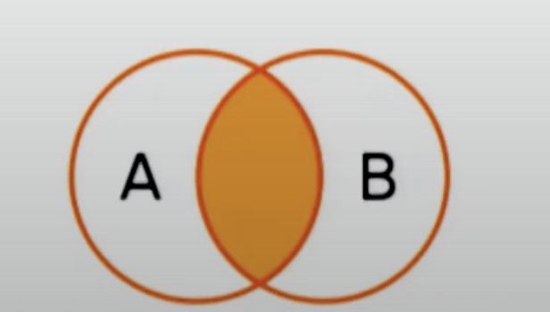
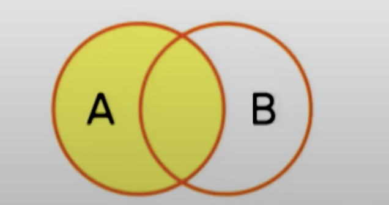
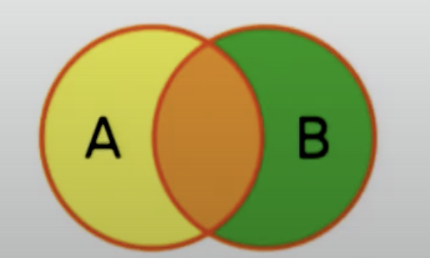

# Week 3 Notes - DBMS

*Prof. Partha Pratham Das, IIT KGP*

*Notes by Adarsh (23f2003570)*  


## [L3.1 SQL Samples (28:26)](https://www.youtube.com/watch?v=j6v3lL5xbao&list=PLZ2ps__7DhBYc4jkUk_yQAjYEVFzVzhdU&index=10&t=2s)

### Retrieve names of buildings that has classrooms with maximum capacity UTMOST 100

```sql
SELECT DISTINCT building_name
FROM classroom
WHERE capacity < 100
```

### Cartesian Product example

```sql
SELECT name, budget
FROM student, department
WHERE student.dept_name = department.dept_name
        AND budget < 5000
```
This generates ALL combination of student department pairs and applies the 2 filters

### Rename Feature (AS operator)

```sql
SELECT S.name AS student_name, budget AS dept_budget
FROM student AS S, department AS D
WHERE S.dept_name = D.dept_name
        AND budget < 5000
```

### String operations

1. Starts with 3 alphabets
```sql
SELECT title
FROM course
WHERE course.id LIKE `___%`
```

### Order By

```sql
SELECT name, dept_name, total_cred
FROM student
ORDER BY dept_name ASC, total_cred DESC;
```

First sort by dept_name and within those results sort by total_cred

### Intersect and IN operator

```sql
SELECT name
FROM instructor
WHERE dept_name IN ('ComSci', 'Maths')
INTERSECT
SELECT name
FROM instructor
WHERE salary < 50000
```

- You can use AND clause to make this neater
- Selects all instructors from comp-sci and maths who have salary < 50K

### Aggregate Functions

```sql
SELECT building, AVG(capacity)
FROM classroom
GROUP BY building
HAVING AVG(capacity) > 25
```

1. MAX
2. AVG
3. MIN
4. COUNT
5. SUM

### Terminology

#### Pure and Multi Set

In **Database Management Systems (DBMS)**, a **pure set** is not a standard or widely used term, but it can be interpreted in the context of **set theory** as applied to databases. 

In databases, sets are commonly used to describe collections of data, particularly when discussing relational databases. Here's how "pure set" might be understood:

##### 1. **Set Theory in DBMS:**
   - A **set** in DBMS is a collection of distinct elements (tuples or rows) where there are no duplicates. The set is **unordered**, and the elements in the set are unique.
   - Operations like **Union**, **Intersection**, and **Difference** in relational algebra rely on set theory principles.

##### 2. **Pure Set:**
   - A **pure set** could be seen as a set that adheres strictly to the properties of a mathematical set. This would imply:
     - No duplicates (all elements or rows are unique).
     - The set is **unordered** (the order of rows does not matter).
     - All elements belong to a single, well-defined set (i.e., no nested or mixed sets).

##### 3. **Comparison with Bags (Multisets):**
   - In contrast to a **pure set**, a **bag** or **multiset** allows duplicates. In SQL, for example, the default result of a `SELECT` query is a bag (because duplicates are allowed unless explicitly removed using `DISTINCT`).

##### Example:
   - If you have a table with rows `[1, 2, 3, 2]`, a **pure set** would contain only `[1, 2, 3]` (no duplicates), while a bag would allow `[1, 2, 3, 2]`.

In short, a **pure set** in DBMS would be a collection of distinct records, aligning with strict set theory principles.

#### Theta Join

A **theta join** is a type of join that uses a general condition to combine rows from two tables. Unlike an **equi-join**, which only uses equality (`=`) in its condition, a theta join can use any comparison operator like `<`, `>`, `<=`, `>=`, `!=`, or `=`, among others.

In SQL, this is often implemented using a `JOIN` clause with a specific condition in the `ON` clause.

##### Example of a Theta Join in PostgreSQL:
```sql
SELECT *
FROM table1
JOIN table2
ON table1.column1 < table2.column2;
```

In this example, the rows are joined based on the condition that `table1.column1` is less than `table2.column2`. This is a theta join because it uses the `<` operator instead of just equality.

##### Key Points:
- A **theta join** allows comparison with any relational operator, not just equality.
- It's flexible and can handle more complex relationships between tables.

## [L3.2 Intermediate SQL /1 (33:06)](https://www.youtube.com/watch?v=Pk1j1UE3JLI&list=PLZ2ps__7DhBYc4jkUk_yQAjYEVFzVzhdU&index=11)

### Nested sub queries

1. Every output of a query is an relation
2. Every input of a query is one or more relations
3. An attribute in a query can be replaced with a query that generates a single value 

```sql
SELECT a1, a2, a3...
FROM r1, r2,...
WHERE P 
```

1. a1, a2... can be replaced by sub-query that generates single value
2. r1 can be replaced by any valid subquery
3. P can be replaced by B `<op>` sub-query
   1. op is like in, not in
   2. B is the attribute/field name
```sql
SELECT DISTINCT course_id
FROM section
WHERE semester='Fall' AND year=2009
    AND course_id IN (SELECT course_id FROM section where
                        semester='Spring' AND year=2010);
```

Nested subqueries in SQL involve placing one query inside another query. They are used to perform operations that depend on the results of another query. 

**Example 1: Basic Usage**

Find employees who earn more than the average salary in their department:
```sql
SELECT EmployeeID, Name
FROM Employees e
WHERE Salary > (SELECT AVG(Salary)
                FROM Employees
                WHERE Department = e.Department);
```
Here, the inner subquery calculates the average salary for each department, and the outer query retrieves employees who earn more than that average.

**Example 2: Multiple Levels**

Find employees who work in the same department as employees with the highest salary:
```sql
SELECT Name
FROM Employees
WHERE Department = (SELECT Department
                    FROM Employees
                    WHERE Salary = (SELECT MAX(Salary)
                                    FROM Employees));
```
The innermost subquery finds the highest salary, the middle subquery finds the department with that highest salary, and the outer query retrieves employees in that department.

### SOME Operator

```sql
SELECT name
FROM instructor
WHERE salary > SOME (SELECT salary FROM instructor
                        WHERE dept_name = 'biology');
```

The `SOME` operator is used in a subquery to compare a value to any value returned by the subquery. It is functionally equivalent to `ANY`. The `SOME` operator allows you to check if a condition is true for at least one of the values returned by the subquery.

For example:
```sql
SELECT * 
FROM Employees 
WHERE Salary > SOME (SELECT Salary 
                      FROM Employees 
                      WHERE Department = 'Sales');
```
This query selects employees whose salary is greater than at least one salary from the Sales department.


#### Mathematically

1. F &lt;comparison&gt; *some* $r \impliedby \implies \forall \ t \isin r$
2. &lt;comparison&gt; are $\lt$, $\le$, $\gt$, $\ge$, $=$, $\neq$

### ALL Operator

ALL operators will match ALL results of a subquery

### EXIST

1. exists means atleast one match exists
2. not exists

### UNIQUE

Sir talks about unique construct.
    1. returns TRUE is there are no dupes
    2. FALSE otherwise

```sql
SELECT T.course_id
FROM course as T
WHERE UNIQUE (SELECT R.course_id
                FROM section as R
                WHERE T.course_id = R.course_id
                AND R.year = 2009);
```

### WITH Clause

The `WITH` clause, also known as a Common Table Expression (CTE), allows you to define a temporary result set that can be referenced within a `SELECT`, `INSERT`, `UPDATE`, or `DELETE` statement. CTEs improve query readability and can simplify complex queries by breaking them into manageable parts.

**Syntax:**

```sql
WITH CTE_Name AS (
    -- CTE query
    SELECT column1, column2
    FROM table_name
    WHERE condition
)
-- Main query using the CTE
SELECT column1
FROM CTE_Name
WHERE another_condition;
```

**Example:**

Find employees with salaries above the average salary of their department:

```sql
WITH AvgSalary AS (
    SELECT Department, AVG(Salary) AS AverageSalary
    FROM Employees
    GROUP BY Department
)
SELECT e.EmployeeID, e.Name, e.Salary
FROM Employees e
JOIN AvgSalary a
ON e.Department = a.Department
WHERE e.Salary > a.AverageSalary;
```

In this example, the `WITH` clause defines a CTE named `AvgSalary` to calculate the average salary per department. The main query then joins the `Employees` table with this CTE to find employees earning more than the average salary in their respective departments.

1. WITH defines a temporary relation available only in the query


### Scalar Sub Query

A scalar subquery is a subquery that returns a single value (one row and one column). It can be used in contexts where a single value is expected, such as in comparisons or assignments.

**Syntax:**

```sql
SELECT column1
FROM table_name
WHERE column2 = (SELECT scalar_value
                  FROM another_table
                  WHERE condition);
```

**Examples:**

1. **Find Employees Earning More Than the Highest Salary in a Department:**

   Suppose you want to find employees who earn more than the highest salary in a particular department. The scalar subquery retrieves the highest salary for that department.

   ```sql
   SELECT EmployeeID, Name
   FROM Employees
   WHERE Salary > (SELECT MAX(Salary)
                   FROM Employees
                   WHERE Department = 'Sales');
   ```

   Here, the scalar subquery `(SELECT MAX(Salary) FROM Employees WHERE Department = 'Sales')` returns a single value, the maximum salary in the 'Sales' department. This value is then used to filter employees with higher salaries.

2. **Find Products More Expensive Than the Average Price:**

   To find products that cost more than the average price across all products:

   ```sql
   SELECT ProductName
   FROM Products
   WHERE Price > (SELECT AVG(Price)
                  FROM Products);
   ```

   In this case, the scalar subquery `(SELECT AVG(Price) FROM Products)` returns the average price of all products. The main query uses this single value to filter products priced above this average.

Scalar subqueries are often used in `WHERE` clauses, but they can also appear in `SELECT` clauses, `HAVING` clauses, and `SET` clauses where a single value is needed.

Gives a runtime error if subquery returns more than 1 result


### Sub Queries in PostgreSQL

In PostgreSQL, subqueries are queries nested inside other queries. They can be used in various places within the main query and offer flexibility to perform complex filtering, transformations, and operations on data. There are several types of subqueries, each serving a different purpose. Below are the main types of subqueries with examples:

#### 1. **Scalar Subqueries**
A scalar subquery returns a single value (i.e., a single row with a single column). These can be used where a single value is expected, such as in the `SELECT` clause or a condition in the `WHERE` clause.

**Example:**

```sql
SELECT 
    name, 
    (SELECT AVG(salary) FROM employees) AS avg_salary
FROM employees;
```

Here, the subquery `(SELECT AVG(salary) FROM employees)` returns the average salary from the `employees` table, and this scalar value is used in the main query for each row.

#### 2. **Column Subqueries**
A column subquery returns a single column of data, which can be used in the `WHERE` clause to filter rows based on the returned column.

**Example:**

```sql
SELECT name 
FROM employees 
WHERE department_id IN (SELECT id FROM departments WHERE location = 'New York');
```

This subquery `(SELECT id FROM departments WHERE location = 'New York')` returns a list of `department_id`s from departments located in New York. The main query then selects all employees who belong to any of those departments.

#### 3. **Row Subqueries**
A row subquery returns a single row of data, which can be compared using a row constructor.

**Example:**

```sql
SELECT id, name 
FROM employees 
WHERE (department_id, salary) = (SELECT department_id, MAX(salary) FROM employees);
```

This query finds the employee with the highest salary in the entire company by comparing the `(department_id, salary)` pair with the subquery result, which returns a single row.

#### 4. **Table Subqueries**
A table subquery returns a full table (multiple rows and columns) and is often used in the `FROM` clause. It essentially acts like a temporary table for the main query.

**Example:**

```sql
SELECT sub.department_id, AVG(sub.salary)
FROM (SELECT department_id, salary FROM employees WHERE salary > 50000) AS sub
GROUP BY sub.department_id;
```

In this example, the subquery `(SELECT department_id, salary FROM employees WHERE salary > 50000)` creates a temporary table of employees with salaries greater than 50,000. The main query then calculates the average salary by department.

#### 5. **Correlated Subqueries**
A correlated subquery depends on the outer query for its values. For each row in the outer query, the subquery is executed.

**Example:**

```sql
SELECT e1.name, e1.salary 
FROM employees e1
WHERE e1.salary > (SELECT AVG(e2.salary) FROM employees e2 WHERE e2.department_id = e1.department_id);
```

In this example, the subquery `(SELECT AVG(e2.salary) FROM employees e2 WHERE e2.department_id = e1.department_id)` calculates the average salary for each department, and the outer query compares each employee’s salary to the average salary of their department. This is called a correlated subquery because the inner query depends on the `department_id` from the outer query (`e1.department_id`).

#### 6. **Exists Subqueries**
An `EXISTS` subquery checks whether the subquery returns any rows. It returns `TRUE` if the subquery returns one or more rows and `FALSE` if no rows are returned. This is useful for checking conditions.

**Example:**

```sql
SELECT name 
FROM employees e
WHERE EXISTS (SELECT 1 FROM departments d WHERE d.id = e.department_id AND d.location = 'New York');
```

Here, the `EXISTS` subquery checks if there are any departments in New York that match the employee’s `department_id`. If such a department exists, the employee is selected.

#### 7. **NOT EXISTS Subqueries**
A `NOT EXISTS` subquery is the opposite of `EXISTS`. It checks whether the subquery returns no rows, and the outer query will return rows if the subquery does not return any.

**Example:**

```sql
SELECT name 
FROM employees e
WHERE NOT EXISTS (SELECT 1 FROM projects p WHERE p.employee_id = e.id);
```

This query returns employees who are not assigned to any projects. The subquery `(SELECT 1 FROM projects p WHERE p.employee_id = e.id)` returns rows if the employee is assigned to any project. The `NOT EXISTS` ensures that only employees without projects are selected.

#### 8. **WITH (Common Table Expression or CTE) Subqueries**
A Common Table Expression (CTE) is essentially a named subquery that is written before the main query using the `WITH` keyword. CTEs are useful for improving query readability, especially for complex queries.

**Example:**

```sql
WITH department_avg AS (
    SELECT department_id, AVG(salary) AS avg_salary
    FROM employees
    GROUP BY department_id
)
SELECT e.name, e.salary, da.avg_salary
FROM employees e
JOIN department_avg da ON e.department_id = da.department_id
WHERE e.salary > da.avg_salary;
```

In this example, the `WITH` clause creates a CTE named `department_avg`, which calculates the average salary by department. The main query then joins the `employees` table with the CTE and selects employees whose salary is higher than the department average.

#### Summary:
- **Scalar Subqueries**: Return a single value.
- **Column Subqueries**: Return a single column.
- **Row Subqueries**: Return a single row.
- **Table Subqueries**: Return multiple rows and columns (a table).
- **Correlated Subqueries**: Subquery depends on the outer query.
- **Exists Subqueries**: Check if subquery returns rows.
- **NOT EXISTS Subqueries**: Check if subquery does not return rows.
- **WITH (CTE) Subqueries**: Define reusable named subqueries for complex queries.

### Modification of Databases

##### DELETE

```SQL
DELETE FROM instructors

DELETE FROM instructors
    WHERE dept_name = 'Finance'

DELETE FROM instructors
    WHERE dept_name IN (SELECT dept_name FROM department
                            WHERE building_name = 'Watson`)
```

**Delete Changes the state of the Table**

    ```sql
    DELETE FROM instructors
        WHERE salary < (SELECT AVG(salary) FROM instructors)
    ```

    1. if delete happens, the average salary changes

##### INSERT

1. Always use named attributes/fields.. the order might change
2. Values in order of named attributes

**Copy from one table to another**
```sql
INSERT INTO table1
    SELECT * FROM table2
```

**Basic Syntax:**

1. **Insert Data into All Columns:**

   ```sql
   INSERT INTO table_name (column1, column2, column3)
   VALUES (value1, value2, value3);
   ```

2. **Insert Data into Specific Columns:**

   ```sql
   INSERT INTO table_name (column1, column2)
   VALUES (value1, value2);
   ```

**Examples:**

1. **Insert Data into All Columns:**

   Suppose you have a `Users` table with columns `UserID`, `UserName`, and `Email`.

   ```sql
   INSERT INTO Users (UserID, UserName, Email)
   VALUES (1, 'Alice', 'alice@example.com');
   ```

   This query inserts a new row into the `Users` table with `UserID` 1, `UserName` 'Alice', and `Email` 'alice@example.com'.

2. **Insert Data into Specific Columns:**

   If you only want to insert values into `UserName` and `Email`, assuming `UserID` is an auto-incrementing primary key:

   ```sql
   INSERT INTO Users (UserName, Email)
   VALUES ('Bob', 'bob@example.com');
   ```

   This query inserts a new row with `UserName` 'Bob' and `Email` 'bob@example.com', letting the database automatically assign a `UserID`.

3. **Insert Multiple Rows:**

   You can also insert multiple rows in a single query:

   ```sql
   INSERT INTO Users (UserName, Email)
   VALUES ('Charlie', 'charlie@example.com'),
          ('Diana', 'diana@example.com');
   ```

   This query inserts two new rows into the `Users` table.

4. **Insert Data from Another Table:**

   You can insert data into a table based on a `SELECT` statement from another table:

   ```sql
   INSERT INTO ArchiveUsers (UserID, UserName, Email)
   SELECT UserID, UserName, Email
   FROM Users
   WHERE RegistrationDate < '2023-01-01';
   ```

   This query copies rows from the `Users` table into the `ArchiveUsers` table where the `RegistrationDate` is before January 1, 2023.

#### UPDATE

**Conditional Updates with case**

```sql
UPDATE instructor
    SET salary = CASE
        WHEN salary <= 1000
        THEN salary * 1.05
        ELSE salary * 1.03
        END
```
**Basic Syntax:**

```sql
UPDATE table_name
SET column1 = value1, column2 = value2, ...
WHERE condition;
```

- **`table_name`**: The name of the table you want to update.
- **`SET`**: Specifies the columns to be updated and their new values.
- **`WHERE`**: Defines which rows should be updated. If omitted, all rows in the table will be updated.

**Examples:**

1. **Update a Single Record:**

   Suppose you have a `Users` table and you want to update the email address of a user with a specific `UserID`.

   ```sql
   UPDATE Users
   SET Email = 'newemail@example.com'
   WHERE UserID = 1;
   ```

   This query changes the `Email` of the user with `UserID` 1 to 'newemail@example.com'.

2. **Update Multiple Columns:**

   To update multiple columns for a specific user:

   ```sql
   UPDATE Users
   SET UserName = 'Alice Smith', Email = 'alice.smith@example.com'
   WHERE UserID = 1;
   ```

   This updates both the `UserName` and `Email` of the user with `UserID` 1.

3. **Update Multiple Records:**

   To increase the salary for all employees in a particular department:

   ```sql
   UPDATE Employees
   SET Salary = Salary * 1.10
   WHERE Department = 'Sales';
   ```

   This query gives a 10% raise to all employees in the 'Sales' department.

4. **Update Using a Subquery:**

   Suppose you want to update a table based on values from another table. For instance, update the `Salary` in the `Employees` table to match the average salary from a `Salaries` table:

   ```sql
   UPDATE Employees
   SET Salary = (SELECT AVG(Salary)
                 FROM Salaries
                 WHERE Department = Employees.Department)
   WHERE Department IN (SELECT Department
                        FROM Salaries);
   ```

   This query updates each employee's salary to the average salary for their department.

5. **Update All Records (Use with Caution):**

   To set a default value for a column in all records:

   ```sql
   UPDATE Users
   SET Status = 'Active';
   ```

   This query sets the `Status` column to 'Active' for all rows in the `Users` table.

**Important Notes:**

- Always use the `WHERE` clause to specify which rows to update. Without it, the update will apply to all rows in the table.
- Be cautious when performing updates, especially when updating multiple rows, to avoid unintended data changes.


### SQL CASE STATEMENT
The `CASE` statement in SQL provides a way to perform conditional logic within a query. It allows you to return different values based on specified conditions, similar to if-else logic in programming.

**Basic Syntax:**

```sql
CASE 
    WHEN condition1 THEN result1
    WHEN condition2 THEN result2
    ...
    ELSE default_result
END
```

- **`WHEN condition`**: Defines a condition to be evaluated.
- **`THEN result`**: Specifies the result to return if the corresponding `WHEN` condition is true.
- **`ELSE default_result`** (optional): Provides a default result if none of the `WHEN` conditions are met.
- **`END`**: Marks the end of the `CASE` statement.

**Examples:**

1. **Simple Case Expression:**

   Categorize employees based on their salary:

   ```sql
   SELECT EmployeeID, Salary,
          CASE
              WHEN Salary < 30000 THEN 'Low'
              WHEN Salary BETWEEN 30000 AND 60000 THEN 'Medium'
              ELSE 'High'
          END AS SalaryCategory
   FROM Employees;
   ```

   This query classifies salaries into 'Low', 'Medium', or 'High' categories and includes this classification as a new column `SalaryCategory` in the result set.

2. **Case in a `SELECT` Statement:**

   Display different messages based on order status:

   ```sql
   SELECT OrderID, Status,
          CASE Status
              WHEN 'P' THEN 'Pending'
              WHEN 'S' THEN 'Shipped'
              WHEN 'D' THEN 'Delivered'
              ELSE 'Unknown'
          END AS StatusDescription
   FROM Orders;
   ```

   This query translates order status codes into descriptive text.

3. **Case in an `ORDER BY` Clause:**

   Sort employees by a custom ranking based on job title:

   ```sql
   SELECT EmployeeID, JobTitle
   FROM Employees
   ORDER BY CASE JobTitle
                WHEN 'Manager' THEN 1
                WHEN 'Team Lead' THEN 2
                WHEN 'Staff' THEN 3
                ELSE 4
            END;
   ```

   This query sorts employees by job title, giving priority to 'Manager', then 'Team Lead', and so on.

4. **Case in a `WHERE` Clause:**

   Apply different filters based on a condition:

   ```sql
   SELECT ProductName, Price
   FROM Products
   WHERE CASE
             WHEN Category = 'Electronics' THEN Price > 100
             WHEN Category = 'Books' THEN Price < 50
             ELSE Price > 20
         END;
   ```

   This query applies different price filters based on the product category.

**Important Notes:**

- **`CASE` in SQL** can be used in `SELECT`, `ORDER BY`, `WHERE`, and `HAVING` clauses.
- **`CASE` is evaluated in order**: Once a condition is true, subsequent `WHEN` clauses are not evaluated.
- **`ELSE` clause is optional**: If omitted, `CASE` returns `NULL` when no conditions are met.

### Update with Scalar sub-queries

The `UPDATE` statement with a scalar subquery allows you to modify records in a table based on a single value returned by a subquery. A scalar subquery is a subquery that returns exactly one row and one column.

**Basic Syntax:**

```sql
UPDATE table_name
SET column_name = (SELECT scalar_value
                   FROM another_table
                   WHERE condition)
WHERE condition;
```

In this syntax:
- **`table_name`**: The table you want to update.
- **`column_name`**: The column to be updated.
- **`scalar_value`**: The value returned by the subquery.
- **`another_table`**: The table from which the subquery retrieves the scalar value.
- **`condition`**: The condition for filtering records to be updated.

**Examples:**

1. **Update Based on a Single Value from Another Table:**

   Suppose you have an `Employees` table and a `Departments` table. You want to update the `Salary` of employees to match the average salary of their department from the `Departments` table.

   ```sql
   UPDATE Employees
   SET Salary = (SELECT AVG(Salary)
                 FROM Employees e2
                 WHERE e2.Department = Employees.Department)
   WHERE Department IN (SELECT DISTINCT Department
                        FROM Employees);
   ```

   **Explanation:**
   - The scalar subquery `(SELECT AVG(Salary) FROM Employees e2 WHERE e2.Department = Employees.Department)` calculates the average salary for the department of each employee.
   - The `UPDATE` statement then sets each employee's salary to this average value where the department matches.

2. **Update with a Scalar Subquery in the Same Table:**

   Suppose you have a `Products` table with columns `ProductID`, `Price`, and `Category`. You want to set the `Price` of each product to the average price of products within its own category.

   ```sql
   UPDATE Products
   SET Price = (SELECT AVG(Price)
                FROM Products p2
                WHERE p2.Category = Products.Category)
   WHERE Category IN (SELECT DISTINCT Category
                      FROM Products);
   ```

   **Explanation:**
   - The scalar subquery `(SELECT AVG(Price) FROM Products p2 WHERE p2.Category = Products.Category)` computes the average price for each product's category.
   - The `UPDATE` query uses this average to set the `Price` for each product.

3. **Update Based on a Constant Value from a Subquery:**

   Suppose you want to update a `Discount` column in the `Orders` table with the highest discount value available from a `Discounts` table.

   ```sql
   UPDATE Orders
   SET Discount = (SELECT MAX(DiscountValue)
                   FROM Discounts)
   WHERE OrderDate < '2024-01-01';
   ```

   **Explanation:**
   - The scalar subquery `(SELECT MAX(DiscountValue) FROM Discounts)` retrieves the highest discount value.
   - The `UPDATE` statement applies this discount value to orders placed before January 1, 2024.

**Important Points:**
- The scalar subquery must return exactly one value; otherwise, the `UPDATE` statement will fail with an error.
- If the subquery returns more than one value or no value, you'll need to adjust the query to handle such cases, possibly by using aggregate functions or additional conditions.


## [L3.3 Intermediate SQL/2 (31:58)](https://youtu.be/_-JZS7mqo6k)

### Joins

In PostgreSQL (and SQL in general), **joins** are used to combine rows from two or more tables based on a related column between them. There are several types of joins, and each serves a different purpose when querying data. Let’s explore the main types of joins with examples:

### 1. **INNER JOIN**




An `INNER JOIN` returns only the rows where there is a match between the columns in both tables.

#### Syntax:
```sql
SELECT columns
FROM table1
INNER JOIN table2
ON table1.column = table2.column;
```

#### Example:
Suppose we have two tables:

- **employees**  
  | id | name    | department_id |
  |----|---------|---------------|
  | 1  | Alice   | 101           |
  | 2  | Bob     | 102           |
  | 3  | Charlie | 103           |

- **departments**  
  | id  | department_name |
  |-----|-----------------|
  | 101 | HR              |
  | 102 | Finance         |

To get employees along with their departments:
```sql
SELECT employees.name, departments.department_name
FROM employees
INNER JOIN departments
ON employees.department_id = departments.id;
```

**Result:**
| name  | department_name |
|-------|-----------------|
| Alice | HR              |
| Bob   | Finance         |

Notice that Charlie, who belongs to department `103`, is excluded because there is no matching department in the `departments` table.

1. Inner Join is a SET INTERSECTION!
1. Equi Join
   1. Natural Join skips common columns.
---

### 2. **LEFT JOIN (LEFT OUTER JOIN)**



A `LEFT JOIN` returns all rows from the left table (table1), and the matching rows from the right table (table2). If there is no match, NULL values are returned for columns from the right table.

#### Syntax:
```sql
SELECT columns
FROM table1
LEFT JOIN table2
ON table1.column = table2.column;
```

#### Example:
Using the same tables as above:
```sql
SELECT employees.name, departments.department_name
FROM employees
LEFT JOIN departments
ON employees.department_id = departments.id;
```

**Result:**
| name    | department_name |
|---------|-----------------|
| Alice   | HR              |
| Bob     | Finance         |
| Charlie | NULL            |

This time, Charlie is included, but with a `NULL` value for the department name because department `103` doesn’t exist.

---

### 3. **RIGHT JOIN (RIGHT OUTER JOIN)**


A `RIGHT JOIN` is the opposite of a left join. It returns all rows from the right table (table2) and the matching rows from the left table (table1). If there is no match, NULL values are returned for columns from the left table.

#### Syntax:
```sql
SELECT columns
FROM table1
RIGHT JOIN table2
ON table1.column = table2.column;
```

#### Example:
Let’s modify the tables slightly to add an extra department:

- **departments**  
  | id  | department_name |
  |-----|-----------------|
  | 101 | HR              |
  | 102 | Finance         |
  | 104 | IT              |

```sql
SELECT employees.name, departments.department_name
FROM employees
RIGHT JOIN departments
ON employees.department_id = departments.id;
```

**Result:**
| name    | department_name |
|---------|-----------------|
| Alice   | HR              |
| Bob     | Finance         |
| NULL    | IT              |

The IT department appears, even though no employee belongs to it, with a `NULL` value for the employee name.

---

### 4. **FULL OUTER JOIN**



A `FULL OUTER JOIN` returns all rows when there is a match in either table. If there is no match, NULL values will be used for non-matching columns from both tables.

#### Syntax:
```sql
SELECT columns
FROM table1
FULL OUTER JOIN table2
ON table1.column = table2.column;
```

#### Example:
```sql
SELECT employees.name, departments.department_name
FROM employees
FULL OUTER JOIN departments
ON employees.department_id = departments.id;
```

**Result:**
| name    | department_name |
|---------|-----------------|
| Alice   | HR              |
| Bob     | Finance         |
| Charlie | NULL            |
| NULL    | IT              |

This query returns all employees and all departments, even if there are no matches. Charlie has no matching department, and the IT department has no matching employee.

---

### 5. **CROSS JOIN**
A `CROSS JOIN` returns the Cartesian product of the two tables, meaning it combines all rows from the first table with all rows from the second table. Output Row size will be $m \times n$

#### Syntax:
```sql
SELECT columns
FROM table1
CROSS JOIN table2;

SELECT columns
FROM table1, table2;
```

#### Example:
```sql
SELECT employees.name, departments.department_name
FROM employees
CROSS JOIN departments;
```

**Result:**
| name    | department_name |
|---------|-----------------|
| Alice   | HR              |
| Alice   | Finance         |
| Alice   | IT              |
| Bob     | HR              |
| Bob     | Finance         |
| Bob     | IT              |
| Charlie | HR              |
| Charlie | Finance         |
| Charlie | IT              |

Each employee is paired with every department.

---

### 6. **SELF JOIN**
A `SELF JOIN` is a regular join, but the table is joined with itself. This is useful when you need to compare rows within the same table.

#### Example:
Suppose you have an employees table where each employee reports to another employee:

- **employees**  
  | id | name    | manager_id |
  |----|---------|------------|
  | 1  | Alice   | NULL       |
  | 2  | Bob     | 1          |
  | 3  | Charlie | 1          |

You can join the table with itself to find out who reports to whom:
```sql
SELECT e1.name AS employee, e2.name AS manager
FROM employees e1
LEFT JOIN employees e2
ON e1.manager_id = e2.id;
```

**Result:**
| employee | manager |
|----------|---------|
| Alice    | NULL    |
| Bob      | Alice   |
| Charlie  | Alice   |

Here, we see that Bob and Charlie report to Alice.

---

### Examples of JOINS on the UNIVERSITY DATASET

#### EQUI-JOIN

This is an `INNER JOIN` NOTE: There are 2 `dept_name` columns

```sql
university=# SELECT * FROM department d INNER JOIN instructor AS i ON d.dept_name = i.dept_name LIMIT 3;
  dept_name  | building |  budget   |  id   |   name   |  dept_name  |  salary   
-------------+----------+-----------+-------+----------+-------------+-----------
 Cybernetics | Mercer   | 794541.46 | 63395 | McKinnon | Cybernetics |  94333.99
 Statistics  | Taylor   | 395051.74 | 78699 | Pingr    | Statistics  |  59303.62
 Marketing   | Lambeau  | 210627.58 | 96895 | Mird     | Marketing   | 119921.41
(3 rows)

```
#### NATURAL JOIN

Note there is only one `dept_name` column

```sql
university=# SELECT * FROM department d NATURAL JOIN instructor AS i LIMIT 3;
  dept_name  | building |  budget   |  id   |   name   |  salary   
-------------+----------+-----------+-------+----------+-----------
 Cybernetics | Mercer   | 794541.46 | 63395 | McKinnon |  94333.99
 Statistics  | Taylor   | 395051.74 | 78699 | Pingr    |  59303.62
 Marketing   | Lambeau  | 210627.58 | 96895 | Mird     | 119921.41
(3 rows)
```

#### LEFT OUTER JOIN

```sql
university=# SELECT * FROM department d LEFT OUTER JOIN instructor AS i ON d.dept_name = i.dept_name LIMIT 3;
 dept_name  |  building   |  budget   |  id   |   name   | dept_name |  salary  
------------+-------------+-----------+-------+----------+-----------+----------
 Civil Eng. | Chandler    | 255041.46 |       |          |           |         
 Biology    | Candlestick | 647610.55 | 80759 | Queiroz  | Biology   | 45538.32
 Biology    | Candlestick | 647610.55 | 81991 | Valtchev | Biology   | 77036.18
(3 rows)

```

#### Notes on Join using the University Dataset

- Rows in department: 20
- Rows in instructor: 50
- Rows in Inner Join: 50 (Note this is specific, if we set up tables where dupe-tupes are allowed what happens?)
- Rows in Left Outer Join: 53 (How did you get 53?)
- Rows in Right Outer Join: 50 (How did you get 50?)
- Rows in Full Outer Join: 53 (Why is it the same as a LEFT OUTER JOIN?)
- Rows in Natural Join: 50 Rows.
- Rows in Cross Join: 1000 Rows ($50 \times 20$)

### Views

In PostgreSQL, a **view** is a virtual table that is the result of a query. Unlike a table, a view does not store data itself. Instead, it provides a way to look at data from one or more tables through a predefined query. Views can be used to simplify complex queries, enhance security by limiting access to specific rows or columns, or present data in a specific format.

#### Key Characteristics of Views:
- **Virtual table**: A view acts like a table but does not store the data physically.
- **Reusable query**: The query behind the view is stored, and the view can be queried just like a regular table.
- **Updatable (in some cases)**: Some views allow data modification (inserts, updates, deletes), depending on the complexity of the view.

#### Benefits of Using Views:
1. **Simplicity**: You can hide the complexity of large queries by creating a view with a simple query interface.
2. **Security**: Views can restrict access to certain columns or rows of a table, enhancing security.
3. **Reusability**: Once a view is created, you can reuse it in multiple queries without rewriting the underlying logic.
4. **Logical Data Abstraction**: Views help abstract the complexity of your database schema by providing a logical interface.

---

#### Creating Views in PostgreSQL

##### 1. **Basic View Creation**
To create a view, you use the `CREATE VIEW` statement followed by a query that defines the view. Here is an example:

```sql
CREATE VIEW employee_view AS
SELECT id, name, salary 
FROM employees;
```

This creates a view named `employee_view` that selects the `id`, `name`, and `salary` columns from the `employees` table.

###### Usage:
You can query this view as if it were a regular table:

```sql
SELECT * FROM employee_view;
```

##### 2. **Creating Views with Joins**
Views can combine data from multiple tables using `JOIN` operations. Here’s an example of a more complex view:

```sql
CREATE VIEW employee_department_view AS
SELECT e.id, e.name, d.department_name
FROM employees e
JOIN departments d ON e.department_id = d.id;
```

In this case, `employee_department_view` is a view that joins the `employees` and `departments` tables and shows the employee name along with their respective department name.

##### 3. **Views with Filters**
You can define views with filtering conditions as well:

```sql
CREATE VIEW high_salary_employees AS
SELECT id, name, salary 
FROM employees
WHERE salary > 50000;
```

This creates a view called `high_salary_employees` that only returns employees with a salary greater than 50,000.

##### 4. **Updatable Views**
Some views are **updatable**, meaning you can perform `INSERT`, `UPDATE`, or `DELETE` operations on them, and those changes will propagate to the underlying base tables.

**Example:**

If `employee_view` contains all the columns needed to update the `employees` table (e.g., primary key, necessary columns), then you can perform updates through the view.

```sql
UPDATE employee_view
SET salary = 60000
WHERE id = 3;
```

This will update the `salary` for the employee with `id = 3` in the base `employees` table.

However, not all views are updatable. Views involving `JOIN`, `GROUP BY`, `DISTINCT`, or aggregate functions are typically **not updatable** without additional configurations like triggers or `INSTEAD OF` rules.

---

#### Modifying Views

##### 1. **Modifying a View (ALTER VIEW)**
If you need to change the view definition, you can drop and recreate it, or use `CREATE OR REPLACE VIEW` to modify the view without dropping it:

```sql
CREATE OR REPLACE VIEW employee_view AS
SELECT id, name, salary, hire_date
FROM employees;
```

This adds the `hire_date` column to the `employee_view`.

##### 2. **Dropping a View**
To remove a view, use the `DROP VIEW` statement:

```sql
DROP VIEW employee_view;
```

This deletes the view `employee_view` but does not affect the underlying data in the `employees` table.

---

#### Example: Complex View with Aggregation

Let’s create a view that calculates the average salary by department:

```sql
CREATE VIEW department_salary_view AS
SELECT department_id, AVG(salary) AS avg_salary
FROM employees
GROUP BY department_id;
```

This view groups employees by their department and calculates the average salary for each department.

#### Querying the View:

```sql
SELECT * FROM department_salary_view;
```

This will return the average salary for each department.

---

#### Materialized Views

Unlike regular views, **materialized views** store the result of the query physically. This can be useful for performance reasons, especially for complex or expensive queries, as the data is stored on disk rather than calculated on the fly.

###### Creating a Materialized View:

```sql
CREATE MATERIALIZED VIEW employee_materialized_view AS
SELECT id, name, salary 
FROM employees;
```

This creates a materialized view that stores the query result on disk.

##### Refreshing a Materialized View:
Since materialized views store data physically, they can become stale if the underlying data changes. You need to refresh them manually or on a schedule:

```sql
REFRESH MATERIALIZED VIEW employee_materialized_view;
```

##### Dropping a Materialized View:

```sql
DROP MATERIALIZED VIEW employee_materialized_view;
```

---

##### Summary of Key Points:

1. **Views** are virtual tables that store query definitions but not data.
2. They help simplify complex queries, improve security, and make querying more efficient by abstracting logic.
3. Views can be based on simple `SELECT` queries, joins, or even filters.
4. **Updatable views** allow data manipulation, but more complex views (involving joins or aggregations) are usually **not updatable**.
5. **Materialized views** store data on disk and must be refreshed when the underlying data changes.

Views offer a powerful way to encapsulate and manage complex queries, making them reusable, modular, and more secure.

### Cascaded Views

In PostgreSQL, **nested views** (or **cascaded views**) refer to views that are built upon other views. This means you create a view, and then create another view that queries the first view, and so on. Cascaded views can be useful for simplifying complex queries by breaking them down into logical steps, or for abstracting layers of information.

#### Key Characteristics of Nested or Cascaded Views:
- **Layered abstraction**: Each view can build upon the previous one, adding more complexity or refining data.
- **Simplified queries**: Complex logic is broken into manageable layers, making queries easier to maintain.
- **Performance impact**: Cascading too many views can introduce performance overhead because each view needs to be evaluated at query time unless using materialized views.

#### How Nested Views Work:
- **View A** is created from a base query (e.g., from a table).
- **View B** is created from a query that selects from **View A**.
- **View C** can be created from a query that selects from **View B**, and so on.

---

#### Example of Nested (Cascaded) Views

##### Step 1: Create Base View

Suppose you have an `employees` table, and you want to create a base view that selects only employees with a salary greater than 50,000.

```sql
CREATE VIEW high_salary_employees AS
SELECT id, name, salary, department_id
FROM employees
WHERE salary > 50000;
```

This creates a view called `high_salary_employees` that selects employees with salaries above 50,000.

##### Step 2: Create a View Based on Another View

Now, you can create another view that adds more information, such as the department name by joining the `high_salary_employees` view with the `departments` table:

```sql
CREATE VIEW high_salary_employee_details AS
SELECT e.id, e.name, e.salary, d.department_name
FROM high_salary_employees e
JOIN departments d ON e.department_id = d.id;
```

This creates a view called `high_salary_employee_details` that includes the department name along with employee details, pulling data from the `high_salary_employees` view.

##### Step 3: Create Another Layer of View

You can further create a third view to calculate the average salary of high-paid employees by department:

```sql
CREATE VIEW avg_high_salary_by_department AS
SELECT department_name, AVG(salary) AS avg_salary
FROM high_salary_employee_details
GROUP BY department_name;
```

This view, `avg_high_salary_by_department`, calculates the average salary of high-paid employees (from the second view) by department.

---

#### Querying Cascaded Views

Once you've set up cascaded views, you can query the final view to get the desired results:

```sql
SELECT * FROM avg_high_salary_by_department;
```

This query will execute and retrieve the average salary of high-paid employees for each department. Even though you’re querying the third view, PostgreSQL will evaluate all dependent views in the cascade, combining their logic.

---

#### Benefits of Cascaded Views

1. **Modularity and Reusability**: Each view encapsulates a piece of logic. You can reuse views in different queries, reducing duplication.
2. **Simplifying Complex Queries**: Instead of writing a long, complex query with many joins, subqueries, or aggregations, you can break it down into smaller steps (views), making each part easier to understand.
3. **Separation of Concerns**: Each view focuses on a specific task, allowing better organization of logic (e.g., one view handles filtering, another handles joining, and another handles aggregation).

---

#### Considerations and Performance Impact of Cascaded Views

- **Performance**: While cascaded views improve query readability and maintainability, they can introduce performance overhead. Every time you query a cascaded view, PostgreSQL has to process each underlying view recursively.
  - If performance becomes a concern, you may want to replace complex cascaded views with **materialized views**, which store the results of the query physically and don't need to be recomputed every time.
  
- **View Dependencies**: PostgreSQL manages view dependencies automatically. If you try to drop a base view that is used by other views, PostgreSQL will prevent the drop unless you cascade the operation (`DROP VIEW base_view CASCADE`), which also drops all dependent views.
  
- **Updatability**: Not all views are updatable, and cascading views that involve multiple tables, joins, or aggregate functions are usually not updatable without additional mechanisms like `INSTEAD OF` triggers.

---

#### Example of Performance Impact: Nested View vs. Materialized View

If you have deeply nested views that must be queried repeatedly, PostgreSQL has to execute all the layers each time.

##### Example of Nested View Query:
```sql
SELECT * FROM avg_high_salary_by_department;
```

This query will involve multiple layers:
1. The first view `high_salary_employees` is evaluated.
2. The second view `high_salary_employee_details` is then evaluated based on the first view.
3. Finally, the third view `avg_high_salary_by_department` computes the result.

##### Using Materialized Views:
To avoid repeated evaluation, you can convert the third view to a **materialized view**, storing the precomputed result on disk:

```sql
CREATE MATERIALIZED VIEW avg_high_salary_by_department_mat AS
SELECT department_name, AVG(salary) AS avg_salary
FROM high_salary_employee_details
GROUP BY department_name;
```

Now, when you query the materialized view:

```sql
SELECT * FROM avg_high_salary_by_department_mat;
```

The results are fetched directly from storage, which improves performance, especially for large datasets.

#### View Expansion

WIP:

1. Recursive View Expansion is forbidden. A view `View9` cannot refer to `View9` in any sub-view used (WIP: reframe this please)
2. C.R.U.D into a View??? Professor Partha Das says its possible if underlying database DDL schema is not violated. WIP: I will update this

### Materialized Views

A **Materialized View** in PostgreSQL is a database object that stores the result of a query physically on disk, unlike a regular view which only stores the query and fetches data dynamically each time it is accessed. Materialized views are useful for improving performance, especially for complex queries that take a long time to compute, by storing precomputed results that can be queried quickly.

#### Key Characteristics of Materialized Views:
- **Stored results**: The result of the query is saved on disk, so accessing a materialized view is faster compared to a regular view.
- **Requires manual refresh**: Since materialized views store a snapshot of the data, they do not automatically reflect changes in the underlying tables. You need to refresh the view manually to update the data.
- **Can be indexed**: Materialized views can be indexed, further improving query performance.
- **Improves query performance**: They are particularly useful when the underlying query is complex or involves large datasets.

#### Creating a Materialized View

To create a materialized view, use the `CREATE MATERIALIZED VIEW` statement.

##### Example:
Let's say you have a table `employees` and you want to create a materialized view to store employees with high salaries.

###### Base Table:
```sql
CREATE TABLE employees (
    id SERIAL PRIMARY KEY,
    name TEXT,
    salary NUMERIC,
    department_id INT
);
```

######3 Step 1: Create Materialized View
You create a materialized view to store high-salary employees:

```sql
CREATE MATERIALIZED VIEW high_salary_employees_mat AS
SELECT id, name, salary, department_id
FROM employees
WHERE salary > 50000;
```

This creates a materialized view named `high_salary_employees_mat`, and the query result is stored physically on disk.

#### Step 2: Query the Materialized View
You can now query this materialized view just like a regular table:

```sql
SELECT * FROM high_salary_employees_mat;
```

This query will return the precomputed results of employees with a salary greater than 50,000.

---

#### Refreshing a Materialized View

Since materialized views store a snapshot of data, they do not automatically reflect updates made to the underlying tables. You need to refresh the materialized view to update its contents.

##### Example of Refreshing:
If the underlying `employees` table is updated (e.g., a new high-salary employee is added), the materialized view will not show this new data until it is refreshed.

```sql
REFRESH MATERIALIZED VIEW high_salary_employees_mat;
```

This statement updates the materialized view with the latest data from the `employees` table.

---

#### Creating Materialized Views with Data Refresh Options

PostgreSQL allows you to create materialized views with options to control when and how the data is refreshed.

##### Example: `WITH NO DATA` Option

You can create a materialized view without populating it immediately using the `WITH NO DATA` option. This is useful if you want to create the view but delay the actual data loading.

```sql
CREATE MATERIALIZED VIEW high_salary_employees_mat AS
SELECT id, name, salary, department_id
FROM employees
WHERE salary > 50000
WITH NO DATA;
```

Later, when you are ready to populate the materialized view, you can use the `REFRESH MATERIALIZED VIEW` command to load the data:

```sql
REFRESH MATERIALIZED VIEW high_salary_employees_mat;
```

---

#### Indexing a Materialized View

To improve query performance on a materialized view, you can create indexes, just like you would on a regular table.

##### Example:
Let's add an index on the `salary` column of the materialized view to optimize salary-based queries.

```sql
CREATE INDEX idx_high_salary ON high_salary_employees_mat (salary);
```

This index will improve the performance of queries that filter or sort by the `salary` column in the materialized view.

---

#### Dropping a Materialized View

If you no longer need a materialized view, you can drop it using the `DROP MATERIALIZED VIEW` command.

##### Example:

```sql
DROP MATERIALIZED VIEW high_salary_employees_mat;
```

This will delete the materialized view and free up the storage space used to store its results.

---

#### Differences Between Regular Views and Materialized Views:

| Feature                 | Regular View                         | Materialized View                      |
|-------------------------|--------------------------------------|----------------------------------------|
| Data Storage            | Does not store data, only the query  | Stores the result of the query         |
| Data Freshness          | Always shows up-to-date data         | Shows stale data until refreshed       |
| Performance             | Slower for complex queries           | Faster for complex queries             |
| Refresh                 | No need for refresh                  | Needs manual refresh                   |
| Indexing                | Cannot be indexed                    | Can be indexed                         |
| Use Case                | For frequently changing data         | For rarely changing or large datasets  |

---

#### When to Use Materialized Views:
- **Complex Queries**: If your query is computationally expensive (e.g., involving multiple joins, aggregations, etc.), materialized views can significantly improve performance.
- **Static or Slowly Changing Data**: Materialized views are useful when the underlying data does not change frequently, or when real-time updates are not critical.
- **Reporting and Analytics**: Materialized views are often used in reporting and analytic systems where precomputed data can be queried quickly.

---

