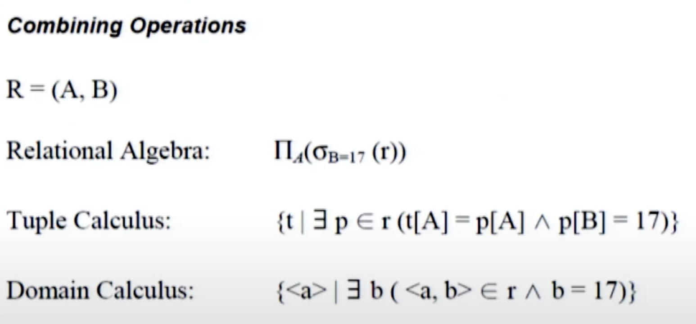
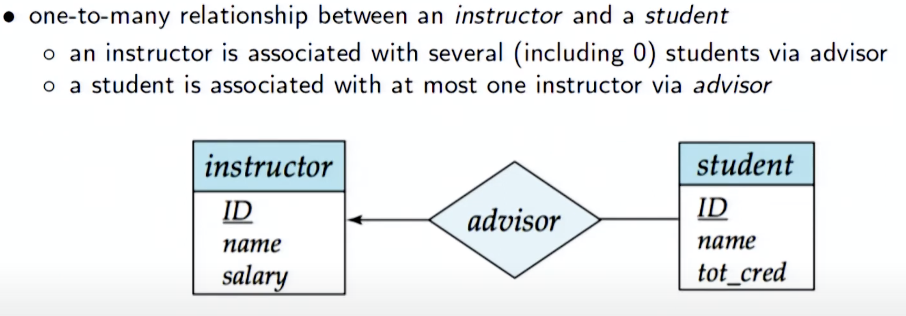
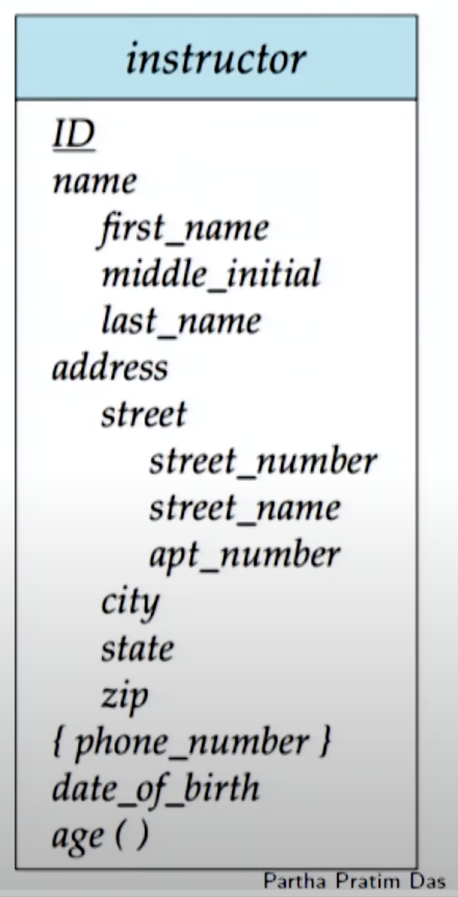
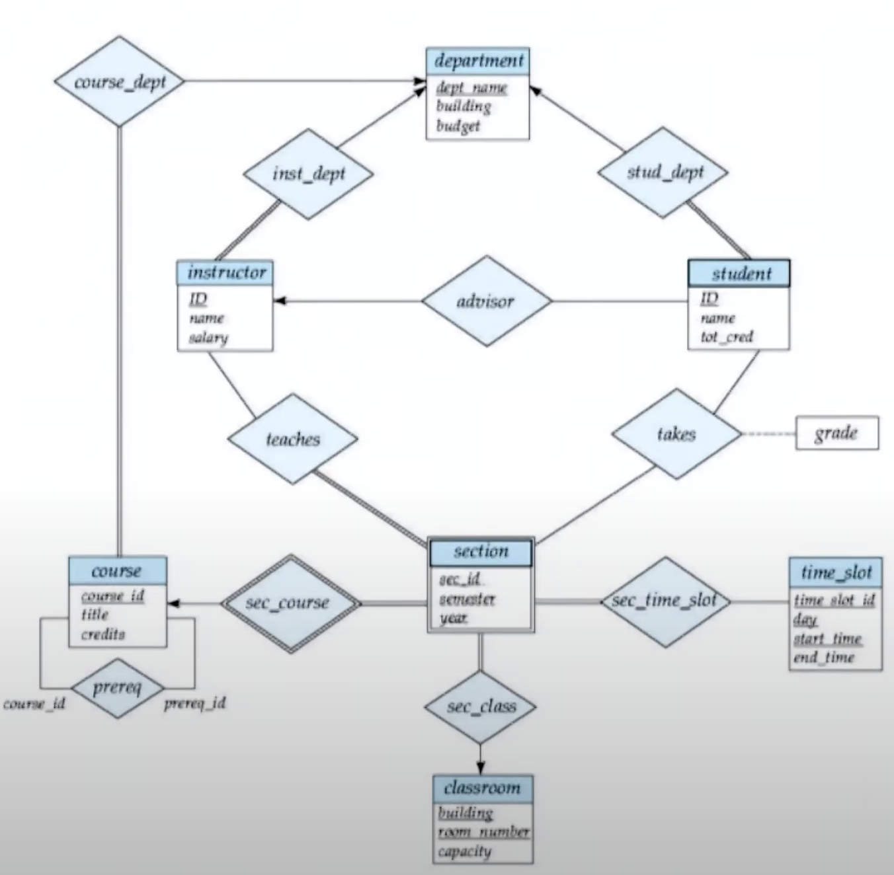
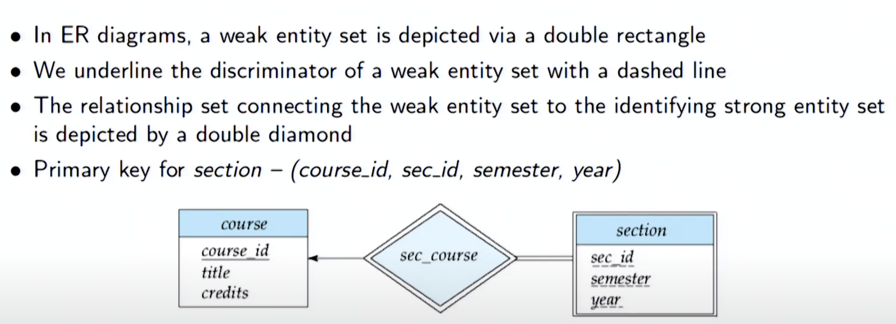
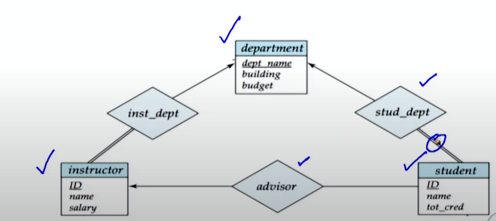
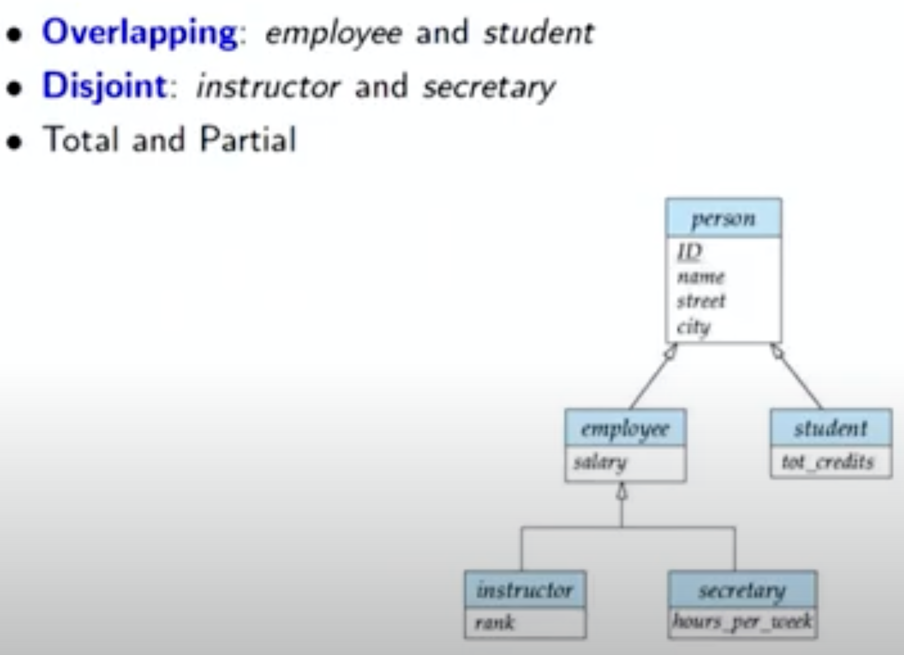

# Week 4 Notes - DBMS

*Prof. Partha Pratham Das, IIT KGP*

*Notes by Adarsh (23f2003570)*  

## [L4.1: Module 16 Formal Relational Query Languages/1 (28:05)](https://youtu.be/VfQcP-2VdLc)

### Formal Relational Query Language

Relational Algebra, Tuple Relational Calculus, and Domain Relational Calculus are forms that provides a theoretical framework for querying relational databases.

#### 1. Relational Algebra

Relational Algebra is a procedural query language that uses a set of operations to manipulate and retrieve data from relational databases. The key operations include:

- **Selection (σ)**: Filters rows based on a condition.
- **Projection (π)**: Selects specific columns from a table.
- **Union (∪)**: Combines results from two tables with the same attributes.
- **Difference (−)**: Retrieves rows from one table that are not in another.
- **Cartesian Product (×)**: Combines every row of one table with every row of another.
- **Join (⨝)**: Combines rows from two tables based on a related column.

##### Example

Given two tables, `employees` and `departments`:

**employees**:
| id | name   | dept_id | salary |
|----|--------|---------|--------|
| 1  | Alice  | 1       | 50000  |
| 2  | Bob    | 2       | 60000  |
| 3  | Charlie| 1       | 55000  |

**departments**:
| dept_id | dept_name  |
|---------|------------|
| 1       | HR         |
| 2       | Engineering |

**Query**: Get names of employees in the HR department.

**Relational Algebra**:

1. Selection: \( \sigma_{dept\_id=1}(employees) \)
2. Projection: \( \pi_{name}(\sigma_{dept\_id=1}(employees)) \)

#### 2. Tuple Relational Calculus

Tuple Relational Calculus is a non-procedural query language that allows you to specify what you want to retrieve without describing how to get it. It uses variables that represent tuples.

##### Example

To retrieve names of employees with a salary greater than 55000:

**Query**: Get names of employees with salary > 55000.

**Tuple Relational Calculus**:

```
{ e.name | e ∈ employees AND e.salary > 55000 }
```

#### 3. Domain Relational Calculus

Domain Relational Calculus is similar to Tuple Relational Calculus, but it uses variables that represent the values of attributes rather than entire tuples. 

##### Example

To retrieve names of employees with a salary greater than 55000:

**Query**: Get names of employees with salary > 55000.

**Domain Relational Calculus**:

```
{ n | ∃d, s (employees(d, n, d, s) AND s > 55000) }
```

Here, `d` represents `dept_id`, `n` represents `name`, and `s` represents `salary`.

- **Relational Algebra**: A procedural way to specify queries using operations.
- **Tuple Relational Calculus**: A non-procedural way that uses tuple variables. This uses predicate calculus
- **Domain Relational Calculus**: Similar to tuple calculus but focuses on attribute values. It is both non-procedural and uses predicate calculus

### Relational Algebra


These operators take 1 or 2 relations as input and produces a new relation as a result

|Symbol|Name|
|-|-|
|$\lor$|OR disjunction|
|$\land$|AND conjunction|
|$\displaystyle \large \neg$|NOT, Negation|
|$=, \not =, >, <, \leq, \geq$|Operators|
|$\sigma$|SELECT|
|$\Pi$|PROJECT|
|$\cup$|UNION|
|$\cap$|INTERSECTION|
|$-$|DIFFERENCE|

### Relational Algebra Notation

#### SELECT
$\sigma_{dept\_name =Physics}(instructor)$
  - `SELECT * FROM instructor WHERE dept_name='Physics'`

#### SELECT WITH WHERE
$\sigma_{A=B} \land {D > 5}(r)$
  - `SELECT * FROM r WHERE A = B AND D > 5`
#### PROJECT
$\prod_{a,b,c,d}(relation)$
  - `SELECT a,b,c,d FROM relation`

#### Operations

$\prod_{course\_id}(\sigma_{semester='fall' \land year = 2009}(section)) {[\cup/-/\cap]} \prod_{course\_id}(\sigma_{semester='spring' \land year = 2010}(section))$

```sql
SELECT course_id FROM section
WHERE semester='fall' AND year=2009
UNION
SELECT course_id FROM section
WHERE semester='spring' AND year=2010
```

#### NOTE ABOUT SET OPERATIONS
For $R \cup S$to be possible
1. r, s should have same `Arity` aka same number of attributes/fields in the table


$R \cap S$is the same as $r - (r - s)$


### Division Operator

In relational databases, the division operation is a specific operation used to find tuples in one relation that are associated with all tuples in another relation. This operation is particularly useful when dealing with queries that involve "all" conditions.

#### Division of Two Relations

In relational databases, the division operation finds tuples in one relation that are associated with all tuples in another relation.

#### Mathematical Definition

Given two relations:

- $R(A, B)$: Relation $R$has attributes $A$and $B$.
- $S(B)$: Relation $S$has attribute $B$.

The result of the division operation $R \div S$will yield a new relation containing all values of $A$from $R$such that for every tuple in $S$, there exists a corresponding tuple in $R$with that $A$and the matching $B$values.

#### Mathematical Representation

The result of the division $R \div S$can be expressed as:

$$
R \div S = \{ t \in \pi_A(R) \mid \forall s \in S, \exists r \in R (r.A = t.A \land r.B = s.B) \}
$$

Where:
- $\pi_A(R)$is the projection of relation $R$on attribute $A$.
- $t$is a tuple from the resulting relation.
- $s$is a tuple from relation $S$.
- $r$is a tuple from relation $R$.

#### Example

##### Given Relations

**Relation $R$**:

| A    | B    |
|------|------|
| 1    | x    |
| 1    | y    |
| 2    | x    |
| 2    | y    |
| 3    | x    |

**Relation $S$**:

| B    |
|------|
| x    |
| y    |

##### Performing the Division $R \div S$

1. **Identify tuples in $R$** for each tuple in $S$:
   - For $S.B = x$: Look for $A$such that $R.A = t.A$and $R.B = x$.
   - For $S.B = y$: Look for $A$such that $R.A = t.A$and $R.B = y$.

2. **Check each $A$**:
   - For $A = 1$: Exists in $R$for both $B = x$and $B = y$.
   - For $A = 2$: Exists in $R$for both $B = x$and $B = y$.
   - For $A = 3$: Exists in $R$only for $B = x$, not for $B = y$.

The result of the division $R \div S$will be:

| A    |
|------|
| 1    |
| 2    |

#### SQL Implementation in PostgreSQL

While SQL does not have a built-in division operator, you can simulate division using a combination of `GROUP BY` and `HAVING` clauses. Here’s how you can implement the division of two relations in PostgreSQL:

##### SQL Example

```sql
WITH R AS (
    SELECT 1 AS A, 'x' AS B UNION ALL
    SELECT 1, 'y' UNION ALL
    SELECT 2, 'x' UNION ALL
    SELECT 2, 'y' UNION ALL
    SELECT 3, 'x'
),
S AS (
    SELECT 'x' AS B UNION ALL
    SELECT 'y'
)

SELECT A
FROM R
GROUP BY A
HAVING COUNT(DISTINCT B) = (SELECT COUNT(*) FROM S);
```

#### Explanation of SQL Query

- The `WITH` clause defines two temporary relations, $R$and $S$.
- The main query groups results by $A$and counts distinct $B$values.
- The `HAVING` clause checks that the count of distinct $B$values for each $A$matches the total count of tuples in $S$.


### One more Relation Division Example

We have two relations:

1. **Students enrolled in courses** (Relation $R$): This relation contains students and the courses they are enrolled in.
2. **Required courses** (Relation $S$): This relation contains the courses that a specific program requires.

#### Given Relations

##### Relation $R(StudentID, CourseID)$

| StudentID | CourseID |
|-----------|----------|
| 101       | CS101    |
| 101       | CS102    |
| 101       | CS103    |
| 102       | CS101    |
| 102       | CS103    |
| 103       | CS102    |
| 103       | CS103    |
| 104       | CS101    |

##### Relation $S(CourseID)$

| CourseID |
|----------|
| CS101    |
| CS102    |

#### Performing the Division $R \div S$

We want to find students who are enrolled in **all** required courses.

1. **Identify tuples in $R$** for each tuple in $S$:
   - For $S.CourseID = CS101$: Look for students who are enrolled in $CS101$.
   - For $S.CourseID = CS102$: Look for students who are enrolled in $CS102$.

2. **Check each StudentID**:
   - For **Student 101**: Enrolled in $CS101$and $CS102$(matches all).
   - For **Student 102**: Enrolled in $CS101$but not in $CS102$(does not match).
   - For **Student 103**: Enrolled in $CS102$but not in $CS101$(does not match).
   - For **Student 104**: Enrolled in $CS101$but not in $CS102$(does not match).

#### Result of the Division $R \div S$

Based on the checks above, the resulting relation will be:

| StudentID |
|-----------|
| 101       |


The division $R \div S$shows that **only Student 101** is enrolled in all the required courses (both $CS101$and $CS102$).

### Another Relation Division problem

We have two relations:

1. **Employees assigned to projects** (Relation $R$): This relation contains employees and the projects they are working on.
2. **Required projects** (Relation $S$): This relation lists the projects that need to be completed for a certain initiative.

#### Given Relations

##### Relation $R(EmployeeID, ProjectID)$

| EmployeeID | ProjectID |
|------------|-----------|
| 201        | P1        |
| 201        | P2        |
| 202        | P1        |
| 202        | P3        |
| 203        | P2        |
| 204        | P1        |
| 204        | P2        |
| 204        | P3        |

##### Relation $S(ProjectID)$

| ProjectID |
|-----------|
| P1        |
| P2        |

#### Performing the Division $R \div S$

We want to find employees who are assigned to **all** required projects.

1. **Identify tuples in $R$** for each tuple in $S$:
   - For $S.ProjectID = P1$: Look for employees who are assigned to $P1$.
   - For $S.ProjectID = P2$: Look for employees who are assigned to $P2$.

2. **Check each EmployeeID**:
   - For **Employee 201**: Assigned to $P1$and $P2$(matches all).
   - For **Employee 202**: Assigned to $P1$but not to $P2$(does not match).
   - For **Employee 203**: Assigned to $P2$but not to $P1$(does not match).
   - For **Employee 204**: Assigned to $P1$, $P2$, and $P3$(matches all).

### Result of the Division $R \div S$

Based on the checks above, the resulting relation will be:

| EmployeeID |
|------------|
| 201        |
| 204        |

The division $R \div S$or $R | S$shows that **Employees 201 and 204** are assigned to all the required projects ($P1$and $P2$).

In this figure $R - S$is the **lecturer** field. $S$is the Module-Subject link.


Relation Division Means **$R|S$or $R \div S$is associated with all instances of $S$**

One more Relation Division Example


One more Relation Division example with 2 or more columns


### Mathematical Expression of Relation Division


### Theta Join

$\Join_{\theta} (r, s) = \sigma_{\theta}(r \times s)$

A **theta join** is a type of join operation in relational databases that combines rows from two or more tables based on a specified condition. Unlike natural joins or inner joins that use equality conditions, theta joins can use any condition, including inequalities, greater than, less than, etc.

#### Syntax

In SQL, a theta join can be implemented using the `JOIN` clause along with an `ON` clause that specifies the condition for the join.

#### Example Scenario

Let's consider two tables: **Employees** and **Departments**.

##### Table Structures

1. **Employees**

| EmployeeID | Name   | Salary | DeptID |
|------------|--------|--------|--------|
| 1          | Alice  | 60000  | 1      |
| 2          | Bob    | 70000  | 2      |
| 3          | Charlie| 80000  | 1      |
| 4          | David  | 90000  | 3      |

2. **Departments**

| DeptID | DeptName       | MinSalary |
|--------|----------------|-----------|
| 1      | HR             | 50000     |
| 2      | Engineering    | 60000     |
| 3      | Sales          | 75000     |

#### Example of a Theta Join

Let’s say we want to find employees whose salary is greater than the minimum salary for their respective department. We can perform a theta join on the **Employees** and **Departments** tables using the condition that compares the employee's salary to the department's minimum salary.

##### SQL Query

```sql
SELECT 
    e.EmployeeID,
    e.Name,
    e.Salary,
    d.DeptName
FROM 
    Employees e
JOIN 
    Departments d ON e.DeptID = d.DeptID AND e.Salary > d.MinSalary;
```

#### Explanation of the Query

- **FROM Employees e**: Selects from the `Employees` table and gives it an alias `e`.
- **JOIN Departments d**: Joins with the `Departments` table, giving it the alias `d`.
- **ON e.DeptID = d.DeptID**: Specifies the first condition for the join, matching employees with their respective departments.
- **AND e.Salary > d.MinSalary**: Specifies the second condition for the join, ensuring that we only include employees whose salary is greater than the minimum salary for their department.

#### Result of the Query

Based on the data in the tables, the result will be:

| EmployeeID | Name   | Salary | DeptName    |
|------------|--------|--------|-------------|
| 2          | Bob    | 70000  | Engineering  |
| 3          | Charlie| 80000  | HR          |
| 4          | David  | 90000  | Sales       |

The theta join allows us to combine information from the `Employees` and `Departments` tables based on the condition of employee salaries being greater than their department's minimum salary. Theta joins are flexible and can accommodate various conditions, making them powerful tools in SQL queries.

When $\theta$does the following
1. Enforces equality b/w R & S then its a equality join
2. If it enforces column binding between R & S then its a natural join


## [L4.2: Formal Relational Query Languages/2 (30:40)](https://youtu.be/WjlbMfEqom8)

### Predicate Calculus or Predicate Logic
Predicate calculus, also known as first-order logic, is a formal system used in relational databases for expressing queries and constraints. Here are key points regarding its application in relational databases:

1. **Foundational Logic**: Predicate calculus extends propositional logic by incorporating quantifiers and predicates, allowing for more expressive statements about database entities.

2. **Predicates**: Predicates represent properties or relations among objects. For example, in a database of students, a predicate could be "is enrolled in" relating students to courses. This is also called Predicate Logic and is an extension of Propositional Logic or Boolean Algebra

3. **Quantifiers**: Two main types:
   - **Universal Quantifier (∀)**: Indicates that a statement holds for all elements in a domain. E.g., "For every student, there exists a course they are enrolled in."
   - **Existential Quantifier (∃)**: Indicates that there is at least one element for which the statement is true. E.g., "There exists a student who is enrolled in a mathematics course."

4. **Logical Connectives**: Similar to propositional logic, predicate calculus uses logical connectives like AND (∧), OR (∨), NOT (¬), and IMPLIES (→) to build complex expressions.

5. **Domain of Discourse**: The set of objects under consideration (e.g., all students, all courses) is referred to as the domain of discourse. Predicates and quantifiers operate over this domain.

6. **Formal Semantics**: Predicate calculus provides a formal framework for interpreting database queries. Each predicate can be associated with a relational table, and the truth of a statement can be evaluated based on the data in those tables.

7. **Query Language**: SQL can be viewed as a practical application of predicate calculus. Queries can be expressed using SELECT, WHERE, and JOIN clauses that embody logical predicates and quantifiers.

8. **Constraints and Rules**: Database integrity constraints (e.g., uniqueness, referential integrity) can be expressed using predicate calculus, ensuring that certain conditions hold for the data.

9. **Expressiveness**: Predicate calculus enhances the ability to express complex queries, enabling operations like filtering, aggregation, and subqueries based on logical conditions.

10. **Evaluation**: The evaluation of predicates in queries can lead to optimization techniques, helping databases retrieve data efficiently by minimizing unnecessary computation.

### Boolean Algebra

1. **Basic Operations**: 
   - **AND ( ∧ )**: Returns true if both operands are true.
     - **Example**: $A \land B$ is true if both $A$ and $B$ are true.
     - **Truth Table**:
       | A | B | $A \land B$|
       |---|---|-------|
       | 0 | 0 |   0   |
       | 0 | 1 |   0   |
       | 1 | 0 |   0   |
       | 1 | 1 |   1   |

   - **OR ( ∨ )**: Returns true if at least one operand is true.
     - **Example**: $A \lor B$ is true if either $A$ or $B$ is true.
     - **Truth Table**:
       | A | B | $A \lor B$|
       |---|---|-------|
       | 0 | 0 |   0   |
       | 0 | 1 |   1   |
       | 1 | 0 |   1   |
       | 1 | 1 |   1   |

   - **NOT ( ¬ )**: Inverts the value of the operand.
     - **Example**: $\neg A$ is true if $A$is false.
     - **Truth Table**:
       | A | $\neg A$|
       |---|----|
       | 0 |  1 |
       | 1 |  0 |

2. **Identity Laws**:
   - $A \land 1 = A$
   - $A \lor 0 = A$

3. **Domination Laws**:
   - $A \land 0 = 0$
   - $A \lor 1 = 1$

4. **Idempotent Laws**:
   - $A \land A = A$
   - $A \lor A = A$

5. **Complement Laws**:
   - $A \land \neg A = 0$
   - $A \lor \neg A = 1$

6. **Distributive Laws**:
   - $A \land (B \lor C) = (A \land B) \lor (A \land C)$
   - $A \lor (B \land C) = (A \lor B) \land (A \lor C)$

7. **Absorption Laws**:
   - $A \lor (A \land B) = A$
   - $A \land (A \lor B) = A$

8. **De Morgan's Theorems**:
   - $\neg(A \land B) = \neg A \lor \neg B$
   - $\neg(A \lor B) = \neg A \land \neg B$

9. **Applications**: Boolean algebra is widely used in:
   - **Digital Logic Design**: Designing circuits using gates like AND, OR, and NOT.
   - **Computer Algorithms**: Simplifying logic expressions in programming.
   - **Search Engines**: Formulating search queries based on logical expressions.

10. **Example Expression**:
    - Simplifying the expression $A \land (B \lor \neg A)$:
      - Using Distributive Law: $A \land B \lor A \land \neg A$
      - By Complement Law: $A \land B \lor 0$
      - Result: $A \land B$

### Predicates

A **predicate** is a statement that contains one or more variables and becomes a proposition when the variables are assigned specific values. It expresses a property or a relation among objects.

#### Mathematical Notation:
A predicate can be denoted as:
$P(x)$
where:
- \(P\) is the predicate symbol (often representing a property or relation).
- \(x\) is a variable that can take values from a specified domain.

#### Parts of a Predicate

1. **Predicate Symbol**:
   - Represents the property or relation.
   - Example: In the predicate $P(x)$, \(P\) might represent "is even".
   - Predicate is a function which tells the truth value of statement P(X) at X.
   - P(x1, x2, x3,....,xn) is called a n-th place predicate
     - or a n-ary predicate
   - P(X) is a predicate
   - P(5) is a proposition!
     - $P(X) \equiv X > 3$ is a Predicate
       - $P(5)$ is a proposition that returns TRUE
       - $P(2)$ is a proposition that returns FALSE

2. **Variables**:
   - The symbols that can take on values from a domain.
   - Example: In $P(x)$, \(x\) is a variable.

3. **Domain of Discourse**:
   - The set of all possible values that the variables can take.
   - Example: If the domain is the set of integers, \(x\) can be any integer.

4. **Terms**:
   - These are the specific values or expressions that can replace the variables in the predicate.
   - Example: If \(x=2\), then $P(2)$ might evaluate to true if \(P\) is "is even".

5. **Quantifiers**:
   - Quantifiers allow us to express the extent to which a predicate holds over a domain:
     - **Universal Quantifier** ($\forall$): Indicates that the predicate is true for all elements in the domain.
       - Notation: $\forall x\,P(x)$ means "for all \(x\), \(P(x)\) is true."
     - **Existential Quantifier** ($\exists$): Indicates that there exists at least one element in the domain for which the predicate is true.
       - Notation: $\exists x\,P(x)$ means "there exists an \(x\) such that \(P(x)\) is true."

#### Example

Let’s consider a specific example with a predicate:

1. **Predicate**: 
   $P(x): x \text{ is an even number}$

2. **Domain**: 
   The domain could be the set of integers: $\mathbb{Z}$.

3. **Quantified Statements**:
   - **Universal Statement**: 
     $\forall \ x \in \mathbb{Z}, P(x) \text{ is false for odd integers.}$
   - **Existential Statement**: 
     $\exists \ x \in \mathbb{Z}\,(P(x)) \text{ is true for } x=2.$

### Quantifiers in Predicate Logic

In predicate logic, quantifiers are used to express statements about the properties of objects in a domain. There are two primary types of quantifiers:

1. **Universal Quantifier** (denoted as $\forall$)
2. **Existential Quantifier** (denoted as $\exists$)

#### 1. Universal Quantifier ($\forall$)

The universal quantifier expresses that a property holds for all elements in a given domain. The notation is:

$$
\forall x \, P(x)
$$

This reads as "for all $x$, $P(x)$ is true," meaning that the statement $P(x)$ is true for every possible value of $x$.

##### Example

**Statement**: "All humans are mortal."

- **Predicate**: Let $P(x)$ represent "x is mortal."
- **Domain**: All humans.

The logical expression would be:

$$
\forall x \, (Human(x) \rightarrow P(x))
$$

This means: For every $x$, if $x$ is a human, then $x$ is mortal.

#### 2. Existential Quantifier ($\exists$)

The existential quantifier expresses that there exists at least one element in the domain for which the property holds. The notation is:

$$
\exists x \, P(x)
$$

This reads as "there exists an $x$ such that $P(x)$ is true," meaning at least one value of $x$ makes the statement $P(x)$ true.

##### Example

**Statement**: "Some humans are doctors."

- **Predicate**: Let $P(x)$ represent "x is a doctor."
- **Domain**: All humans.

The logical expression would be:

$$
\exists x \, (Human(x) \land P(x))
$$

This means: There exists an $x$ such that $x$ is a human and $x$ is a doctor.

#### Combining Quantifiers

Quantifiers can also be combined to express more complex statements. The order of quantifiers is significant and can change the meaning of the statement.

##### Example

**Statement**: "Every student has at least one book."

- **Predicate**: Let $P(x, y)$ represent "x has y."
- **Domain**: Students and books.

The logical expression would be:

$$
\forall x \, (Student(x) \rightarrow \exists y \, (Book(y) \land P(x, y)))
$$

This means: For every student $x$, there exists a book $y$ such that $x$ has $y$.

#### Problem
1. Find the first names of students whose age > 21
   1. $\{t.FName | Student(t) \land t.Age > 21\}$

### Tuple Relation Calculus (TRC)

Tuple Relational Calculus (TRC) is a non-procedural query language that allows users to specify the desired information without describing how to obtain it. In TRC, queries are expressed using tuples and the language is based on predicate logic.

#### Syntax

A TRC expression generally has the form:

$$
\{ t | P(t) \}
$$

Where:
- \( t \) is a tuple variable.
- \( P(t) \) is a predicate that describes the conditions that the tuples must satisfy.

#### Example Database Schema

Let's assume we have the following relations:

1. **Students**(StudentID, Name, Major)

| StudentID | Name    | Major     |
|-----------|---------|-----------|
| 1         | Alice   | CS        |
| 2         | Bob     | EE        |
| 3         | Charlie | CS        |
| 4         | David   | ME        |

2. **Courses**(CourseID, Title, Credits)

| CourseID | Title          | Credits |
|----------|----------------|---------|
| 101      | Database       | 3       |
| 102      | Operating Sys  | 4       |
| 103      | Algorithms     | 3       |

3. **Enrollments**(StudentID, CourseID)

| StudentID | CourseID |
|-----------|----------|
| 1         | 101      |
| 1         | 102      |
| 2         | 101      |
| 3         | 103      |
| 4         | 102      |

#### Examples of Tuple Relational Calculus Queries

##### 1. Retrieve the Names of All Students

To retrieve the names of all students, you can express the query as:

$$
\{ s.Name | \text{Students}(s) \}
$$

This means: "Select the Name of tuple \( s \) from the Students relation."

##### 2. Find Students Major in Computer Science

To find all students majoring in Computer Science (CS):

$$
\{ s | \text{Students}(s) \land s.Major = 'CS' \}
$$

This means: "Select tuple \( s \) from Students where the Major of \( s \) is 'CS'."

##### 3. Retrieve the Student IDs of Students Enrolled in a Specific Course

To find students enrolled in the course with CourseID = 101:

$$
\{ e.StudentID | \text{Enrollments}(e) \land e.CourseID = 101 \}
$$

This means: "Select the StudentID from the Enrollments relation where CourseID is 101."

##### 4. Find Students Enrolled in More Than One Course

To find students who are enrolled in more than one course, you can express it as:

$$
\{ e_1.StudentID | \text{Enrollments}(e_1) \land \exists e_2 (\text{Enrollments}(e_2) \land e_1.StudentID = e_2.StudentID \land e_1.CourseID \neq e_2.CourseID) \}
$$

This means: "Select StudentID \( e_1 \) from Enrollments where there exists another enrollment \( e_2 \) for the same student in a different course."

##### 5. Retrieve All Courses Taken by a Specific Student

To get all courses taken by the student with StudentID = 1:

$$
\{ c | \exists e (\text{Enrollments}(e) \land e.StudentID = 1 \land \text{Courses}(c) \land c.CourseID = e.CourseID) \}
$$

This means: "Select course \( c \) such that there exists an enrollment \( e \) for StudentID 1, and \( c \) matches the CourseID of that enrollment."

Tuple Relational Calculus provides a way to express queries based on the properties of tuples in a database.

#### TRC Example 1


### TRC Example 2


### TRC Example 3


### Safety Of Expressions in TRC

In Tuple Relational Calculus (TRC), the **safety** of an expression is an important concept that ensures that the query will produce a finite result. A TRC expression is considered **safe** if it guarantees that the variables used in the query will be bounded by the domain of the relations, preventing the query from producing an infinite result.

#### Criteria for Safety

A TRC expression is safe if:
1. All free variables in the expression must be bounded by the range of some relation in the database.
2. The expression must not produce tuples that rely on infinite domains or arbitrary set constructions.

#### Examples of Safe and Unsafe Expressions

##### Example Database Schema

Let's use a simplified version of our previous database:

1. **Students**(StudentID, Name, Major)

| StudentID | Name    | Major     |
|-----------|---------|-----------|
| 1         | Alice   | CS        |
| 2         | Bob     | EE        |
| 3         | Charlie | CS        |

2. **Enrollments**(StudentID, CourseID)

| StudentID | CourseID |
|-----------|----------|
| 1         | 101      |
| 1         | 102      |
| 2         | 101      |
| 3         | 103      |

#### Safe Expressions

1. **Retrieve Student Names**

$$
\{ s.Name | \text{Students}(s) \}
$$

**Explanation**: This expression is safe because the variable \( s \) is bounded by the Students relation, ensuring a finite set of results.

2. **Find Students with Major in Computer Science**

$$
\{ s | \text{Students}(s) \land s.Major = 'CS' \}
$$

**Explanation**: This is safe as well, because \( s \) is again bounded by the Students relation.

3. **Find Enrolled Students for a Specific Course**

$$
\{ e.StudentID | \text{Enrollments}(e) \land e.CourseID = 101 \}
$$

**Explanation**: This expression is safe since \( e \) is bounded by the Enrollments relation.

#### Unsafe Expressions

1. **Retrieve All Possible Combinations of Students and Courses**

$$
\{ (s, c) | \text{Students}(s) \land \text{Courses}(c) \} \cup \{ (s, c) | s \text{ is any tuple} \} 
$$

**Explanation**: This expression is unsafe because it tries to create tuples from all possible combinations of students and courses, which can lead to infinite results due to the second part of the expression that includes "any tuple." This creates an unbounded variable.

2. **Using a Non-Bounded Variable**

$$
\{ s | s \text{ is a tuple} \} 
$$

**Explanation**: This expression is unsafe because it introduces a free variable \( s \) without any bounding condition, potentially leading to an infinite number of tuples.


### Equivalence of Algebra and Relational Calculus

The equivalence of Relational Algebra, Tuple Relational Calculus (TRC), and Domain Relational Calculus (DRC) lies in their ability to express the same queries and retrieve the same results from a relational database. Here’s an overview of each, followed by their equivalences expressed in mathematical notation.

1. **Relational Algebra (RA)**:
   - A procedural query language that provides a set of operations (like selection, projection, union, difference, and joins) to manipulate relations.

2. **Tuple Relational Calculus (TRC)**:
   - A non-procedural query language that describes queries in terms of tuple variables and predicates.

3. **Domain Relational Calculus (DRC)**:
   - Another non-procedural query language, but it uses domain variables instead of tuple variables, allowing queries to be expressed in terms of individual attributes.

#### Equivalence

To show equivalence, we express that a query expressed in one of these languages can be represented in the other two.

##### 1. Equivalence of Relational Algebra and Tuple Relational Calculus

If we have a relational algebra expression $R_1$, we can find a TRC expression $R_2$ that returns the same result:

- **RA Expression**:
  $$
  R_1 = \sigma_{\text{condition}}(R) \quad \text{(Selection)}
  $$
- **TRC Expression**:
  $$
  R_2 = \{ t | R(t) \land \text{condition}(t) \}
  $$

This means: The selection operation in RA can be represented in TRC by selecting tuples from $R$ that satisfy the condition.

##### 2. Equivalence of Relational Algebra and Domain Relational Calculus

Similarly, a relational algebra expression $R_1$ can also be represented by a DRC expression $R_3$:

- **RA Expression**:
  $$
  R_1 = \sigma_{\text{condition}}(R) \quad \text{(Selection)}
  $$
- **DRC Expression**:
  $$
  R_3 = \{ (d_1, d_2, \ldots, d_n) | \text{condition}(d_1, d_2, \ldots, d_n) \land R(d_1, d_2, \ldots, d_n) \}
  $$

Here, $d_1, d_2, \ldots, d_n$ are domain variables corresponding to the attributes of $R$.

##### 3. Equivalence Between Tuple and Domain Relational Calculus

For any TRC expression $R_2$, there exists a corresponding DRC expression $R_4$:

- **TRC Expression**:
  $$
  R_2 = \{ t | R(t) \land \text{condition}(t) \}
  $$
- **DRC Expression**:
  $$
  R_4 = \{ (d_1, d_2, \ldots, d_n) | R(d_1, d_2, \ldots, d_n) \land \text{condition}(d_1, d_2, \ldots, d_n) \}
  $$

#### Summary of Equivalence

We can denote the equivalence as follows:

1. **Relational Algebra $\leftrightarrow$ Tuple Relational Calculus**:
   $$
   \forall R_1 \, \exists R_2: \text{RA}(R_1) \equiv \text{TRC}(R_2)
   $$

2. **Relational Algebra $\leftrightarrow$ Domain Relational Calculus**:
   $$
   \forall R_1 \, \exists R_3: \text{RA}(R_1) \equiv \text{DRC}(R_3)
   $$

3. **Tuple Relational Calculus $\leftrightarrow$ Domain Relational Calculus**:
   $$
   \forall R_2 \, \exists R_4: \text{TRC}(R_2) \equiv \text{DRC}(R_4)
   $$

#### EQ Combining Operation


#### EQ SELECT Operation


#### EQ PROJECT Operation


#### EQ UNION Operation


#### EQ SET DIFF Operation


#### EQ INTERSECTION Operation


#### EQ NATURAL JOIN


## [L4.3: Entity-Relationship Model/1 (31:39)](https://youtu.be/EGAQdgim3IA)

### Design Process for Databases

Designing a PostgreSQL database from system design specifications involves several key steps.

#### 1. **Understand Requirements**
   - **Action**: Gather and analyze the system requirements.
   - **Example**: For an e-commerce platform, requirements might include managing products, customers, and orders.

#### 2. **Identify Entities**
   - **Action**: Determine the main entities based on requirements.
   - **Example**: 
     - **Product**
     - **Customer**
     - **Order**

#### 3. **Define Attributes for Each Entity**
   - **Action**: List the attributes that describe each entity.
   - **Example**: 
     - **Product**: `ProductID`, `Name`, `Description`, `Price`, `StockQuantity`
     - **Customer**: `CustomerID`, `Name`, `Email`, `Address`
     - **Order**: `OrderID`, `OrderDate`, `CustomerID`, `TotalAmount`

#### 4. **Identify Relationships Between Entities**
   - **Action**: Define how entities are related to each other.
   - **Example**:
     - A **Customer** can place multiple **Orders** (1:N).
     - An **Order** can include multiple **Products** (N:M).

#### 5. **Determine Cardinalities**
   - **Action**: Specify the cardinality for relationships.
   - **Example**: 
     - **Customer** to **Order**: 1:N
     - **Order** to **Product**: N:M (requires a join table).

#### 6. **Create the ER Diagram**
   - **Action**: Draw an ER diagram to visualize entities, attributes, and relationships.
   - **Example**: 
     - Represent **Customer**, **Order**, and **Product** as rectangles.
     - Connect them with lines indicating relationships and cardinalities.

#### 7. **Translate the ER Diagram into Tables**
   - **Action**: Convert the entities and relationships into tables and define primary/foreign keys.
   - **Example**:
     ```sql
     CREATE TABLE Customer (
         CustomerID SERIAL PRIMARY KEY,
         Name VARCHAR(100),
         Email VARCHAR(100) UNIQUE,
         Address TEXT
     );

     CREATE TABLE Product (
         ProductID SERIAL PRIMARY KEY,
         Name VARCHAR(100),
         Description TEXT,
         Price DECIMAL(10, 2),
         StockQuantity INT
     );

     CREATE TABLE "Order" (
         OrderID SERIAL PRIMARY KEY,
         OrderDate TIMESTAMP DEFAULT CURRENT_TIMESTAMP,
         CustomerID INT,
         TotalAmount DECIMAL(10, 2),
         FOREIGN KEY (CustomerID) REFERENCES Customer(CustomerID)
     );

     CREATE TABLE Order_Product (
         OrderID INT,
         ProductID INT,
         Quantity INT,
         PRIMARY KEY (OrderID, ProductID),
         FOREIGN KEY (OrderID) REFERENCES "Order"(OrderID),
         FOREIGN KEY (ProductID) REFERENCES Product(ProductID)
     );
     ```

#### 8. **Normalization**
   - **Action**: Ensure the database schema is normalized to eliminate redundancy.
   - **Example**: 
     - Check that data is structured into separate tables and that relationships are correctly represented without duplicate data.

#### 9. **Implement Database Schema**
   - **Action**: Execute the SQL statements to create the tables in PostgreSQL.
   - **Example**: Run the SQL commands created in step 7 in a PostgreSQL client.

#### 10. **Test the Database**
   - **Action**: Insert sample data and perform queries to ensure everything functions correctly.
   - **Example**: 
     ```sql
     INSERT INTO Customer (Name, Email, Address) VALUES ('John Doe', 'john@example.com', '123 Elm St');
     INSERT INTO Product (Name, Description, Price, StockQuantity) VALUES ('Laptop', 'High-performance laptop', 1200.00, 10);
     INSERT INTO "Order" (OrderDate, CustomerID, TotalAmount) VALUES (CURRENT_TIMESTAMP, 1, 1200.00);
     INSERT INTO Order_Product (OrderID, ProductID, Quantity) VALUES (1, 1, 1);
     ```

#### 11. **Documentation**
   - **Action**: Document the schema design, including table structures, relationships, and any business rules.
   - **Example**: Create a document outlining each table, its purpose, and relationships.

### Abstraction in ER Models

Abstraction in Entity-Relationship (ER) models refers to the simplification of complex real-world scenarios into manageable representations that focus on the essential components of the system. Here’s a detailed look at how abstraction works in ER models:

#### 1. **Entity Abstraction**
   - **Definition**: An entity is a distinct object or thing in the real world that is represented in the database.
   - **Example**: Instead of detailing every attribute of a student (like age, grades, hobbies), you represent the **Student** as a single entity with relevant attributes (e.g., **StudentID**, **Name**).

#### 2. **Attribute Abstraction**
   - **Definition**: Attributes are the properties or characteristics of entities. Abstraction helps in selecting only relevant attributes to avoid clutter.
   - **Example**: For a **Product** entity, you might only include essential attributes like **ProductID**, **Name**, and **Price**, while omitting less critical details like supplier information at this stage.

#### 3. **Relationship Abstraction**
   - **Definition**: Relationships define how entities are related to each other. Abstraction allows focusing on significant relationships.
   - **Example**: Instead of detailing every type of relationship (e.g., customer feedback, warranty claims), you might only represent the key relationship: **Customer** **purchases** **Product**.

#### 4. **Generalization and Specialization**
   - **Generalization**: This is the process of abstracting common characteristics from multiple entities into a more generalized entity.
     - **Example**: You might generalize **Car** and **Truck** into a single entity **Vehicle** with attributes like **VehicleID**, **Make**, and **Model**.
   - **Specialization**: The opposite process, where you create sub-entities from a general entity.
     - **Example**: Starting from **Employee**, you could specialize into **FullTimeEmployee** and **PartTimeEmployee** with specific attributes relevant to each type.

#### 5. **Aggregation**
   - **Definition**: This allows for treating a relationship set as a higher-level entity, which can simplify complex models.
   - **Example**: If you have a relationship where **Course** is taught by **Instructor** and taken by **Student**, you can aggregate these into a single entity **CourseOffering** that encapsulates both relationships.

#### 6. **Views**
   - **Definition**: In ER models, views can represent simplified subsets of data or relationships that are relevant to specific users or applications.
   - **Example**: A view for a library system might show only the **Book** and **Author** entities, ignoring other entities like **Publisher** and **Member** for a specific query.

#### 7. **Diagram Simplification**
   - **Definition**: ER diagrams can become complex. Abstraction helps focus on key entities and relationships, simplifying the visual representation.
   - **Example**: Instead of showing every detail of each entity, an abstracted ER diagram might only highlight core entities and their primary relationships.
### Terminology

1. An **Entity** is an object that exists and is distinguishable from other objects. Example Person, Company, Event Plant. Entity is represented with a set of attributes
   
2. **Entity Set** is a set of entities of the same type. Example Set of Persons, Companies, Events, Plants
3. Subset of attributes form primary key of the `entity set`
4. A **Relationship** is an association between several entities
5. A **Relationship Set** is a Mathematical set among 2 or more entities.


### Weak Entity Sets

Weak entity sets are a fundamental concept in Entity-Relationship (ER) modeling. A weak entity set is an entity that cannot be uniquely identified by its own attributes alone and relies on a "strong" (or "owner") entity to ensure its uniqueness. Here's a breakdown of weak entity sets with examples:

#### Characteristics of Weak Entity Sets

1. **No Primary Key**: Weak entities do not have a primary key that uniquely identifies them. Instead, they are identified by their relationship with a strong entity.
2. **Partial Key**: Weak entities have a partial key, which is an attribute or set of attributes that can distinguish weak entities within a particular strong entity context.
3. **Existence Dependency**: Weak entities depend on the existence of a strong entity; they cannot exist independently.
4. An entity set that is not a weak entity set is termed as a strong entity set.
5. Every weak entity must be associated with an identifying entity


#### Example Scenario

Let’s consider a scenario involving a **Project** and **Task** in a project management system:

##### Strong Entity: Project

- **Attributes**:
  - `ProjectID` (Primary Key)
  - `ProjectName`
  - `StartDate`

##### Weak Entity: Task

- **Attributes**:
  - `TaskID` (Partial Key)
  - `Description`
  - `Status`

NOTE: The weak entity needs to have a relationship with the strong entity. This is called **Identifying Relationship**

##### Relationships

- A **Task** is associated with exactly one **Project**, but a **Project** can have multiple **Tasks**.
- The uniqueness of a **Task** is determined by its `TaskID` in conjunction with the `ProjectID` of the associated **Project**.

#### ER Diagram Representation

1. **Project** is represented as a rectangle.
2. **Task** is represented as a double rectangle (indicating it is a weak entity).
3. The relationship between **Project** and **Task** is shown with a diamond, labeled "has" or "includes".
4. The partial key for **Task** is indicated, and the connecting line between **Project** and **Task** shows the dependency.

#### Example Data

**Project Table:**

| ProjectID | ProjectName  | StartDate  |
|-----------|---------------|------------|
| 1         | Build Website | 2024-01-01 |
| 2         | Develop App   | 2024-02-01 |

**Task Table:**

| TaskID | Description            | Status   | ProjectID |
|--------|------------------------|----------|-----------|
| 101    | Design Homepage        | In Progress | 1         |
| 102    | Implement Backend      | Not Started | 1         |
| 201    | UI/UX Design           | Completed | 2         |
| 202    | Setup Database         | In Progress | 2         |

#### Key Points

- **Identification**: A task is uniquely identified by both `TaskID` and `ProjectID`. For example, `TaskID 101` belongs to `ProjectID 1`, making it unique within that context.
- **Existence Dependency**: A **Task** cannot exist without a corresponding **Project**. If the **Project** is deleted, all associated **Tasks** must also be removed.

### Discriminator

A **discriminator** in the context of relational databases, especially when dealing with **weak entity sets** or **inheritance hierarchies** in an Entity-Relationship (ER) model, is an attribute that helps to distinguish between different subtypes or instances of an entity.

#### Definition

- **Discriminator**: An attribute that uniquely identifies a specific subtype of a superclass (or parent entity). It indicates which subclass an instance belongs to, especially in cases of polymorphism where a parent entity can have multiple child entities.

#### Key Characteristics

1. **Identification**: The discriminator attribute allows the database to determine which specific subtype an entity instance corresponds to.
2. **Part of the Key**: In the case of weak entities, the discriminator is often used in conjunction with the primary key of the strong entity to form a composite key.
3. **Subclassing**: It is commonly used in scenarios involving inheritance in object-oriented designs, where a base class has multiple derived classes.

#### Example Scenario

Consider a university database with the following entities:

- **Person** (superclass)
  - Attributes: `PersonID`, `Name`, `Email`
  
- **Student** (subclass)
  - Attributes: `StudentID`, `Major`, `Discriminator` (e.g., value = 'Student')

- **Instructor** (subclass)
  - Attributes: `InstructorID`, `Department`, `Discriminator` (e.g., value = 'Instructor')

#### Implementation

In the `Person` table, you could have a `Discriminator` column that indicates whether the person is a `Student` or an `Instructor`.

**Person Table Example:**

| PersonID | Name       | Email               | Discriminator |
|----------|------------|---------------------|---------------|
| 1        | Alice      | alice@example.com    | Student       |
| 2        | Bob        | bob@example.com      | Instructor     |

#### Usage in Queries

The discriminator allows for specific queries to filter data based on the subtype:

```sql
SELECT * FROM Person WHERE Discriminator = 'Student';
```

A discriminator is a vital attribute used in relational databases to differentiate between various subtypes of a generalized entity. It facilitates the implementation of inheritance and polymorphism in data modeling, helping to manage complexity and maintain data integrity within the database structure.


## [Mod19: L4.4: Entity-Relationship Model/2 (29:12)](https://youtu.be/In_PYLgZvKo)

### Recap: Logical Parts in a Relational Database

Certainly! A relational database is structured to recognize relationships among data. The core logical parts or relations in a relational database include:

#### 1. **Tables (Relations)**
   - **Definition**: A table is a collection of related data entries and consists of rows and columns.
   - **Example**: A "Customers" table might have columns for `CustomerID`, `Name`, `Email`, and `Phone`.

#### 2. **Rows (Records/Tuples)**
   - **Definition**: Each row in a table represents a single record or data entry.
   - **Example**: A row in the "Customers" table might look like this: `1, John Doe, johndoe@example.com, 123-456-7890`.

#### 3. **Columns (Attributes/Fields)**
   - **Definition**: Columns define the type of data stored in the table and represent attributes of the data.
   - **Example**: In the "Customers" table, `CustomerID` could be an integer, `Name` a string, and `Email` a string.

#### 4. **Primary Keys**
   - **Definition**: A primary key is a unique identifier for a record in a table, ensuring that no two rows have the same key.
   - **Example**: `CustomerID` could be the primary key in the "Customers" table.

#### 5. **Foreign Keys**
   - **Definition**: A foreign key is an attribute that creates a link between two tables, referring to the primary key in another table.
   - **Example**: In an "Orders" table, a `CustomerID` foreign key would link each order to the corresponding customer in the "Customers" table.

#### 6. **Relationships**
   - **Types of Relationships**:
     - **One-to-One**: Each record in Table A corresponds to one record in Table B.
       - **Example**: A "User" table and a "Profile" table, where each user has exactly one profile.
     - **One-to-Many**: A record in Table A can relate to multiple records in Table B.
       - **Example**: A "Customer" can have many "Orders".
     - **Many-to-Many**: Records in Table A can relate to multiple records in Table B and vice versa.
       - **Example**: A "Students" table and a "Courses" table, where students can enroll in multiple courses and each course can have multiple students (often managed through a junction table).

#### 7. **Indexes**
   - **Definition**: An index improves the speed of data retrieval operations on a database table at the cost of additional space and potential slower writes.
   - **Example**: An index on the `Email` column in the "Customers" table would allow faster searches for customer records by email.

#### 8. **Views**
   - **Definition**: A view is a virtual table that is based on the result set of a SQL query. It does not store data itself but presents data from one or more tables.
   - **Example**: A view called "ActiveCustomers" might display only customers with active accounts by filtering the "Customers" table based on certain criteria.

#### 9. **Constraints**
   - **Definition**: Constraints enforce rules on data in the table to maintain accuracy and integrity.
   - **Types of Constraints**:
     - **NOT NULL**: Ensures that a column cannot have a NULL value.
     - **UNIQUE**: Ensures that all values in a column are different.
     - **CHECK**: Ensures that all values in a column satisfy a specific condition.
   - **Example**: A `CHECK` constraint might ensure that the `Email` field contains the `@` symbol.

#### 10. **Transactions**
   - **Definition**: A transaction is a sequence of operations performed as a single logical unit of work. Transactions follow the ACID properties (Atomicity, Consistency, Isolation, Durability).
   - **Example**: Transferring money from one bank account to another would require two operations (debiting one account and crediting another) to either both succeed or both fail.
### Entities

#### 1. **Entity**
An **entity** is a single object or thing in the real world that can be distinctly identified. For example, a specific customer or product.

- **Example**: 
  - An individual customer: **Customer A**
  - An individual product: **Product X**

**Visual Representation**:
```
+---------------------+
|      Customer       |
|---------------------|
| CustomerID: 1       |  <-- Entity: Customer A
| Name: John Doe      |
| Email: johndoe@example.com |
+---------------------+
```

#### 2. **Entity Set**
An **entity set** is a collection of similar entities. It represents all the entities of a particular type.

- **Example**: 
  - The entity set of all customers.

**Visual Representation**:
```
+---------------------+
|     Customers       |
|---------------------|
| CustomerID: 1      |
| Name: John Doe      |
| Email: johndoe@example.com |
|---------------------|
| CustomerID: 2      |
| Name: Jane Smith    |
| Email: janesmith@example.com |
+---------------------+
```

- **Entity**: A single instance (e.g., "Customer A").
- **Entity Set**: A collection of entities of the same type (e.g., all customers).

In a diagram, you might represent entities as boxes or circles, while the entity set can be shown as a larger box that contains multiple entity representations.

#### Additional Example

If we add a **Product** entity set, it might look like this:

#### Entity Set for Products
```
+---------------------+
|      Products       |
|---------------------|
| ProductID: 101     |
| Name: Widget A      |
| Price: $25.00       |
|---------------------|
| ProductID: 102     |
| Name: Widget B      |
| Price: $30.00       |
+---------------------+
```

### UML Diagrams
#### Relationships


1. Here `Advisor` is a relationship between `Instructor` and `Student`.
2. `Advisor` has an attribute called `date`.
3. This means `Advisor` will have *Instructor.ID* and *Student.ID* as foreign keys
4. Note that Date has a dotted line. This means date is an attribute of `Advisor`
   1. If the line was a solid line, then `date` would be an entity or table.
   2. `date` would means an entity set with no attribute.


Certainly! An **Entity-Relationship (ER) diagram** visually represents the data structure and relationships in a database. Here’s how **Entity Sets** are depicted and their properties explained in point form.

### Entity Sets in an ER Diagram

- **Representation**: 
  - An entity set is usually represented as a rectangle.
  - Inside the rectangle, the name of the entity set is written (e.g., "Customer," "Product").

#### Example ER Diagram Snippet
```
+------------------+     +------------------+
|    Customer      |     |     Product      |
+------------------+     +------------------+
| CustomerID (PK)  |     | ProductID (PK)   |
| Name              |     | Name             |
| Email             |     | Price            |
+------------------+     +------------------+
```

### Properties of Entity Sets

1. **Unique Identification**:
   - Each entity set has a **primary key (PK)** that uniquely identifies each entity within that set.

2. **Attributes**:
   - Entity sets have **attributes**, which describe the properties of the entities. For example, a "Customer" entity might have attributes like `CustomerID`, `Name`, and `Email`.

3. **Multiplicity**:
   - An entity set can have a **cardinality** that indicates the number of instances of one entity that can be associated with instances of another entity.
   - Examples include one-to-one, one-to-many, and many-to-many relationships.

4. **Relationships**:
   - Entity sets can be related to one another through **relationships**, which can also be depicted in the ER diagram using diamonds.

5. **Weak Entity Sets**:
   - Some entity sets can be **weak**, meaning they do not have a primary key and depend on another entity set for their identification. They are typically represented with a double rectangle.

6. **Participation Constraints**:
   - An entity set may have constraints that specify whether all entities must participate in a relationship (total participation) or if participation is optional (partial participation).

7. **Inheritance**:
   - Entity sets can be organized into a hierarchy where a child entity set inherits attributes from a parent entity set.

8. **Attributes Types**:
   - Attributes can be:
     - **Simple**: Cannot be divided (e.g., `Name`).
     - **Composite**: Can be divided into sub-parts (e.g., `Address` could be divided into `Street`, `City`, `Zip`).
     - **Derived**: Can be calculated from other attributes (e.g., `Age` can be derived from `Date of Birth`).

### ER-Diagram Cheat Sheet


### Roles


Basically *Prof. PPD* is saying is
1. `prereq` is a course because It has all properties of a course.
2. `prereq_id` is the same as `course_id`


### Cardinality Constraints

Cardinality constraints in Entity-Relationship (ER) diagrams specify the number of instances of one entity that can or must be associated with instances of another entity. These constraints are crucial for defining the relationships between different entities in a database.

#### Types of Cardinality Constraints

General rules:
- `<` or `>` means **one**
- `|` means **MANY**

1. **One-to-One (1:1)**
   - **Description**: An instance of Entity A can be associated with only one instance of Entity B, and vice versa.
   - **Example**: A person and their passport; each person can have one passport, and each passport is assigned to one person.
   - **Diagram Representation**:
     ```
     +--------+     +--------+
      Person <-----> Passport
     +--------+     +--------+
     ```
   - Note `<----->` means 1-1

2. **One-to-Many (1:N)**
   - **Description**: An instance of Entity A can be associated with multiple instances of Entity B, but an instance of Entity B can be associated with only one instance of Entity A.
   - **Example**: A customer and their orders; one customer can place many orders, but each order belongs to one customer.
   - **Diagram Representation**:
     ```
     +--------+     +--------+
     Customer <-----|  Order 
     +--------+     +--------+
     ```

3. **Many-to-One (N:1)**
   - **Description**: Multiple instances of Entity A can be associated with one instance of Entity B, but each instance of Entity B can only relate to one instance of Entity A.
   - **Example**: Many employees work in one department; multiple employees can belong to a single department, but each employee belongs to only one department.
   - **Diagram Representation**:
     ```
     +--------+     +----------+
      Employee |-----> Department
     +--------+     +----------+
     ```

4. **Many-to-Many (M:N)**
   - **Description**: Instances of Entity A can be associated with multiple instances of Entity B, and instances of Entity B can also be associated with multiple instances of Entity A.
   - **Example**: Students and courses; students can enroll in multiple courses, and each course can have multiple students.
   - **Diagram Representation**:
     ```
     +--------+     +--------+
       Student |-----| Course 
     +--------+     +--------+
     ```

#### Notation in ER Diagrams

- **Lines and Crow’s Foot Notation**: Cardinality is often represented using lines connecting entities, with symbols indicating the type of relationship.
  - A single line represents a one-to-one relationship.
  - A line with a crow’s foot (three prongs) indicates a one-to-many relationship.
  - A double crow’s foot indicates a many-to-many relationship.

#### Participation Constraints

Cardinality constraints can also be complemented by **participation constraints**:
- **Total Participation**: All instances of an entity must participate in the relationship (represented by a double line).
- **Partial Participation**: Some instances of an entity may not participate in the relationship (represented by a single line).

Cardinality constraints are essential for accurately modeling the relationships between entities in an ER diagram. They help define how many instances of one entity relate to instances of another, guiding database design and ensuring data integrity.

#### **Prof. PPD's Notes** VVIP!
##### 1-1 Relations


- 1 Advisor can advise 1 student

##### 1-Many Relations


- One Advisor can advice many students

##### Many-1 Relations


- Many or 0 advisors can advice only 1 student
##### Many-Many Relations

- Many advisors can advice many students

*Always focus on the relationship first*

### ER Participation

In Entity-Relationship (ER) modeling, **participation constraints** specify whether all or only some instances of an entity set are involved in a relationship. They provide critical information about how entities relate to one another. Here are the key principles of participation constraints:

#### Types of Participation Constraints

1. **Total Participation**
   - Denoted by a **Double Line**
   - **Definition**: Every instance of the entity set must participate in the relationship.
   - **Characteristics**:
     - Represented by a **double line** connecting the entity to the relationship in an ER diagram.
     - Indicates that there cannot be an instance of the entity that does not relate to at least one instance of the associated entity.
   - **Example**: In a university database, if every student must enroll in at least one course, the relationship between "Students" and "Courses" would exhibit total participation for the "Students" entity.

   **Diagram Representation**:
   ```
   +---------+       +---------+
   | Student |=======| Enrolls |
   +---------+       +---------+
   ```

2. **Partial Participation**
   - Denoted by a **Single Line**
   - **Definition**: Some instances of the entity set may not participate in the relationship.
   - **Characteristics**:
     - Represented by a **single line** connecting the entity to the relationship in an ER diagram.
     - Indicates that it is acceptable for some instances of the entity to not have any associated instances in the relationship.
   - **Example**: In a company database, not all employees may be assigned to a project. Thus, the relationship between "Employees" and "Projects" would exhibit partial participation for "Employees."

   **Diagram Representation**:
   ```
   +---------+       +---------+
   | Employee|-------| Assigned|
   +---------+       +---------+
   ```

- **Total Participation**: 
  - Indicates a mandatory relationship for all instances of the entity.
  - Often used for entities that must fulfill a specific role in a relationship (e.g., a "User" must have an "Account").

- **Partial Participation**:
  - Indicates that participation in the relationship is optional for some instances of the entity.
  - Used for entities where involvement in a relationship is not mandatory (e.g., an "Employee" may not be assigned to any project).

**Note**

Understanding participation constraints is vital for:
- **Data Integrity**: Ensuring that the relationships among entities accurately reflect real-world rules.
- **Database Normalization**: Helping to organize data to minimize redundancy and improve data integrity.
- **Query Design**: Facilitating the creation of efficient queries that consider whether certain data will always be present or may be absent.


#### Notation for Entities


1. Write `Composite Attributes`
2. Write `Component Attribute` with a tab
3. The curly braces `{}` indicates a `Multi Valued Attribute`
4. The small braces `()` indicates that age is `derived attribute`. Its a function and has to be computed from `date_of_birth`




#### Notation for Weak Entity Sets



1. The Discriminator is the underlined attributes. `sec_id`, `semester`, `year`
2. the primary key for `sec_course` will be
   1. course_id
   2. sec_id
   3. semester
   4. year
   
A weak entity set is an entity that cannot be uniquely identified by its own attributes alone. Instead, it relies on a "strong" (or "owner") entity set for its identification. 

##### Example Scenario

Let's consider a simple example with two entities: `Customer` (strong entity) and `Order` (weak entity). 

- A `Customer` has attributes like `customer_id` (primary key), `name`, and `email`.
- An `Order` has attributes like `order_id` (not enough to uniquely identify an order) and `customer_id` (foreign key from `Customer`).

```sql
-- Create the strong entity set: Customer
CREATE TABLE Customer (
    customer_id SERIAL PRIMARY KEY,
    name VARCHAR(100),
    email VARCHAR(100)
);

-- Create the weak entity set: Order
CREATE TABLE "Order" (
    order_id SERIAL,
    order_date DATE,
    customer_id INT,
    PRIMARY KEY (order_id, customer_id), -- Composite primary key
    FOREIGN KEY (customer_id) REFERENCES Customer(customer_id)
);
```

1. **Customer Table**: 
   - `customer_id` is the primary key, uniquely identifying each customer.

2. **Order Table**: 
   - `order_id` alone is not unique. Thus, it needs `customer_id` as part of its primary key to create a composite key that uniquely identifies each order.
   - The `customer_id` column is a foreign key referencing the `Customer` table, establishing the relationship.

The `Order` entity depends on the `Customer` entity for its identification, making it a weak entity.


### Discriminator vs Primary Key

A **discriminator** is a column (or set of columns) used in a database to differentiate between different types of entities within a single table, particularly in the context of inheritance (single-table inheritance). It helps identify which subclass a particular row belongs to.

**Example:**
In a table `Vehicle`, you might have different types of vehicles (e.g., `Car`, `Truck`). The `discriminator` column could be named `vehicle_type`, which could take values like 'Car' or 'Truck' to indicate the specific subclass.

```sql
CREATE TABLE Vehicle (
    vehicle_id SERIAL PRIMARY KEY,
    vehicle_type VARCHAR(50),  -- Discriminator
    make VARCHAR(100),
    model VARCHAR(100)
);
```

#### Composite Key

A **composite key** is a primary key that consists of two or more columns to uniquely identify a record in a table. Composite keys are used when a single column is not sufficient to guarantee uniqueness.

**Example:**
In an `Order` table, you might use a combination of `order_id` and `customer_id` to create a composite key.

```sql
CREATE TABLE "Order" (
    order_id SERIAL,
    customer_id INT,
    order_date DATE,
    PRIMARY KEY (order_id, customer_id)  -- Composite key
);
```

#### Key Differences

1. **Purpose**:
   - **Discriminator**: Differentiates between types of entities in inheritance.
   - **Composite Key**: Ensures unique identification of records using multiple columns.

2. **Implementation**:
   - **Discriminator**: Usually a single column indicating the type of the entity.
   - **Composite Key**: Can involve two or more columns forming a unique combination.

3. **Context**:
   - **Discriminator**: Commonly used in scenarios involving inheritance.
   - **Composite Key**: Used in general database design where unique identification needs multiple attributes.

- A **discriminator** helps distinguish between different types of records in a table, especially in an inheritance hierarchy.
- A **composite key** is a way to uniquely identify records by combining multiple columns into a single primary key.
- A discriminator and composite key are 2 different things

### Representing Entity Sets with Composite Attributes

In relational databases, entity sets with composite attributes are represented by creating a separate table for the entity and handling the composite attribute appropriately.

1. **Main Entity Table**: Create a table for the main entity that includes its primary key and any simple attributes. 

2. **Composite Attribute**: For the composite attribute, you break it down into its individual components and represent each component as a separate column in the main entity table. 

For example, consider an entity set `Person` with a composite attribute `Address` that includes `Street`, `City`, and `ZipCode`. You would create the `Person` table like this:

```sql
CREATE TABLE Person (
    PersonID INT PRIMARY KEY,
    FirstName VARCHAR(50),
    LastName VARCHAR(50),
    Street VARCHAR(100),
    City VARCHAR(50),
    ZipCode VARCHAR(10)
);
```

In this structure:
- `PersonID` is the primary key.
- `FirstName` and `LastName` are simple attributes.
- `Street`, `City`, and `ZipCode` are the individual components of the composite attribute `Address`.

#### Alternative Approach
If the composite attribute is complex or has multiple instances (like multiple addresses), you might consider creating a separate table to handle it. For example:

```sql
CREATE TABLE Address (
    AddressID INT PRIMARY KEY,
    PersonID INT,
    Street VARCHAR(100),
    City VARCHAR(50),
    ZipCode VARCHAR(10),
    FOREIGN KEY (PersonID) REFERENCES Person(PersonID)
);
```

In this case:
- Each address is a separate record in the `Address` table.
- `PersonID` in the `Address` table serves as a foreign key linking back to the `Person` table.

- Break down composite attributes into individual columns in the main entity table for simple cases.
- Use a separate table for complex composite attributes or when dealing with multiple instances of the same composite attribute.
- Flatten the composite attributes

### Redundancy of Schema



1. 3 entity sets in this diagram
   1. instructor
   2. department
   3. student
2. 3 Relationships
   1. `inst_dept`
   2. `stud_dept`
   3. `advisor`
3. `advisor` is many to one from student to instructor. This has partial participation from both entities
   1. This means you can have students who do not have instructors and vice versa
   2. primary key will be (instructor.ID, student.ID)
4. `stud_dept` is a many to 1 from student to department.
   1. This relation has full participation from `student` side.
   2. This means you CANNOT have a student who does not have a department.
   3. This means every member of entity set `student` has to be in relation `stud_dept`
   4. Primary Key of `stud_dept` will be (student.id, department.dept_name)
5. `inst_dept` is a many to 1 relation from instructor to department
   1. `inst_dept` has full participation from `instructor` side.
   2. This means every instructor has to be in `inst_dept`
   3. Every Instructor will be in the `inst_dept` only once. This means the instructor will have only 1 department
   4. Primary Key of `inst_dept` will be (instructor.Id, department.dept_name)

### Redundancy

Redundancy in a database schema refers to the unnecessary duplication of data, which can lead to inconsistencies, increased storage costs, and complications in data maintenance. Redundant data can occur in various forms, including duplicate records or repeated information across tables.

### Examples of Redundancy

1. **Duplicate Records**: If a database contains multiple entries for the same entity, such as two entries for the same customer, this leads to redundancy.

   **Example**:
   ```sql
   CustomerID | Name    | Email
   ------------|---------|--------------------
   1           | Alice   | alice@example.com
   1           | Alice   | alice@example.com  -- Duplicate
   ```

2. **Repeating Groups**: If multiple attributes of the same type are stored in a single table instead of being separated into their own entities.

   **Example**:
   ```sql
   Orders
   OrderID | CustomerID | Product1 | Product2 | Product3
   ---------|-------------|----------|----------|----------
   101     | 1           | Widget A | Widget B | Widget C
   ```

   Here, `Product1`, `Product2`, and `Product3` are repeating groups and can lead to many unused columns if there are fewer than three products.

### Mitigating Redundancy

To mitigate redundancy, database designers often follow normalization principles.

1. **Normalization**: This process involves organizing the database into tables and establishing relationships between them to reduce redundancy.

   - **First Normal Form (1NF)**: Ensure that all columns contain atomic values and each entry in a column is of the same type.
   - **Second Normal Form (2NF)**: Ensure that all non-key attributes are fully functional dependent on the primary key, eliminating partial dependency.
   - **Third Normal Form (3NF)**: Ensure that all attributes are only dependent on the primary key, eliminating transitive dependencies.

   **Example of Normalization**:
   Instead of storing products directly in the orders table, create separate tables for customers and products:

   ```sql
   CREATE TABLE Customers (
       CustomerID INT PRIMARY KEY,
       Name VARCHAR(50),
       Email VARCHAR(100)
   );

   CREATE TABLE Products (
       ProductID INT PRIMARY KEY,
       ProductName VARCHAR(50)
   );

   CREATE TABLE Orders (
       OrderID INT PRIMARY KEY,
       CustomerID INT,
       ProductID INT,
       FOREIGN KEY (CustomerID) REFERENCES Customers(CustomerID),
       FOREIGN KEY (ProductID) REFERENCES Products(ProductID)
   );
   ```

2. **Using Foreign Keys**: Implementing foreign keys to link tables reduces the need to repeat data. For instance, instead of repeating customer information in every order, you reference the `CustomerID`.

3. **Avoiding Unnecessary Columns**: Design tables to include only necessary fields, removing any that could lead to redundancy.

4. **Data Integrity Constraints**: Use constraints to ensure data integrity. For instance, applying unique constraints can help avoid duplicate entries.

### Many to One relationship with Full Participation

In a many-to-one relationship, multiple records in one table (the "many" side) can be associated with a single record in another table (the "one" side).

#### Scenario

- Each student can enroll in only one class, but each class can have many students.
- We will enforce full participation, meaning every student must be associated with a class.

#### Table Structure

1. **Classes Table**: Represents the classes available.
   - `ClassID` (Primary Key)
   - `ClassName`

2. **Students Table**: Represents students who are enrolled in classes.
   - `StudentID` (Primary Key)
   - `StudentName`
   - `ClassID` (Foreign Key referencing `Classes.ClassID`)

#### SQL Schema

Here’s how you would create these tables in SQL:

```sql
-- Create Classes table
CREATE TABLE Classes (
    ClassID INT PRIMARY KEY,
    ClassName VARCHAR(50) NOT NULL
);

-- Create Students table with a foreign key reference to Classes
CREATE TABLE Students (
    StudentID INT PRIMARY KEY,
    StudentName VARCHAR(50) NOT NULL,
    ClassID INT NOT NULL,
    FOREIGN KEY (ClassID) REFERENCES Classes(ClassID) ON DELETE CASCADE,
    CONSTRAINT fk_class
        FOREIGN KEY (ClassID)
        REFERENCES Classes(ClassID)
        ON DELETE CASCADE
);
```

#### Explanation

1. **Classes Table**: This table contains unique identifiers for classes. The `ClassID` serves as the primary key.

2. **Students Table**: 
   - `StudentID` is the primary key for identifying each student.
   - `ClassID` is a foreign key that references `ClassID` in the `Classes` table. This establishes the many-to-one relationship, indicating that multiple students can belong to one class.
   - The `ON DELETE CASCADE` clause means that if a class is deleted, all associated students will also be deleted, ensuring referential integrity.

#### Full Participation

To enforce full participation, you can add a NOT NULL constraint to the `ClassID` in the `Students` table:

```sql
ClassID INT NOT NULL,
```

This ensures that every student must belong to a class, thereby enforcing full participation. If you attempt to insert a student without specifying a class, the database will reject the operation.

```sql
-- Inserting data into Classes
INSERT INTO Classes (ClassID, ClassName) VALUES (1, 'Mathematics');
INSERT INTO Classes (ClassID, ClassName) VALUES (2, 'Science');

-- Inserting data into Students
INSERT INTO Students (StudentID, StudentName, ClassID) VALUES (1, 'Alice', 1);
INSERT INTO Students (StudentID, StudentName, ClassID) VALUES (2, 'Bob', 1);
INSERT INTO Students (StudentID, StudentName, ClassID) VALUES (3, 'Charlie', 2);
```

#### Querying the Data

To see the relationship, you can perform a JOIN:

```sql
SELECT 
    Students.StudentID,
    Students.StudentName,
    Classes.ClassName
FROM 
    Students
JOIN 
    Classes ON Students.ClassID = Classes.ClassID;
```
```
 studentid | studentname |  classname  
-----------+-------------+-------------
         1 | Alice       | Mathematics
         2 | Bob         | Mathematics
         3 | Charlie     | Science
(3 rows)
```

The many-to-one relationship between `Students` and `Classes` is clearly defined, ensuring that each student is associated with one class while allowing each class to have many students. The implementation of NOT NULL on `ClassID` enforces full participation, guaranteeing that every student is linked to a class.


### Problem
Make 2 Tables Employee and Department. Then make the following relations

1. One to One from Employee to Department
2. Many to One from Employee to Department
3. Many To Many from Employee to Department
4. One to One from Department to Employee

```SQL
CREATE TABLE Employee (
   id INT PRIMARY KEY,
   Employee_Name VARCHAR(200) NOT NULL
);

CREATE TABLE Department(
   id INT PRIMARY KEY,
   department_name VARCHAR(200) NOT NULL
);

INSERT INTO Department VALUES (1, 'Mechanical');
INSERT INTO Department VALUES (2, 'Aerospace');

INSERT INTO Employee VALUES (1, 'Prof. Mechatronix');
INSERT INTO Employee VALUES (2, 'Prof. FlyHigh');
```

#### One to One from Employee to Department

```SQL
CREATE TABLE emp_dept_one_one(
   emp_id INT PRIMARY KEY,
   dept_id INT UNIQUE,
   FOREIGN KEY (emp_id) REFERENCES Employee(id)
      ON DELETE CASCADE,
   FOREIGN KEY (dept_id) REFERENCES Department(id)
      ON DELETE CASCADE
)

INSERT INTO emp_dept_one_one VALUES (1, 1); /* Allowed */
INSERT INTO emp_dept_one_one VALUES (1, 2); /* Not Allowed */
INSERT INTO emp_dept_one_one VALUES (2, 1); /* Not Allowed*/
```

### Many to One From Employee to Department

```SQL
CREATE TABLE emp_dept_many_one (
   dept_id INT,
   emp_id INT UNIQUE,
   FOREIGN KEY (emp_id) REFERENCES Employee(id)
      ON DELETE CASCADE,
   FOREIGN KEY (dept_id) REFERENCES Department(id)
      ON DELETE CASCADE
);

INSERT INTO emp_dept_many_one VALUES (1, 1); /* Allowed */
INSERT INTO emp_dept_many_one VALUES (1, 2); /* Allowed */
INSERT INTO emp_dept_many_one VALUES (2, 1); /* NOT Allowed */
```

### Many to Many From Employee to Department

```SQL
CREATE TABLE emp_dept_many_many (
   dept_id INT,
   emp_id INT,
   PRIMARY KEY (dept_id, emp_id),
   FOREIGN KEY (emp_id) REFERENCES Employee(id)
      ON DELETE CASCADE,
   FOREIGN KEY (dept_id) REFERENCES Department(id)
      ON DELETE CASCADE
);

INSERT INTO emp_dept_many_many VALUES (1, 1); /* Allowed */
INSERT INTO emp_dept_many_many VALUES (1, 1); /* NotAllowed */
INSERT INTO emp_dept_many_many VALUES (1, 2); /* Allowed */
INSERT INTO emp_dept_many_many VALUES (2, 1); /* Allowed */
INSERT INTO emp_dept_many_many VALUES (2, 2); /* Allowed */
```


## [L4.5: Entity-Relationship Model/3 (32:00)](https://youtu.be/WOWKszMjmgE)

### 'Is A' Relationship a.ka ISA

In the context of databases, the "Is A" relationship often pertains to how entities are structured and related within a database schema, especially when dealing with inheritance or categorization.

1. **Entity Relationship Models**: In databases, entities (tables) can have relationships that reflect real-world connections. An "Is A" relationship indicates that one entity is a subtype of another. For example, in a database for a zoo, you might have a table for `Animals`, and a more specific table for `Mammals`. Here, "Mammals is a Animals" implies that every entry in the `Mammals` table also qualifies as an entry in the `Animals` table.

2. **Table Inheritance**: This concept can be implemented through different strategies:
   - **Single Table Inheritance**: All data for a base class and its subclasses is stored in a single table with a type discriminator column. For instance, a single `Animals` table might have columns for all animal types, with a column indicating whether an entry is a `Mammal`, `Bird`, etc.
   - **Class Table Inheritance**: Each class has its own table. The `Mammals` table would store additional attributes specific to mammals, while still relating back to the `Animals` table via a foreign key.
   - **Concrete Table Inheritance**: Each subclass has its own table with all relevant attributes, without a separate base class table.

3. **Normalization**: The "Is A" relationship aids in normalizing the database design. By categorizing entities, you can reduce redundancy and enhance data integrity. For instance, if all animals share certain attributes, it makes sense to have a parent `Animals` table and child tables for specific types.

4. **Querying**: Understanding the "Is A" relationship is crucial for querying the database effectively. For example, if you want to retrieve all mammals, you would query the `Mammals` table, but you might also want to join it with the `Animals` table to get broader attributes or information.

#### Example:

- **Entities**:
  - `Animals (id, name, type)`
  - `Mammals (id, fur_color, habitat)`
  - `Birds (id, wing_span, nest_type)`

Here, both `Mammals` and `Birds` "are" types of `Animals`. This structure allows for efficient data management and querying while preserving the hierarchical relationship between entities.



1. Instructor is a Employee
2. Employee is a Person
3. so Instructor is a specialized form of person
   1. Fields of Instructor are all of person+employee+instructor

#### Three ways of ISA relations modelling

1. **Specialization Method:** Model each hierarchical entity as a table
   1. PERSON | ID, name, street, city
   2. STUDENT | ID, total_cred
   3. employee | ID, salary
   4. Remember ID comes from Person!
   5. Drawback is JOINING relations i.e TIME Complexity
   
2. Flatten the whole thing
   1. PERSON | ID, name, street, city
   2. STUDENT | ID, name, street, city, total_cred
   3. employee | ID, name, street, city, salary
   4. DRAWBACK: Space Complexity and keeping all these data tables consistent
3. **Generalization**
   1. ID, name, street, city, Salary, total_cred
   2. You will need to add an `discriminator`
      1. or do null signature checks to find who is who 

### Aggregation


1. `eval_for` is Relation between project, student, instructor.

WIP: 23:43