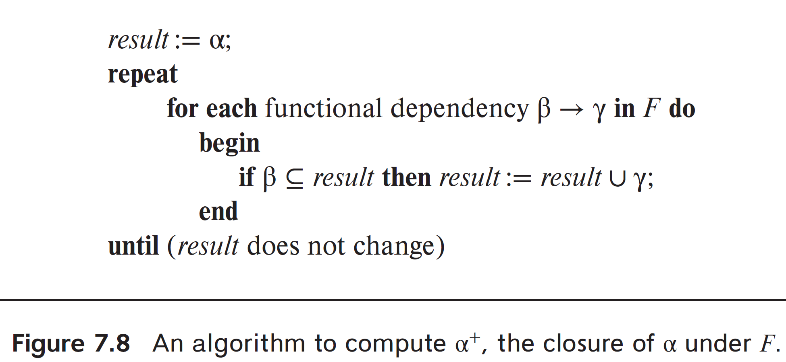
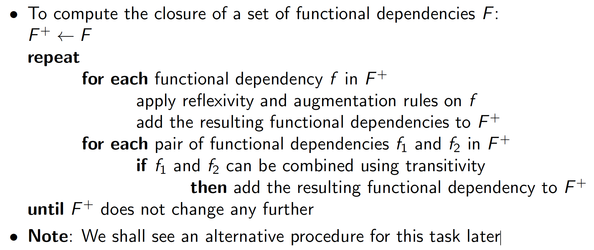

# Week 5 Notes - DBMS

*Prof. Partha Pratham Das, IIT KGP*

*Notes by Adarsh (23f2003570)*  

## [L5.1: Relational Database Design/1 (31:40)](https://youtu.be/Am4ZVa1Filk)

**Good Database Design**  
1. Reflects `Real world structure` of the problem
2. Represents all `Expected Data` over time
3. Avoids `Redundant Storage` of data
4. Provides `Fast and Efficient` access to data
5. Supports `Maintenance of Data Integrity` over time
6. `Clean, Consistent, Easy to Understand`

**Redundancy** is having multiple copies of same data in the database  

**Anomalies** are inconsistencies that arise due to changes in a DB

### Anomalies
Database anomalies are issues that can occur in a database due to improper organization or design, particularly in relational databases. The main types of anomalies are **insertion anomalies**, **deletion anomalies**, and **update anomalies**. Here’s a detailed explanation of each, along with examples:

#### 1. Insertion Anomaly

**Definition:** An insertion anomaly occurs when certain attributes cannot be added to the database without the presence of other attributes. This often happens when the database schema is not well designed.

**Example:**  
Consider a table that stores information about students and the courses they are enrolled in:

| StudentID | StudentName | CourseID | CourseName  |
|-----------|-------------|----------|--------------|
| 1         | Alice       | 101      | Math         |
| 2         | Bob         | 102      | Science      |

If we want to insert a new course (e.g., "History") but do not have any students enrolled in it yet, we cannot insert this course into the table because we have to provide a `StudentID` and `StudentName`. This restriction can lead to difficulties in managing courses that are not yet assigned to any student.

#### 2. Deletion Anomaly

**Definition:** A deletion anomaly occurs when the deletion of a data item inadvertently removes additional important data that is not intended to be deleted.

**Example:**  
Using the same table as before, suppose we want to delete information about a student:

| StudentID | StudentName | CourseID | CourseName  |
|-----------|-------------|----------|--------------|
| 1         | Alice       | 101      | Math         |
| 2         | Bob         | 102      | Science      |

If we delete Bob's record because he dropped out, we also lose the information about the Science course since it's only associated with him. Now we have lost track of the course entirely, which is not what we intended.

#### 3. Update Anomaly

**Definition:** An update anomaly occurs when a change to a data item requires multiple rows to be updated, and failure to update all rows leads to inconsistency in the database.

**Example:**  
Again, consider the same table:

| StudentID | StudentName | CourseID | CourseName  |
|-----------|-------------|----------|--------------|
| 1         | Alice       | 101      | Math         |
| 2         | Bob         | 102      | Science      |
| 2         | Bob         | 103      | Science      |

If Bob changes his name to "Robert," we need to update his name in every instance where it appears. If we only update one of the rows and forget the other, the database now contains inconsistent data, with one instance showing "Bob" and another showing "Robert."


#### Mitigating Anomalies

To mitigate these anomalies, database normalization is often used. Normalization involves organizing the fields and tables of a database to minimize redundancy and dependency. By following normal forms (1NF, 2NF, 3NF, etc.), you can reduce the chances of anomalies occurring. For example, in our student-course example, we could separate the students and courses into different tables, linking them with a relationship table that indicates enrollments. This would prevent all three types of anomalies.

### Dependencies and Anomalies

The relationship between dependencies and anomalies in database systems is a fundamental aspect of database design, particularly concerning normalization. Understanding this relationship helps prevent data anomalies and ensures data integrity.

#### Types of Dependencies

1. **Functional Dependency**: A relationship where one attribute (or a group of attributes) uniquely determines another attribute. For example, if we have a table of students where `StudentID` uniquely identifies `StudentName`, we can say that `StudentID` functionally determines `StudentName`.
   1. If a Relation Set $R$ has $n$ attributes, we can have $2^n$ subsets
   2. At maximum, there would be $2^n \times 2^n$ possible Functional Dependencies

2. **Partial Dependency**: This occurs when a non-key attribute is functionally dependent on a part of a composite primary key. This is problematic because it can lead to redundancy.

3. **Transitive Dependency**: This occurs when a non-key attribute is dependent on another non-key attribute. For instance, if `A` determines `B`, and `B` determines `C`, then `A` transitively determines `C`.

#### Anomalies in Relation to Dependencies

1. **Insertion Anomaly**:  
   - **Dependency Issue**: Insertion anomalies often arise from partial or transitive dependencies. If a non-key attribute depends on another non-key attribute, you may find that you cannot insert new data without having to also include unnecessary data.
   - **Example**: In a table where `CourseID` determines `InstructorName`, you can't insert a new course without also specifying an instructor who may not be associated with any student yet.

2. **Deletion Anomaly**:  
   - **Dependency Issue**: Deletion anomalies frequently result from functional dependencies that are improperly organized. When you have a non-key attribute dependent on a composite key, deleting one piece of information can inadvertently remove other related information.
   - **Example**: If a student record contains course information directly, deleting that student may also remove course details, which could affect other students enrolled in the same course.

3. **Update Anomaly**:  
   - **Dependency Issue**: Update anomalies stem from having the same piece of information stored in multiple places due to functional dependencies. If changes are made to one instance but not to others, this inconsistency leads to errors.
   - **Example**: If multiple records exist for a student (because they are enrolled in multiple courses), and the student’s name changes, failing to update all instances leads to inconsistencies.

#### Normalization as a Solution

To mitigate these anomalies, normalization is applied to the database design, which involves:

- **Removing Partial Dependencies**: This can be achieved by splitting tables so that all non-key attributes are fully functionally dependent on the primary key. This typically moves the design towards the Second Normal Form (2NF).
  
- **Eliminating Transitive Dependencies**: This involves creating new tables to ensure that non-key attributes are only dependent on the primary key, leading to the Third Normal Form (3NF).

The relationship between dependencies and anomalies is critical in database design. Properly identifying and managing dependencies through normalization can effectively reduce or eliminate anomalies, ensuring data integrity and consistency. Understanding these concepts is essential for creating robust database systems that can efficiently handle data without running into issues that compromise data quality.

### Best Practices in Decomposition

Database decomposition, often referred to as normalization, is the process of organizing a database into smaller, more manageable parts while reducing redundancy and improving data integrity. Here are some best practices for effective database decomposition:

#### 1. **Understand the Requirements**

- **Gather Requirements**: Before starting decomposition, thoroughly understand the data requirements and business rules. Engage stakeholders to capture all necessary details about how data will be used.
- **Define Entities and Relationships**: Identify the main entities (e.g., customers, orders) and their relationships. This helps in forming the basis for your tables.

#### 2. **Use Normalization Techniques**

- **Apply Normal Forms**: Normalize your database to at least the Third Normal Form (3NF):
  - **1NF**: Ensure all attributes contain only atomic values and that each record is unique.
  - **2NF**: Remove partial dependencies by ensuring all non-key attributes are fully dependent on the primary key.
  - **3NF**: Eliminate transitive dependencies by ensuring non-key attributes depend only on the primary key.

#### 3. **Identify Functional Dependencies**

- **Analyze Dependencies**: Clearly identify functional dependencies among attributes. This understanding is crucial for deciding how to split tables without losing essential relationships.
- **Create Dependency Diagrams**: Visualizing dependencies can help in recognizing which attributes belong together and which should be separated.

#### 4. **Minimize Redundancy**

- **Avoid Duplicate Data**: Ensure that no piece of information is stored in multiple places. This reduces the risk of inconsistencies during updates.
- **Use Foreign Keys**: When decomposing tables, use foreign keys to maintain relationships between them, which helps to enforce data integrity without redundancy.

#### 5. **Maintain Data Integrity**

- **Establish Referential Integrity**: Ensure that relationships between tables are maintained through foreign keys and constraints, preventing orphaned records.
- **Implement Constraints**: Use unique constraints, check constraints, and default values to maintain valid data and avoid invalid entries.

#### 6. **Design for Performance**

- **Consider Denormalization When Necessary**: While normalization reduces redundancy, it can sometimes lead to performance issues in read-heavy applications. Be ready to denormalize specific parts of the database if performance demands it, but do this judiciously.
- **Indexing**: Use indexing on frequently queried fields to improve search performance, but balance this with the overhead of maintaining the indexes.

#### 7. **Documentation**

- **Document Your Design**: Keep comprehensive documentation of the database schema, including the purpose of each table, relationships, and any normalization decisions made.
- **Maintain an Entity-Relationship Diagram (ERD)**: An ERD provides a visual representation of the database structure, making it easier for team members to understand and maintain.

#### 8. **Iterate and Review**

- **Review the Design**: After initial decomposition, review the design with stakeholders. Gather feedback to ensure it meets business needs.
- **Iterate as Needed**: Be prepared to revisit and adjust the database design based on changing requirements or new insights.

#### 9. **Test and Validate**

- **Test Data Integrity**: Insert, update, and delete test records to ensure that data integrity is maintained and that all relationships work as expected.
- **Load Testing**: Simulate workloads to ensure that performance remains acceptable under expected usage scenarios.

#### 10. **Plan for Future Growth**

- **Scalability**: Design your database with scalability in mind, ensuring that it can handle increased loads and additional requirements without needing a complete redesign.
- **Flexibility**: Allow for the addition of new attributes or tables as business needs evolve without significantly disrupting the existing structure.

### Functional Decomposition

Functional decomposition in the context of databases refers to the process of breaking down complex operations and data management tasks into simpler, more manageable functions that represent specific operations on the database. This technique helps clarify the relationships and dependencies among different data entities, making the design and querying of the database more efficient.

#### Key Concepts of Functional Decomposition in Databases

1. **Identify Functions**: Determine the main operations performed on the database, such as retrieving, inserting, updating, and deleting data.

2. **Break Down Operations**: Decompose these operations into smaller, more specific functions that focus on particular tasks, such as filtering data, calculating aggregates, or joining tables.

3. **Define Inputs and Outputs**: Clearly outline what data each function requires and what data it produces, which helps in designing queries and stored procedures.

4. **Representation**: Use notations or diagrams to represent these functions and their relationships effectively.

#### Notation for Functional Decomposition in Databases

A common way to represent functional decomposition in databases involves using **Data Flow Diagrams (DFDs)** or **UML activity diagrams**. However, a simpler notation can also be used in the form of a structured list or table. Below are some methods of representation:

##### 1. Structured List

You can create a hierarchical list that shows the main functions and their sub-functions. For example:

- **Main Function**: Manage Books
  - **Sub-function 1**: Retrieve Books
    - Input: Search Criteria
    - Output: List of Books
  - **Sub-function 2**: Add Book
    - Input: Book Details
    - Output: Confirmation Message
  - **Sub-function 3**: Update Book
    - Input: Book ID, Updated Details
    - Output: Confirmation Message
  - **Sub-function 4**: Delete Book
    - Input: Book ID
    - Output: Confirmation Message

##### 2. Data Flow Diagram (DFD)

In a DFD, you can use circles or ovals to represent functions, arrows to show the flow of data, and rectangles to represent data stores. 

**Example DFD**:

```
[User] → (Retrieve Books) → [Books Database]
[User] → (Add Book) → [Books Database]
[User] → (Update Book) → [Books Database]
[User] → (Delete Book) → [Books Database]
```

In this diagram:
- **User**: Represents the data source or external entity.
- **Functions**: Represented by ovals (e.g., "Retrieve Books").
- **Data Store**: Represented by rectangles (e.g., "Books Database").

##### 3. UML Activity Diagram

In UML, an activity diagram can also be used to represent functional decomposition, showcasing how data flows between different operations.

**Example UML Activity Diagram**:

```
[Start] → (Retrieve Books) → (Display Books) → [End]
                          ↓
                   (Add Book)
                          ↓
                   (Confirm Addition)
```

- dept_name $\to$ building, budget
- LHS functionally determines RHS
- This means given a department, the building and budget will be unique
- though dept_name decides or functionally determines the building and budget.
  - dept_name is not a key

Functional decomposition in databases involves breaking down complex operations into simpler, well-defined functions. By using structured lists, DFDs, or UML activity diagrams, you can effectively represent these functions and their relationships, facilitating a clearer understanding of the database's operational design. This structured approach aids in efficient database design, querying, and maintenance.

### Decomposition

In database design, decomposition refers to the process of breaking down a complex schema into smaller, more manageable components. This helps reduce redundancy, improve data integrity, and facilitate better understanding of the database structure. There are several types of decomposition used in database design, including:

#### 1. **Functional Decomposition**

**Definition**: Functional decomposition involves breaking down the overall functionality of a database into smaller, distinct functions or operations. This approach focuses on what the database needs to do rather than how it does it.

**Purpose**: To clarify and organize the operations that will be performed on the data.

**Example**: In an e-commerce database, functional decomposition might break down operations like:
- Retrieving product information
- Processing customer orders
- Managing user accounts

#### 2. **Normalization**

**Definition**: Normalization is a systematic approach to organizing data in a database to minimize redundancy and ensure data dependencies are properly enforced. It involves decomposing tables into smaller tables and defining relationships among them.

**Normal Forms**:
- **1NF (First Normal Form)**: Ensures that all columns contain atomic values and each row is unique.
- **2NF (Second Normal Form)**: Removes partial dependencies, ensuring that all non-key attributes are fully functionally dependent on the primary key.
- **3NF (Third Normal Form)**: Eliminates transitive dependencies, where non-key attributes depend on other non-key attributes.
- Higher normal forms (BCNF, 4NF, 5NF) address more complex issues.

**Purpose**: To eliminate redundancy and maintain data integrity.

#### 3. **Denormalization**

**Definition**: Denormalization is the process of intentionally introducing redundancy into a database design for the sake of improving read performance. It involves combining tables that have been normalized.

**Purpose**: To optimize read-heavy operations, reducing the need for complex joins and improving query performance.

**Example**: In a normalized database, a user table and an order table might be separate. Denormalization might combine these into a single table that includes user details with each order.

#### 4. **Vertical Decomposition**

**Definition**: Vertical decomposition refers to splitting a table into two or more tables based on columns. This is useful when certain columns are not frequently accessed together.

**Purpose**: To improve performance by allowing more efficient use of memory and storage.

**Example**: A customer table might be split into two tables: one containing frequently accessed fields like `CustomerID`, `Name`, and `Email`, and another with less frequently accessed fields like `Address` and `PhoneNumber`.

#### 5. **Horizontal Decomposition**

**Definition**: Horizontal decomposition involves splitting a table into smaller tables based on rows. This can be based on certain criteria, such as date ranges or categories.

**Purpose**: To improve performance by reducing the size of the tables being accessed at any given time.

**Example**: A large order table could be split into separate tables for different years (e.g., `Orders_2023`, `Orders_2024`) to speed up query performance on specific datasets.

#### 6. **Clustering**

**Definition**: Clustering involves grouping similar data together in a way that optimizes access patterns. This can be a form of vertical or horizontal decomposition based on how data is accessed.

**Purpose**: To improve the efficiency of queries by reducing I/O operations.

**Example**: In a customer database, customers might be clustered based on geographical location, which can speed up queries related to regional marketing efforts.

#### 7. **Entity-Relationship Decomposition**

**Definition**: This type of decomposition focuses on breaking down entities and their relationships in an ER model into tables in a relational database.

**Purpose**: To create a clear mapping of real-world entities and their relationships into a database schema.

**Example**: An `Order` entity might be decomposed into `Orders`, `Order_Items`, and `Customers` tables, representing different aspects of the order process.

### Lossy and Lossless Decomposition

In database design, decomposition refers to breaking down a relation (table) into smaller relations to eliminate redundancy and maintain data integrity. The concepts of **lossy** and **lossless decomposition** are crucial when discussing how these decompositions affect the ability to reconstruct the original data.

#### Lossless Decomposition

**Definition**: A decomposition is considered lossless if, after decomposing a relation into two or more sub-relations, it is possible to join them back together to obtain the original relation without losing any information.

**Characteristics**:
- **No Information Loss**: All the original data can be reconstructed exactly from the decomposed tables.
- **Preservation of Dependencies**: Functional dependencies are preserved, meaning that if certain dependencies held in the original table, they will still hold when the tables are joined back together.

**Example**:  
Consider a relation `R` with attributes `(A, B, C)` that has the following functional dependency: `A → B`. If we decompose `R` into two relations:
- `R1(A, B)`
- `R2(A, C)`

This decomposition is lossless if we can join `R1` and `R2` on `A` to recreate `R` without any loss of information. The join will yield:
- `R(A, B, C)`

In this case, the decomposition is lossless because we can retrieve all original data.

#### Lossy Decomposition

**Definition**: A decomposition is considered lossy if, after decomposing a relation into sub-relations, it is not possible to join them back together to get the original relation without losing some information.

**Characteristics**:
- **Information Loss**: Some information from the original relation is lost in the decomposed relations, leading to incomplete or inaccurate data when attempting to reconstruct the original relation.
- **Potential Ambiguity**: The join of the decomposed tables may produce duplicate rows or fail to reflect the original dependencies, resulting in ambiguity.

**Example**:  
Using the same relation `R(A, B, C)`, suppose we decompose it into:
- `R1(A, B)`
- `R2(B, C)`

If we join `R1` and `R2` on `B`, we might end up with fewer rows than the original relation `R`, or we might produce incorrect data combinations. For example:
- If `R` contained rows like `(1, X, Z)` and `(1, Y, Z)`, but `R1` has just `(1, X)` and `R2` has `(X, Z)`, the join will miss `(1, Y, Z)`.

Thus, this decomposition is lossy because you cannot recover all the original data after joining.

#### Determining Lossless vs. Lossy Decomposition

To determine whether a decomposition is lossless, database designers often use the following criteria:

1. **Dependency Preservation**: If the original functional dependencies can be expressed using the functional dependencies of the decomposed tables, it is a strong indicator of lossless decomposition.
2. **Join Dependency**: A decomposition is lossless if for every original relation, the join of the decomposed relations returns the original relation. This usually involves ensuring that certain attributes are common across the decomposed relations.

#### Note on Decomposition

If we decompose employee(**ID**, Name, Street, City, Salary ) into
- employee1(ID, name)
- employee2(name, street, city, salary)
Since employee2 has no primary key, and it can have duplicates, it is a `WEAK ENTITY`

If employee2 has duplicates, we cannot reconstruct the original `employee` which makes this decomposition **LOSSY**

$R_1$ and $R_2$ are decompositions from $R$  

**Rules for LOSSLESS**  
$R_1 \cap R_2 \neq \emptyset$  
$R_1 \cup R_2 = R$

Because if intersection is $\emptyset$ then cartesian product happens

For **every** instance of $r$ is you take the projection of $R_1$ and $R_2$  and then you do a natural join then you have to get back the original instance of $R$  

$\forall r \in R, r_1 = \prod_{R_1}(r), r_2 = \prod_{R_2}(r)$  

$r_1 \Join r_2 = r$


### Atomic Domains and 1st Normal Form (1NF)

In database systems, the concept of **atomic domains** is an important aspect of the design and organization of data. An atomic domain refers to a set of values that are indivisible and cannot be further decomposed. This notion is critical for ensuring data integrity and efficient data processing.

#### Key Characteristics of Atomic Domains

1. **Indivisibility**: Each value in an atomic domain is considered a single, indivisible unit. For example, the value "John Doe" in a name field is atomic; it cannot be split into "John" and "Doe" within the context of that database attribute.

2. **Simple Data Types**: Atomic domains often correspond to basic data types such as integers, floating-point numbers, characters, and strings. Each of these types represents a single piece of information.

3. **Value Representation**: In relational databases, each attribute of a relation (table) must have a domain, and if the domain is atomic, it guarantees that each entry in that column is a single value. For example, if an attribute is defined to be of type `INTEGER`, it can only hold whole numbers and not arrays or lists.

4. **Normalization**: The principle of atomic domains is closely related to normalization, particularly in the First Normal Form (1NF). To be in 1NF, a relation must have atomic domains, meaning that each attribute must hold only atomic values and each row must be unique.

#### Examples of Atomic Domains

- **Integer Domain**: The attribute `Age` in a `Person` table can have values from an atomic domain of integers (e.g., 25, 30, 45).
  
- **String Domain**: The attribute `Email` might have values like "john.doe@example.com", which is treated as a single atomic value.

- **Boolean Domain**: An attribute like `IsActive` could represent a domain of boolean values (e.g., TRUE or FALSE).

#### Non-Atomic Domains

In contrast, non-atomic domains contain values that can be further subdivided. For instance:
- A `FullName` attribute that stores values like "John Doe" may be considered non-atomic if the design allows for splitting it into `FirstName` and `LastName`.

#### Importance of Atomic Domains

1. **Data Integrity**: Atomic domains help maintain data integrity by ensuring that each piece of data is stored in its simplest form. This prevents ambiguity and complexities that can arise from more complex data types.

2. **Ease of Querying**: Queries become more straightforward when dealing with atomic values, as they can be easily filtered, sorted, and aggregated without the need for additional parsing or manipulation.

3. **Normalization**: The use of atomic domains is a key requirement for achieving higher normal forms in relational databases, which contributes to reducing redundancy and improving data consistency.

### Normal Forms / Normalization

Normalization is a process in database design that organizes data to minimize redundancy and improve data integrity. The process involves dividing large tables into smaller, more manageable ones while defining relationships between them. Normal forms (NF) are a series of guidelines for achieving normalization. Here’s an overview of the different normal forms, including definitions and examples:

#### 1. **First Normal Form (1NF)**

**Definition**: A relation is in 1NF if all attributes contain only atomic (indivisible) values, and each record is unique.

*In DBMS, we assume that all the relations are in 1NF, by default.*

**Characteristics**:
- No repeating groups or arrays.
- Each column must hold a single value (from that domain).
- Each row must be unique.

**Example**:
Consider a `Students` table:

| StudentID | Name      | Courses                |
|-----------|-----------|------------------------|
| 1         | Alice     | Math, Science          |
| 2         | Bob       | English, History       |

This table is not in 1NF because the `Courses` column contains non-atomic values (lists of courses). To convert it to 1NF, we can create separate rows for each course:

| StudentID | Name  | Course   |
|-----------|-------|----------|
| 1         | Alice | Math     |
| 1         | Alice | Science  |
| 2         | Bob   | English  |
| 2         | Bob   | History  |

#### 2. **Second Normal Form (2NF)**

**Definition**: A relation is in 2NF if it is in 1NF and all non-key attributes are fully functionally dependent on the primary key.

**Characteristics**:
- Eliminate partial dependencies; non-key attributes must depend on the entire primary key, not just part of it.

**Example**:
Consider a `CourseEnrollments` table:

| StudentID | CourseID | Instructor | CourseName  |
|-----------|----------|------------|--------------|
| 1         | 101      | Dr. Smith  | Math         |
| 1         | 102      | Dr. Brown  | Science      |
| 2         | 101      | Dr. Smith  | Math         |

In this case, `CourseName` and `Instructor` depend only on `CourseID`, not on the entire primary key `(StudentID, CourseID)`. To convert it to 2NF, we split it into two tables:

**Table 1: CourseEnrollments**

| StudentID | CourseID |
|-----------|----------|
| 1         | 101      |
| 1         | 102      |
| 2         | 101      |

**Table 2: Courses**

| CourseID | Instructor | CourseName  |
|----------|------------|--------------|
| 101      | Dr. Smith  | Math         |
| 102      | Dr. Brown  | Science      |

#### 3. **Third Normal Form (3NF)**

**Definition**: A relation is in 3NF if it is in 2NF and all the attributes are functionally dependent only on the primary key (i.e., there are no transitive dependencies).

**Characteristics**:
- Eliminate transitive dependencies; non-key attributes should not depend on other non-key attributes.

**Example**:
Consider a `Students` table:

| StudentID | Name  | AdvisorID | AdvisorName  |
|-----------|-------|-----------|---------------|
| 1         | Alice | 201       | Dr. Johnson   |
| 2         | Bob   | 202       | Dr. Lee       |

Here, `AdvisorName` is transitively dependent on `AdvisorID`. To convert to 3NF, we create a separate table for advisors:

**Table 1: Students**

| StudentID | Name  | AdvisorID |
|-----------|-------|-----------|
| 1         | Alice | 201       |
| 2         | Bob   | 202       |

**Table 2: Advisors**

| AdvisorID | AdvisorName  |
|-----------|---------------|
| 201       | Dr. Johnson   |
| 202       | Dr. Lee       |

#### 4. **Boyce-Codd Normal Form (BCNF)**

**Definition**: A relation is in BCNF if it is in 3NF and for every functional dependency $X \rightarrow Y$, $X$ is a superkey.

**Characteristics**:
- Address situations where 3NF is not sufficient due to certain dependencies.

**Example**:
Consider a `Courses` table:

| CourseID | Instructor | Room   |
|----------|------------|--------|
| 101      | Dr. Smith  | 101    |
| 102      | Dr. Brown  | 101    |

In this case, the `Room` is determined by the `Instructor`, but `Instructor` is not a superkey. To convert to BCNF, we split it into two tables:

**Table 1: Courses**

| CourseID | Instructor |
|----------|------------|
| 101      | Dr. Smith  |
| 102      | Dr. Brown  |

**Table 2: RoomAssignments**

| Instructor | Room   |
|------------|--------|
| Dr. Smith  | 101    |
| Dr. Brown  | 101    |

#### 5. **Fourth Normal Form (4NF)**

**Definition**: A relation is in 4NF if it is in BCNF and has no multi-valued dependencies.

**Characteristics**:
- A multi-valued dependency occurs when one attribute in a table uniquely determines another attribute, but that second attribute is independent of other attributes.

**Example**:
Consider a `StudentProjects` table:

| StudentID | Course    | Project     |
|-----------|-----------|-------------|
| 1         | Math      | Project A   |
| 1         | Math      | Project B   |
| 1         | Science   | Project A   |
| 1         | Science   | Project B   |

Here, the `Course` and `Project` attributes are independent of each other. To convert to 4NF, we split it:

**Table 1: StudentCourses**

| StudentID | Course    |
|-----------|-----------|
| 1         | Math      |
| 1         | Science   |

**Table 2: StudentProjects**

| StudentID | Project     |
|-----------|-------------|
| 1         | Project A   |
| 1         | Project B   |

#### 6. **Fifth Normal Form (5NF)**

**Definition**: A relation is in 5NF if it is in 4NF and cannot be decomposed further without losing data.

**Characteristics**:
- Deals with cases where information can be reconstructed from smaller pieces of information but is still dependent on multiple keys.

**Example**:
Consider a table that stores combinations of courses and instructors:

| CourseID | Instructor | Semester  |
|----------|------------|-----------|
| 101      | Dr. Smith  | Fall      |
| 101      | Dr. Brown  | Spring    |
| 102      | Dr. Smith  | Spring    |

In this case, the table can be decomposed into multiple tables to reduce redundancy:

**Table 1: CourseInstructors**

| CourseID | Instructor |
|----------|------------|
| 101      | Dr. Smith  |
| 101      | Dr. Brown  |
| 102      | Dr. Smith  |

**Table 2: CourseSemesters**

| CourseID | Semester  |
|----------|-----------|
| 101      | Fall      |
| 101      | Spring    |
| 102      | Spring    |


### Specific notes
1. a table containing a course code `CS1001` is not in 1NF according to Prof.PPD as CS is a department and 1001 is course serial number. That is if you intend to extract CS from CS1001
2. Set of names is a composite attribute. 1NF would be f_name, m_name, l_name
3. Phone Numbers[] is not 1NF. Break it down into a separate table

### Violation of 1NF

To illustrate examples of relations that are not in First Normal Form (1NF), we need to consider tables that violate the requirements of 1NF. A relation is not in 1NF if it contains non-atomic values, meaning at least one column has values that are not indivisible (e.g., lists or sets).

#### Example 1: Multiple Values in a Single Column

**Table: Students**

| StudentID | Name  | Courses              |
|-----------|-------|----------------------|
| 1         | Alice | Math, Science        |
| 2         | Bob   | English, History     |
| 3         | Carol | Science              |

**Issues**:
- The `Courses` column contains multiple values for each student, which is not atomic. Each student's courses should be represented as separate rows to conform to 1NF.

#### Example 2: Nested Records

**Table: Orders**

| OrderID | CustomerName | Items                          |
|---------|--------------|--------------------------------|
| 1001    | John Doe     | {Laptop, Mouse}                |
| 1002    | Jane Smith   | {Tablet, Charger, Cover}       |

**Issues**:
- The `Items` column contains nested sets of items, violating the atomicity requirement of 1NF. Each order's items should be stored in individual rows instead of as a collection.

#### Example 3: Repeating Groups

**Table: EmployeeProjects**

| EmployeeID | Name     | Project1     | Project2     |
|------------|----------|--------------|--------------|
| 101        | Alice    | Project A    | Project B    |
| 102        | Bob      | Project C    | NULL         |
| 103        | Carol    | Project D    | Project E    |

**Issues**:
- The presence of `Project1` and `Project2` columns suggests a repeating group. Each employee can work on multiple projects, which should be represented in a single column with multiple rows instead.

#### Example 4: Non-Atomic Attributes

**Table: Books**

| BookID | Title              | Authors                  |
|--------|--------------------|--------------------------|
| 1      | Database Systems    | {Silberschatz, Korth}    |
| 2      | Operating Systems   | {Stallings}              |
| 3      | Data Structures     | {Cormen, Leiserson, Rivest} |

**Issues**:
- The `Authors` column contains lists of authors, violating the atomicity requirement. Each author should ideally be in a separate row related to the book.

#### Converting to 1NF

To convert these examples to 1NF, you would need to break down the non-atomic columns into separate rows. Here’s how the `Students` example can be converted:

**Normalized Table: Students**

| StudentID | Name  | Course   |
|-----------|-------|----------|
| 1         | Alice | Math     |
| 1         | Alice | Science  |
| 2         | Bob   | English  |
| 2         | Bob   | History  |
| 3         | Carol | Science  |


## [L5.2: Module 22 Relational Database Design/2 (23:57)](https://youtu.be/iW5C0g8fhx4)


Functional Dependencies contd...

If a department has 5 buildings that the department cannot determine the building


### Keys

1. $K$ is **super key** of schema $R$ if and only if $K \to R$ ie. K determines R
2. $K$ is **candidate key** iff
   1. $K \to R$
   2. for no $\alpha \subset R$, $\alpha \to R$
   3. Candidate Key is minimal super key
3. $K$ is attributes of table
4. for $K$ to determine $R$, $K$ cannot have duplicates
5. in general $\alpha \to \beta$ if $\beta \subseteq \alpha$

### Armstrong's Axioms

1. **Reflexivity**:
   - If a set of attributes $Y$ is a subset of another set of attributes $X$, then $X$ functionally determines $Y$.
   - **Formal Notation**: If $Y \subseteq X$, then $X \rightarrow Y$.
   - **Example**: If $X = \{A, B\}$, then $\{A, B\} \rightarrow A$.

2. **Augmentation**:
   - If $X$ functionally determines $Y$, then adding attributes to both sides of the functional dependency preserves the dependency.
   - **Formal Notation**: If $X \rightarrow Y$, then $XZ \rightarrow YZ$ for any attribute set $Z$.
   - **Example**: If $\{A\} \rightarrow \{B\}$, then $\{A, C\} \rightarrow \{B, C\}$.

3. **Transitivity**:
   - If $X$ functionally determines $Y$ and $Y$ functionally determines $Z$, then $X$ functionally determines $Z$.
   - **Formal Notation**: If $X \rightarrow Y$ and $Y \rightarrow Z$, then $X \rightarrow Z$.
   - **Example**: If $\{A\} \rightarrow \{B\}$ and $\{B\} \rightarrow \{C\}$, then $\{A\} \rightarrow \{C\}$.

For **completeness** you only need Reflexivity, Augmentation and Transitivity


#### Derived Rules

1. **Union**:
   - If $X$ functionally determines $Y$ and $X$ also functionally determines $Z$, then $X$ functionally determines $YZ$.
   - **Example**: If $\{A\} \rightarrow \{B\}$ and $\{A\} \rightarrow \{C\}$, then $\{A\} \rightarrow \{B, C\}$.

2. **Difference**:
   - If $X$ functionally determines $YZ$ and $Y$ is a subset of $YZ$, then $X$ functionally determines $Z$.
   - **Example**: If $\{A\} \rightarrow \{B, C\}$, then $\{A\} \rightarrow \{C\}$ (assuming $B$ is part of $YZ$).

3. **Pseudo-Transitivity**:
   - If $X$ functionally determines $Y$ and $WY$ functionally determines $Z$, then $WX$ functionally determines $Z$.
   - **Example**: If $\{A\} \rightarrow \{B\}$ and $\{C, B\} \rightarrow \{D\}$, then $\{C, A\} \rightarrow \{D\}$.

Armstrong's Axioms provide a formal foundation for reasoning about functional dependencies in relational databases. They are essential for database design and normalization, helping to ensure efficient and consistent database schemas.

### Definition of Closure

The closure of a set of attributes $X$, denoted as $X^+$, is the set of attributes that can be functionally determined by $X$ using a given set of functional dependencies $F$. In simpler terms, $X^+$ includes all the attributes that can be reached by applying the functional dependencies starting from the attributes in $X$.

#### How to Compute Closure

To compute the closure $X^+$:

1. **Start with the initial set**: Begin with the set $X$.
2. **Add all attributes from $X$** to $X^+$.
3. **Iterate through the functional dependencies** in $F$:
   - For each functional dependency $A \rightarrow B$, if $A$ is a subset of $X^+$, add $B$ to $X^+$.
4. **Repeat** this process until no new attributes can be added to $X^+$.

#### Example

Consider the following relation schema and functional dependencies:

**Relation Schema**: $R(A, B, C, D)$

**Functional Dependencies**:
1. $A \rightarrow B$
2. $B \rightarrow C$
3. $A \rightarrow D$

Now, let’s compute the closure of $X = \{A\}$.

**Step-by-step computation**:

1. **Start with**: $X^+ = \{A\}$

2. **Apply Functional Dependencies**:
   - From $A \rightarrow B$, we can add $B$:
     - $X^+ = \{A, B\}$
   - From $B \rightarrow C$ (now $B$ is in $X^+$), we can add $C$:
     - $X^+ = \{A, B, C\}$
   - From $A \rightarrow D$, we can add $D$:
     - $X^+ = \{A, B, C, D\}$

3. **Final Closure**: Since no new attributes can be added, we have:
   - $\{A\}^+ = \{A, B, C, D\}$

#### Computing Closure



#### Example of Closure with More Attributes

Now, let’s compute the closure of $Y = \{A, B\}$ using the same functional dependencies.

1. **Start with**: $Y^+ = \{A, B\}$

2. **Apply Functional Dependencies**:
   - From $A \rightarrow B$ (already in $Y^+$, no change).
   - From $B \rightarrow C$, we can add $C$:
     - $Y^+ = \{A, B, C\}$
   - From $A \rightarrow D$, we can add $D$:
     - $Y^+ = \{A, B, C, D\}$

3. **Final Closure**: 
   - $ \{A, B\}^+ = \{A, B, C, D\}$

#### Significance of Closure

1. **Checking Candidate Keys**: Closure is used to determine if a set of attributes is a candidate key by checking if its closure contains all attributes of the relation.
  
2. **Determining Functional Dependencies**: You can derive functional dependencies from the closure to check for redundancies or to simplify a set of dependencies.

3. **Normalization**: Closure helps identify attributes that are dependent on others, which is essential during the normalization process to eliminate redundancy.

The closure of a set of attributes is a fundamental concept in database design, particularly concerning functional dependencies. Understanding how to compute and utilize closures aids in ensuring database integrity, normalization, and effective schema design.


## [L5.3: Relational Database Design/3 (35:23)](https://youtu.be/gFJuNh63MGw)

### Closures

Say you have a relation $R = \{A,B,C,G,H,I\}$

Your FD's are **Functional Dependencies** ($F$):
1. $A \rightarrow B$
2. $A \rightarrow C$
3. $CG \rightarrow H$
4. $CG \rightarrow I$
5. $B \rightarrow H$

The Closure would be
1. $A \rightarrow H$ by transitivity of $A \rightarrow B \rightarrow H$
2. $AG \rightarrow H$ by augmentation of $A$ to $AG$
3. $AG \rightarrow I$ by augmentation of $A$ to $AG$
4. $CG \rightarrow CGI$ as $CGCG \rightarrow CGI$
   1. $CGI \rightarrow HI$ again augumentation
   2. therefore $CG \rightarrow HI$

#### Algorithm




### Closure of Attributes

The closure of a set of attributes $X$, denoted as $X^+$, is the set of all attributes that can be determined from $X$ using a given set of functional dependencies $F$. Essentially, it answers the question: "Given the attributes in $X$, what other attributes can we derive?"

#### How to Compute Closure

To compute the closure $X^+$:

1. **Start with the initial set**: Begin with the set $X$.
2. **Initialize the closure**: Set $X^+ = X$.
3. **Iterate through the functional dependencies** in $F$:
   - For each functional dependency $A \rightarrow B$:
     - If $A$ is a subset of $X^+$, add $B$ to $X^+$.
4. **Repeat the process** until no new attributes can be added to $X^+$.

#### Example

Let's consider a relation schema and a set of functional dependencies:

**Relation Schema**: $R(A, B, C, D)$

**Functional Dependencies**:
1. $A \rightarrow B$
2. $B \rightarrow C$
3. $A \rightarrow D$

Now, we will compute the closure of $X = \{A\}$.

**Step-by-step computation**:

1. **Start with**: 
   - $X^+ = \{A\}$

2. **Apply Functional Dependencies**:
   - **From** $A \rightarrow B$: Since $A$ is in $X^+$, we can add $B$:
     - $X^+ = \{A, B\}$
   - **From** $B \rightarrow C$: Now $B$ is in $X^+$, so we can add $C$:
     - $X^+ = \{A, B, C\}$
   - **From** $A \rightarrow D$: $A$ is still in $X^+$, so we can add $D$:
     - $X^+ = \{A, B, C, D\}$

3. **Final Closure**: No new attributes can be added, so:
   - $\{A\}^+ = \{A, B, C, D\}$

### Example with More Attributes

Let’s compute the closure of $Y = \{A, B\}$ using the same functional dependencies.

1. **Start with**: 
   - $Y^+ = \{A, B\}$

2. **Apply Functional Dependencies**:
   - **From** $A \rightarrow B$: Already in $Y^+$ (no change).
   - **From** $B \rightarrow C$: Now we can add $C$:
     - $Y^+ = \{A, B, C\}$
   - **From** $A \rightarrow D$: We can add $D$:
     - $Y^+ = \{A, B, C, D\}$

3. **Final Closure**: 
   - $\{A, B\}^+ = \{A, B, C, D\}$

#### Significance of Closure

1. **Determining Candidate Keys**: The closure helps to identify candidate keys by checking if the closure of a set of attributes contains all the attributes of the relation.

2. **Functional Dependency Derivation**: By computing closures, one can derive additional functional dependencies and verify if a given dependency is implied by a set of dependencies.

3. **Normalization**: Understanding closures is essential for normalization processes, as it helps in eliminating redundant data and ensuring that the schema is designed correctly.

### Finding Candidate Key from Closure

1. Has to be super key (contains all the attributes of the relation)
2. Has to be minimal (Subsets are not super key)

  $R = \{A,B,C,G,H,I\}$
  
$$
\begin{aligned}
   F&=A \rightarrow B \\
   &=A \rightarrow C \\
   &=CG \rightarrow H \\
   &=CG \rightarrow I \\
   &=B \rightarrow H
\end{aligned}
$$

Is $AG$ a candidate key?

Find $[AG]^+$
1. $[AG]^+ = \{A,G\}$
2. $+\{A,B,C\}$ Transitivity,Reflexivity $[AG]^+ = \{A,B,C,G\}$
3. Tackle $CG \rightarrow HI$ given $CG \subseteq \{A,B,C,G\}$
4. $\therefore [AG]^+ = \{A,B,C,G, H,I\}$
5. Check is $[AG]^+$ is Super Key
   1. $AG \rightarrow R$ ? YES
   2. $[AG]^+ \supseteq R$ ? YES
6. Check if $A \rightarrow R$
   1.  Is $A^+ \supseteq R$
   2.  $A^+=\{A,B,C,H\}$
   3.  Not a Superset of $R$
7. Check if $G \rightarrow R$
   1.  Is $G^+ \supseteq R$
   2.  $G^+=\{G\}$
   3.  Not a Superset of $R$
8.  Therefore $AG$ is a Minimal Super Key and Candidate Key

### Trivial Functional Dependency

A **trivial functional dependency** in databases is a specific type of functional dependency that is always true and does not provide any additional information about the relationship between attributes. Understanding trivial functional dependencies is essential for reasoning about other functional dependencies and for the normalization process in database design.

#### Definition

A functional dependency $A \rightarrow B$ is considered **trivial** if the set of attributes $B$ is a subset of the set of attributes $A$. In simpler terms, it means that knowing the values of $A$ will not provide any new information about $B$ because $B$ is already included in $A$.

#### Formal Notation

If $A$ is a set of attributes and $B$ is a set of attributes, then the dependency $A \rightarrow B$ is trivial if:
- $B \subseteq A$

#### Examples

1. **Example 1**:
   - Let $A = \{X, Y\}$ and $B = \{X\}$.
   - Here, the functional dependency $\{X, Y\} \rightarrow \{X\}$ is trivial because $X$ is already part of $\{X, Y\}$.

2. **Example 2**:
   - Let $C = \{A, B, C\}$ and $D = \{A, C\}$.
   - The functional dependency $\{A, B, C\} \rightarrow \{A, C\}$ is also trivial because $\{A, C\}$ is a subset of $\{A, B, C\}$.

#### Significance of Trivial Functional Dependencies

1. **Normalization**: Trivial functional dependencies do not help in the normalization process since they do not contribute to eliminating redundancy. They can be ignored when analyzing the functional dependencies of a relation.

2. **Dependency Inference**: Trivial dependencies can help in understanding more complex dependencies. For example, they serve as a base case in deriving non-trivial dependencies through Armstrong’s axioms.

3. **Checking Completeness**: When assessing a set of functional dependencies, trivial dependencies can be used as a benchmark to ensure that all potential relationships have been accounted for.

### Computing a Canonical Cover

A **canonical cover**, denoted as *Fc*, is a simplified yet equivalent representation of a given set of functional dependencies (*F*) in a relational database schema. It serves to streamline the process of verifying updates against these dependencies, thereby enhancing efficiency.

*   **Definition:**
    *   *Fc* logically implies every dependency in *F*, and *F*, in turn, logically implies every dependency in *Fc*.
    *   No functional dependency within *Fc* has extraneous attributes.
    *   Each left-hand side of a functional dependency in *Fc* is unique.

*   **Motivation:** During database updates, the system must ensure that the update does not violate any of the functional dependencies in *F*. Checking against the original set *F* can be computationally expensive. However, a canonical cover *Fc* offers a simplified form that is easier to test while preserving the same implications as *F*.

*   **Construction:** The process of generating a canonical cover for a given set of functional dependencies is outlined in source.

*   **Advantages:**
    *   **Minimality:** Eliminating extraneous attributes and combining dependencies with identical left-hand sides makes *Fc* minimal in a specific sense, reducing the effort needed to verify satisfaction.
    *   **Efficiency:** Testing *Fc* for satisfaction is cheaper than testing the original set *F*, leading to improved performance during database updates.

*   **Example:** Source presents an example of computing a canonical cover. Given the set *F* = {A → BC, B → C, A → B, AB → C} on the schema (A, B, C), the canonical cover is *Fc* = {A → B, B → C}. This simplification is achieved by:

    *   Combining A → BC and A → B into A → BC.
    *   Recognizing A as extraneous in AB → C since *F* logically implies B → C.
    *   Identifying C as extraneous in A → BC as it is logically implied by A → B and B → C.

*   **Uniqueness:** While the canonical cover aids in simplifying dependency checks, it's important to note that it might not be unique. Different canonical covers might exist for a given set of functional dependencies. Source illustrates this point with the set *F* = {A → BC, B → AC, and C → AB}. By selectively removing extraneous attributes, multiple valid canonical covers emerge, including:
    *   *Fc* = {A → B, B → AC, and C → AB}
    *   *Fc* = {A → C, C → B, and B → A}
    *   *Fc* = {A → C, B → C, and C → AB}

*   **Extraneous Functional Dependencies:** Sometimes, an entire functional dependency within *F* may be extraneous. This means that removing it doesn't alter the closure of *F*. Canonical covers, by definition, do not contain such extraneous functional dependencies.

The concept of a **canonical cover** offers a valuable optimization strategy in relational database design. By providing a simplified and equivalent representation of functional dependencies, it facilitates efficient validation of updates, thereby contributing to the overall integrity and performance of the database system. 


### Finding Closures

#### Example 1
Consider a Schema $R(A,B,C,D,E,F,G)$ that satisfies FD (Functional Dependencies)

$A \rightarrow B$, $BC \rightarrow DE$, $AEF \rightarrow G$. Find $AC^+$

1. $(AC)^+ = \{AC\}$
2. Since $A \rightarrow B$, $(AC)^+ = \{ACB\}$
3. We have BC in ACB and $BC \rightarrow DE$
   1. So $(AC)^+ = \{ACBDE\}$
4. There is no $AEF$ closure in $AC^+$. We have A, E but no F.
   1. So we cannot do much
   2. So $(AC)^+ = \{ACBDE\}$

#### Example 2
Consider a Schema $R(A,B,C,D,E,F,G)$ that satisfies FD (Functional Dependencies)

$A \rightarrow B$, $BC \rightarrow DE$, $AEF \rightarrow G$.


Is the FD $ACF \rightarrow DG$ implied in this case ?

We have to use Attribute Closures. And find closure $ACF^+$. If the closure includes $DG$ then $ACF^+$ decides $DG$

1. $ACF^+ = \{ACF\}$
2. $ACF^+ = \{ACFB\} \because A \rightarrow B$
3. $ACF^+ = \{ACFBDE\} \because BC \rightarrow DE$
4. $ACF^+ = \{ACFBDEG\} \because AEF \rightarrow G$
5. Since $DG$ are in $ACF^+$, we can say $ACF \rightarrow DG$ is implied


## [L5.4: Relational Database Design/4 (30:36)](https://youtu.be/6AZlp7EcmiQ)

### Attribute Closure Algorithm
1. Testing for SuperKey. to test if $\alpha$ is a Super Key, find $\alpha^+$ and see if all attributes of $R$ are in it.
2. Testing Functional Dependencies. To test if $\alpha \rightarrow \beta$ holds (is it in $F^+$), check if $\beta \subseteq \alpha^+$ or $\alpha^+ \supseteq \beta$
3. Computing closure of $F$
   1. For each $\gamma \subseteq R$, we find closure $\gamma^+$
   2. for each $S \subseteq \gamma^+$ we output a functional dependency $\gamma \rightarrow S$

**Attribute closure can be used to find non-trivial functional dependencies.**

### Extraneous Attributes

Extraneous Attributes in $\alpha \rightarrow \beta$
   1. Could be in LHS or RHS
   2. If you remove the extraneous $A$ then the Functional Dependency does not change.
   3. Lesser attributes on LHS means a strong functional dependency 
   4. Lesser attributes on RHS makes a weak functional dependency
   5. in a FD $\{A \rightarrow C, AB \rightarrow CD\}$, $AB^+ = \{ABCD\}$ Here C is extraneous in the RHS


To test LHS in $\alpha \rightarrow \beta$

1. You want to know if $A \in \alpha$ is extraneous in $\alpha$
2. Remove A from $\alpha$.
3. Find $[\alpha - A]^+$ and if $\beta$ is in this set, A is Extraneous!

To test RHS in $\alpha \rightarrow \beta$
1. You want to know if $A \in \beta$ is extraneous in $\beta$
2. Remove A from $\beta$
3. WIP


### Equivalent Function Dependencies

2 FD's $A$ & $B$ are equivalent if $A^+ == B^+$


|Condition|Case1|Case2|Case3|Case4|
|-|-|-|-|-|
|F covers G|True|True|False|False
|G covers F|True|False|True|False
|Result|$F = G$|$F \supset G$|$G \supset F$|--


### Canonical Cover

In **database systems**, a **canonical cover** (or **minimal cover**) refers to a set of **functional dependencies** that is both **minimal** and **equivalent** to the original set of functional dependencies. The canonical cover ensures that no redundant dependencies exist and that all the dependencies are necessary to preserve the integrity of the data.

#### Key Concepts of Canonical Cover:

1. **Functional Dependency (FD)**: A functional dependency between two sets of attributes $X$ and $Y$ in a relation $R$ is written as:
   $$
   X \to Y
   $$
   This means that if two tuples (rows) have the same values for the attributes in $X$, they must also have the same values for the attributes in $Y$.

2. **Canonical Cover**: A **canonical cover** is a minimal set of functional dependencies that implies all the original dependencies in the relation. The canonical cover satisfies two properties:
   - **Minimal**: No dependency in the set can be removed without changing the meaning of the dependency set.
   - **Equivalent**: The canonical cover implies all the original functional dependencies in the relation.

#### Steps to Find a Canonical Cover:

To compute the canonical cover for a set of functional dependencies, we typically follow these steps:

##### 1. **Decompose all FDs to have a single attribute on the right-hand side**:
   If any functional dependency has more than one attribute on the right-hand side, we break it into multiple dependencies.

   - Example: If $A \to BC$, split it into:
     $$
     A \to B \quad \text{and} \quad A \to C
     $$

##### 2. **Eliminate extraneous attributes from the left-hand side**:
   An attribute $X$ in a functional dependency $X \to Y$ is extraneous if removing $X$ still implies the same dependency.

   - For instance, if you have $AB \to C$ and $A \to C$, then $AB \to C$ is redundant because $A \to C$ already holds.
   
##### 3. **Remove redundant dependencies**:
   A functional dependency is redundant if it can be derived from the other dependencies in the set.

   - For example, if you have $A \to B$ and $B \to C$, then $A \to C$ is redundant because it can be derived by combining $A \to B$ and $B \to C$.

#### Example of Canonical Cover:

Given a set of functional dependencies:
$$
F = \{ A \to BC, AB \to C, C \to D, A \to D \}
$$

##### Step 1: Decompose all FDs with multiple attributes on the right-hand side:
$$
F' = \{ A \to B, A \to C, AB \to C, C \to D, A \to D \}
$$

##### Step 2: Remove extraneous attributes:
- For $AB \to C$, we check if $A \to C$ is already implied by the other dependencies. Since $A \to C$ is already present, $AB \to C$ is redundant and can be removed.

Thus, the dependencies now are:
$$
F'' = \{ A \to B, A \to C, C \to D, A \to D \}
$$

##### Step 3: Remove redundant dependencies:
- We check for redundant dependencies. In this case, none of the remaining dependencies are redundant, so the final canonical cover is:
$$
F_{\text{canonical}} = \{ A \to B, A \to C, A \to D, C \to D \}
$$

Thus, the canonical cover for this set of FDs is:
$$
F_{\text{canonical}} = \{ A \to B, A \to C, A \to D, C \to D \}
$$

#### Why is a Canonical Cover Important?

- **Minimization**: It helps minimize the number of functional dependencies, making it easier to manage and optimize the database schema.
- **Normalization**: Canonical covers are used during **normalization** to check the normal form of a relation and ensure that redundancy is minimized.
- **Database Design**: During **schema design** and **decomposition**, using a canonical cover helps eliminate unnecessary dependencies, ensuring the database structure is both efficient and free from redundancy.

#### Final Thoughts:

A **canonical cover** plays a crucial role in ensuring that a database schema is both **efficient** and **consistent**. It provides a way to minimize the set of functional dependencies while preserving the same data constraints, leading to better database design and easier management of data integrity.

### Prime and Non Prime attributes

- Attributes belonging to any candidate keys are prime. Union of all CK attributes
- Attributes that do not belong to any CK is non prime.
- Find all CK's and union attributes

- **Functional Dependency (FD)**: A functional dependency $X \to Y$ means that if two tuples (rows) agree on the values of the attributes in $X$, they must also agree on the values of the attributes in $Y$.
  
- **Candidate Key**: A **candidate key** is a minimal set of attributes that can uniquely identify a tuple in a relation. Every relation must have at least one candidate key, and each candidate key must functionally determine all other attributes in the relation.

- **Prime Attribute**: An attribute is **prime** if it is part of any **candidate key**.
  
- **Non-prime Attribute**: An attribute is **non-prime** if it is **not** part of any candidate key.

#### Finding Prime and Non-Prime Attributes:

1. **Determine the Candidate Keys**: This is the first step. Identify the minimal sets of attributes that uniquely identify a tuple in the relation.

2. **Classify Attributes**: Once you have the candidate key(s), you can classify attributes:
   - Attributes that appear in **any** of the candidate keys are **prime**.
   - Attributes that do **not** appear in any candidate key are **non-prime**.

#### Example 1: Finding Prime and Non-Prime Attributes

Let's walk through an example.

##### Given Relation:
We have a relation $R(A, B, C, D)$ with the following set of functional dependencies:
$$
F = \{ A \to B, B \to C, A \to D \}
$$

**Step 1: Find the Candidate Keys**

To find the candidate keys, we use the functional dependencies:

- From $A \to B$, we know that $A$ determines $B$.
- From $B \to C$, we know that $B$ determines $C$.
- From $A \to D$, we know that $A$ determines $D$.

Thus, $A$ functionally determines all other attributes: $A \to B$, $B \to C$, and $A \to D$. This means $A$ is a **candidate key**.

- The **candidate key** is: $A$.

**Step 2: Classify Prime and Non-Prime Attributes**

- The prime attribute(s) are the ones that are part of the **candidate key**. In this case, the candidate key is $A$, so $A$ is a **prime attribute**.
- The non-prime attributes are those that do **not** appear in any candidate key. Here, $B$, $C$, and $D$ are **non-prime attributes**.

So, in this case:
- **Prime attributes**: $A$
- **Non-prime attributes**: $B$, $C$, $D$

#### Example 2: Multiple Candidate Keys

Let's take another example where we have more than one candidate key.

##### Given Relation:
Consider a relation $R(A, B, C, D)$ with the following set of functional dependencies:
$$
F = \{ A \to B, C \to D, A \to C \}
$$

**Step 1: Find the Candidate Keys**

- From $A \to B$, we know $A$ determines $B$.
- From $A \to C$, we know $A$ determines $C$.
- From $C \to D$, we know $C$ determines $D$.

We can derive the following:

- $A$ determines $B$ and $C$, and since $C \to D$, $A$ also determines $D$. Hence, $A$ determines all attributes, so $A$ is a **candidate key**.
- $C$ determines $D$, and since $A \to C$, we also know that $A$ determines $C$. Therefore, $AC$ is another candidate key.

So, the candidate keys are:
- $A$
- $AC$

**Step 2: Classify Prime and Non-Prime Attributes**

- Prime attributes are those that appear in any of the candidate keys.
  - From the candidate keys $A$ and $AC$, we see that the prime attributes are $A$ and $C$.
  
- Non-prime attributes are those that do not appear in any candidate key.
  - The non-prime attribute here is $B$, since it does not appear in any candidate key.

Thus:
- **Prime attributes**: $A$, $C$
- **Non-prime attributes**: $B$, $D$

#### Summary of Prime and Non-Prime Attributes

1. **Prime Attributes**: These are the attributes that are part of any **candidate key**.
2. **Non-Prime Attributes**: These are the attributes that are **not** part of any candidate key.

#### Practical Use in Normalization:
Prime and non-prime attributes are often used when checking a relation for normal forms such as:
- **2NF (Second Normal Form)**: A relation is in 2NF if it is in 1NF and every non-prime attribute is fully functionally dependent on the entire candidate key (i.e., no partial dependency).
- **3NF (Third Normal Form)**: A relation is in 3NF if it is in 2NF and for every functional dependency $X \to Y$, either $X$ is a superkey or $Y$ is a prime attribute.

These classifications help in **normalizing** a database schema to eliminate redundancy and maintain data integrity.


### Candidate Key Algorithm

1. Find all element of relations a.k.a attribute that are not on the right
2. Take and group the missing $R$ values/attributes.
3. keep adding other attributes and calculate closure.
4. if closure is a subset of $R$ ie. contains all attributes then its a CK


## [L5.5 Dependency Preservation](https://youtu.be/h-SO2pc9_0k)

### Dependency Preservation

1. Try to preserve dependencies after decomposing the relations
2. Lossless decomposition and Dependency preservation are exclusive of each other
3. You can have a lossless decomposition that does not preserve dependencies
4. You may gave a decomposition that preserves dependencies but is lossy
5. I had to learn this after getting a lot of **whacks**.
   1. Do not mix Lossless With Dependency Preservation
      1. For lossless, just test
         1. $R_1 \cup R_2 \cup ... \cup R_n = R$
         2. $R_1 \cap R_2 \cap ... \cap R_n \ne \emptyset$
         3. If #3 does not hold the FD could be lossless still.. Oxymoron ?


**Dependency Preservation** is an important concept in **database normalization**. It refers to the property of a relational schema where all the **functional dependencies** (FDs) in the original schema are preserved in the decomposed schema after the normalization process (such as **BCNF**, **3NF**, etc.).

When a database schema is decomposed into smaller sub-schemas (or relations), it's essential that the decomposition preserves the **functional dependencies** of the original schema so that the integrity and meaning of the data are maintained. If the dependencies are not preserved after decomposition, it could lead to anomalies or loss of data consistency during insertions, deletions, or updates.

#### What are **Functional Dependencies** (FDs)?
A **functional dependency** (FD) is a relationship between attributes (columns) in a relation (table). It expresses that if two tuples (rows) in a relation agree on the values of some attributes, they must also agree on the values of some other attributes.

- A functional dependency is denoted as $X \to Y$, which means **if two rows have the same values for the attributes in $X$, they must have the same values for the attributes in $Y$**.

#### Example of Functional Dependency:
Consider a table representing employees:

| Employee_ID | Name   | Department | Salary |
|-------------|--------|------------|--------|
| 101         | Alice  | HR         | 50000  |
| 102         | Bob    | IT         | 60000  |
| 103         | Carol  | HR         | 52000  |

Let's assume the following functional dependencies:
- **Employee_ID → Name, Department, Salary**: Given an `Employee_ID`, we can determine the `Name`, `Department`, and `Salary` of the employee.
- **Department → Salary**: The salary is determined by the department (in this simple example).

### What is **Dependency Preservation**?
Dependency preservation means that after decomposing a relation into smaller sub-relations, all the functional dependencies that existed in the original relation should still be expressible in terms of the decomposed relations. In other words, the decomposed relations should not lose any of the original FDs, and you should be able to enforce them using the decomposed schema.

#### Importance of Dependency Preservation:
1. **Data Integrity**: Preserving dependencies ensures that the relationships between data attributes are maintained. This helps in avoiding anomalies when inserting, deleting, or updating data.
2. **Avoiding Redundancy**: When dependencies are preserved, unnecessary redundancy or inconsistency in data is avoided, which is crucial for maintaining efficient and accurate databases.
3. **Simplifies Enforcement of Business Rules**: When FDs are preserved, you can continue enforcing business logic or constraints across the decomposed schema, reducing the need for extra integrity checks or complex queries.

#### Example of a Decomposition with Dependency Preservation

Consider a relation $R(A, B, C)$ with functional dependencies:
- $A \to B$
- $B \to C$

A possible decomposition could be:
- $R1(A, B)$ with $A \to B$
- $R2(B, C)$ with $B \to C$

In this case, both functional dependencies $A \to B$ and $B \to C$ are preserved in the decomposed relations.

However, **not all decompositions preserve dependencies**. For example, if you decomposed $R(A, B, C)$ into two relations $R1(A, C)$ and $R2(B, C)$, the dependency $A \to B$ would be lost, because neither $R1$ nor $R2$ would be able to enforce this dependency alone. Therefore, this decomposition would **not preserve** the original dependencies.

### When Dependency Preservation is Challenging:
Sometimes, when decomposing relations into 3NF or BCNF (Boyce-Codd Normal Form), **dependency preservation** might be compromised. While 3NF or BCNF ensures that the schema is free from certain types of anomalies (like transitive dependencies or redundancy), the decomposition may lead to **loss of functional dependencies**.

For example:
- **BCNF** can lead to dependency loss in cases where a functional dependency involves non-prime attributes (attributes not part of any candidate key).
- **Lossless decomposition** ensures that no information is lost during decomposition, but dependency preservation might not always be achievable.

#### **Lossless vs. Dependency Preservation Decomposition**
- **Lossless Decomposition**: A decomposition of a relation into smaller relations is lossless if, after performing the join of the smaller relations, we can recover the original relation without any loss of information. Lossless decomposition is a fundamental property that ensures data can be reconstructed without ambiguity.

- **Dependency Preservation**: As discussed earlier, this property ensures that all functional dependencies are preserved across the decomposed relations.

A **lossless and dependency-preserving** decomposition is ideal but not always achievable simultaneously. There are cases where we prioritize **lossless decomposition** over **dependency preservation**, especially when it comes to achieving higher normal forms like BCNF.

#### Algorithm To Test for Dependency Preservation

1. You will be given
   1. Super/Original Relation $R$ and all its attributes
   2. Function Definition Set $F$
   3. and the Decomposed Relations $R_1, R_2,....,R_n$
   4. You will lastly be given a Functional Relation to test for Dependency Preservation
2. From the Function Definition $F$
   1. You will flatten/expand the FDs such that there is only one term in the LHS
   2. You will then select only functional relations such that all attributes in decomposed relation $R_i$ is in the functional relation
      1. This will give you the closure of the functional definition valid for the particular decomposed relation.. $R_1, R_2,....,R_n$ will yield $F_1^+, F_2^+,....,F_n^+$
3. Compute $F^{'} = F_1^+ \cup F_2^+ \cup... \cup F_n^+$
   1. The above expression will give you all the functional relations (or even FD closures if you write it that way) from individual decomposed relations.
4. Lastly see of the FD to test is in $F^{'}$
   1. If it is then kudos, that relation can be accessed in the given Decomposed Relation!
5. This algorithm is not complete. You may need to compute closures of combination of keys


#### Conclusion
**Dependency Preservation** in database systems is crucial for maintaining the integrity of functional relationships in the schema after it has been decomposed during normalization. While decomposing a schema into smaller relations, it’s important to ensure that the original functional dependencies are preserved to avoid anomalies and maintain consistency. However, achieving both **lossless decomposition** and **dependency preservation** may sometimes be a trade-off when aiming for higher normal forms like BCNF.

