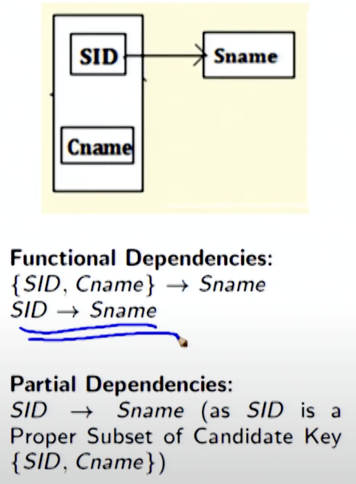
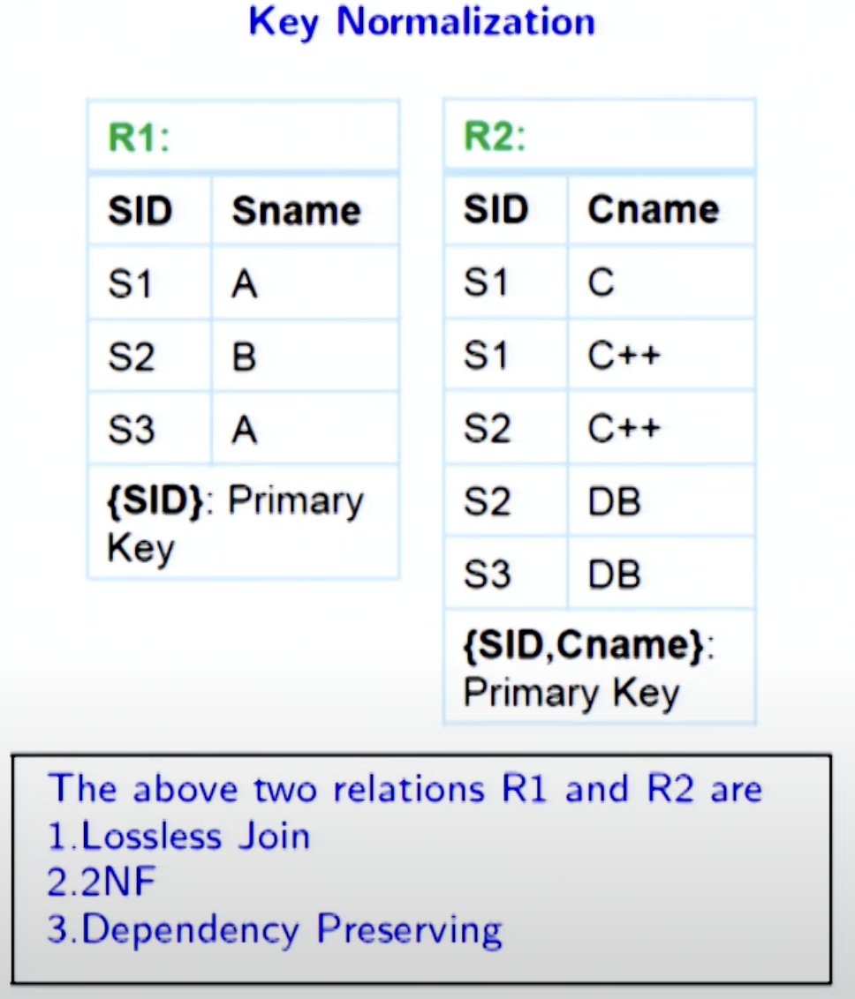
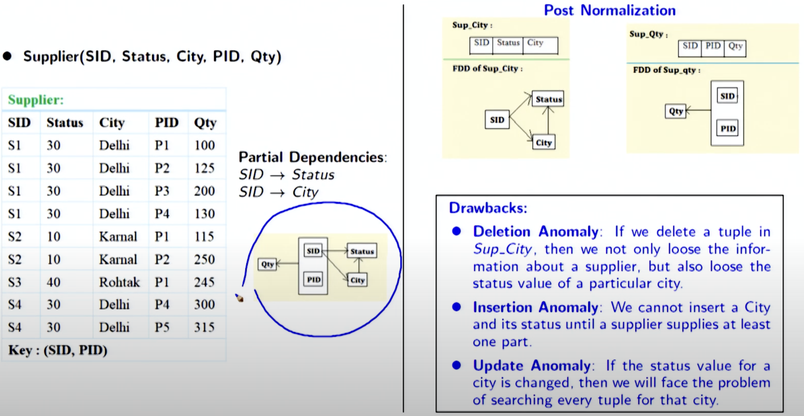

# Week 6 Notes - DBMS

*Prof. Partha Pratham Das, IIT KGP*

*Notes by Adarsh (23f2003570)*  

## [L6.1: Relational Database Design/6: Normal Forms (34:30)]

| **Normal Form**          | **Description**                                                                                                                                                      | **Key Conditions**                                                                                                                                                                                                                                                                                           |
|--------------------------|----------------------------------------------------------------------------------------------------------------------------------------------------------------------|----------------------------------------------------------------------------------------------------------------------------------------------------------------------------------------------------------------------------------------------------------------------------------------------------------------|
| **1NF (First Normal Form)**    | Ensures all values in the database are atomic (indivisible).                                                                                                        | - All attributes must contain atomic (single-valued) values. - Each record (tuple) must be unique.                                                                                                                                                                                                      |
| **2NF (Second Normal Form)**   | Eliminates partial dependency (non-prime attributes depend on part of a composite key).                                                                              | - The relation must be in **1NF**. - No non-prime attribute can depend on a part of a candidate key (if the key is composite).                                                                                                                                                                           |
| **3NF (Third Normal Form)**    | Eliminates transitive dependencies (non-prime attributes depend on other non-prime attributes).                                                                     | - The relation must be in **2NF**. - No non-prime attribute can depend on another non-prime attribute (transitive dependency). - Every non-prime attribute must depend directly on the primary key.                                                                                                     |
| **BCNF (Boyce-Codd Normal Form)** | A stricter version of 3NF, where every functional dependency has a superkey on the left-hand side.                                                                   | - The relation must be in **3NF**. - For every functional dependency \( X \to Y \), \( X \) must be a **superkey**.                                                                                                                                                                                        |
| **4NF (Fourth Normal Form)**   | Resolves multi-valued dependencies (when an attribute determines a set of values independently of other attributes).                                                  | - The relation must be in **BCNF**. - No multi-valued dependency exists (a situation where one attribute determines multiple independent values of another attribute).                                                                                                                                |
| **5NF (Fifth Normal Form)**    | Eliminates join dependencies, ensuring the relation can be reconstructed from smaller relations without redundancy.                                                    | - The relation must be in **4NF**. - Every join dependency must be implied by candidate keys. - The relation must not have any non-trivial join dependency that would cause data redundancy during reconstruction.                                                                                          |
| **6NF (Sixth Normal Form)**    | Focuses on temporal data, allowing independent updates of time-based attributes.                                                                                      | - The relation must be in **5NF**. - The relation is split by time intervals, ensuring independent updates for each time-based attribute (important for temporal databases).                                                                                                                             |
| **DKNF (Domain-Key Normal Form)** | Ensures that all constraints are a result of domain constraints (data types) or key constraints (candidate keys).                                                     | - The relation must have no constraints other than **domain** or **key constraints**. - No additional integrity constraints or business rules are enforced outside of domain and key constraints.                                                                                                         |
| **PDNF (Projection-Join Normal Form)** | Ensures that every dependency in the relation is a projection of a candidate key.                                                                                   | - The relation must be in **5NF**. - All dependencies must be preserved in some projection of the relation, meaning the relation can be reconstructed by joining smaller relations based on candidate keys.                                                                                                  |
| **EKNF (Entity-Key Normal Form)** | Focuses on ensuring that keys (primary or candidate keys) for entities are used correctly and that no redundant entity keys are present in relationships.           | - Entity relationships should not use unnecessary or non-unique keys to identify an entity. - The decomposition ensures key-preserving relationships and avoids redundancy in entity-key mappings.                                                                                                         |
| **ETNF (Entity-Temporal Normal Form)** | Ensures proper handling of **temporal data** (data that changes over time) and prevents redundancy in how time-based changes are represented in the database.         | - The relation must be in **5NF**. - Temporal aspects of data are normalized so that time-intervals are used to represent valid data states. - Changes over time should be handled with proper time-period representations without redundancy.                                                                |

---

## First Normal Form

1. You need to check if
   1. values are not `Multivalued`
   2. No insert, delete, update anomalies
   3. LHS of relation should be a Superkey
      1. If its not relation instances may duplicate

## Second normal form
1. You need to check if
   1. Relation is in 1NF
   2. R contains no partial dependencies. This means every relation has to be defined by a Candidate Key or Primary Key

## Partial Dependency

Say $R(X, Y, A)$ is a relational schema
- $X$ is *Candidate Key*
- $Y$ is Proper subset of C.K
- $A$ is some Non Prime Attribute (Attrib that does not belong to any C.K)

In this case $Y \rightarrow A$ is a `Partial Dependency`

- $SID \rightarrow Sname$ is Partial Dependency
  - because SName is a non prime attribute
  - $SID \subset [SID+Cname]$
- $SID+Cname$ is a Candidate Key
- Duplicate are possible
- Not in 2 NF

**Possible Fix**

