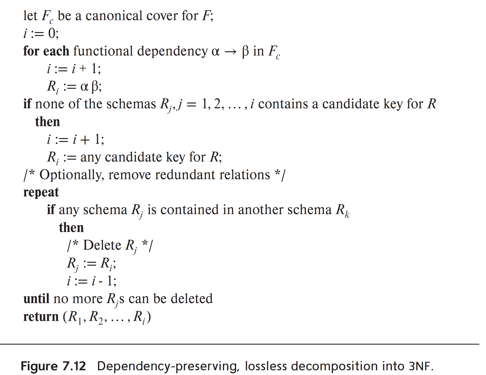
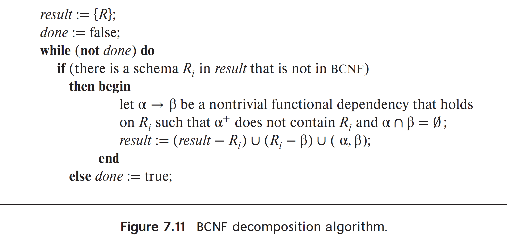

# Week 6 Notes - DBMS

*Prof. Partha Pratham Das, IIT KGP*

*Notes by Adarsh (23f2003570)*  

## [L6.1: Relational Database Design/6: Normal Forms (34:30)]

| **Normal Form**          | **Description**                                                                                                                                                      | **Key Conditions**                                                                                                                                                                                                                                                                                           |
|--------------------------|----------------------------------------------------------------------------------------------------------------------------------------------------------------------|----------------------------------------------------------------------------------------------------------------------------------------------------------------------------------------------------------------------------------------------------------------------------------------------------------------|
| **1NF (First Normal Form)**    | Ensures all values in the database are atomic (indivisible).                                                                                                        | - All attributes must contain atomic (single-valued) values. - Each record (tuple) must be unique.                                                                                                                                                                                                      |
| **2NF (Second Normal Form)**   | Eliminates partial dependency (non-prime attributes depend on part of a composite key).                                                                              | - The relation must be in **1NF**. - No non-prime attribute can depend on a part of a candidate key (if the key is composite).                                                                                                                                                                           |
| **3NF (Third Normal Form)**    | Eliminates transitive dependencies (non-prime attributes depend on other non-prime attributes).                                                                     | - The relation must be in **2NF**. - No non-prime attribute can depend on another non-prime attribute (transitive dependency). - Every non-prime attribute must depend directly on the primary key.                                                                                                     |
| **BCNF (Boyce-Codd Normal Form)** | A stricter version of 3NF, where every functional dependency has a superkey on the left-hand side.                                                                   | - The relation must be in **3NF**. - For every functional dependency \( X \to Y \), \( X \) must be a **superkey**.                                                                                                                                                                                        |
| **4NF (Fourth Normal Form)**   | Resolves multi-valued dependencies (when an attribute determines a set of values independently of other attributes).                                                  | - The relation must be in **BCNF**. - No multi-valued dependency exists (a situation where one attribute determines multiple independent values of another attribute).                                                                                                                                |
| **5NF (Fifth Normal Form)**    | Eliminates join dependencies, ensuring the relation can be reconstructed from smaller relations without redundancy.                                                    | - The relation must be in **4NF**. - Every join dependency must be implied by candidate keys. - The relation must not have any non-trivial join dependency that would cause data redundancy during reconstruction.                                                                                          |
| **6NF (Sixth Normal Form)**    | Focuses on temporal data, allowing independent updates of time-based attributes.                                                                                      | - The relation must be in **5NF**. - The relation is split by time intervals, ensuring independent updates for each time-based attribute (important for temporal databases).                                                                                                                             |
| **DKNF (Domain-Key Normal Form)** | Ensures that all constraints are a result of domain constraints (data types) or key constraints (candidate keys).                                                     | - The relation must have no constraints other than **domain** or **key constraints**. - No additional integrity constraints or business rules are enforced outside of domain and key constraints.                                                                                                         |
| **PDNF (Projection-Join Normal Form)** | Ensures that every dependency in the relation is a projection of a candidate key.                                                                                   | - The relation must be in **5NF**. - All dependencies must be preserved in some projection of the relation, meaning the relation can be reconstructed by joining smaller relations based on candidate keys.                                                                                                  |
| **EKNF (Entity-Key Normal Form)** | Focuses on ensuring that keys (primary or candidate keys) for entities are used correctly and that no redundant entity keys are present in relationships.           | - Entity relationships should not use unnecessary or non-unique keys to identify an entity. - The decomposition ensures key-preserving relationships and avoids redundancy in entity-key mappings.                                                                                                         |
| **ETNF (Entity-Temporal Normal Form)** | Ensures proper handling of **temporal data** (data that changes over time) and prevents redundancy in how time-based changes are represented in the database.         | - The relation must be in **5NF**. - Temporal aspects of data are normalized so that time-intervals are used to represent valid data states. - Changes over time should be handled with proper time-period representations without redundancy.                                                                |

---

### First Normal Form

1. You need to check if
   1. values are not `Multivalued`
   2. No insert, delete, update anomalies
   3. LHS of relation should be a Superkey
      1. If its not relation instances may duplicate

### Second normal form
1. You need to check if
   1. Relation is in 1NF
   2. R contains no partial dependencies. This means every relation has to be defined by a Candidate Key or Primary Key

### Partial Dependency

Say $R(X, Y, A)$ is a relational schema
- $X$ is *Candidate Key*
- $Y$ is Proper subset of C.K
- $A$ is some Non Prime Attribute (Attrib that does not belong to any C.K)

In this case $Y \rightarrow A$ is a `Partial Dependency`

- $SID \rightarrow Sname$ is Partial Dependency
  - because SName is a non prime attribute
  - $SID \subset [SID+Cname]$
- $SID+Cname$ is a Candidate Key
- Duplicate are possible
- Not in 2 NF

**Possible Fix**

### Transitive Dependencies

A **transitive dependency** occurs when one non-prime attribute (an attribute that is not part of any candidate key) depends on another non-prime attribute via a third attribute.

In other words, if we have three attributes **A**, **B**, and **C**, a transitive dependency means:
- **A** → **B** (A determines B),
- **B** → **C** (B determines C),
- Therefore, **A** → **C** (A indirectly determines C through B).

#### Example:
Let's use an example to illustrate this concept. Consider a **student enrollment** table:

| StudentID | StudentName | CourseID | InstructorName | InstructorEmail |
|-----------|-------------|----------|----------------|-----------------|
| 101       | Alice       | CS101    | Dr. Smith      | smith@uni.edu   |
| 102       | Bob         | CS101    | Dr. Smith      | smith@uni.edu   |
| 103       | Charlie     | CS102    | Dr. Johnson    | johnson@uni.edu |

In this table:
- **StudentID** is the primary key (candidate key).
- **InstructorName** and **InstructorEmail** are dependent on **CourseID** (which is not a candidate key but part of the relational design).
- There's a **transitive dependency** here:
  - **StudentID** → **CourseID** (StudentID determines the CourseID).
  - **CourseID** → **InstructorName** (CourseID determines InstructorName).
  - So, **StudentID** indirectly determines **InstructorName** through **CourseID**.

#### Why Transitive Dependencies are a Problem:
Transitive dependencies lead to **data redundancy** and **anomalies** during insertion, deletion, or update operations. For example:
- If we want to change the instructor for a course (say, for **CS101**), we would need to update all the rows where the course is listed, leading to potential inconsistency if not done correctly.

#### How to Eliminate Transitive Dependencies:
To eliminate transitive dependencies, we use **Third Normal Form (3NF)**. A table is in 3NF if:
1. It is in **Second Normal Form (2NF)**.
2. There is no **transitive dependency** (i.e., all non-prime attributes are directly dependent on the primary key, not on another non-prime attribute).

#### Steps to Remove Transitive Dependency:
In our example, we could split the table into two tables to avoid the transitive dependency:

##### Table 1: **Student Enrollment**

| StudentID | StudentName | CourseID |
|-----------|-------------|----------|
| 101       | Alice       | CS101    |
| 102       | Bob         | CS101    |
| 103       | Charlie     | CS102    |

##### Table 2: **Course Details**

| CourseID | InstructorName | InstructorEmail   |
|----------|----------------|-------------------|
| CS101    | Dr. Smith      | smith@uni.edu     |
| CS102    | Dr. Johnson    | johnson@uni.edu   |

Now:
- **StudentID** → **CourseID** in the **Student Enrollment** table.
- **CourseID** → **InstructorName** and **InstructorEmail** in the **Course Details** table.

In this design:
- The **Instructor** data is now stored separately and is only updated in one place (in **Course Details**).
- There is no transitive dependency anymore because non-prime attributes depend only on the primary key, not on another non-prime attribute.

#### Summary:
- A **transitive dependency** occurs when one non-prime attribute depends on another non-prime attribute through a third attribute, leading to redundancy and potential anomalies.
- To resolve transitive dependencies, tables are normalized to **Third Normal Form (3NF)**.

### Important Notes on Decomposition

When your data has redundencies, you have to normalize it

Two main objectives to test after normalizing
1. The relations should be lossless
2. The relations should preserve the original functional dependencies

### Third Normal Form

Relation $dept\_advisor(s\_ID, i\_ID,dept\_name)$  

$F = \{s\_ID, dept\_name \rightarrow i\_ID, i\_ID \rightarrow dept\_name\}$  

- $\{s\_ID, dept\_name\}$ is a Super Key
- $\{i\_ID \rightarrow dept\_name\}$, Though dept_name is contained in a SK, it is not used in the identifier. But i_ID is an identifier.

|s_id|dept_name|i_ID|
|-|-|-|

and

|i_ID|dept_name|
|-|-|

1. Is it 1NF (atomic and not multi valued) YES
2. Is it in 2NF (NO Partial dependency + 1NF) YES
3. Is it in 3NF (non-prime attributes depend on other non-prime attributes) all of the prime attributes are used. so YES
4. Even though it's in 3NF, There will be repetition of information

BCNF will guarentee Lossless Joins, but will not guarentee dependency preservation

## [L6.2: Relational Database Design/7: Normal Forms (32:17)](https://youtu.be/4Vn2-tcg21c)  

BCNF is good in reduction of redundancy but not good at preserving dependencies

Boyce Codd Normal Form is a stronger normal form and requires an inner join

3NF is weaker than BCNF, but it guarantees that the decomposition of functional definitions will be
1. LOSSLESS
2. AND Preserves Dependencies

### **3NF:**

A relation $R$ is in BCNF if
   1. for every FD defined in the original relation (a.k.a associated with $R$) $X \rightarrow A$
      1. $A \subseteq X$
      2. OR $X$ is a SuperKey of $R$
For the above to be in 3NF
   1. $A$ should be part of some **candidate key**

It should also be in 2NF and 1NF

### Testing for 3NF
   1. Only check FD's in $F$
      1. No need to compute FD's in $F^+$
   2. If $\alpha$ is a Super Key, Use attribute closure to check each dependency of $\alpha \rightarrow \beta$
   3. if $\alpha$ is not a SuperKey, we have to verify if each attribute in $\beta$ is contained in a candidate key of $R$
   4. Notes on efficiency
      1. Tests for 3NF is expensive. It involves finding CK's
      2. Testing for 3NF is NP HARD
      3. Decomposition into 3NF can be done in polynomial time.

### 3NF Decomposition Algorithm

1. You are given FD Set - $F$ of a Relation $R$
2. **First:** Find the canonical/minimum cover $F_c$ of $F$
3. **Second** For each dependency $R_i$ in the Canonical Cover $F_c$
   1. $R_i = XY$ for each FD in $F_c$ where $X \rightarrow Y$
      1. $R_i = XY$ means union $\cup$ of X,Y
   2. Remember, $R_i$ is the decomposed relation!
   3. If any key $K \in R$ are not available in $R_1, R_2,...,R_n$
      1. then .. create one more relation $R_i = K$
   4. every $R_i$ created this way will be in 3NF, Dependency preserving and lossless join

**3 step process**  

### 3NF Sample 1

  Given $R = (cust\_id, emp\_id, branch\_name)$
  
  Given 
  $$
  F = cust\_id, emp\_id \rightarrow branch\_name, type \\
  emp\_id \rightarrow branch\_name, \\
  cust\_id, branch\_name \rightarrow emp\_id
  $$

  $$
  F_c = cust\_id, emp\_id \rightarrow branch\_name \\
   cust\_id, emp\_id \rightarrow type \\
   emp\_id \rightarrow branch\_name \\
   cust\_id, branch\_name \rightarrow emp\_id
  $$

  Note that $cust\_id, emp\_id \rightarrow branch\_name$ can be removed as just $emp_id$ can cover/describe $branch_name$

  $$
  R_i = (cust\_id, emp\_id, type) \\
   (emp\_id, branch\_name) \\
   (cust\_id, branch\_name, emp\_id)
  $$

  Note:
  
$(emp\_id, branch\_name) \in (cust\_id, branch\_name, emp\_id)$

Therefore 3NF form would be

$$
  R_{3nf} = (cust\_id, emp\_id, type) \\
   (cust\_id, branch\_name, emp\_id)
$$

### BCNF Decomposition Algorithm

#### If you cannot decompose a relation to BCNF, You will have to use an expensive JOIN to retrieve data

### 3NF vs BCNF

|3rd Normal Form|Boyce Codd Normal Form|
|-|-|
|Focuses on Primary Key|Focuses on Candidate key|
|High Redundancy compared to BCNF|0% Redundancy|
|Preserves all dependencies|May not preserve dependencies|
|$X \rightarrow Y$ is possible if $X$ is **Super Key** OR (this is the relaxation) $Y$ is part of some key|$X \rightarrow Y$ is possible if $X$ is **Super Key**|