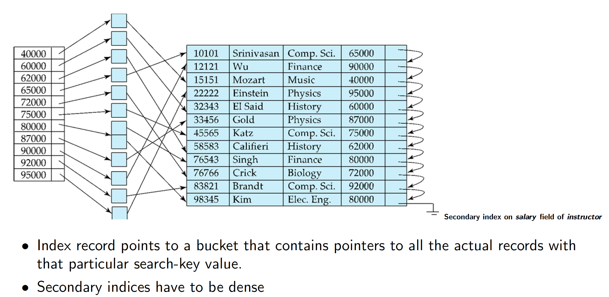
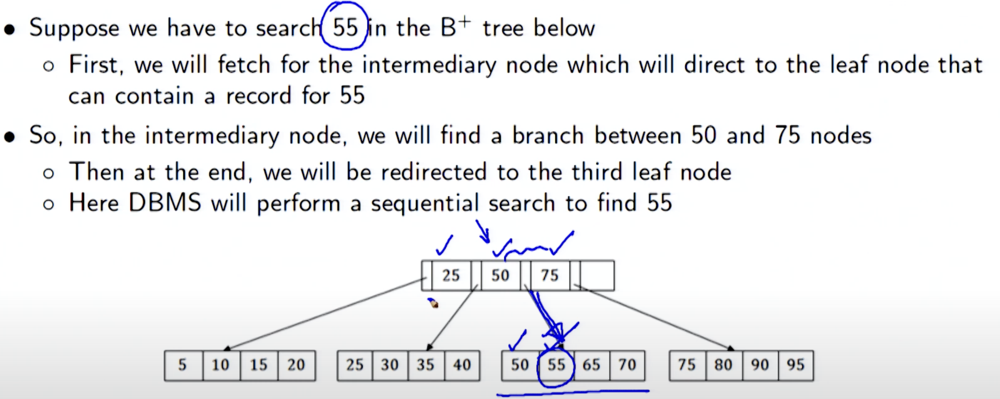
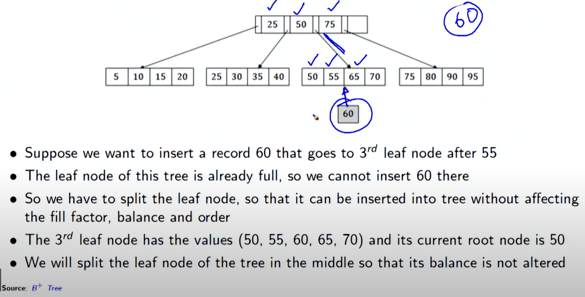
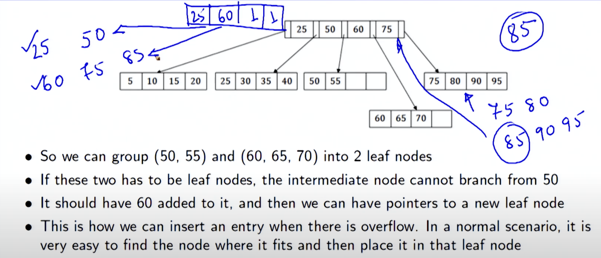
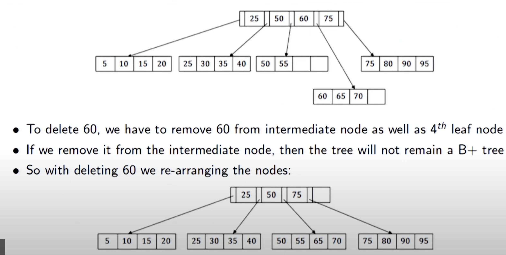
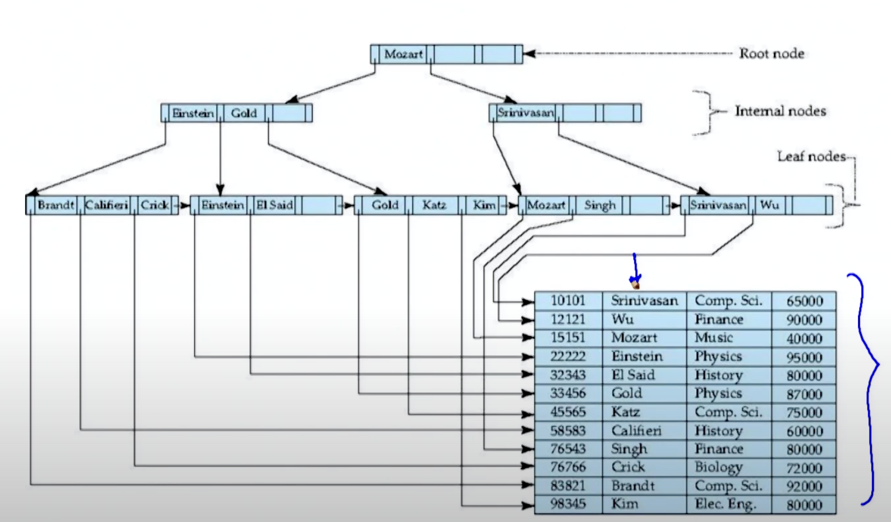
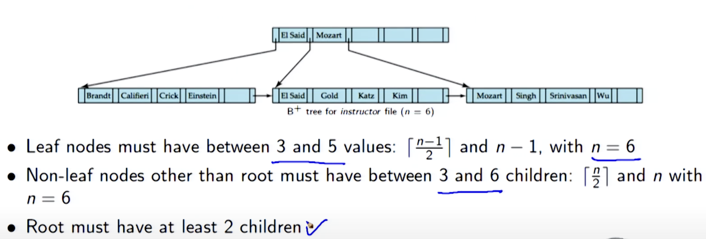
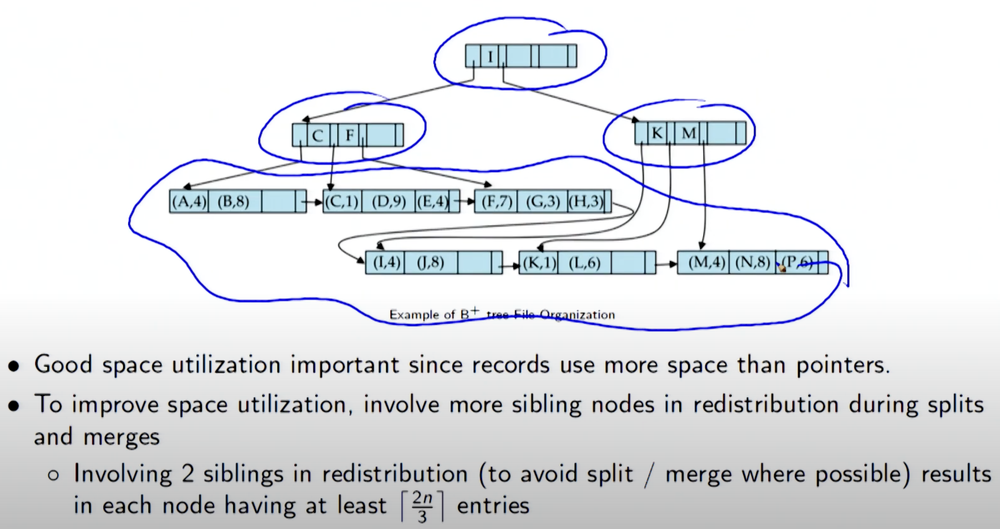
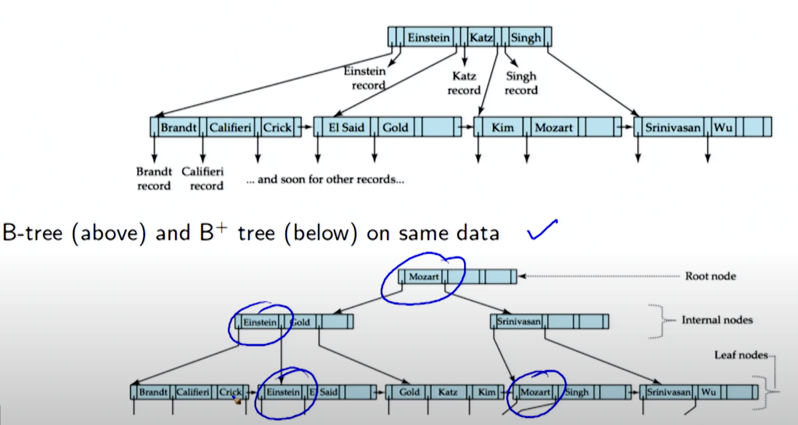
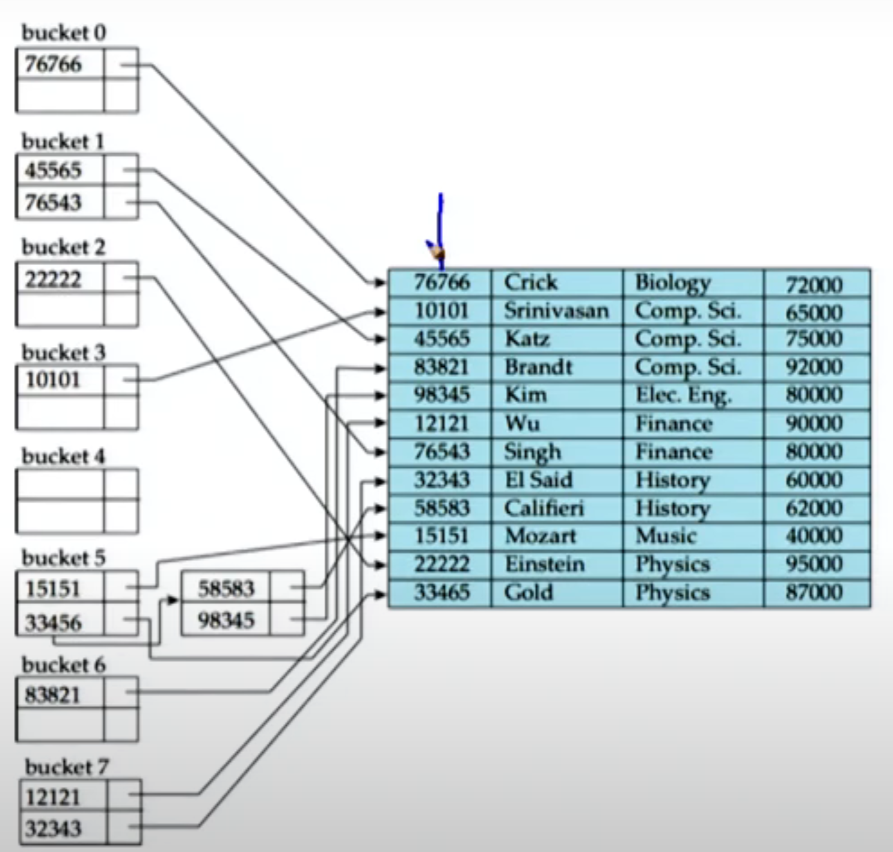

# Week 9 Notes - DBMS

*Prof. Partha Pratham Das, IIT KGP*

*Notes by Adarsh (23f2003570)*  

## [L9.1: Indexing and Hashing/1: Indexing/1 (32:02)](https://youtu.be/fY-EC1dknnQ)

### Indexes

Database indexes are essential structures that enhance the speed and efficiency of data retrieval operations. At a high level, an index is a data structure that allows the database management system (DBMS) to quickly look up and access rows in a table without scanning every single row. This can drastically reduce query times, especially when dealing with large datasets.

#### 1. **What Is an Index?**
An index in a database is similar to the index in a book. Instead of going through every page to find a specific word, you can look it up in the index, which points directly to the page number. Similarly, a database index points to the physical location of data in the database table, enabling quick retrieval.

#### 2. **Index Types**
There are various types of indexes, each with its own internal structure and use cases. Some common ones include:

##### **B-Tree Index (Balanced Tree Index)**
- **Structure**: A **B-tree** index is a balanced tree structure where each node contains a sorted key and a reference (pointer) to the corresponding data row.
- **How it works**: The index is divided into a tree of nodes, and each node holds a sorted list of keys. The B-tree ensures that the tree remains balanced (i.e., every path from the root to the leaves has the same length), guaranteeing efficient searching, insertion, and deletion.
- **Use case**: This is the most common type of index for queries involving equality (`=`) or range queries (`<`, `<=`, `>`, `>=`). It's typically used in OLTP (Online Transaction Processing) systems.

##### **Hash Index**
- **Structure**: A **hash index** uses a hash function to map the key to a specific location (bucket) in the table.
- **How it works**: When a query is issued with a key, the database applies the hash function to map the key to the corresponding bucket where the data is stored. Hash indexes are fast for exact match queries (e.g., `WHERE column = value`) but are not suitable for range queries.
- **Use case**: Used in situations where exact matching is the primary operation, such as lookups in key-value stores.

##### **Bitmap Index**

```sql
CREATE BITMAP INDEX Index_Name
   ON Table_Name (Column_Name);
```

- **Structure**: A **bitmap index** uses bitmaps (bit arrays) to represent the presence or absence of a particular value in the indexed column.
- **How it works**: For a column with a limited number of distinct values (e.g., gender with values "male" and "female"), a bitmap index will create a bitmap where each bit corresponds to a row, and the bit is set to `1` if the row contains the value, and `0` otherwise.
- **Use case**: Bitmap indexes are efficient for columns with low cardinality (few distinct values) and are often used in data warehousing scenarios.

##### **Full-text Index**
- **Structure**: A **full-text index** is specialized for searching text-based data. It stores information about words in text columns and their positions in the documents.
- **How it works**: Full-text indexes often use a combination of algorithms like inverted indexes, where each word in the text is mapped to a list of rows that contain that word.
- **Use case**: Used in search engines, content management systems, or applications that need to support text searching (e.g., "find all rows containing the word 'apple'").

#### 3. **Index Storage**
Indexes are typically stored separately from the actual data rows (the table itself), and they consist of:
- **Keys**: The indexed column(s) or expression(s) that the index is built on.
- **Pointers**: References (often memory addresses or row IDs) to the actual data rows or table entries.

#### 4. **How Indexes Speed Up Queries**
When a query is issued to the database, the DBMS decides whether to use an index based on several factors, such as the type of query and the available indexes. Here's how indexes help:
- **Direct Lookup**: If an index exists on a column being queried, the DBMS can use the index to directly find the location of the required rows.
- **Reduced Search Space**: Instead of scanning all rows, an index narrows down the search space, often requiring just a small number of disk accesses, even for large tables.
- **Efficient Sorting**: If the index stores data in a sorted order (as in a B-tree index), sorting operations can be optimized by using the index directly rather than having to sort the data from scratch.

#### 5. **Cost of Indexes**
While indexes speed up reads, they come with overhead:
- **Storage**: Indexes require additional disk space. The more indexes you have, the more storage space is consumed.
- **Write Performance**: Every time a row is inserted, updated, or deleted, the database must update all associated indexes. This can slow down write-heavy workloads.
- **Index Maintenance**: Some indexes may require periodic rebuilding or optimization to maintain their efficiency, especially when there is heavy write activity.

#### 6. **Clustered vs Non-clustered Indexes**
- **Clustered Index**: A table can have only one clustered index, which means the data rows themselves are stored in the order of the index. In a clustered index, the index structure contains pointers to the data rows themselves.
- **Non-clustered Index**: A table can have multiple non-clustered indexes. These indexes are separate from the table and contain pointers to the actual rows in the table.

#### 7. **Index Operations**
- **Creation**: Indexes are usually created using the `CREATE INDEX` statement in SQL, and they can be created on one or more columns.
- **Update**: When a row in the indexed column is modified, the corresponding index needs to be updated to reflect the change.
- **Drop**: Unused or redundant indexes can be dropped to save space and improve write performance.

#### 8. **Choosing the Right Index**
The effectiveness of an index depends on the query patterns. Factors to consider:
- **Columns Used in Queries**: Index columns should be those that are frequently queried, especially in `WHERE`, `ORDER BY`, `JOIN`, and `GROUP BY` clauses.
- **Cardinality**: Indexing columns with high cardinality (many distinct values) is usually more beneficial than low-cardinality columns.
- **Query Frequency**: Frequently accessed columns or tables should be indexed for performance benefits.


1. Say a Database has 1 Table and the table has 2 indexes, the DB would have 2 index files and 1 Table file.
2. Say you update, delete a row, a corresponding update/delete has to be done on the index
3. Deleting on index file means you have to restore the sorting order. Some Movement has to be made.

### **Order of a Tree: Definition**
- The **order** of a tree is the maximum number of **children** that a node can have.
- In simpler binary trees, the order is always **2** because each node has at most two children (left and right).
- For trees like **B-trees** or **B+ trees**, the order indicates how many children a node can have, and thus, how many keys can be stored in each node.

#### **Example:**
- In a **binary tree**, the order is **2**, meaning each node can have at most **two children**.
- In a **B-tree of order m**, each node can have up to **m children** and **m-1 keys**. The order of the tree dictates how many children can exist in each internal node.

#### **Order in Different Trees:**

1. **Binary Tree** (Order = 2)
   - Each node has at most 2 children: left and right child.

   Example of a Binary Tree:
   ```
       10
      /  \
     20   30
   ```

2. **B-tree of Order m** (Order = m)
   - Each node can have up to **m** children.
   - Each node can store up to **m-1 keys**.
   - The B-tree is typically used in database indexing systems.

   Example of a **B-tree of order 3**:
   ```
             [10, 20]
            /   |   \
        [5]   [15]  [25, 30]
   ```

   In this case:
   - Each node can have at most **3 children** and at most **2 keys** (since it's order 3, and we have m-1 keys).

3. **B+ Tree** (Order = m)
   - Like B-trees, but **all data** is stored in the **leaf nodes**.
   - Internal nodes store only **keys** to guide searches.


### Types of Indices

#### **Ordered Index**

An **Ordered Index** (also called a **B-tree Index**) is a type of index that stores key-value pairs in a sorted order. This allows for efficient searching, range queries, and ordered retrieval of data. In an ordered index, the keys are arranged in a way that supports fast binary search-like operations.

##### Characteristics of Ordered Index:
1. **Sorting**: The keys are sorted in a specific order (typically ascending or descending).
2. **Efficient Range Queries**: Since the data is sorted, it's efficient to find a range of values (e.g., find all records between certain values).
3. **Balanced Tree Structure**: In databases like MySQL, an ordered index often uses a B-tree or a B+ tree, which maintains a balanced structure for fast searches, inserts, and deletes.

##### Example:
Consider a table `Employees` with the following records:

| ID  | Name     | Age |
|-----|----------|-----|
| 1   | Alice    | 25  |
| 2   | Bob      | 30  |
| 3   | Charlie  | 35  |
| 4   | Diana    | 40  |

If we create an **Ordered Index** on the `Age` column, the index might look like this:

- **Age Index**: (Sorted order of Age)
  - (25, Alice)
  - (30, Bob)
  - (35, Charlie)
  - (40, Diana)

Now, when you query for `Age > 30`, the database can efficiently find the starting point (in this case, `Charlie` at age 35) and then continue to scan for subsequent entries.

##### Advantages:
- **Efficient Lookups**: Searching for a specific key or value is fast due to the sorted nature.
- **Range Queries**: Useful for operations like "find all records with age between 30 and 40."
- **Balanced Tree Structure**: Most B-tree implementations ensure logarithmic search time.

##### Disadvantages:
- **Insertion/Deletion Overhead**: As the data is sorted, insertions and deletions may require re-balancing of the tree.
- **Space Overhead**: Extra memory might be required to store the index structure.

---

#### **Hash Index**

A **Hash Index** is a type of index where the database uses a **hash function** to convert the index key into a fixed-size value (a hash value). The hash value is used to quickly determine the location of the associated data.

##### Characteristics of Hash Index:
1. **Direct Mapping**: The hash function maps a key to a specific location in a hash table. There is no ordering of keys in a hash index.
2. **Fast Equality Searches**: Hash indexes are optimized for lookups based on equality (e.g., find a record with an exact match).
3. **No Range Queries**: Since there is no order maintained, hash indexes are inefficient for range-based queries.

##### Example:
Consider the same `Employees` table. If we create a **Hash Index** on the `ID` column, the database might apply a hash function to the `ID` values and create a hash table.

| Hash Value | Record (ID, Name, Age)     |
|------------|----------------------------|
| 0011       | (1, Alice, 25)             |
| 0100       | (2, Bob, 30)               |
| 1010       | (3, Charlie, 35)           |
| 1100       | (4, Diana, 40)             |

The hash index allows for very fast lookups for specific `ID` values. For example, to find the record with `ID = 3`, the database will quickly compute the hash of `3` (which might give a value like `1010`), and it can directly access the record associated with that hash value.

##### Advantages:
- **Fast Lookups for Exact Matches**: Hash indexes are extremely fast for finding exact matches (e.g., `WHERE ID = 3`).
- **Constant Time Complexity**: In ideal conditions, the time complexity of a hash lookup is constant, O(1).

##### Disadvantages:
- **No Support for Range Queries**: You cannot perform operations like "find all records with `ID` between 2 and 4" because the hash index does not preserve any ordering of keys.
- **Collisions**: When two keys map to the same hash value (a collision), it can require additional processing (e.g., using chaining or open addressing to handle collisions).
- **Not Suitable for Ordered Operations**: Since the hash index does not maintain any order, operations like sorting are inefficient.

#### **Comparison:**

| Feature                | Ordered Index (B-tree)      | Hash Index                |
|------------------------|-----------------------------|---------------------------|
| **Key Order**           | Maintains sorted order      | No order maintained       |
| **Best Use Case**       | Range queries, sorted results | Exact-match lookups       |
| **Efficiency for Range Queries** | Efficient | Not supported             |
| **Efficiency for Exact Matches** | Moderate (log(n)) | Very efficient (O(1))     |
| **Insert/Update Cost**  | Moderate, requires rebalancing | Low (constant time)       |
| **Space Complexity**    | Higher due to tree structure | Lower (just a hash table) |

- **Ordered Index** is ideal for cases where you need to support range queries and ordered results (e.g., searching for all employees within a certain age range).
- **Hash Index** is best suited for scenarios where you only need to perform fast exact-match lookups (e.g., querying for an employee by `ID`).


### Index Evaluation Metrics

Index evaluation metrics help assess the performance of database indexes and determine which index is the most efficient for a given query workload. The key metrics used to evaluate indexes typically revolve around the **cost**, **speed**, and **efficiency** of operations like searching, inserting, and deleting data.

#### 1. **Search Time or Query Performance**

This metric evaluates how efficiently an index can retrieve data in response to a query, typically measured by the **time** it takes to perform lookups.

- **Cost of a Search**: 
  - For **B-tree (Ordered)** indexes, search time is typically logarithmic (**O(log N)**) because the data is sorted and stored in a tree structure.
  - For **Hash Indexes**, search time is constant (**O(1)**) in the best case, as it involves a direct lookup via a hash function.
  
**Example:**
- If a table of 1,000 records is indexed using a **B-tree** on a `Name` column, the search for a specific name using this index would take **O(log 1000) = O(10)** operations.
- For the same table with a **Hash Index** on `ID`, the lookup for `ID = 200` would take **O(1)** operations if the hash function distributes values evenly.

#### 2. **Insertion and Deletion Time (Update Cost)**

This metric measures the time it takes to insert new records or delete existing records when an index is in place. It is critical in environments with frequent data modifications.

- **B-tree (Ordered) Index**: Insertion and deletion in a B-tree require maintaining the tree’s balance, which can involve **O(log N)** time for insertion or deletion operations.
- **Hash Index**: Hash indexes tend to offer fast insertion and deletion (often **O(1)**), as it usually involves just inserting or removing an entry in the hash table.

**Example:**
- For a **B-tree** on a table with 1,000 records, inserting a new record might require searching for the right place in the tree, followed by rebalancing the tree if necessary, leading to a time complexity of **O(log 1000) = O(10)**.
- With a **Hash Index**, inserting a record would typically be faster, requiring only **O(1)** time (assuming no hash collisions).

#### 3. **Index Size (Space Complexity)**

The space complexity or index size metric refers to how much additional storage is required to maintain an index. Larger indexes require more disk space, which could affect overall performance, especially for systems with large datasets.

- **B-tree (Ordered) Index**: These indexes often require **more storage** than hash indexes because they must store not only the indexed values but also pointers to the actual data in the table (node keys and references).
- **Hash Index**: Hash indexes are typically **more space-efficient** than B-tree indexes, as they only need to store hash values and pointers to the corresponding data rows.

**Example:**
- A **B-tree index** on a `Name` column in a 1,000-row table might store additional references to the data and keep nodes that ensure the tree structure remains balanced. As a result, the index size could be a multiple of the size of the original table.
- A **Hash Index** on the `ID` column of the same table may take up less space, as it only needs to store hash values and data references.

#### 4. **Selectivity and Cardinality**

- **Selectivity** measures how well the index narrows down the search space. High selectivity means the index efficiently reduces the number of records retrieved (e.g., a unique value or a value that occurs very infrequently).
- **Cardinality** refers to the number of distinct values in a column. High cardinality columns (e.g., `ID`, `email`) are good candidates for indexing, while low cardinality columns (e.g., `Gender`, `True/False`) may not benefit as much from indexing.

**Example:**
- For a **B-tree index** on an `Age` column, if the table contains many records with unique ages, the index will have **high selectivity** (efficient for queries like `Age = 30`). But for a `Gender` column with only two possible values (male/female), the selectivity is low, and the index might not provide significant performance improvements.
- A **Hash Index** on a column with high cardinality (like `ID`) performs well, but it may not perform as efficiently for a low-cardinality column (e.g., `Status` with values like `Active`, `Inactive`).

#### 5. **Throughput**

Throughput refers to how much data can be processed by the database in a given time frame (e.g., number of queries processed per second). It’s important in high-performance systems with many queries per second.

- **B-tree** indexes generally provide a **balanced throughput** for a mix of read and write operations, but they might be slower than hash indexes for read-heavy workloads.
- **Hash Indexes** are usually faster for equality-based queries (e.g., `WHERE ID = 200`), but they do not support range queries, which could limit throughput in some use cases.

**Example:**
- A **B-tree index** on `Age` in a table of 10,000 rows would have reasonable throughput for queries like `WHERE Age BETWEEN 30 AND 40`, but would perform slower for exact matches compared to a hash index on `ID`.
- A **Hash Index** on `ID` would provide **higher throughput** for queries like `WHERE ID = 100` but would not work for `WHERE Age BETWEEN 30 AND 40`.

#### 6. **Query Plan Efficiency (Access Path)**

This metric evaluates how well the database query planner can leverage the index to generate an efficient query execution plan. The query plan depends on whether the database can use the index to minimize the amount of data scanned.

- **B-tree Index**: This index is usually selected for queries that involve ranges, sorting, or ordering (e.g., `WHERE Age > 30` or `ORDER BY Age`).
- **Hash Index**: This index is highly efficient for equality queries but cannot be used for range-based queries.

**Example:**
- If you execute `SELECT * FROM Employees WHERE Age BETWEEN 30 AND 40`, the query planner may choose a **B-tree index** on the `Age` column because it efficiently supports range queries.
- If you execute `SELECT * FROM Employees WHERE ID = 100`, the query planner may choose a **Hash Index** on `ID` because it supports fast lookups for exact matches.

#### **Comparison of Metrics:**

| Metric                       | **B-tree (Ordered)**                     | **Hash Index**                        |
|------------------------------|------------------------------------------|---------------------------------------|
| **Search Time**               | O(log N)                                 | O(1)                                  |
| **Insertion/Deletion Time**   | O(log N) (rebalancing)                  | O(1) (constant time)                  |
| **Index Size (Space Complexity)** | Larger (due to tree structure)         | Smaller (due to hash table structure)  |
| **Selectivity**               | High for highly distinct columns         | High for unique keys (e.g., ID)       |
| **Throughput**                | Moderate (balanced read/write performance) | High for exact-match queries          |
| **Query Plan Efficiency**     | Efficient for range queries, sorting    | Efficient for equality queries        |


Choosing the best index type depends on the **query workload** and the specific **requirements** of your database:
- **B-tree indexes** are versatile and efficient for range queries, ordered retrieval, and cases with moderate read/write operations.
- **Hash indexes** provide **extremely fast lookups** for exact-match queries but are unsuitable for range queries or sorting.

Consider a database with a `Users` table:

| UserID | Name      | Age | Country   |
|--------|-----------|-----|-----------|
| 1      | Alice     | 30  | USA       |
| 2      | Bob       | 25  | UK        |
| 3      | Charlie   | 35  | Canada    |
| 4      | Diana     | 28  | Australia |

- **B-tree index on `Age`**: Useful for queries like `SELECT * FROM Users WHERE Age BETWEEN 25 AND 30`.
- **Hash index on `UserID`**: Very efficient for queries like `SELECT * FROM Users WHERE UserID = 3`.

The **B-tree** provides more versatility, especially for **range queries**, while the **Hash index** is highly efficient for **exact match** queries like searching by `UserID`.


### Ordered Indices

An **Ordered Index** (often implemented using a **B-tree** or **B+ tree**) is an index where the data (or keys) are stored in a sorted order. This allows efficient searching, range queries, and ordered retrieval of data, thanks to the inherent **sorting** of the index.

In an ordered index:
- **Keys are sorted**: The values in the index are sorted (usually in ascending or descending order).
- **Efficient Range Queries**: The sorted nature makes it efficient to perform range-based queries, such as finding all values within a certain range.
- **Efficient Searching**: Searching for a specific value can be done quickly using a **binary search**.

The most common structure used to implement ordered indices in databases is the **B-tree** or **B+ tree**, both of which are **self-balancing** tree structures. They ensure that the index remains balanced, providing efficient lookup, insert, and delete operations.

#### **How Ordered Indices Work**

##### 1. **B-tree (or B+ tree) Structure**:

A **B-tree** is a balanced tree where each node contains several keys and has pointers to its child nodes. It is **self-balancing**, meaning the tree reorganizes itself to ensure that the height remains logarithmic in relation to the number of elements, providing efficient search and modification operations.

- **Internal nodes** store keys that act as separators.
- **Leaf nodes** store the actual data or pointers to the data rows.
- **Ordered structure**: Keys in each node are stored in sorted order, and child pointers correspond to ranges of keys.

For **B+ trees**, a variant of the B-tree, the internal nodes only store keys for searching, while the **leaf nodes** store both the keys and actual records or pointers to records.

#### **Example: Ordered Index with B-tree**

Let's take an example with a `Books` table, where we will create an **Ordered Index** on the `Title` column.

##### Step 1: Define the `Books` table:

| BookID | Title                   | Author        | Year |
|--------|-------------------------|---------------|------|
| 1      | "The Great Gatsby"       | F. Scott      | 1925 |
| 2      | "Moby Dick"              | Herman Melville | 1851 |
| 3      | "Pride and Prejudice"    | Jane Austen   | 1813 |
| 4      | "To Kill a Mockingbird"  | Harper Lee    | 1960 |
| 5      | "1984"                   | George Orwell | 1949 |

##### Step 2: Create an Ordered Index on the `Title` column

We will create a **B-tree index** on the `Title` column. The B-tree index will store the titles in **sorted order** for efficient searching.

- **Ordered B-tree index on `Title`**: 

| Key (Title)                | Pointer to Row (BookID) |
|----------------------------|-------------------------|
| "1984"                     | 5                       |
| "Moby Dick"                | 2                       |
| "Pride and Prejudice"      | 3                       |
| "The Great Gatsby"         | 1                       |
| "To Kill a Mockingbird"    | 4                       |

The keys are stored in **sorted order** in the index, and each key is associated with a **pointer** that leads to the full row in the `Books` table.

##### Step 3: Searching with the Ordered Index

Now that we have an ordered index on `Title`, let's look at how it helps us search efficiently:

- **Exact Match Search**: To find a specific book, say `"Moby Dick"`, the database can use the **B-tree index** to quickly find the location of `"Moby Dick"` in the sorted index.

  The search process works like this:
  - Start at the root node of the B-tree and compare the target value (`"Moby Dick"`) with the values stored at the node.
  - Traverse down the tree by following the correct child pointer based on the comparison.
  - The search process continues until the target key (`"Moby Dick"`) is found in the leaf node, which will contain the pointer to the corresponding row in the `Books` table.

  Since the index is sorted, finding `"Moby Dick"` would involve a **logarithmic search** with respect to the number of rows, making it **much faster** than scanning the entire table.

- **Range Query**: You can efficiently retrieve all books whose titles fall within a certain range. For example, if you want to find books with titles alphabetically between `"Moby Dick"` and `"To Kill a Mockingbird"`, the query can use the ordered index to quickly find the start and end points and then fetch the records.

  - Start by locating `"Moby Dick"` in the index.
  - Then, use the index to traverse to the next entry (`"Pride and Prejudice"`) and continue until `"To Kill a Mockingbird"`.
  - This is an efficient way to perform a range query, rather than scanning the entire table.

##### Step 4: Inserting a New Record

When a new record is inserted into the `Books` table, the ordered index must be updated to maintain the sorted order. For example, if we insert a new book titled `"War and Peace"`, the ordered index will need to be updated to place this new title in the correct position.

- The B-tree will **reorganize itself** if necessary to maintain balance, ensuring that insertions remain efficient.
- In this case, `"War and Peace"` would be inserted in the correct position based on its alphabetical order:

| Key (Title)                | Pointer to Row (BookID) |
|----------------------------|-------------------------|
| "1984"                     | 5                       |
| "Moby Dick"                | 2                       |
| "Pride and Prejudice"      | 3                       |
| "The Great Gatsby"         | 1                       |
| "To Kill a Mockingbird"    | 4                       |
| "War and Peace"            | 6                       |

##### Step 5: Deleting a Record

If a record is deleted from the table (e.g., if `"Moby Dick"` is deleted), the ordered index must also be updated to remove the corresponding entry.

- The index will **adjust** by removing the key and reorganizing if necessary to maintain the sorted structure and balance.

#### **Advantages of Ordered Indices (B-tree/B+ tree)**

1. **Efficient Search**: Searching for a specific value is **O(log N)** because the data is sorted and the B-tree structure ensures logarithmic height.
   
2. **Range Queries**: Since the keys are sorted, **range queries** (e.g., `BETWEEN`, `>`, `<`) are very efficient. You can quickly locate the starting key and then scan sequentially through the sorted keys.

3. **Balanced Tree**: The B-tree is self-balancing, meaning that the time complexity of search, insertion, and deletion remains logarithmic even as the table grows.

4. **Sorted Order**: Ordered indices make it easy to retrieve data in a sorted order without needing to perform an explicit `ORDER BY` in queries.

#### **Disadvantages of Ordered Indices**

1. **Overhead for Insertions and Deletions**: Insertions and deletions require maintaining the balance of the tree, which can lead to overhead. This is particularly noticeable in systems with frequent updates.

2. **Higher Space Requirements**: B-trees require additional space to store pointers and maintain the tree structure, which can lead to increased storage requirements.

3. **Slower for Exact Match Queries**: While B-trees are very efficient for range queries, hash-based indexes may provide faster **exact match** lookups because they use direct hashing rather than searching through a tree.

#### **Comparison with Other Index Types**

| Feature                        | **Ordered Index (B-tree)**     | **Hash Index**                    |
|--------------------------------|--------------------------------|-----------------------------------|
| **Best for**                   | Range queries, sorted queries  | Exact-match queries               |
| **Search Complexity**          | O(log N)                       | O(1)                              |
| **Efficient for**              | `BETWEEN`, `>`, `<`, sorting   | Equality queries (`=`)            |
| **Insert/Update Complexity**   | O(log N) (requires balancing)  | O(1)                              |
| **Storage Requirements**       | Higher (tree structure)        | Lower (hash table)                |

An **Ordered Index** (like a B-tree or B+ tree index) is particularly useful in scenarios where the data needs to be accessed in a sorted order or when range queries are frequently performed. It is highly efficient for searching and retrieving records based on a range of values but may not be the best choice for exact-match queries where hash indexes excel.

For example, in a `Books` table, an ordered index on the `Title` column enables fast retrieval of books in a certain alphabetical range (e.g., all books between "A" and "M") or allows sorting of books in alphabetical order. It also supports efficient searching for specific books by their title.

1. An `Ordered Index` has index entries sorted on `Search Key Value`
2. `Primary Index or Clustering Index` is the index whose search key specifies the sequential order of the ordered file
   1. This is usually the primary key - but need not be
3. `Secondary Index or Non-Clustering Index`: is an index whose order is different from the sequential order of the file.
4. `Index Sequential File` MEANS ordered sequential file with primary index


### **Dense Index vs Sparse Index**

A **Dense Index** and a **Sparse Index** are two types of indexing techniques used in database systems to improve the speed of data retrieval. Both of them are used to speed up search operations, but they do so in different ways, especially in terms of how they map index entries to the actual data in the table.

#### **1. Dense Index**

In a **Dense Index**, there is an **index entry for every record** in the table, regardless of whether the record's value appears multiple times or not. Each key in the index is associated with a pointer that leads to a specific record in the database.

##### Characteristics of Dense Index:
- **Every record has an index entry**: Every key value in the table (whether it's unique or not) will have an entry in the index.
- **Index Size**: The index size tends to be larger since there’s one index entry for every data record.
- **Efficiency**: Dense indexes are efficient for **exact match queries** because the index directly points to the data rows.
- **Suitable for Small Tables**: Dense indexes are typically more efficient for smaller tables, where the overhead of maintaining an index is acceptable.

##### **Example of Dense Index**

Consider a table of **Employees** with an index on the `EmployeeID` column:

| EmployeeID | Name   | Age | Department |
|------------|--------|-----|------------|
| 101        | Alice  | 30  | HR         |
| 102        | Bob    | 25  | IT         |
| 103        | Charlie| 35  | Marketing  |
| 104        | Diana  | 40  | IT         |

We create a **Dense Index** on the `EmployeeID` column, meaning each record will have an index entry:

| EmployeeID (Key) | Pointer to Data (EmployeeID) |
|------------------|------------------------------|
| 101              | Pointer to Row 1             |
| 102              | Pointer to Row 2             |
| 103              | Pointer to Row 3             |
| 104              | Pointer to Row 4             |

Here, every record in the table has a corresponding index entry. When a query like `SELECT * FROM Employees WHERE EmployeeID = 102` is executed, the index quickly points to the exact row in the table.

##### **Advantages of Dense Index:**
- **Fast Lookups**: Since every record has a corresponding index entry, finding a specific value (e.g., `EmployeeID = 102`) is very fast.
- **Efficient for Exact Match Queries**: Dense indexes are optimal for exact matches because they always provide a direct reference to the record.

##### **Disadvantages of Dense Index:**
- **Space Overhead**: Dense indexes require extra storage because they store an index entry for every record in the table, even if some keys appear multiple times.
- **Performance Impact on Insertions/Updates**: Because the index needs to be updated with every insertion or modification to the table, maintaining the index can incur some performance overhead.

---

#### **2. Sparse Index**

In a **Sparse Index**, only **some records** in the table have index entries. A sparse index does not contain an entry for every record. Instead, it typically points to **one or more records that fall within a certain range**. Sparse indexing is particularly useful for large datasets where not every record needs to be indexed.

##### Characteristics of Sparse Index:
- **Some records have index entries**: The index only contains entries for a subset of the records in the table, often for the first record in each block or page (or for records that mark the start of a range).
- **Index Size**: The index size is smaller compared to a dense index, as it only stores entries for some of the records.
- **Efficient for Range Queries**: Sparse indexes are often used for **range queries** where accessing a small subset of records in a range is more efficient.
- **Suitable for Large Tables**: Sparse indexes are ideal for large tables where indexing every record would be inefficient in terms of space and maintenance overhead.

##### **Example of Sparse Index**

Consider the same **Employees** table, but this time with a sparse index on the `Age` column. We decide to only index every **first record** in a group of records that share the same age.

| EmployeeID | Name   | Age | Department |
|------------|--------|-----|------------|
| 101        | Alice  | 30  | HR         |
| 102        | Bob    | 25  | IT         |
| 103        | Charlie| 35  | Marketing  |
| 104        | Diana  | 40  | IT         |

Now, we create a **Sparse Index** based on the `Age` column. The index will only store the first record in each group of employees with a distinct age:

| Age (Key) | Pointer to Data (EmployeeID) |
|-----------|------------------------------|
| 30        | Pointer to Row 1             |
| 35        | Pointer to Row 3             |
| 40        | Pointer to Row 4             |

In this sparse index:
- There’s no entry for `Age = 25` in the index, but there's an index entry for `Age = 30`, `Age = 35`, and `Age = 40` (the first employee for each age group).
- When a query like `SELECT * FROM Employees WHERE Age = 30` is executed, the index points to the first employee with `Age = 30` (Alice), and the database will have to scan through any other records in the table with the same age (if needed).
- If you delete a record from the table that is an entry in the sparse index then you have to replace that sparse index entry with the next greater record from the original table.

##### **Advantages of Sparse Index:**
- **Smaller Index Size**: Because the index only contains entries for some records (not every record), it requires **less space** than a dense index.
- **Faster for Range Queries**: Sparse indexes are particularly efficient for range queries because they only index the starting points of ranges, and accessing data in a specific range can be done quickly by scanning a smaller subset of records.
- **Lower Maintenance Overhead**: Inserting or updating records in a sparse index typically requires fewer index modifications compared to a dense index.

##### **Disadvantages of Sparse Index:**
- **Slower Exact Match Queries**: For queries that search for an exact match (e.g., `WHERE Age = 30`), the sparse index may not directly point to the desired record. The database may need to scan through the table to find the exact match.
- **Not as Efficient for Point Queries**: Sparse indexes are less efficient when performing point queries that require finding a specific record based on the indexed key (unless the key is in the index).

---

##### **Comparison of Dense and Sparse Indexes**

| Feature                     | **Dense Index**                         | **Sparse Index**                          |
|-----------------------------|-----------------------------------------|-------------------------------------------|
| **Index Entries**           | One index entry per record              | One index entry for a subset of records   |
| **Size of Index**           | Larger, since every record is indexed   | Smaller, only a subset of records are indexed |
| **Efficiency for Exact Matches** | Very efficient (direct match)        | Less efficient (may require scanning)    |
| **Efficiency for Range Queries** | Moderate (every record indexed)      | Very efficient (only key records indexed) |
| **Insert/Update Cost**      | Higher overhead (must update for every record) | Lower overhead (updates only for key records) |
| **Space Complexity**        | Higher (requires more space)            | Lower (requires less space)               |

---

#### **When to Use Dense vs Sparse Indexes:**

1. **Dense Index**:
   - Best for **exact match queries** where you need to find individual records quickly.
   - Suitable for smaller datasets or situations where the overhead of maintaining the index is manageable.
   - Used when **every record is equally important** and needs to be indexed.
   
2. **Sparse Index**:
   - Ideal for **large datasets** where space efficiency is important and range queries are common.
   - Well-suited for **range queries** where you want to access a range of records efficiently, without indexing every single record.
   - Good when you need to **reduce index maintenance overhead** in systems with frequent insertions/updates.

---

#### **Example of Use Case:**

##### **Dense Index** Use Case:
In a small **Library Database** where you store books, a **Dense Index** on `BookID` would be ideal, because you want to find a book based on its unique identifier quickly, and the size of the index is manageable.

##### **Sparse Index** Use Case:
In a large **Sales Transactions Database**, where each customer has multiple transactions, a **Sparse Index** on `TransactionDate` (indexing only the first transaction per day) might be useful to efficiently query all transactions within a specific date range, without indexing every individual transaction.

- **Dense indexes** are efficient for situations where you need to look up specific records quickly, and the overhead of maintaining the index is acceptable.
- **Sparse indexes** are ideal when you want to save space, and you are more concerned with range queries than individual record lookups, making them useful for large datasets with range-based access patterns.

For a sparse index, the binary search will tell you between which 2 values is your record available.
Sparse index is heavily used.


### Secondary Indexes

1. Index record points to a list/bucket that has all pointers to the actual records with that particular search-key value.
2. Secondary indices has to be DENSE (not Sparse)
3. Can point to records with duplicate search keys
4. For duplicates, A Secondary index points to a list element which points to all the records that match
5. Its an index on an index.. so dense



A **Secondary Index** is an index that is created on a table column (or a set of columns) that is **not the primary key**. Unlike a **Primary Index**, which is automatically created when a primary key is defined (and is typically clustered), a secondary index allows you to create an efficient lookup mechanism for non-primary key columns.

A **secondary index** helps improve the performance of queries that use columns other than the primary key for searching or filtering data. Secondary indexes do not affect the physical storage order of the data in the table, which is why they are also called **non-clustered indexes**.

#### **Key Features of Secondary Indexes:**
1. **Non-clustered**: Secondary indexes do not affect the physical layout of the data in the table. Data in the table remains unordered, and the secondary index contains references (or pointers) to the actual rows in the table.
2. **Multiple Secondary Indexes**: A table can have multiple secondary indexes, each created on different columns to optimize performance for various types of queries.
3. **Performance for Non-primary Key Queries**: They are particularly useful for **non-primary key queries**, like searches based on columns that are frequently used in `WHERE` clauses or sorting.
4. **No Impact on Physical Storage**: Since they don't dictate the physical ordering of the rows in the table, secondary indexes are **non-clustered**, unlike the primary index (which is clustered and orders the rows physically).

#### **Example of a Secondary Index**

Consider a **Customer** table with the following structure:

| CustomerID (Primary Key) | Name       | Age | Country    |
|--------------------------|------------|-----|------------|
| 101                      | Alice      | 30  | USA        |
| 102                      | Bob        | 25  | UK         |
| 103                      | Charlie    | 35  | Canada     |
| 104                      | Diana      | 40  | USA        |
| 105                      | Eve        | 28  | UK         |

In this example, the `CustomerID` is the **primary key** of the table. Let's say we often need to search for customers based on their `Country` or `Age`, but these columns are not unique and are not part of the primary key.

To improve query performance, we can create **secondary indexes** on the `Country` and `Age` columns.

---

#### **Step 1: Define the Secondary Index**

We'll create two secondary indexes:
1. **Secondary Index on `Country`** (for faster queries that filter by country).
2. **Secondary Index on `Age`** (for faster queries that filter by age).

##### Secondary Index on `Country`:

The secondary index on `Country` would look something like this:

| Country  | Pointer to Row (CustomerID) |
|----------|-----------------------------|
| USA      | Pointer to Row 1            |
| UK       | Pointer to Row 2            |
| Canada   | Pointer to Row 3            |

This index would allow queries like `SELECT * FROM Customers WHERE Country = 'USA'` to be executed quickly by referencing the pointer in the index.

##### Secondary Index on `Age`:

Similarly, the secondary index on `Age` would look like this:

| Age  | Pointer to Row (CustomerID) |
|------|-----------------------------|
| 25   | Pointer to Row 2            |
| 28   | Pointer to Row 5            |
| 30   | Pointer to Row 1            |
| 35   | Pointer to Row 3            |
| 40   | Pointer to Row 4            |

This index would make queries like `SELECT * FROM Customers WHERE Age = 30` more efficient.

---

#### **Step 2: How Secondary Index Works**

Let's say you execute the following query:

```sql
SELECT * FROM Customers WHERE Country = 'USA';
```

- **Step 1**: The database will use the secondary index on `Country`.
- **Step 2**: The index will look up the key `'USA'` in the index and find the corresponding pointer (`Row 1` and `Row 4`).
- **Step 3**: The database will follow these pointers and retrieve the actual rows (Alice and Diana) from the table.

**Important**: The secondary index does not change the physical order of the data in the table. The rows are still stored according to their `CustomerID` (primary key), but the secondary index allows the system to jump directly to the correct rows based on the `Country` column.

---

#### **Advantages of Secondary Indexes:**

1. **Faster Lookups**: Secondary indexes speed up the retrieval of data based on columns that are not the primary key, such as `Age` or `Country`.
2. **Multiple Indexes**: You can have multiple secondary indexes on a table, allowing for efficient querying of different columns.
3. **Improved Query Performance**: They improve the performance of queries that filter, group, or sort data based on non-primary key columns.

#### **Disadvantages of Secondary Indexes:**

1. **Storage Overhead**: Secondary indexes consume additional storage space because they must maintain a separate data structure to store the index entries.
2. **Insert/Update/Delete Overhead**: Every time a row is inserted, updated, or deleted, the corresponding secondary indexes must be updated as well. This can introduce performance overhead on write-heavy workloads.
3. **Not Sorted**: Secondary indexes don’t affect the physical storage order of rows in the table, meaning that they can’t be used for range queries as efficiently as clustered indexes (e.g., queries like `BETWEEN`, `>`, or `<`).
4. Sequential scan using Secondary Index is expensive. Each record access may get a new block from disk

---

#### **Real-World Example of Secondary Index Use**

##### **Example 1: Searching by Age (with Secondary Index)**

If you want to find customers who are **30 years old**:

```sql
SELECT * FROM Customers WHERE Age = 30;
```

- The database uses the **secondary index on Age** to quickly find `Age = 30` and the corresponding row (`Row 1`, pointing to `Alice`).
- The index allows quick access to the row, without needing to scan the entire table.

##### **Example 2: Searching by Country (with Secondary Index)**

If you want to find all customers from the **USA**:

```sql
SELECT * FROM Customers WHERE Country = 'USA';
```

- The secondary index on `Country` allows the system to quickly find rows where the `Country` is `'USA'` (i.e., `Row 1` and `Row 4`, pointing to `Alice` and `Diana`).
- The system follows these pointers to fetch the actual data from the table.

##### **Example 3: Combined Query (with Multiple Secondary Indexes)**

If you want to find all customers from the **USA** who are **30 years old**, you can combine the two secondary indexes:

```sql
SELECT * FROM Customers WHERE Country = 'USA' AND Age = 30;
```

- The database first uses the **secondary index on Country** to find rows for `Country = 'USA'` (i.e., `Row 1` and `Row 4`).
- Then, it uses the **secondary index on Age** to filter these results by `Age = 30`, which would only match `Row 1` (pointing to `Alice`).
- This combination of secondary indexes reduces the need to scan the full table for the query results.

---

#### **Comparison with Primary Index**

| Feature                     | **Primary Index**                | **Secondary Index**                |
|-----------------------------|-----------------------------------|------------------------------------|
| **Used For**                 | Primary key columns               | Non-primary key columns            |
| **Impact on Data Storage**   | Determines physical order of rows| Does not affect physical order     |
| **Number of Indexes**        | Only one (per table)              | Multiple indexes allowed           |
| **Index Entries**            | One per row                       | Can be one per non-unique value    |
| **Performance**              | Best for primary key lookups      | Best for secondary key lookups     |
| **Space Consumption**        | Minimal (primary key)             | Larger (for multiple indexes)      |

#### **Conclusion:**

A **Secondary Index** is a non-clustered index that is created on columns other than the primary key. It provides a way to speed up queries that involve non-primary key columns by allowing for efficient lookups, range queries, and sorting based on those columns. While secondary indexes improve read performance, they come with overhead in terms of storage space and maintenance (insert, update, delete operations).

**Use Cases**:
- Creating secondary indexes on columns like `Age`, `Country`, or `Name` when you frequently query by those columns.
- Having multiple secondary indexes to optimize performance for different types of queries that use non-primary key columns.

---

### Multi level indexes

A **Multilevel Index** is an indexing technique used to handle large indexes efficiently by creating an index of indexes. Essentially, it is an **index of the primary index** or an index that breaks down a large index into smaller, more manageable chunks. This helps reduce the lookup time for large datasets, especially when the index itself is too large to fit in memory.

The concept of multilevel indexing is commonly used in databases that employ **B-trees** or **B+ trees** for indexing, where the first level of the index might be too large to search efficiently in a single step. A multilevel index reduces the search space by organizing the index in a hierarchical structure with multiple levels.

#### Example of Multilevel Index:

Consider a **Books** table with **BookID** as the primary key. Let’s assume there are 1000 rows in the table.

| BookID | Title                 |
|--------|-----------------------|
| 1      | "The Great Gatsby"     |
| 2      | "Moby Dick"            |
| 3      | "Pride and Prejudice"  |
| 4      | "1984"                 |
| ...    | ...                   |
| 1000   | "War and Peace"        |

If we create a **primary index** on the `BookID` column, it would typically consist of **1000 index entries**. The index might look like this:

| BookID (Key) | Pointer to Data Row |
|--------------|---------------------|
| 1            | Pointer to Row 1    |
| 2            | Pointer to Row 2    |
| 3            | Pointer to Row 3    |
| 4            | Pointer to Row 4    |
| ...          | ...                 |
| 1000         | Pointer to Row 1000 |

- **Level 1 (Primary Index)**: This is the first level, where each key (e.g., `BookID`) is associated with a pointer to the data in the table. For 1000 entries, this could become unwieldy and difficult to search efficiently if the index is large enough that it cannot fit into memory.

To address this, a **Multilevel Index** adds an additional level of indexing. Let’s break it down further:

- **Level 2 (Secondary Index)**: Instead of having to traverse through all 1000 entries at once, the primary index is split into **blocks**. For example, we group the first 100 index entries into one block, the next 100 into another block, and so on. Each block is indexed with the first key of that block.

| BookID (Key) | Pointer to Block (Secondary Index) |
|--------------|-------------------------------------|
| 1            | Pointer to Block 1 (Entries 1-100) |
| 101          | Pointer to Block 2 (Entries 101-200) |
| 201          | Pointer to Block 3 (Entries 201-300) |
| ...          | ...                                 |
| 901          | Pointer to Block 10 (Entries 901-1000) |

- **Level 3 (Tertiary Index)**: If necessary, we could have a **third level** that indexes the blocks of Level 2. This would be helpful if the number of blocks is large enough to exceed the memory capacity.

| BookID (Key) | Pointer to Block (Tertiary Index) |
|--------------|------------------------------------|
| 1            | Pointer to Block 1 (Level 2)      |
| 101          | Pointer to Block 2 (Level 2)      |
| ...          | ...                                |

In this example, the **multilevel index** would have:
1. **Level 1**: Primary index with key-value pairs.
2. **Level 2**: A secondary index that indexes blocks of the Level 1 entries.
3. **Level 3**: A tertiary index that could index the blocks of Level 2 entries.

#### **Advantages of Multilevel Indexes**

1. **Efficient Search**:
   - Multilevel indexes reduce the number of disk accesses required to locate a record, especially for very large indexes.
   - Instead of searching through every entry in a large index, you only need to search through a smaller, more manageable set of index entries at each level.
   
2. **Scalability**:
   - Multilevel indexing scales better for large datasets because it reduces the size of the search space at each level.
   - As the number of rows increases, the number of index levels also increases, but the search space at each level remains small.
   
3. **Reduced Memory Usage**:
   - By splitting the index into multiple levels, each level of the index can fit into memory more easily, avoiding the need to load the entire index into memory at once.
   
4. **Efficient Disk Access**:
   - Since multilevel indexes minimize the amount of data that must be read from disk, they are particularly useful when the index or table is too large to fit into memory. This is critical in scenarios where **disk I/O** is a bottleneck.

#### **Disadvantages of Multilevel Indexes**

1. **Increased Index Maintenance Overhead**:
   - As the number of levels increases, so does the complexity of maintaining the index. For each insertion, deletion, or update operation, the entire structure must be adjusted.
   - Maintaining multiple levels of indexes can add overhead during write operations, especially when the index size grows.
   
2. **Space Overhead**:
   - Multilevel indexes require more space than a single-level index, as additional index structures are created for each level.
   - While each level is smaller than the previous one, the total storage required for multilevel indexing can be significant.

3. **Complexity in Implementation**:
   - Implementing multilevel indexes is more complex compared to single-level indexes. The indexing system must manage multiple levels, each of which must be optimized for efficiency.

4. **Slower Updates for Large Tables**:
   - In a heavily updated table, adding, deleting, or updating records may require the entire index structure to be restructured across multiple levels, which can slow down write operations.

#### **Best Practices for Multilevel Indexes**

1. **Use When Table Size Is Large**:
   - Multilevel indexes are most beneficial when the table or index is too large to fit into memory or when a single-level index becomes inefficient.
   - For very large datasets, especially those stored on disk, multilevel indexing helps ensure that search times remain logarithmic, even as the size of the data grows.

2. **Optimize for Read-Heavy Workloads**:
   - Multilevel indexes work best in **read-heavy workloads** where the benefit of fast retrieval outweighs the overhead of maintaining the index.
   - They are particularly useful for applications where **range queries** or **exact match searches** on large datasets are frequent.

3. **Limit the Number of Levels**:
   - Avoid creating too many levels. The more levels you have, the greater the complexity and the higher the maintenance cost.
   - Try to keep the number of levels minimal while still ensuring the index structure fits into memory or remains efficient for your workload.

4. **Consider Hybrid Indexing Techniques**:
   - Multilevel indexing can be combined with other indexing methods, such as **hash indexing** or **bitmap indexing**, to achieve a balance between space efficiency and query speed.
   - For example, a **B-tree** can be used at the lower levels, while a **bitmap index** might be used at the top level to index categorical or low-cardinality values.

5. **Use Multilevel Indexes for Non-clustered Indexes**:
   - When implementing secondary or non-clustered indexes, use a multilevel structure to manage large data efficiently.
   - Non-clustered indexes (like secondary indexes on non-primary key columns) often benefit most from multilevel indexing.

6. **Periodically Rebuild Indexes**:
   - As the data grows and changes, periodically rebuild the indexes to optimize their structure. Rebuilding may involve reorganizing the index levels or reducing the number of levels to maintain balance between space and speed.

#### **Example: Multilevel Index in a B-Tree**

Let’s assume we have a table of customer data with over a million records. Without a multilevel index, the system would need to scan the entire index or table for a query. However, if we use a **B-tree** index, we can break the index into **levels**:

1. **Level 1**: Primary index on `CustomerID` that contains the top level of the tree.
2. **Level 2**: Secondary index on groups of `CustomerID` values (e.g., ranges of 1000 `CustomerID` values per node).
3. **Level 3**: Tertiary index that points to subsets of Level 2.

Each level indexes a **subset** of keys, and at each level, the search space is reduced, ultimately leading to the desired record.

#### **Conclusion**

Multilevel indexes are an essential technique for efficiently handling large datasets in database systems. By breaking down a large index into smaller chunks, multilevel indexes reduce search times and improve scalability, making them ideal for applications where performance and disk I/O are critical. However, they come with trade-offs in terms of storage, maintenance overhead, and complexity.

**Best Use Cases**:
- Large tables with millions of records.
- Read-heavy workloads with complex queries involving large datasets.
- When efficient disk I/O and reduced memory consumption are important.

**Best Practices** include minimizing the number of levels, optimizing for read-heavy workloads, and considering hybrid indexing


## [L9.2: Indexing and Hashing/2: Indexing/2 (32:51)](https://youtu.be/pZ9aUJUzFhg)


### AVL Trees

An **AVL Tree** is a self-balancing **binary search tree (BST)**, where the difference between the heights of the left and right subtrees of any node (called the **balance factor**) is at most 1. This balancing property ensures that the AVL Tree remains approximately balanced, providing efficient operations like **search**, **insertion**, and **deletion**.

The AVL Tree was named after its inventors, **Adelson-Velsky** and **Landis**, who introduced it in 1962 as the first data structure to guarantee balance for binary search trees.

#### **Key Characteristics of an AVL Tree**

1. **Binary Search Tree (BST) Properties**:
   - Like a regular binary search tree, an AVL tree maintains the property that for any node:
     - All values in the left subtree are less than the node's value.
     - All values in the right subtree are greater than the node's value.

2. **Height Balance Property**:
   - For each node in the AVL tree, the **balance factor** is calculated as:
     $$
     \text{Balance Factor} = \text{Height of Left Subtree} - \text{Height of Right Subtree}
     $$
   - The tree is **balanced** if, for every node, the balance factor is **-1, 0, or 1**. This ensures that the tree does not become "unbalanced" (i.e., skewed to one side).
   - If the balance factor for any node is outside this range, the tree needs to be **rebalanced**.

3. **Height of an AVL Tree**:
   - The height of an AVL tree with **n** nodes is guaranteed to be **O(log n)** due to the balance property. This ensures that operations such as **searching**, **insertion**, and **deletion** all run in logarithmic time.

#### **Rotations in AVL Trees**

When an insertion or deletion causes an imbalance, the AVL tree performs a **rotation** to restore balance. There are four types of rotations used to fix the imbalance:

##### 1. **Left Rotation (Single Rotation)**:
- A left rotation is performed when a node is **right-heavy** (balance factor = -2) and the right child is **right-heavy** (balance factor = -1).
  
**Before Left Rotation**:
```
       z
      / \
     T1   y
         / \
        T2  T3
```
**After Left Rotation**:
```
       y
      / \
     z   T3
    / \
  T1   T2
```

##### 2. **Right Rotation (Single Rotation)**:
- A right rotation is performed when a node is **left-heavy** (balance factor = 2) and the left child is **left-heavy** (balance factor = +1).

**Before Right Rotation**:
```
       y
      / \
     x   T2
    / \
  T1   T3
```

**After Right Rotation**:
```
       x
      / \
     T1   y
         / \
        T3  T2
```

##### 3. **Left-Right Rotation (Double Rotation)**:
- A left-right rotation is used when the tree is **left-heavy** (balance factor = 2), but the **left child** is **right-heavy** (balance factor = -1).
- It involves performing a left rotation on the left child, followed by a right rotation on the grandparent.

**Before Left-Right Rotation**:
```
        z
       / \
      y   T4
     / \
    T1   x
        / \
       T2  T3
```
**After Left-Right Rotation**:
```
        x
       / \
      y   z
     / \    \
    T1  T2  T4
```

##### 4. **Right-Left Rotation (Double Rotation)**:
- A right-left rotation is used when the tree is **right-heavy** (balance factor = -2), but the **right child** is **left-heavy** (balance factor = +1).
- It involves performing a right rotation on the right child, followed by a left rotation on the grandparent.

**Before Right-Left Rotation**:
```
        x
       / \
     T1    y
           / \
          T2   z
             / \
            T3  T4
```
**After Right-Left Rotation**:
```
        y
       / \
      x    z
     / \  / \
    T1  T2 T3 T4
```

#### **Operations in AVL Tree**

##### 1. **Insertion**:
- Insertion is done in the same way as a regular binary search tree: start at the root, traverse the tree, and insert the new node at the appropriate leaf position.
- After insertion, we calculate the balance factor for each node along the path from the inserted node to the root. If any node has a balance factor outside the allowed range (-1, 0, 1), we perform the appropriate rotation to restore balance.

##### 2. **Deletion**:
- Deletion is similar to a regular binary search tree. The node to be deleted is found, and the tree is adjusted accordingly.
- After deletion, we again check the balance factor of each node on the path from the deleted node to the root. If any node becomes unbalanced, rotations are performed to restore balance.

##### 3. **Searching**:
- Searching in an AVL tree follows the same approach as in a regular binary search tree. Starting from the root, we compare the search key with the current node's key and decide whether to move to the left or right subtree.
- Since the tree is balanced, the search operation takes **O(log n)** time.

#### **Advantages of AVL Trees**

1. **Balanced Tree**:
   - The primary advantage of AVL trees is that they are balanced, which ensures that all operations (search, insert, delete) take **O(log n)** time. This makes them very efficient compared to an unbalanced binary search tree (BST), which could degrade to **O(n)** time in the worst case.

2. **Faster Search Times**:
   - Because the tree is always balanced, the search time is guaranteed to be logarithmic, leading to faster lookups.

3. **Efficient for Dynamic Data**:
   - AVL trees are well-suited for dynamic datasets where data is frequently inserted or deleted. The balancing ensures that the tree remains efficient even as it grows or shrinks.

#### **Disadvantages of AVL Trees**

1. **Complexity in Implementation**:
   - Implementing an AVL tree requires handling rotations, which adds complexity to the code, especially when dealing with insertions and deletions.
   
2. **Higher Overhead on Insertions and Deletions**:
   - Each insertion or deletion requires balancing the tree, which involves calculating balance factors and potentially performing rotations. While rotations are efficient (O(1)), these extra steps can make insertions and deletions slower compared to a simple binary search tree (BST).
   
3. **Space Overhead**:
   - Each node in an AVL tree needs to store the height of the subtree, which adds extra memory overhead compared to a simple binary search tree.

#### **Example of AVL Tree**

Let's look at an example of an AVL tree with integer values inserted sequentially:

1. **Insert 10**:
   ```
   10
   ```

2. **Insert 20**:
   ```
   10
     \
     20
   ```
   The tree is still balanced.

3. **Insert 30**:
   - Inserting 30 causes an imbalance. The balance factor of node 10 is -2, which requires a **left rotation** at 10.
   ```
       20
      /  \
     10   30
   ```

4. **Insert 25**:
   - Insert 25, which causes an imbalance at node 20. A **right-left rotation** is needed to restore balance.
   ```
       20
      /  \
    10    30
         /
       25
   ```

After these operations, the tree remains balanced at each step, ensuring efficient search, insertion, and deletion operations.

#### **So....**

An **AVL Tree** is a self-balancing binary search tree that maintains a balance factor of -1, 0, or 1 for each node, ensuring that the height of the tree remains **O(log n)**, leading to efficient operations. Though the tree ensures fast lookups and maintains balance through rotations, the extra overhead of rotations and the complexity of the implementation can be a disadvantage for certain applications. However, for scenarios where data is frequently inserted or deleted, and balanced search times are crucial, the AVL tree is an excellent choice.

---

### **Balanced Binary Search Tree (BST)**

A **Balanced Binary Search Tree (BST)** is a binary search tree where the height difference between the left and right subtrees of any node (called the **balance factor**) is minimized, typically constrained to be within a specific range (usually -1, 0, or 1). The primary purpose of a balanced BST is to maintain an optimal structure so that operations such as **search**, **insert**, and **delete** can be performed in **O(log n)** time, where **n** is the number of nodes.

There are several types of balanced binary search trees, including:
- **AVL Trees**: A type of self-balancing BST that maintains strict balancing with balance factors of -1, 0, or +1.
- **Red-Black Trees**: A more relaxed form of balanced BST that uses extra properties (coloring of nodes) to maintain balance.
- **B-trees and Splay Trees**: Other types of balanced trees used in specific applications.

For simplicity, we'll focus on the general concept of a balanced BST and demonstrate operations on it.

#### **Properties of a Balanced BST**

1. **Binary Search Tree (BST) Properties**:
   - For each node:
     - All values in the left subtree are smaller than the node's value.
     - All values in the right subtree are greater than the node's value.

2. **Balance Property**:
   - A balanced BST has additional properties (depending on the type of balance) to ensure that the tree is kept balanced after insertions and deletions. This prevents the tree from degenerating into a linear structure, which would result in inefficient **O(n)** operations.
   - In the case of AVL trees, the height difference between the left and right subtrees of any node should not exceed 1.

#### **Search Operation in a Balanced BST**

**Objective**: To search for a value in a balanced BST.

1. Start from the root node.
2. If the search value is **equal** to the current node’s value, return the node (value found).
3. If the search value is **less than** the current node’s value, move to the **left subtree**.
4. If the search value is **greater than** the current node’s value, move to the **right subtree**.
5. Repeat this process until the value is found or a leaf node is reached (in which case the value doesn't exist in the tree).

##### Example:

Given a balanced BST:

```
        20
       /  \
     10    30
     / \   / \
    5  15 25  35
```

Let’s search for **15**:

- Start at the root (20). Since 15 is less than 20, move to the left subtree.
- At node 10, 15 is greater than 10, so move to the right subtree.
- At node 15, we have found the value, so return **15**.

#### **Insert Operation in a Balanced BST**

**Objective**: To insert a new value into a balanced BST.

1. **Standard BST Insert**: Insert the new node as you would in a regular binary search tree.
   - If the value is less than the current node’s value, move to the left child.
   - If the value is greater than the current node’s value, move to the right child.
2. After the insertion, check if the tree is still balanced.
3. If any node has a balance factor (difference between the height of the left and right subtrees) that exceeds the allowable limit, perform the necessary **rotation(s)** to restore balance (like in AVL trees or Red-Black trees).

##### Example:

Let’s insert **12** into the balanced BST:

```
        20
       /  \
     10    30
     / \   / \
    5  15 25  35
```

- Start at the root (20). Since 12 is less than 20, move to the left subtree.
- At node 10, 12 is greater than 10, so move to the right subtree.
- At node 15, 12 is less than 15, so move to the left subtree, where we insert **12**.

The new tree after insertion:

```
        20
       /  \
     10    30
     / \   / \
    5  15 25  35
       /
     12
```

If the tree were to become unbalanced after the insertion (which may happen in certain types of balanced trees like AVL or Red-Black trees), rotations would be performed to restore balance.

#### **Delete Operation in a Balanced BST**

**Objective**: To delete a node from a balanced BST.

1. **Find the Node**: Start by locating the node to be deleted.
   - If the node has **no children** (a leaf node), simply remove the node.
   - If the node has **one child**, remove the node and replace it with its child.
   - If the node has **two children**, find the **in-order successor** (the smallest node in the right subtree) or **in-order predecessor** (the largest node in the left subtree), replace the node to be deleted with this node, and delete the successor (which will now have at most one child).
2. After the deletion, check if the tree is still balanced.
3. If necessary, perform **rotations** to restore the balance of the tree.

##### Example:

Let’s delete **10** from the following balanced BST:

```
        20
       /  \
     10    30
     / \   / \
    5  15 25  35
```

- Start at the root (20). Since 10 is less than 20, move to the left subtree.
- At node 10, we need to delete this node. Node 10 has **two children** (5 and 15).
  - We find the **in-order successor** (the smallest node in the right subtree), which is **15**.
  - Replace **10** with **15**, then delete node **15**.
  - Node **15** has no children, so it is simply removed.

The tree after deletion:

```
        20
       /  \
     15    30
     /     / \
    5    25  35
```

In some cases, the deletion may unbalance the tree, and rotations would need to be performed to restore balance.

#### **Summary of Operations**

| **Operation** | **Description**                                           |
|---------------|-----------------------------------------------------------|
| **Search**    | Traverse down the tree (O(log n) time) to find the value. |
| **Insert**    | Insert a new node and rebalance the tree if necessary (O(log n) time). |
| **Delete**    | Remove a node and rebalance the tree if necessary (O(log n) time). |

#### **Example of Full Tree Operations**

1. **Initial Tree**:

```
        20
       /  \
     10    30
     / \   / \
    5  15 25  35
```

2. **Insert 12**:

After insertion:

```
        20
       /  \
     10    30
     / \   / \
    5  15 25  35
       /
     12
```

3. **Delete 10**:

After deletion:

```
        20
       /  \
     15    30
     /     / \
    5    25  35
```

#### **Advantages of Balanced BSTs**

1. **Efficient Operations**: By keeping the tree balanced, the height remains logarithmic, ensuring **O(log n)** performance for search, insert, and delete operations.
2. **Scalability**: Balanced BSTs scale well with large datasets because operations do not degrade to linear time.

#### **Disadvantages of Balanced BSTs**

1. **Complexity**: Maintaining balance requires additional complexity in terms of rotations or other balancing mechanisms (such as in AVL trees or Red-Black trees).
2. **Overhead**: Rebalancing operations (rotations) may slow down insertions and deletions, although they still provide better overall performance compared to unbalanced trees.

### **So.....**
A **Balanced Binary Search Tree** ensures efficient operations by maintaining a structure where the height is kept logarithmic. Inserting, searching, and deleting nodes all take **O(log n)** time, which is crucial for large datasets. While operations like rotations can add complexity and overhead, the balance guarantees that the tree remains efficient even as it grows.

---
### **Randomized Binary Search Tree (Randomized BST)**

A **Randomized Binary Search Tree (Randomized BST)** is a variant of the standard **Binary Search Tree (BST)** that uses **randomization** to maintain balance during tree operations like insertion and deletion. The main idea behind a Randomized BST is to randomly shuffle the order of insertion of the elements, rather than trying to keep the tree perfectly balanced through rotations or other mechanisms like AVL or Red-Black trees.

This randomness ensures that, on average, the tree remains balanced over time, even though no explicit effort is made to balance the tree during each operation.

#### **Key Concepts of Randomized BST**

1. **Randomized Insertion**: 
   - When a new node is inserted, instead of always inserting the new key at a specific position (like a regular BST), we randomly choose a node to perform the insertion. This randomness helps avoid worst-case scenarios like inserting elements in sorted order, which would lead to a skewed tree.
   
2. **Expected Balanced Height**: 
   - Despite the randomness, the height of a Randomized BST is **O(log n)** with high probability. This is because the randomized nature of the tree insertion tends to spread the nodes out evenly across the tree, avoiding deep left- or right-heavy subtrees.

3. **Unbalanced but Efficient on Average**: 
   - Although a Randomized BST can be unbalanced in individual cases, it performs well on average because randomization helps to prevent the worst-case behavior (e.g., inserting sorted elements).
   
4. **Probabilistic Guarantees**: 
   - While the tree might temporarily become unbalanced, over time, the tree structure tends to approach a balanced state due to the randomness involved in insertions.

#### **Operations in Randomized BST**

The operations of search, insert, and delete are quite similar to those in a standard BST, but with the key difference being that the insertion order is randomized. Here's a brief overview of each operation:

1. **Search**:
   - The search operation in a Randomized BST follows the standard approach: traverse the tree from the root, comparing the key with the current node’s value, and move left or right accordingly. Since the tree is not explicitly balanced, the search could take O(n) in the worst case, but with high probability, it takes **O(log n)**.

2. **Insertion**:
   - The insertion operation is similar to a regular BST, but with a random twist:
     - A new key is randomly inserted into the tree. To do this, the key is initially inserted according to standard BST rules (comparing it with the current node's value).
     - After inserting, a randomized tree rotation or restructuring might occur, but generally, the tree remains a BST and maintains average balanced performance over multiple operations.
     
3. **Deletion**:
   - Deletion in a Randomized BST works the same way as in a regular BST:
     - If the node to be deleted has two children, the **in-order successor** (or predecessor) is used to replace the deleted node.
     - After deletion, the tree may become slightly unbalanced, but due to randomization, it is unlikely to remain unbalanced for long.

#### **Advantages of Randomized BST**

1. **Simplicity**: 
   - Randomized BSTs are conceptually simpler than explicitly balanced trees like AVL or Red-Black trees. They don’t require complex balancing operations, rotations, or extra data like color-coding.
   
2. **Expected Logarithmic Time Complexity**:
   - Operations such as search, insertion, and deletion have **O(log n)** time complexity on average, which is comparable to other balanced trees.
   
3. **Flexibility**:
   - Because of their randomized nature, they can be more flexible and efficient for scenarios where the order of input data is unpredictable or unknown.

#### **Disadvantages of Randomized BST**

1. **Worst-Case Performance**:
   - In the worst case (if the randomization fails), the tree could degenerate into a linked list, leading to **O(n)** time complexity for operations. However, this scenario is rare and happens with very low probability.

2. **Lack of Guarantees**:
   - Unlike AVL or Red-Black trees, a Randomized BST doesn't guarantee strict balance. The probabilistic nature means that performance is "on average" good, but there's no strict worst-case guarantee.

#### **Example: Insertion in a Randomized BST**

Consider inserting values into a **Randomized BST**. Suppose we insert the values **[10, 20, 30, 40, 50]** into the tree.

- When inserting **10**, it becomes the root.
- Inserting **20**: Since the insertion is randomized, 20 may end up as the left or right child of 10, depending on the random order.
- Inserting **30**: Similar randomness in where 30 is inserted.
- The structure of the tree will be randomly influenced by the insertion order, and no specific balancing mechanism is applied.

The randomization helps to prevent the worst-case unbalanced tree when the inputs are in sorted order.

#### **So ...**

A **Randomized Binary Search Tree (Randomized BST)** is a probabilistically balanced binary search tree where insertions are randomized. This randomization ensures that, on average, the tree remains balanced and supports efficient **O(log n)** operations. The simplicity of the structure makes it attractive for certain applications, though it comes with the caveat that in rare cases, it can degrade to **O(n)** time complexity. It is particularly useful in scenarios where the order of input data is unpredictable or when simplicity is preferred over strict balancing guarantees.

---

### **2-3-4 Tree**

A **2-3-4 Tree** is a type of **self-balancing search tree** that is an extension of the **B-tree** family. The name "2-3-4" comes from the fact that each node in the tree can have 2, 3, or 4 children, and correspondingly, it can store 1, 2, or 3 keys.

The primary goal of a 2-3-4 tree is to maintain a balanced structure where all leaves are at the same level (w.r.t Root), ensuring that the tree remains balanced, and operations like search, insert, and delete remain efficient.

- **2-node**: A node with 1 key and 2 children.
- **3-node**: A node with 2 keys and 3 children.
- **4-node**: A node with 3 keys and 4 children.

#### **Properties of a 2-3-4 Tree**
1. **Balanced Structure**: All leaf nodes are at the same level (w.r.t Root).
2. **Node Structure**:
   - A **2-node** has one key and two children.
   - A **3-node** has two keys and three children.
   - A **4-node** has three keys and four children.
3. **No Overflow**: When a node exceeds 3 keys, it splits into two nodes, ensuring that the tree remains balanced.
4. **Height-Balanced**: Like other B-trees, 2-3-4 trees maintain a height balance, ensuring that search, insert, and delete operations run in **O(log n)** time.
5. The maximum number of data items that a leaf node can contain is 3.

#### **Insert Operation in a 2-3-4 Tree**

Insertion in a 2-3-4 tree works similarly to other B-trees but with some extra rules to handle splitting and merging nodes. The general steps are:

1. **Find the appropriate leaf node** where the new key should be inserted, following the usual binary search approach.
2. **Insert the key into the node**:
   - If the node has space (i.e., has 1 or 2 keys), simply insert the key into the node in sorted order.
3. **Split the node**:
   - If the node is full (i.e., has 3 keys), split the node into two nodes, and push the middle key up into the parent node. This can cause the parent node to also split if it becomes full, propagating the split upwards if necessary.
   
##### Example: Inserting into a 2-3-4 Tree

Let’s go through an example where we insert keys **10, 20, 5, 15, 30** into an empty 2-3-4 tree.

1. **Insert 10**:

Start with an empty tree, and insert **10** as the root.

```
[10]
```

2. **Insert 20**:

Insert **20**. Since the node has space, we just insert **20** into the root node.

```
[10, 20]
```

3. **Insert 5**:

Insert **5**. The root node has space, so we just insert **5** in sorted order.

```
[5, 10, 20]
```

4. **Insert 15**:

Insert **15**. The root node is full, so we split the node. The middle key (**10**) is pushed up to the parent node, and we create two new nodes, one with **5** and the other with **15, 20**.

```
        [10]
       /    \
   [5]       [15, 20]
```

5. **Insert 30**:

Insert **30** into the rightmost node (**[15, 20]**). Since it has space, we insert **30** into the node.

```
        [10]
       /    \
   [5]       [15, 20, 30]
```

#### **Delete Operation in a 2-3-4 Tree**

Deleting from a 2-3-4 tree is more complex than inserting because it may require merging nodes or redistributing keys between sibling nodes to maintain balance.

**Steps for deletion**:
1. **Find the node** containing the key to be deleted.
2. **Delete the key** from the node.
   - If the node has enough keys (i.e., 2 or 3 keys), simply remove the key.
3. **Balance the tree**:
   - If a node ends up with fewer than the required number of keys (i.e., a 2-node), we may need to **redistribute keys** from a sibling or **merge nodes**.
   - If the root becomes empty after deletion, it is removed, and the height of the tree decreases by 1.

##### Example: Deleting from a 2-3-4 Tree

We continue with the tree we built previously:

```
        [10]
       /    \
   [5]       [15, 20, 30]
```

Now, let’s delete **15**.

1. **Find the node** with key **15**. It is in the node **[15, 20, 30]**.
2. **Delete the key** **15**. This results in the node **[20, 30]**.
3. The node still has 2 keys, so it is not underpopulated, and the tree remains balanced.

```
        [10]
       /    \
   [5]       [20, 30]
```

Now, let’s delete **20**.

1. **Find the node** with key **20**. It is in the node **[20, 30]**.
2. **Delete the key** **20**. This results in the node **[30]**.
3. The node now has only 1 key, which is underpopulated. We need to **redistribute** keys or **merge** nodes.
4. Since the left sibling **[5]** has 1 key, we **merge** the left and right nodes. The key **10** moves down to the node **[5, 30]**.

```
        [10]
       /    
   [5, 30]
```

This balances the tree, and the operation is complete.

#### **Search Operation in a 2-3-4 Tree**

Searching in a 2-3-4 tree is straightforward and follows the binary search approach, as each node is sorted.

**Steps for search**:
1. Start at the root.
2. At each node, compare the search key to the node's keys and determine which child to move to.
3. Continue traversing down the tree until you either find the key or reach a leaf node.

##### Example: Searching for 15 in the 2-3-4 Tree

Given the tree:

```
        [10]
       /    \
   [5]       [15, 20, 30]
```

Let’s search for **15**:

1. Start at the root (node **[10]**). Since **15** is greater than **10**, move to the right child node **[15, 20, 30]**.
2. In the node **[15, 20, 30]**, we find **15**, so we return **15**.

#### **Summary of Operations**

- **Insert**: Insert keys in sorted order. If a node exceeds 3 keys, it splits, and the middle key is pushed up. This ensures the tree remains balanced.
- **Delete**: Find and remove the key. If a node becomes underpopulated (fewer than 2 keys), keys may need to be redistributed or nodes may need to be merged.
- **Search**: Traverse the tree by comparing the key with the node's keys, moving to the appropriate child until the key is found or the leaf is reached.

#### **Advantages of a 2-3-4 Tree**

1. **Balanced Structure**: Since it is a type of B-tree, it remains balanced, ensuring **O(log n)** time for search, insert, and delete operations.
2. **Efficient Operations**: The tree remains balanced and does not degrade into a linear structure (unlike an unbalanced binary search tree).
3. **No Overflow**: The splitting of nodes keeps the tree balanced, and the root only changes when necessary.

#### Properties of 2-3-4 Node

1. 2-3-4 tree is a BTree if n = 4 (n is order)
2. 2 node means 1 search keys, 2 nodes
3. 3 node means 2 search keys, 3 nodes
4. 4 node means 3 search keys, 4 nodes
5. All paths from root to leaf are same lengths
6. Number of children are (number of elements in parent node) + 1
7. each node that is not a root or leaf node has between $(\dfrac{n}{2}, n)$ children
8. a leaf node has between $\lceil \frac{n-1}{2} \rceil$ and $n-1$ values
9. if root is leaf it can have between $0$ and $n-1$ values
10. if root is not a leaf, it has atleast 2 children

#### **Disadvantages of a 2-3-4 Tree**

1. **Complexity**: Operations like insertion and deletion are more complex than in a simple binary search tree, especially due to node splitting and merging.
2. **Space Overhead**: Each node in the tree can store up to 3 keys, which requires more space compared to a standard binary search tree.

#### **So....**

A **2-3-4 tree** is a balanced, self-adjusting binary search tree with nodes that can store 1, 2, or 3 keys. It is an efficient structure for ensuring **logarithmic time complexity** for search, insert, and delete operations. While the insertion and deletion operations are more complex than in a simple BST, the balance maintained by the tree ensures that these operations remain efficient even as the tree grows large.

---

### **Skip List**

A **Skip List** is a data structure that allows for fast search, insertion, and deletion operations, similar to balanced trees, but it is much simpler to implement. It is a **probabilistic** data structure that achieves **O(log n)** time complexity for most operations on average, similar to **Balanced Binary Search Trees** (e.g., AVL, Red-Black Trees), but without the need for complex rotations or balancing logic.

#### **Structure of Skip List**

A Skip List consists of multiple **levels** of linked lists:
- The **bottom level** is a regular sorted linked list with all elements.
- Each higher level is a "shortcut" or "skip" over the lower levels, containing a subset of the elements from the level below.
- The top level contains very few elements, and as you move down to the bottom level, the number of elements increases.
- Each level skips over a subset of elements from the level below it, improving the search time.

The key idea is that by traversing the higher levels (which have fewer elements), you can skip over large portions of the list, thus speeding up searches and updates.

#### **How Skip List Works**

1. **Insertion**: When inserting an element:
   - A random level is chosen for the new node. This random level is chosen based on a probability distribution (often 50% chance of going up a level).
   - The element is inserted into the bottom level of the Skip List and then promoted up to higher levels as determined by the random choice.
   
2. **Search**: To search for an element:
   - Start at the top-left corner and move to the right until you find an element greater than or equal to the search key or reach the end of the list.
   - If you encounter an element that is less than the search key, move down to the next level and continue the search from there.
   - This continues until either the element is found or you reach the bottom level.

3. **Deletion**: To delete an element:
   - Search for the element first. If found, remove it from the list at all levels where it appears (i.e., at all levels where it was promoted).
   
#### **Performance of Skip List**

- **Search**: The search operation runs in **O(log n)** expected time because each level of the Skip List cuts the search space roughly in half.
- **Insertion**: Insertion is also **O(log n)** on average, due to the random promotion of nodes.
- **Deletion**: Deletion is **O(log n)** on average, as we only need to find the node and remove it from each level where it exists.

#### **Advantages of Skip List**
- **Simplicity**: Skip Lists are simpler to implement than balanced trees like AVL or Red-Black Trees because they don’t require rotations or complex balancing logic.
- **Probabilistic Balance**: The randomness ensures that, on average, the Skip List remains balanced without requiring explicit balancing steps.
- **Space Efficient**: Skip Lists use linked lists, which can be more memory-efficient than some tree-based structures.

#### **Disadvantages of Skip List**
- **Randomized Performance**: The performance of Skip Lists relies on randomness. In rare cases, the structure may become unbalanced, though this is highly unlikely in practice.
- **Memory Usage**: Skip Lists require additional memory to maintain the multiple levels of pointers, which can be overhead compared to simpler structures like regular linked lists or arrays.

---

### **Splay Tree**

A **Splay Tree** is a self-adjusting binary search tree that performs all operations (search, insert, delete) in **amortized O(log n)** time. The key feature of a Splay Tree is the **splaying operation**, which moves a recently accessed element to the root of the tree to optimize future accesses. This operation is performed after every access, either for search, insertion, or deletion.

#### **How a Splay Tree Works**

A Splay Tree works by performing a series of tree rotations after each access (search, insert, delete). The idea is that elements that are accessed frequently should be near the root, and less frequently accessed elements should be further away.

1. **Search**:
   - To search for an element, traverse the tree as you would in a standard binary search tree.
   - Once you find the element, **splay** it to the root of the tree by performing rotations.
   
2. **Insertion**:
   - Insert the element into the tree as you would in a standard binary search tree.
   - After insertion, **splay** the newly inserted node to the root to ensure that frequently accessed elements are near the top.
   
3. **Deletion**:
   - To delete a node, first **splay** the node to the root.
   - After it is at the root, remove it and then **restructure** the tree, if necessary, by merging the left and right subtrees.

#### **Splaying Operations (Zig, Zig-Zig, Zig-Zag)**

When a node is accessed, it is splayed to the root using a series of rotations. Depending on the structure of the tree, different types of rotations (or **splay operations**) are used:

1. **Zig** (Single rotation):
   - If the node is the **child** of the root, a single rotation is performed.
   
2. **Zig-Zig** (Double rotation):
   - If the node is the **grandchild** of the root, two rotations are performed (one on the parent, then one on the grandparent).
   
3. **Zig-Zag** (Double rotation):
   - If the node is a **left child of a right child** or a **right child of a left child**, two rotations are performed (one on the node’s parent, and then one on the node itself).

These rotations are performed in a way that moves the accessed node towards the root, eventually splaying it to the top.

#### **Performance of Splay Tree**

- **Search**: In the **amortized** sense, the search operation takes **O(log n)** time on average, but it can take **O(n)** in the worst case (in rare scenarios where the tree becomes degenerate).
- **Insert**: Similarly, insertions take **O(log n)** amortized time, but may take **O(n)** in the worst case.
- **Delete**: Deletion also takes **O(log n)** amortized time, but can take **O(n)** in the worst case.

The key advantage of the splay tree is that it guarantees **amortized O(log n)** time for any sequence of operations, which means that although individual operations might take longer in certain cases, they will be balanced out over time.

#### **Advantages of Splay Tree**
- **Self-Adjusting**: The splaying operation ensures that frequently accessed elements are near the root, optimizing access patterns.
- **No Need for Explicit Balancing**: Unlike AVL or Red-Black trees, Splay Trees do not require explicit balancing, such as rotations triggered by insertion or deletion. The splay operation itself maintains a balanced tree structure over time.
- **Simple to Implement**: Splay Trees are easier to implement than other self-balancing trees like AVL or Red-Black trees because there’s no need to store extra balancing information (like node color or balance factor).

#### **Disadvantages of Splay Tree**
- **Unpredictable Worst-Case Performance**: In certain access patterns, a Splay Tree can degrade to a **linear structure**, where operations take **O(n)** time. For example, if elements are accessed in a strictly increasing or decreasing order, the tree could become unbalanced.
- **Amortized Complexity**: Although the time complexity is **O(log n)** on average, the worst-case time complexity for a single operation can still be **O(n)**.

---

### **Summary of Key Points**

| Feature                | **Skip List**                        | **Splay Tree**                             |
|------------------------|--------------------------------------|--------------------------------------------|
| **Time Complexity**     | **O(log n)** average for search, insert, delete | **O(log n)** amortized for search, insert, delete |
| **Worst-case Complexity**| **O(n)** in rare cases                | **O(n)** in the worst case (e.g., for a sorted access pattern) |
| **Balance**             | Probabilistically balanced           | Self-adjusting through splaying            |
| **Simplicity**          | Simple to implement (linked lists with random promotion) | Simple to implement (no extra balancing info) |
| **Memory Usage**        | Requires extra memory for multiple levels | No extra memory except for tree structure |
| **Efficiency**          | Efficient for most search-heavy applications | Efficient when there are locality and frequent access patterns |

---

## [L9.3: Indexing and Hashing/3: Indexing/3 (32:01)](https://youtu.be/bIUCShynysk)

### **B+ Tree: Overview**

A **B+ Tree** is an advanced version of the **B-Tree**, which is commonly used in databases and file systems to manage large datasets and provide efficient searching, insertion, and deletion operations. The main difference between a **B-Tree** and a **B+ Tree** is that in a B+ Tree:

- All data (or values) are stored in the **leaf nodes**, whereas internal nodes only store **keys**.
- The **leaf nodes** are often linked together to form a **linked list**, allowing for efficient range queries and sequential access.
- Internal node contains atleast $n/2$ child pointers, excluding root node and at most $n$ child pointers
- Leaf node contains atleast $\lceil{\dfrac{n}{2}} \rceil$ record pointers and $\dfrac{n}{2}$ key values
  - at most $n$ record pointers and $n$ key values
- one block/leaf node pointer $P$ to point to next leaf node/block. This is for linear search
- Internal node means non Leaf node. Root is a special internal node!
- Leaf node can have maximum n items
- In internal nodes, leaf nodes, keys are sorted.

#### **B+ Tree Properties**

1. **Balanced Structure**: Like a B-tree, the B+ Tree is a self-balancing search tree, which ensures that all leaves are at the same level.
   1. All paths from root to leaf are of same height
2. **Sorted Keys**: Keys are stored in non-decreasing order in the internal nodes and leaves.
3. **Leaf Nodes**: All data (or records) are stored in the leaf nodes, while the internal nodes only store keys.
4. **Linked List of Leaf Nodes**: The leaf nodes are often linked together in a doubly linked list to allow for fast sequential access.
5. **Efficiency**: B+ Trees provide **O(log n)** time complexity for search, insertion, and deletion.
6. All nodes that are not Leaf or not Root have between $n/2$ to $n$ children
7. Leaf node has between $\frac{n-1}{2}$ and $n-1$ children
8. Root nodes can have between 2 to n pointers/children

#### **B+ Tree Structure**

1. **Internal Nodes**: Internal nodes in a B+ Tree store only keys and act as "guides" for navigating through the tree. These nodes help direct the search toward the correct leaf node.
2. **Leaf Nodes**: Leaf nodes store actual data values or references to the data. The leaf nodes are connected in a doubly linked list to facilitate efficient range queries and sequential scans.
3. **Height**: B+ Trees are **balanced**, meaning the distance from the root to any leaf node is the same. This ensures **O(log n)** time complexity for operations.

#### **B+ Tree Operations**

- **Search**: Similar to other trees, search begins from the root and traverses down to the appropriate leaf node.
- **Insert**: Insertions may require splitting nodes if they become full, but like B-Trees, B+ Trees maintain balance by ensuring all leaf nodes remain at the same level.
- **Delete**: Deletion involves removing the key from the leaf and possibly redistributing or merging nodes to maintain balance.

#### **Practical Example of a B+ Tree**

Let’s consider a practical example of a B+ Tree where we are managing a simple database of **student records**. We will simulate **insertion** and **searching** operations on the tree.

#### **Initial Setup**

Let’s assume the following:
- We use a **B+ Tree** of **order 3** (each node can hold a maximum of 2 keys and 3 children).
- The keys represent **student IDs**, and the leaf nodes will store references to the actual student records.

**Inserting student IDs**: [10, 20, 5, 15, 25, 30]

#### **Step 1: Insert 10**

Start with an empty B+ Tree.

- Insert **10** as the root node because it's the first element.
- After insertion, the tree looks like this:

```
   [10]
```

#### **Step 2: Insert 20**

- Insert **20** into the root. Since the root has space for another key, we insert **20**.
- After insertion, the tree looks like this:

```
   [10, 20]
```

#### **Step 3: Insert 5**

- Insert **5** into the root. The root node is full (it has 2 keys), so we need to split it.
- Split the root into two nodes:
  - The middle key (**10**) is promoted to the new root.
  - The node becomes:
    - Root: **[10]**
    - Left child: **[5]**
    - Right child: **[20]**

```
       [10]
      /    \
  [5]       [20]
```

#### **Step 4: Insert 15**

- Insert **15** into the right child **[20]** because **15** is smaller than **20** but larger than **10**.
- After insertion, the tree looks like this:

```
       [10]
      /    \
  [5]       [15, 20]
```

#### **Step 5: Insert 25**

- Insert **25** into the right child **[15, 20]** because **25** is larger than **20**.
- After insertion, the tree looks like this:

```
       [10]
      /    \
  [5]       [15, 20, 25]
```

#### **Step 6: Insert 30**

- Insert **30** into the right child **[15, 20, 25]**. The node becomes full, so we split it.
- The middle key (**20**) is promoted to the root, and the split nodes become:

```
          [10, 20]
         /    |    \
     [5]    [15]   [25, 30]
```

Now, the tree has been split into two levels, and the keys are balanced in the tree.

#### **Final Tree Structure**

```
          [10, 20]
         /    |    \
     [5]    [15]   [25, 30]
```

Here:
- The root contains **[10, 20]**.
- The **leaf nodes** store the actual data (which we assume are student records associated with the keys):
  - **[5]**: Reference to the student record with ID 5.
  - **[15]**: Reference to the student record with ID 15.
  - **[25, 30]**: References to the student records with IDs 25 and 30.

The **leaf nodes** could also be connected in a doubly linked list for **efficient sequential access** or range queries.

#### **B+ Tree Search Example**

Suppose we want to **search for the student with ID 15**:

1. Start from the root. The root has keys **[10, 20]**.
2. Since **15** is between **10** and **20**, we move to the middle child (the node containing **15**).
3. We find **15** in the node **[15]**, so the search operation completes.

In this example, the **search** takes **O(log n)** time, which is efficient even for large datasets.

#### **B+ Tree Advantages**

1. **Efficient Search**: Search operations are efficient, with **O(log n)** time complexity, as the tree remains balanced.
2. **Range Queries**: Since leaf nodes are linked in a doubly linked list, range queries (such as retrieving all records between two student IDs) can be performed efficiently by simply following the linked list from one leaf node to the next.
3. **Sequential Access**: The linked leaf nodes allow efficient sequential access, which is useful for operations like iterating over records or performing **range queries**.
4. **Balanced Structure**: Like a B-tree, a B+ tree is balanced, ensuring that all leaf nodes are at the same depth, which maintains consistent performance for insertion, deletion, and search operations.

#### **B+ Tree Disadvantages**

1. **Additional Memory**: The tree requires extra memory to store the links between leaf nodes (used for range queries and sequential access).
2. **Insertions/Deletions**: While insertion and deletion in B+ trees are efficient, they may involve node splitting and rebalancing, which can be computationally expensive in certain situations, though still **O(log n)** on average.

#### Searching $B^+$ Tree



#### Inserting into a Full $B^+$ Tree



**Split!**



#### Delete



#### Search $B^+$ Tree + Database


1. Internal nodes point to another internal node or leaf nodes.
2. leaf nodes point directly to the data!

#### $B^+$ Tree with n = 6 (n is order)



**NOTE **
    1. Index = 5
    2. n = 6. Is n the number of pointers ? (n is order)

#### **Conclusion**

A **B+ Tree** is a highly efficient data structure used extensively in databases and file systems. It provides efficient search, insertion, deletion, and range query operations, with **O(log n)** time complexity for most operations. Its primary advantage is that it stores data in the leaf nodes, and the leaf nodes are linked together in a doubly linked list, enabling efficient sequential access and range queries. This makes it particularly useful for systems that require frequent range queries or need to handle large datasets.


### **Comparison: B+ Tree vs Index Sequential Files**

| **Aspect**                   | **B+ Tree**                                          | **Index Sequential Files (ISAM)**                      |
|------------------------------|------------------------------------------------------|--------------------------------------------------------|
| **Structure**                 | Balanced tree with internal nodes storing keys and leaf nodes storing data or pointers. | A file structure with a **primary data file** and a **secondary index file**. |
| **Storage Location of Data**  | Data is stored in the **leaf nodes** of the tree.    | Data is stored in the **data file**; index points to data records. |
| **Balanced**                  | Always balanced; all leaf nodes are at the same depth. | **Not necessarily balanced**. If the index file becomes large, reorganization may be needed. |
| **Access Time**               | **O(log n)** for search, insert, and delete due to the balanced structure. | **O(log n)** for search, but access time can degrade over time due to file fragmentation. |
| **Search Efficiency**         | Efficient search due to hierarchical tree structure and **sorted keys**. | **Efficient for sequential access**, but random access can be slower due to fragmentation. |
| **Insertion and Deletion**   | Insertion and deletion involve **tree rotations** to maintain balance (complex but efficient). | Insertion and deletion are **simpler** but may require **reorganization** if the index or data file grows beyond limits. |
| **Range Queries**             | Efficient range queries using **linked leaf nodes**, allowing fast traversal. | **Less efficient** for range queries, as sequential access requires scanning the entire data file or index. |
| **Efficiency of Sequential Access** | Not optimized for sequential access, but **possible** with linked leaf nodes. | Designed specifically for **sequential access**, making it faster for sequential reads. |
| **Memory Usage**              | Requires extra memory to maintain the **internal nodes** and **linked list of leaf nodes**. | Requires less memory as the **index** is typically separate, and data is stored in a **sequential file**. |
| **Complexity**                | More complex to implement due to **tree balancing** and maintaining multiple levels. | Simpler structure, as it only requires maintaining an index and a data file. |
| **Disk Access**               | **Logarithmic disk accesses** due to hierarchical structure. | Requires more **disk accesses** for certain operations (especially for large files). |
| **Use Cases**                 | **Databases** and **file systems** where **efficient range queries** and **balanced searches** are needed. | Best for **sequential file access** in systems where **indexing is needed for faster searches** but range queries are not a primary concern. |
| **Example**                   | Used in **SQL databases**, **key-value stores**, and **filesystem indexing**. | Historically used in **IBM's ISAM**, **early databases**, and **indexed sequential file systems**. |

- **B+ Tree** is a **dynamic** structure that ensures balanced access, making it ideal for high-performance search and range queries in large datasets, especially in databases.
- **Index Sequential Files (ISAM)** are simpler and optimized for **sequential access**, but require reorganization for performance maintenance as the dataset grows.
  
---

#### **B+ Tree Search Algorithm**

The **search algorithm** for a B+ Tree is similar to that of a binary search tree but with the key distinction that in a B+ Tree, only the **leaf nodes** store actual data, and internal nodes store **keys** to guide the search.

1. **Start at the Root**:
   - Begin the search at the **root** of the B+ Tree.

2. **Traverse Internal Nodes**:
   - The root and all internal nodes contain **keys** (but not data). Internal nodes serve as guides to help you navigate through the tree.
   - At each internal node, you will perform a **binary search** to find the correct key range (i.e., where the target key lies between two keys in the node).
   
3. **Move to the Appropriate Child Node**:
   - Based on the binary search result in the current internal node, **choose the child node** to descend into.
   - For example, if you're looking for key `K`, and your current node has keys `[10, 20, 30]`, then:
     - If `K < 10`, you follow the **leftmost** child.
     - If `10 <= K < 20`, you follow the second child.
     - If `20 <= K < 30`, you follow the third child.
     - If `K >= 30`, you follow the **rightmost** child.

4. **Repeat Until Reaching a Leaf Node**:
   - Continue this process of descending into child nodes, based on the key comparisons, until you reach a **leaf node**. All keys in internal nodes only guide you, but the **actual data** resides in the **leaf nodes**.

5. **Search in the Leaf Node**:
   - Once you've reached a leaf node, the leaf node will contain the **actual data** (or pointers to the data).
   - Perform a **linear search** or **binary search** within the leaf node to locate the target key.
   - If the key is found, return the corresponding data (or a pointer to the data).
   - If the key is not found, the search terminates.

6. **Return Result**:
   - If the key is found, return the associated data.
   - If not found, the search returns a **failure** or **null**.

#### **Time Complexity**:
- **Search time** in a B+ Tree is **O(log n)** where `n` is the number of entries in the tree. This is because, in the worst case, the algorithm will visit **O(log n)** levels in the tree, and searching within a node is a constant-time operation due to the small size of the nodes (fixed number of keys).

#### **Example**

Assume we have the following **B+ Tree** with order 3 (each node can hold up to 2 keys):

```
          [10, 20]
         /    |    \
     [5]    [15]   [25, 30]
```

Now, if we want to **search for key 15**:

1. **Start at the root**: The root has keys **[10, 20]**.
   - We compare `15` with the keys in the root.
   - Since **10 <= 15 < 20**, we move to the middle child, which contains **[15]**.

2. **Move to the leaf node**: We are now at the leaf node **[15]**.
   - We perform a **linear search** and find that the key `15` exists in the leaf.

3. **Return result**: We return the corresponding data (or pointer to the data associated with `15`).

---

#### B+ Tree timing

If there are K Search keys in a file, n is the pointer count (index + 1).

The height of the tree is $\lceil \log_{\lceil \frac{n}{2}\rceil}{K}\rceil$

Node is normally the size of disk block. $\approx 4KB$

$n$ is typically 100 - 40 bytes per index entry

at 1 million search key values, n = 100, there will be a height of $\log_{\frac{100}{2}}(10^6)$

$50 * 50 * 50 * 50 = 6,250,000$ so max height = 4.


In a balanced binary tree, there will be a height of $\log_{2}(10^6)$

$10^6 \approx 2^{20}$ height will be 20 in a Balanced Binary Tree

so if a node transversal uses 20ms
1. B+ tree = 80ms
2. Balanced BST = 400ms
3. BBST is 5 times slower with 1million search key values


#### $B^+$ Tree file organiztion
1. Leaf nodes need to be half full




### BTree

1. Allows search key to appear only once.
2. No redundant storage of search keys


**BTree vs $B^+$ Tree**



Both **B-Tree** and **B+ Tree** are self-balancing tree data structures designed for efficient searching, insertion, and deletion in systems that manage large amounts of data, such as databases and file systems. However, they differ in several key aspects.

| **Aspect**                     | **B-Tree**                                    | **B+ Tree**                                    |
|---------------------------------|-----------------------------------------------|------------------------------------------------|
| **Data Storage**                | Both **internal nodes** and **leaf nodes** store data. | Only **leaf nodes** store actual data; **internal nodes** store keys. |
| **Structure**                   | A balanced tree where both internal and leaf nodes contain keys and data. | A balanced tree where internal nodes contain only keys, and all actual data resides in the leaf nodes. |
| **Leaf Nodes**                  | Leaf nodes contain both **keys and data**.<br>According to IITM, in BTree, Leaf Nodes are not linked together (though the diagram shows a link.). But B+ trees are linked using a linked list      | Leaf nodes contain **only data**, and they are often linked in a doubly linked list for efficient sequential access. |
| **Internal Nodes**              | Internal nodes contain **both keys and data**.  | Internal nodes only store **keys** to guide searches. |
| **Search Operation**            | Search operation starts at the root and traverses internal nodes, comparing keys until the appropriate node is found. | Similar search process, but only reaches leaf nodes to access actual data. |
| **Insertion**                   | Insertions may require **splitting internal nodes** and **leaf nodes** when nodes become full. | Insertions are simpler as only **leaf nodes** store data. Internal nodes are adjusted only when necessary. |
| **Deletion**                    | Deletions can require rebalancing internal and leaf nodes, potentially merging or redistributing keys. | Similar deletion process, but deletion only affects the **leaf nodes**, making it easier to maintain balance. |
| **Traversal**                   | **In-order traversal** is performed on both internal and leaf nodes. | **In-order traversal** is performed only on **leaf nodes**. |
| **Efficiency for Range Queries**| Less efficient for range queries because both internal and leaf nodes contain data. | More efficient for range queries due to **leaf nodes being linked**, allowing sequential traversal from one leaf to the next. |
| **Sequential Access**           | Not optimized for sequential access as both internal and leaf nodes contain data. | Optimized for sequential access as **leaf nodes are linked in a doubly linked list**. |
| **Memory Usage**                | Requires more memory as both internal and leaf nodes store data. | More memory-efficient for large datasets, as only leaf nodes store data, and internal nodes store only keys. |
| **Balancing**                   | Keeps the tree balanced by ensuring that all leaf nodes are at the same level, and data is distributed across internal nodes. | Keeps the tree balanced by ensuring that all leaf nodes are at the same level, but data is only stored in leaf nodes. |
| **Performance for Search**      | **O(log n)** for search operations. The performance is similar to B+ Tree, but internal nodes also store data, which can slightly complicate the structure. | **O(log n)** for search operations. Searching is efficient, as the structure is optimized for quick access to keys and data at leaf nodes. |
| **Best Use Case**               | Suitable for **general-purpose indexing** in databases and file systems where data retrieval patterns are random. | Best for **databases** and **file systems** that require efficient **range queries**, **sequential access**, and where **search** and **insert** operations are frequent. |

#### **Detailed Comparison**

##### **1. Data Storage**
- **B-Tree**: Stores both **keys** and **data** in all nodes (internal and leaf nodes). This can make traversal more complex as each node may contain both index information and data records.
- **B+ Tree**: Stores **keys** in internal nodes and only **data (or references to data)** in leaf nodes. This simplifies the tree structure, as internal nodes only guide the search, and leaf nodes store the actual records.

##### **2. Search Process**
- **B-Tree**: In a B-Tree, both internal and leaf nodes store data. This means that when searching, you may find the data in an internal node or a leaf node. This can make searches a bit more flexible, but also more complex.
- **B+ Tree**: In a B+ Tree, all actual data is stored in the **leaf nodes**. Search operations always go down to the leaf nodes, ensuring that the search process is simpler, and the internal nodes are just used for directing the search.

##### **3. Range Queries**
- **B-Tree**: Range queries are less efficient because data is stored in both internal and leaf nodes. Traversing a range often involves accessing both internal and leaf nodes, which is not as efficient.
- **B+ Tree**: Range queries are **much more efficient** because the **leaf nodes** are linked together in a **doubly linked list**. Once the search reaches the relevant leaf node, it can quickly traverse to the next leaf node, making sequential access fast and straightforward.

##### **4. Insertion and Deletion**
- **B-Tree**: Insertions and deletions in B-Trees can involve **splitting or merging** both internal and leaf nodes. This may require more complicated tree balancing operations since both types of nodes hold data.
- **B+ Tree**: Insertions and deletions in B+ Trees are **simpler** because only the **leaf nodes** store data. Changes to the structure usually only affect the leaf nodes, making it easier to maintain balance. Internal nodes are only modified when the tree structure needs to be adjusted.

##### **5. Sequential Access**
- **B-Tree**: Not optimized for **sequential access** because both internal and leaf nodes contain data, making traversal less straightforward.
- **B+ Tree**: **Leaf nodes** in a B+ Tree are typically linked together in a **doubly linked list**, making it ideal for **sequential access**. This allows for fast and efficient range queries and full-table scans.

##### **6. Memory Efficiency**
- **B-Tree**: More memory-intensive as both internal and leaf nodes need to store data and keys.
- **B+ Tree**: More memory-efficient because only leaf nodes store data, and internal nodes only store keys.

##### **7. Best Use Case**
- **B-Tree**: Often used for **general-purpose indexing** in databases and file systems where both searching and retrieval of data records are frequent.
- **B+ Tree**: Ideal for **databases** or **file systems** where **range queries** and **sequential access** (e.g., for range scans, pagination, or sorting) are frequent. It is more efficient when many search operations are followed by sequential accesses.

#### **Summary of Differences**

| **Feature**                  | **B-Tree**                                  | **B+ Tree**                                  |
|------------------------------|---------------------------------------------|---------------------------------------------|
| **Data Location**             | Data stored in **internal and leaf nodes**  | Data stored **only in leaf nodes**         |
| **Search Efficiency**         | Efficient search but can be more complex    | Efficient search due to simpler structure   |
| **Range Query Efficiency**    | Less efficient due to mixed data in nodes  | Highly efficient with linked leaf nodes     |
| **Insertion/Deletion**        | More complex due to splitting/merging of both internal and leaf nodes | Simpler due to data only in leaf nodes     |
| **Sequential Access**         | Not optimized for sequential access        | Optimized with doubly linked leaf nodes     |
| **Memory Usage**              | Requires more memory as both internal and leaf nodes store data | More memory efficient due to separation of keys and data |
| **Use Case**                  | General-purpose indexing in databases      | Databases and systems with frequent range queries and sequential access |

- **B+ Trees** are typically preferred when efficient **range queries**, **sequential access**, and **memory efficiency** are required, especially in databases and file systems.
- **B-Trees** are more versatile in some cases but are generally less efficient for range queries due to the mixing of data and keys in both internal and leaf nodes.

---


## [L9.4: Module 44 Indexing and Hashing/4: Hashing (37:28)](https://youtu.be/yXK6yYwNJFw)

### Static Hashing

**Static hashing** refers to a hashing technique where the number of **buckets** (or **slots**) in the hash table is fixed and does not change dynamically during the lifetime of the table. In other words, the size of the hash table is **predefined** and **remains constant** throughout the operation. In static hashing, the hash function maps keys to fixed locations in a table, and these locations (or buckets) store the corresponding values.

- Bucket is a unit of storage containing one or more records. It's a disk block
- Bucket has to be searched sequentially to get a record
- Hash function is used to locate records for retrieval, insert or delete
- IITM's has function is $\sum_{\forall \ char \ in \ key}(char) \% 10$
  - Sum ASCII represetation of all characters
  - modulo 10
  - gives a value in $[0,9]$
- Prof. PPD uses buckets to hold records. The Search Key is hashed to a number between 0 and 9.
  - He uses that as the bucket/silo identifier.
  - Basically, he appears to `shard` a table of records into buckets
- By making the bucket identifier [0,9] he is betting on
  - 1. the Search Keys are **uniformly** distributed over the 10 buckets. That way Bucket over flow does not happen. Remember a bucket size is the size of the block size of the disk.
- If the bucket hash function (ie sum of ascii values of all characters) has no collision then the buckets is probably going to have same number of records/rows/entries

#### **How Static Hashing Works**

1. **Hash Function**: 
   - A hash function is used to map a **key** to an index in the hash table (a bucket).
   - The hash function takes a **key** and computes an integer that is used as an index to store the corresponding value in the table.
   - The hash function typically ensures that keys are uniformly distributed across the available buckets to minimize **collisions**.

2. **Buckets**: 
   - The hash table is divided into a number of **buckets** (slots). Each bucket holds a value or a linked list of values that hash to the same index (in case of **collisions**).
   - The number of buckets is fixed when the table is created and does not grow or shrink dynamically.

3. **Handling Collisions**: 
   - **Collisions** occur when two or more keys hash to the same index (bucket).
   - Common methods to handle collisions in static hashing:
     - **Chaining**: Use a linked list at each bucket to store all elements that hash to the same index.
     - **Open Addressing**: If a bucket is already occupied, probe to find the next available bucket (linear probing, quadratic probing, etc.).

4. **Insertion**:
   - To insert a new key-value pair, the hash function computes the index of the bucket where the key should go.
   - If the bucket is available, the value is inserted directly into the bucket.
   - If the bucket is full and **chaining** is used, the new value is added to the linked list in that bucket.
   
5. **Search**:
   - To search for a key, the hash function computes the index and checks the bucket at that index.
   - If the bucket contains the desired key (using linear or linked list search), the associated value is returned.
   
6. **Deletion**:
   - To delete a key, the hash function is used to find the bucket where the key is located.
   - The key is removed from the bucket, and the value associated with it is deleted.

#### **Example of Static Hashing (with Chaining)**

Let's walk through a simple example of **static hashing** with **chaining** to handle collisions.

##### Step 1: Define the Hash Table

We have a hash table of size 5 (i.e., 5 buckets), and we will use a **simple hash function** for demonstration:

$$
\text{hash}(k) = k \mod 5
$$

The size of the table is fixed at 5, meaning there are **5 buckets**: 0, 1, 2, 3, 4.

##### Step 2: Insertion

Let's insert the following keys into the hash table: **15, 7, 25, 17, 12**.

- **Insert 15**:
  - $\text{hash}(15) = 15 \mod 5 = 0$
  - The key `15` is inserted into bucket `0`.

- **Insert 7**:
  - $\text{hash}(7) = 7 \mod 5 = 2$
  - The key `7` is inserted into bucket `2`.

- **Insert 25**:
  - $\text{hash}(25) = 25 \mod 5 = 0$
  - The key `25` hashes to bucket `0`, but bucket `0` already contains `15`. Using **chaining**, we insert `25` in a linked list in bucket `0`.

- **Insert 17**:
  - $\text{hash}(17) = 17 \mod 5 = 2$
  - The key `17` hashes to bucket `2`, and bucket `2` already contains `7`. Using **chaining**, we insert `17` in a linked list in bucket `2`.

- **Insert 12**:
  - $\text{hash}(12) = 12 \mod 5 = 2$
  - The key `12` hashes to bucket `2`, and bucket `2` already contains `7` and `17`. Using **chaining**, we insert `12` in a linked list in bucket `2`.

##### Step 3: Hash Table After Insertion

After inserting all the keys, the hash table looks like this:

| **Bucket** | **Contents**           |
|------------|------------------------|
| 0          | 15 → 25                |
| 1          | (empty)                |
| 2          | 7 → 17 → 12            |
| 3          | (empty)                |
| 4          | (empty)                |

- Bucket 0 contains the keys `15` and `25` (collided and chained).
- Bucket 2 contains the keys `7`, `17`, and `12` (collided and chained).
- Other buckets are empty.

##### Step 4: Searching for a Key

To search for the key `17`:

- We compute the hash: $\text{hash}(17) = 17 \mod 5 = 2$.
- We check bucket 2, which contains the linked list `7 → 17 → 12`.
- We traverse the list and find the key `17`.

##### Step 5: Deleting a Key

To delete the key `7`:

- We compute the hash: $\text{hash}(7) = 7 \mod 5 = 2$.
- We check bucket 2, which contains the linked list `7 → 17 → 12`.
- We remove `7` from the list, leaving `17 → 12`.

The hash table after deletion looks like this:

| **Bucket** | **Contents**           |
|------------|------------------------|
| 0          | 15 → 25                |
| 1          | (empty)                |
| 2          | 17 → 12                |
| 3          | (empty)                |
| 4          | (empty)                |

#### **Advantages of Static Hashing**

1. **Simplicity**: Static hashing is simple to implement because the number of buckets is fixed and does not change dynamically.
2. **Predictable Memory Usage**: The memory usage is predictable, as the number of buckets is constant.
3. **Efficient Search**: If the hash function distributes keys well and there are few collisions, search operations can be very fast.

#### **Disadvantages of Static Hashing**

1. **Fixed Size**: Since the number of buckets is fixed, it can lead to **underutilization** of space (if too many buckets) or **excessive collisions** (if too few buckets). This lack of flexibility is a significant drawback.
2. **Collisions**: Static hashing is prone to **collisions** when the number of keys exceeds the available buckets. Handling collisions (e.g., chaining) introduces overhead.
3. **Inefficiency in Dynamic Data**: For systems with dynamic data where the size can grow or shrink over time, static hashing may not scale well, as the table size cannot be adjusted without **rebuilding the entire table**.

#### **Example of Hash Table Using Static Hashing (with Chaining)**:

- **Hash Function**: $\text{hash}(k) = k \mod 5$
- **Fixed Table Size**: 5 buckets
- **Collisions** Handled by Chaining (Linked List)

| **Bucket** | **Contents**           |
|------------|------------------------|
| 0          | 15 → 25                |
| 1          | (empty)                |
| 2          | 7 → 17 → 12            |
| 3          | (empty)                |
| 4          | (empty)                |

Static hashing is a simple and effective technique for implementing hash tables where the size of the hash table is fixed and known in advance. It works well for relatively static datasets but can be inefficient for dynamic datasets that grow or shrink over time. Collisions in static hashing are typically handled using methods like chaining or open addressing. However, since the size of the table is fixed, static hashing may struggle with performance issues if the number of keys is too large or too small for the fixed number of buckets.


### Buckets



### Extended Hash Structure (For buckets)

Extendable Hashing is a dynamic, disk-based hashing technique used for indexing in a Database Management System (DBMS). It is primarily employed to manage large datasets efficiently, especially when the data is too large to fit into memory and needs to be stored on disk. It is an improvement over static hashing because it allows for **dynamic expansion** and **shrinkage** of the hash table without needing to rehash the entire dataset when the directory grows or shrinks.

1. **Hash Table and Directory**:
   - **Hash Table**: Stores the actual data (or records) and is typically an array of buckets.
   - **Directory**: A structure that helps in locating the correct bucket for a given record. It maintains pointers to the buckets and can dynamically grow or shrink.

2. **Bucket**:
   A bucket in extendable hashing is a container where records are stored. If a bucket becomes full, it splits into two buckets, and the directory adjusts accordingly.

3. **Global Depth (GD)**:
   The global depth indicates how many bits are used from the hash value to index the directory. For example, if the hash function produces 32-bit hashes and the global depth is 3, the directory will have 8 (2³) entries.

4. **Local Depth (LD)**:
   Local depth is the depth of individual buckets, representing the number of bits from the hash value used to index that particular bucket. The local depth of a bucket can be less than or equal to the global depth. When a bucket splits, its local depth increases.

#### Process of Extendable Hashing

##### 1. **Hash Function**:
   A hash function generates a hash value from the key of the data item. The hash value is then split into two parts:
   - **Global part**: The leftmost bits (determined by the global depth).
   - **Local part**: The remaining bits, which are used to determine the appropriate bucket within the hash table.

##### 2. **Directory and Buckets**:
   - The directory starts with a small size (initially 2⁰ entries, where 0 is the global depth).
   - Each directory entry points to a bucket. The number of entries in the directory corresponds to 2^global_depth.

##### 3. **Insertion**:
   - To insert a record, compute the hash value of the key.
   - Use the global depth to extract the necessary number of leftmost bits from the hash value.
   - This extracted value maps to a specific directory entry, which points to the corresponding bucket.
   - If the bucket is not full, insert the record into the bucket.
   - If the bucket is full, the bucket is split:
     - The bucket is divided into two new buckets.
     - The local depth of the bucket is incremented.
     - The global depth is updated if necessary, expanding the directory if the local depth exceeds the global depth.

##### 4. **Bucket Split**:
   When a bucket becomes full and a split occurs:
   - The directory may need to be resized (doubled) to accommodate the new buckets.
   - The records in the bucket are redistributed into the new buckets based on the hash values.
   - If a bucket splits, it results in an increase in its local depth. If the local depth exceeds the global depth, the global depth is increased, and the directory size is doubled.

##### 5. **Deletion**:
   - When a record is deleted, the corresponding bucket is checked to see if it becomes empty or underpopulated.
   - If the bucket is no longer needed, it may be merged with a neighboring bucket, and the directory and local depths may be adjusted accordingly.

##### 6. **Directory Expansion**:
   The directory is expanded when the global depth exceeds the local depth of individual buckets. The directory size grows exponentially as the global depth increases, allowing the system to efficiently handle increasing data volumes.

#### Advantages of Extendable Hashing

- **Dynamic Growth**: The directory grows or shrinks as needed, ensuring that the system remains efficient as data volumes change.
- **Efficient Splits**: Only the affected bucket and directory entries need to be adjusted when a split occurs, reducing the overhead of rehashing the entire table.
- **Scalability**: The system can handle large datasets efficiently due to the dynamic nature of the directory and bucket structure.
- **Reduced Collisions**: Since the directory is dynamically resized, the likelihood of collisions is minimized compared to static hashing techniques.

#### Example

Consider an extendable hash table with:
- Global depth (GD) = 2 (i.e., 4 directory entries: 00, 01, 10, 11).
- Each directory entry points to a bucket.

- **Inserting Record 1**: Suppose the hash value for Record 1 is `1100`. The first two bits (`11`) point to directory entry 3, and the record is inserted into the bucket corresponding to entry 3.
- **Inserting Record 2**: Suppose the hash value for Record 2 is `1010`. The first two bits (`10`) point to directory entry 2, and Record 2 is inserted into the bucket corresponding to entry 2.
- **When a Bucket Overflows**: If one of the buckets becomes full, the bucket splits, and the global or local depth is adjusted as needed. The directory might expand, and the hash values are redistributed across the expanded directory.

#### Disadvantages

- **Space Overhead**: The directory can grow exponentially, potentially consuming significant memory as the global depth increases.
- **Complexity**: Managing the directory and handling splits and merges can be complex, especially as the dataset grows.
  
Extendable hashing is a highly efficient method for handling dynamic datasets in a DBMS, particularly useful for indexing large amounts of data that don't fit entirely in memory. By dynamically adjusting the directory and bucket sizes based on the data, extendable hashing ensures both efficient storage and retrieval, with fewer collisions and more adaptable space management than static hashing methods.


### Bitmap Indexes !!

A **bitmap index** is a type of index that is especially effective in scenarios where the dataset has a limited number of distinct values (low cardinality) for a particular column. It uses a bitmap (a sequence of bits, 0s and 1s) to represent the presence or absence of a particular value in the column. Bitmap indexing is particularly useful in query optimization for conditions involving equality comparisons (e.g., `=`, `IN`, etc.) and for columns with low cardinality.

1. **Bitmap**: A bitmap is a compact array of bits (0s and 1s), where each bit represents the presence or absence of a value in the dataset.
   - For example, if a column has values `{A, B, C}`, a bitmap could represent which rows contain each of these values.
   
2. **Low Cardinality**: Bitmap indexes work best when the column values are limited and do not change frequently. Cardinality refers to the number of unique values in a column. If a column has a small number of distinct values (e.g., gender, boolean flags), a bitmap index is highly effective.
   
3. **Bitmap for Each Value**: For each distinct value in the column, a separate bitmap is created. The position of the bit indicates whether the value exists in the corresponding row of the table.

Let's take a simple example of a table `EMPLOYEE` with the following data:

| Emp_ID | Gender | Department |
|--------|--------|------------|
| 1      | M      | HR         |
| 2      | F      | IT         |
| 3      | M      | HR         |
| 4      | F      | Finance    |
| 5      | M      | IT         |

For this table, let's create a **bitmap index** for the `Gender` and `Department` columns.

#### Example 1: Bitmap Index for Gender Column

- **Distinct Values**: `{M, F}` (Male and Female)
- **Bitmaps**:
   - One bitmap for `M` (Male)
   - One bitmap for `F` (Female)

Here’s how the bitmaps would look for the `Gender` column:

| Emp_ID | Gender | M (Bitmap) | F (Bitmap) |
|--------|--------|------------|------------|
| 1      | M      | 1          | 0          |
| 2      | F      | 0          | 1          |
| 3      | M      | 1          | 0          |
| 4      | F      | 0          | 1          |
| 5      | M      | 1          | 0          |

- **Bitmap for M (Male)**: `1, 0, 1, 0, 1`
- **Bitmap for F (Female)**: `0, 1, 0, 1, 0`

Each bit in the bitmap corresponds to the presence of the gender value (`M` or `F`) for the corresponding employee record.

#### Example 2: Bitmap Index for Department Column

- **Distinct Values**: `{HR, IT, Finance}`
- **Bitmaps**:
   - One bitmap for `HR`
   - One bitmap for `IT`
   - One bitmap for `Finance`

Here’s how the bitmaps would look for the `Department` column:

| Emp_ID | Department | HR (Bitmap) | IT (Bitmap) | Finance (Bitmap) |
|--------|------------|-------------|-------------|------------------|
| 1      | HR         | 1           | 0           | 0                |
| 2      | IT         | 0           | 1           | 0                |
| 3      | HR         | 1           | 0           | 0                |
| 4      | Finance    | 0           | 0           | 1                |
| 5      | IT         | 0           | 1           | 0                |

- **Bitmap for HR**: `1, 0, 1, 0, 0`
- **Bitmap for IT**: `0, 1, 0, 0, 1`
- **Bitmap for Finance**: `0, 0, 0, 1, 0`

Each bitmap corresponds to whether a specific employee works in that department.

#### Query Optimization Using Bitmap Indexes

##### Example Query 1: Select all employees who are Male (`Gender = M`)

- **Bitmap for M**: `1, 0, 1, 0, 1`
- This bitmap directly gives us the rows where `Gender = M`, so we can quickly retrieve the employee IDs `1, 3, and 5`.

##### Example Query 2: Select all employees who work in IT (`Department = IT`)

- **Bitmap for IT**: `0, 1, 0, 0, 1`
- This bitmap directly indicates that employees with IDs `2` and `5` work in IT.

##### Example Query 3: Select all Male employees who work in IT (`Gender = M AND Department = IT`)

- Perform a **bitwise AND** between the `Gender = M` bitmap and the `Department = IT` bitmap:
  
  ```
  Gender = M:   1, 0, 1, 0, 1
  Department = IT: 0, 1, 0, 0, 1
  ---------------------------
  AND Result:    0, 0, 0, 0, 1
  ```

- The result `0, 0, 0, 0, 1` means only employee ID `5` satisfies both conditions.

#### Benefits of Bitmap Indexes

1. **Space Efficiency**: For columns with low cardinality, bitmap indexes are space-efficient as they use a compact binary representation.
2. **Fast Query Performance**: Bitmap indexes allow fast retrieval of data because operations like AND, OR, and NOT can be efficiently performed on the bitmaps.
3. **Optimized for Read-heavy Workloads**: Bitmap indexes are particularly suitable for environments with heavy read queries (e.g., decision support systems).
4. **Efficient for Multiple Conditions**: Bitmap indexes perform well in queries involving multiple conditions on different columns.

#### Drawbacks of Bitmap Indexes

1. **Not Ideal for High Cardinality Columns**: Bitmap indexes do not perform well when a column has many distinct values (high cardinality), as the bitmaps would become large and inefficient.
2. **Expensive for Write-heavy Workloads**: Bitmap indexes can be inefficient in situations where the table undergoes frequent updates, inserts, or deletes because updating bitmaps can be costly.
3. **Bitmap Maintenance**: Bitmap indexes may require periodic rebuilding or maintenance in the case of frequent data changes.

#### **So?.... well this is an awesome encoded way to represent data!!**

As Prof. Usha Mohan from Stats 1/IITM BS calls coded representation !!! Reduces network traffic, hard to decode but awesome!

Bitmap indexes are highly effective for querying columns with a small number of distinct values (low cardinality), allowing for efficient storage and fast query execution through bitwise operations. They are especially valuable in data warehousing and O.L.A.P systems where large-scale querying is common. However, their usefulness diminishes with high-cardinality columns or highly dynamic datasets.

## [L9.5: Module 45 Indexing and Hashing/5: Index Design (33:57)](https://youtu.be/oZetRAwYmrw)

### Index Command

```sql
--normal index
CREATE INDEX IndexName ON Employee(EmployeeID, EmployeeName);

-- make the search key Candidate Key
CREATE UNIQUE INDEX IndexName ON Employee(EmployeeID, EmployeeName);


-- drop index
DROP INDEX IndexName;
```

In PostgreSQL, the `CREATE INDEX` command is used to create an index on one or more columns of a table. Indexes can improve query performance, especially for read-heavy operations. However, creating unnecessary indexes can slow down write operations (INSERT, UPDATE, DELETE), so it's important to use them wisely.

```sql
CREATE INDEX index_name ON table_name (column_name [ASC|DESC] [, ...]);
```

#### Common Options and Clauses for `CREATE INDEX`

1. **Basic Syntax**:
   - `CREATE INDEX index_name`: Defines the name of the index.
   - `ON table_name`: Specifies the table on which the index is created.
   - `(column_name)`: Specifies one or more columns to index.
   - `ASC|DESC`: Defines the sorting order for the index. `ASC` is default (ascending order), while `DESC` indicates descending order.

   **Example**:
   ```sql
   CREATE INDEX idx_users_name ON users (name);
   ```

2. **UNIQUE Index**:
   A unique index ensures that the indexed column(s) contain only unique values. This can be used as a constraint.

   **Syntax**:
   ```sql
   CREATE UNIQUE INDEX index_name ON table_name (column_name);
   ```

   **Example**:
   ```sql
   CREATE UNIQUE INDEX idx_users_email ON users (email);
   ```
   This will enforce that every value in the `email` column is unique.

3. **CONCURRENTLY**:
   The `CONCURRENTLY` option allows you to create an index without locking the table. This is useful in production environments where the table is frequently accessed. However, creating an index concurrently may take longer.

   **Syntax**:
   ```sql
   CREATE INDEX CONCURRENTLY index_name ON table_name (column_name);
   ```

   **Example**:
   ```sql
   CREATE INDEX CONCURRENTLY idx_users_name ON users (name);
   ```
   This creates the index without locking the table, allowing concurrent operations.

4. **WITH (fillfactor = value)**:
   The `WITH` clause allows you to specify options for index storage. One common option is `fillfactor`, which sets the percentage of space to leave on each index page when creating the index. Lowering the `fillfactor` can improve performance for certain workloads, such as tables that are frequently updated.

   **Syntax**:
   ```sql
   CREATE INDEX index_name ON table_name (column_name) WITH (fillfactor = 70);
   ```

   **Example**:
   ```sql
   CREATE INDEX idx_users_name ON users (name) WITH (fillfactor = 70);
   ```

5. **WHERE (Partial Index)**:
   You can create an index on a subset of rows, which is known as a partial index. This can be useful if you know that only a small portion of the data is frequently queried, thus reducing the index size and increasing performance for those queries.

   **Syntax**:
   ```sql
   CREATE INDEX index_name ON table_name (column_name) WHERE condition;
   ```

   **Example**:
   ```sql
   CREATE INDEX idx_active_users ON users (name) WHERE status = 'active';
   ```

   This will create an index on the `name` column but only for rows where `status = 'active'`.

6. **USING (Index Type)**:
   PostgreSQL supports several types of indexes, such as `btree`, `hash`, `gist`, `gin`, and others. The default index type is `btree`. You can specify a different index type using the `USING` clause.

   **Syntax**:
   ```sql
   CREATE INDEX index_name ON table_name USING index_type (column_name);
   ```

   **Example**:
   ```sql
   CREATE INDEX idx_users_hash_email ON users USING hash (email);
   ```
   In this example, a hash index is created on the `email` column.

   Common index types:
   - `btree`: Default index type, efficient for equality and range queries.
   - `hash`: Useful for equality comparisons, but less flexible than `btree`.
   - `gist`: Used for geometric, full-text search, or other non-scalar data types.
   - `gin`: Useful for indexing arrays, full-text search, and JSONB columns.
   - `spgist`: Used for special types like geometric data.
   - `brin`: Block-range index, typically used for large, ordered datasets.

7. **NULLS FIRST / NULLS LAST**:
   When creating an index with multiple columns, you can specify whether NULL values should be placed first or last in the order. By default, NULLs are treated as the highest values in ascending order, but this behavior can be changed.

   **Syntax**:
   ```sql
   CREATE INDEX index_name ON table_name (column_name NULLS FIRST | NULLS LAST);
   ```

   **Example**:
   ```sql
   CREATE INDEX idx_users_name_nulls_last ON users (name NULLS LAST);
   ```

8. **Include Additional Columns (Covering Index)**:
   You can create an index that includes non-key columns (covering index) to improve query performance by including the columns that are often selected together with the indexed column(s). These columns are stored in the index itself, so they can be returned without needing to access the table.

   **Syntax**:
   ```sql
   CREATE INDEX index_name ON table_name (column_name) INCLUDE (other_column);
   ```

   **Example**:
   ```sql
   CREATE INDEX idx_users_name_email ON users (name) INCLUDE (email);
   ```
   In this example, the index includes the `email` column, so queries using `name` and `email` can benefit from the index.

9. **Using the `COVERING` Keyword for Full Text Search Index**:
   PostgreSQL allows you to create full-text search indexes using `GIN` or `GiST`. In such cases, `COVERING` is used to improve search efficiency.

   **Example**:
   ```sql
   CREATE INDEX idx_ft_search ON documents USING gin(to_tsvector('english', content));
   ```

   This creates a full-text search index on the `content` column of the `documents` table.

10. **Tablespace**:
   You can specify the tablespace where the index will be stored. This can be useful if you want to control disk usage or optimize storage by placing indexes on a different disk or partition.

   **Syntax**:
   ```sql
   CREATE INDEX index_name ON table_name (column_name) TABLESPACE tablespace_name;
   ```

   **Example**:
   ```sql
   CREATE INDEX idx_users_name ON users (name) TABLESPACE fast_disk;
   ```

11. **CLUSTER**:
   You can optionally cluster the table based on the index, which physically arranges the table rows in the order of the index. This can improve performance for certain types of queries but requires periodic maintenance.

   **Syntax**:
   ```sql
   CREATE INDEX index_name ON table_name (column_name) CLUSTER;
   ```

   **Example**:
   ```sql
   CREATE INDEX idx_users_name_clustered ON users (name) CLUSTER;
   ```

#### COMPUTE STATISTICS

When PostgreSQL creates an index, it also collects statistics about the distribution of values in the indexed columns. These statistics are crucial because the PostgreSQL query planner uses them to estimate the cost of different query execution plans. If PostgreSQL does not have sufficient statistics about the index, the planner may make suboptimal decisions, leading to poor query performance.

The `COMPUTE STATISTICS` option explicitly requests PostgreSQL to gather additional statistics for a particular index when creating or rebuilding it.

```sql
CREATE INDEX index_name ON table_name (column_name) COMPUTE STATISTICS;
```

Alternatively, it can be used when **rebuilding** an index with the `REINDEX` command:

```sql
REINDEX INDEX index_name COMPUTE STATISTICS;
```

- **Index-Level Statistics**: Normally, PostgreSQL gathers basic statistics about the columns involved in the index (like distinct values and NULL values). However, when you use `COMPUTE STATISTICS`, it can gather more detailed and sophisticated statistics on the distribution of indexed values.
  
- **What Does It Collect?**
  - **Histogram of Values**: It can gather detailed histograms or distributions of values in the indexed column(s). This allows PostgreSQL to make better guesses about selectivity (how many rows are expected to match a query condition).
  - **Correlation Data**: PostgreSQL can gather data about the correlation between the indexed column values and the physical ordering of the table rows. This can help in situations where the query planner needs to determine if an index scan is more efficient than a sequential scan.

- **When to Use `COMPUTE STATISTICS`**:
  - **Large Tables**: If the indexed column contains a large number of distinct values or is highly skewed, `COMPUTE STATISTICS` helps the planner understand the distribution better.
  - **Frequently Updated Indexes**: For indexes on columns that are frequently updated (e.g., `timestamp`, `status`, etc.), gathering detailed statistics can make a significant difference.
  - **Complex Queries**: If your queries often include complex conditions that depend on the specific distribution of indexed values (e.g., filtering or sorting), having better statistics will result in improved execution planning.

```sql
SELECT * FROM users WHERE email = 'example@example.com';
```

- Without detailed statistics, the PostgreSQL query planner might guess that an index scan on the `email` column isn't very selective and might opt for a sequential scan instead, even if the `email` column is indexed.
  
- However, if you use `COMPUTE STATISTICS`, PostgreSQL can gather more detailed information about how the values are distributed in the `email` column (e.g., whether a particular email is common or rare), leading the planner to make a more informed decision. This could result in it choosing the index scan instead of the sequential scan, improving performance.

#### Performance Considerations

- **Cost of `COMPUTE STATISTICS`**: The `COMPUTE STATISTICS` operation may take additional time and resources, especially for large tables or indexes with many distinct values. Therefore, it should be used selectively, such as when you expect significant performance gains from the updated statistics.
  
- **Use in Maintenance**: In many cases, `COMPUTE STATISTICS` is not something that needs to be used frequently, as PostgreSQL generally updates index statistics automatically through the `ANALYZE` command. However, it can be beneficial when rebuilding indexes (e.g., after major data updates or bulk insertions).


#### Bitmap Index

In PostgreSQL, a **Bitmap Index** is a type of index that uses a bitmap (a series of bits) to represent the existence (or non-existence) of values in the indexed columns. This kind of index is typically used for columns that have a **low cardinality**, meaning the column has a small number of distinct values compared to the number of rows in the table. Bitmap indexes are useful in scenarios where multiple column conditions are being used together in queries (e.g., ANDing multiple conditions on indexed columns).

However, PostgreSQL does not natively support bitmap indexes in the same way it supports traditional index types like `BTREE` or `HASH`. Instead, PostgreSQL allows the creation of **Bitmap Index Scans**—a type of scan where individual indexes (of any type) are combined using bitmap operations. This is a strategy used by PostgreSQL's query planner to optimize the execution of queries with multiple conditions on indexed columns.

1. **Bitmap Indexing Mechanism**:
   - A bitmap is a sequence of bits (0s and 1s), where each bit corresponds to a row in the table.
   - When a value is present in a given row, the corresponding bit is set to 1; if the value is absent, it is set to 0.
   - Multiple bitmap indexes on different columns can be combined using bitwise operations (AND, OR, etc.) to efficiently find rows that match all or some of the indexed conditions.

2. **Bitmap Index Scan**:
   A **Bitmap Index Scan** is a scan method used by PostgreSQL to combine multiple bitmap indexes, creating a single bitmap that represents the result of applying all the conditions in a query. This technique can significantly improve query performance in certain scenarios.

#### Bitmap Index Use Cases

Bitmap indexes are particularly useful in the following scenarios:

- **Low Cardinality Columns**: Bitmap indexes are most effective on columns with a low number of distinct values (low cardinality). For example, a column that stores gender (`'M'`, `'F'`) or boolean values (`TRUE`, `FALSE`).
  
  Example:
  ```sql
  CREATE INDEX idx_users_gender ON users (gender);
  ```

- **Complex Queries**: Bitmap indexes are useful in queries that involve multiple conditions across columns. They are often employed in queries using `AND` or `OR` operations between columns.

  Example:
  ```sql
  SELECT * FROM users WHERE gender = 'M' AND status = 'active';
  ```

- **Combination of Indexes**: When there are multiple indexes on different columns, PostgreSQL may decide to combine the bitmaps generated by those indexes. This allows PostgreSQL to efficiently answer queries that match multiple columns.

#### How Bitmap Indexes Work in PostgreSQL

Although PostgreSQL doesn't have a direct `CREATE BITMAP INDEX` command, it can still use bitmap indexes internally during query execution. The **Bitmap Index Scan** is used in conjunction with other index types (such as `BTREE`, `GIN`, or `GiST`), and PostgreSQL may choose to use a bitmap to combine multiple index conditions during query execution. This is done through a **Bitmap Heap Scan**.

- **Bitmap Heap Scan**: After creating bitmaps for each index condition, PostgreSQL performs a "heap scan" of the table, using the bitmap to determine which rows should be returned based on the query conditions.

#### Example of Bitmap Index Scans in Action

Let’s say you have a `users` table with columns `gender`, `status`, and `age`. You create indexes on `gender` and `status`:

```sql
CREATE INDEX idx_users_gender ON users (gender);
CREATE INDEX idx_users_status ON users (status);
```

Now, if you execute a query that involves both `gender` and `status` conditions, PostgreSQL might use a **Bitmap Index Scan** to combine the indexes on `gender` and `status`.

```sql
SELECT * FROM users WHERE gender = 'M' AND status = 'active';
```

PostgreSQL will do the following:
1. It will scan the `gender` index and create a bitmap where the bits corresponding to rows with `gender = 'M'` are set to 1.
2. It will scan the `status` index and create a bitmap where the bits corresponding to rows with `status = 'active'` are set to 1.
3. It will combine the two bitmaps (using an **AND operation**), resulting in a bitmap that identifies rows where both conditions are satisfied.
4. PostgreSQL will perform a **Bitmap Heap Scan** to fetch the rows corresponding to the set bits in the combined bitmap.

### Advantages of Bitmap Indexes

1. **Efficient Multi-Column Searches**:
   - Bitmap indexes are extremely efficient when you need to filter data on multiple columns with conditions. By combining bitmaps from multiple indexes, PostgreSQL can quickly narrow down the matching rows.

2. **Low Cardinality**:
   - For columns with a small number of distinct values (e.g., gender, status, or boolean flags), bitmap indexing can be very space-efficient and fast.

3. **Improved Performance for Complex Queries**:
   - Bitmap index scans are particularly effective for complex queries that require matching on several conditions across multiple indexed columns. This can reduce the overall query execution time compared to sequentially scanning the entire table.

4. **Reduced IO**:
   - Since bitmaps are compact and efficient, they can significantly reduce the amount of data PostgreSQL needs to read from the disk compared to scanning the entire table or multiple indexes individually.

#### Limitations of Bitmap Indexes

1. **High Cardinality Columns**:
   - Bitmap indexes are not ideal for columns with a high cardinality (i.e., columns with many distinct values, like `email`, `name`, or `timestamp`). The bitmap can become very large and inefficient in terms of both storage and computation.

2. **Overhead for Updates and Inserts**:
   - Bitmap indexes can be expensive to maintain on frequently updated tables, particularly when rows are inserted, updated, or deleted. This is because the bitmap needs to be recalculated for each operation.

3. **Memory Usage**:
   - While bitmaps are space-efficient for low cardinality data, they can consume a lot of memory when dealing with large datasets, especially when many conditions are combined.

4. **Not Suitable for All Queries**:
   - For simple queries that filter on a single column or a high-cardinality column, a bitmap index scan will generally not be the best option. PostgreSQL will likely use more traditional index types like `BTREE` in those cases.


#### Example from flisdb

```
> SELECT * FROM players;

 player_id |   name    |    dob     | jersey_no | team_id
-----------+-----------+------------+-----------+---------
 P1001     | Rudra     | 2003-05-01 |        99 | T0001
 P1002     | Advik     | 2004-06-01 |        89 | T0001
 P1003     | Adi       | 2003-05-07 |        79 | T0001
 P1004     | veer      | 2003-08-12 |        69 | T0001
 P1005     | Ahmed     | 2003-09-13 |        49 | T0001
 P1006     | Viyan     | 2002-10-14 |        49 | T0001

 SELECT * FROM PLAYERS WHERE player_id = 'P1006' AND jersey_no=49 AND team_id='T0001';

 player_id = 'P1006'    => 0,0,0,0,0,1
 jersey_no=49           => 0,0,0,0,1,1
 team_id='T0001'        => 1,1,1,1,1,1

 if you AND them        => 0,0,0,0,0,1
```

#### Composite Search Key Index

*ORDER of attributes is important from left to right*  

say you have a relation $(a_1, a_2)$ and $(b_1, b_2)$

Lexicographic Ordering is $(a_1, a_2) < (b_1, b_2)$ ONLY IF

$a_1 < b_1 \ OR \ (a_1 == b_1 \ AND \ a_2 < b_2)$  

- $(1,2) < (1,3)$
- $(1,3) < (2,3)$
- $(4,3) > (3,1)$
- Order is important
- So index with (dept_name, salary) is **different** from (salary, dept_name)


#### Privileges to Create Index

To create Index
1. you must own the TABLE or have INDEX object privilege.
2. The schema that contains the index must also have a quota for the table space.
   1. or UNLIMITED TABLESPACE system privilege
3. Function based indexes require QUERY_REWRITE privilege and QUERY_REWRITE_ENABLED initialization parameters set to be TRUE

### General Rules for Indexing

Indexes are critical for optimizing query performance. Indexes are data structures that allow for fast retrieval of rows based on the values of one or more columns. However, their use and creation are governed by a set of rules and best practices to ensure they are effective, efficient, and do not hinder the overall performance of the system.

#### 1. **Indexing Columns Used in `WHERE`, `JOIN`, and `ORDER BY` Clauses**
   - **Rule**: Indexes should be created on columns that are frequently used in `WHERE` clauses, `JOIN` conditions, and `ORDER BY` clauses to speed up query execution.
   
   **Reason**: These columns are used in filter conditions (e.g., `WHERE`), which directly benefit from indexed lookups. If a column is regularly involved in sorting (`ORDER BY`) or joining (`JOIN`), indexing can reduce the need for full table scans, significantly improving query performance.
   
   **Example**:
   ```sql
   CREATE INDEX idx_users_email ON users (email);  -- For fast lookups in WHERE
   CREATE INDEX idx_orders_date ON orders (order_date);  -- For efficient sorting
   ```

#### 2. **Index Only Columns with High Cardinality**
   - **Rule**: Indexes should be created on columns with **high cardinality** (i.e., columns that contain many distinct values). Indexes on low cardinality columns (e.g., gender, boolean values) might not improve performance.
   
   **Reason**: High cardinality columns (such as `user_id` or `email`) have a large number of distinct values, making them ideal candidates for indexing. A low cardinality column (e.g., `status` with values like "active" and "inactive") can lead to inefficient indexes, as the database would have to scan many rows even with an index in place.
   
   **Example**:
   ```sql
   CREATE INDEX idx_users_userid ON users (user_id);  -- High cardinality column
   ```

#### 3. **Avoid Over-Indexing**
   - **Rule**: Avoid creating too many indexes on a table, as it can negatively impact performance, especially for data modification operations (INSERT, UPDATE, DELETE).
   
   **Reason**: While indexes speed up query reads, they come with overhead. Each time a row is inserted, updated, or deleted, the database must also update the corresponding indexes. Too many indexes can slow down write operations and increase storage requirements.
   
   **Best Practice**: Only index the columns that are frequently used in query predicates (filters) or sorting. Periodically assess the indexes to remove any redundant ones.
   
   **Example**:
   ```sql
   -- Over-indexing with redundant indexes (not recommended)
   CREATE INDEX idx_users_email ON users (email);
   CREATE INDEX idx_users_name ON users (name);  -- If email is enough, avoid creating this
   ```

#### 4. **Composite Indexes for Multiple Columns**
   - **Rule**: When a query filters or sorts based on multiple columns, creating a **composite index** (an index on multiple columns) is often more efficient than creating individual indexes on each column.
   
   **Reason**: A composite index can speed up queries that involve conditions on multiple columns simultaneously. The order of the columns in the composite index matters—queries that match the leading columns of the index benefit the most.
   
   **Example**:
   ```sql
   CREATE INDEX idx_users_name_status ON users (name, status);  -- Composite index
   ```
   
   In this example, a query filtering on both `name` and `status` will benefit more from this composite index than having two separate indexes on `name` and `status`.

#### 5. **Use Unique Indexes to Enforce Uniqueness**
   - **Rule**: Use **unique indexes** to enforce uniqueness constraints on columns that must have unique values, such as primary keys or unique fields like email addresses.
   
   **Reason**: A unique index ensures that no two rows in a table can have the same value for the indexed column(s). It provides both performance benefits (quick lookups) and data integrity by preventing duplicate entries.
   
   **Example**:
   ```sql
   CREATE UNIQUE INDEX idx_users_email_unique ON users (email);  -- Enforces uniqueness
   ```

#### 6. **Clustered Indexes and Table Organization**
   - **Rule**: A **clustered index** determines the physical order of data storage in a table. A table can only have one clustered index, and it should be created on the column that is most frequently used for range queries or sorting.
   
   **Reason**: A clustered index organizes the data rows themselves according to the index. This can make range queries and sorting operations more efficient since the data is stored in the same order as the index. However, it is important to choose the correct column for the clustered index, as it impacts the physical layout of the table.
   
   **Example**:
   ```sql
   CREATE CLUSTER idx_users_userid ON users (user_id);  -- Clustered index on user_id
   ```

   **Note**: In PostgreSQL, the `CLUSTER` command is used to physically reorder a table based on an index. A clustered index is not automatically updated with each insert, so the table may need to be reclustered periodically.

#### 7. **Use Indexes for Query Performance, but Not for Everything**
   - **Rule**: Not every query will benefit from indexes. Indexes are most effective for read-heavy operations (SELECTs), but they are not always beneficial for all queries, especially those that involve complex joins or subqueries.
   
   **Reason**: Indexes help with query performance when they are used for filtering or sorting, but they might not improve performance for complex queries or operations like full-table scans, which require accessing a large portion of the table. Additionally, unnecessary indexes can slow down data modification operations (INSERT/UPDATE/DELETE).
   
   **Example**:
   - Indexes are not beneficial for queries that read the entire table, such as:
     ```sql
     SELECT * FROM users;  -- No need for an index since the whole table is being scanned.
     ```

### Ground rules for indexing

#### Rule 0: Indexes lead to Access-Update Tradeoff
   - have index in specific field 
     - for better performance and reduced updation/insertion
     - for lesser space usage
     - reduced memory use

#### Rule 1: Index the Correct Tables
   - Create index if you want to retrieve less than 15% of all rows in a table.
   - Index is good when values are distinct
   
#### Rule 2: Index the Correct Columns
   - Columns have relative unique values
   - regular index is good when there are wide range of values
   - bitmap indexes are good when there are small range of boolean convertible values
   - NULL values cannot be Indexed
     - `WHERE COL_X IS NOT NULL` will never use the index
     - To use the index, you need to have some value that is not NULL.
       - WHERE COL_X > $-9.99 \times 10^{125}$ will use index
   - column types like `LONG`, `BLOB` (LONG RAW is deprecated) cannot be indexed
   - 
#### Rule 3: Limit the Number of Indexes for Each Table
   - If the table is read-only you can use a lot of indexes
   - If a table has a few 100 records you may not need an index
   - When rows are inserted, updated, deleted all indexes of table should be updated. But for column updates, only column index should be updated.
   - Heavily updated tables should use fewer indexed
#### Rule 4: Choose the Order of Columns in Composite Indexes
   - Order of columns in index can affect performance
     - order the columns in order of decreasing order of usage. Heavily used columns come first
     - If you have a vendor part number relation/table where few vendors have lots of parts, then the composite index should be `(part_id, vendor_id)`
#### Rule 5: Gather Statistics to Make Index Usage More Accurate

   - COMPUTE STATISTICS in CREATE INDEX
   - DBMS_STATS.GATHER_TABLE_STATISTICS
   - DBMS_STATS.GATHER_SCHEMA_STATISTICS
#### Rule 6: Drop Indexes That Are No Longer Required
   - DROP INDEX IndexName


## [Tutorial 9.1 - B Trees (15:04)](https://youtu.be/sNjeVWiAaZ8)

1. Inside a `Node` the keys are stored in order
   1. $K_1 < K_2 < K_3 .... < K_{q - 1}$
   2. $P_{r1}$, $P_{r2}$, $P_{r3}$.....$P_{r(q-1)}$ are `RECORD/DATA POINTERS`
   3. $Pb_{1}$, $Pb_{2}$ ..... $Pb_{q}$ are `BLOCK POINTERS` or `CHILD POINTERS`
   4. $<K_1, P_{r1}>$ is a Key-Value-Pointer tuple.
2. In a p-order BTree
   1. Max Child Pointers ($Pb_1$) is `q` and $q\le p$
   2. Max Keys or Key-Value-Pointer Tuples is `p - 1`
3. Any key on left of $Pb_i$ must be lesser than $Pb_i$
4. Any key on right of $Pb_i$ must be greater than $Pb_i$
5. If $Pb_i$ is pointing to `X` then $K_{i-1} < X < K_{i}$


#### Algorithm

1. Fill up the root node with as many values as `order - 1`
2. Take next item, place in between higher than and lower-than tuples.
3. If split required, split it
   1. Stop if no more inputs.
4. go to step 2


### [Tutorial 9.2 - $B^+$ Trees (17:19)](https://youtu.be/IbXHaBr9mNg)

In a P-order B+ Tree there are:
   1. $q \le p$ `Block/Tree Pointers`
   2. $K_1$, $K_2$, $K_3$ ... $K_{q-1}$ are keys
      1. Within each node $K_1 < K_2 < K_3 ... < K_{q-1}$
   3. $P_{b1}$, $P_{b2}$, $P_{b3}$ ... $P_{b(q-1)}$, $P_{bq}$ are Block Pointers or Child Pointers
   4. If $Pb_i$ is pointing to `X` then $K_{i-1} \le X < K_{i}$
      1. Why $\le$ ? Because keys can be repeated

**Max Number of Child/Block Pointers** = $p$  
**Max Number of Keys** = $p -1$  
**Max Keys Leaf Node** = $p -1$  
**Max Data Pointer Leaf Node** = $p -1$  
**Number of Block Pointer in leaf node** = 1

So a leaf node looks like

$(K_1, P_{r1})$, $(K_2, P_{r2})$, .... , $(K_(q-1), P_{r(q-1)}), P_{next}$

#### 4-Order $B^+$ Tree
- **Max Child Pointers** = 4
- **Max Keys** = 3