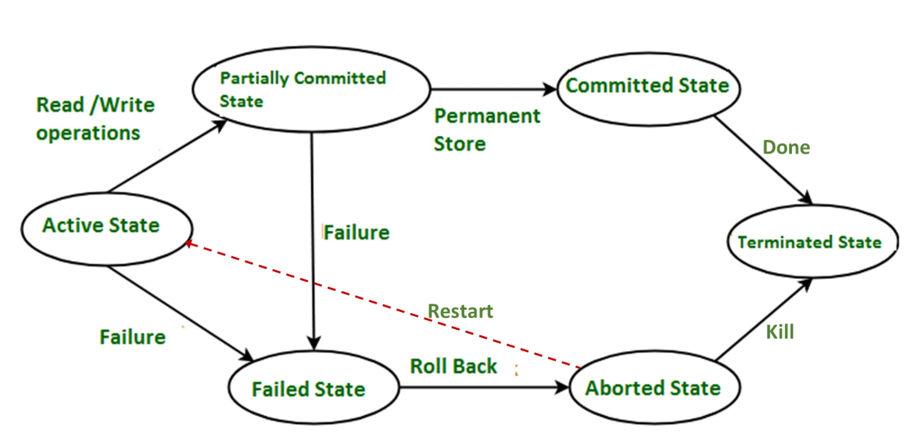

# Week 10 Notes - DBMS

*Prof. Partha Pratham Das, IIT KGP*

*Notes by Adarsh (23f2003570)*  

## [L10.1 Module 46: Transactions/1 (26:28)](https://youtu.be/MwdAkFhR_I8)

### Required Properties of Transaction

A database transaction must satisfy the **ACID** properties to ensure data integrity and consistency. These properties are:

1. **Atomicity**: Ensures that all operations within a transaction are completed successfully. If any operation fails, the entire transaction is rolled back, leaving the database in a consistent state. Partial Execution is not allowed
   1. Bank Transfer. If you debit $50 from Account A and Credit Account B, then both operations should happen OR NONE should happen

2. **Consistency**: Guarantees that a transaction brings the database from one valid state to another, maintaining all predefined rules (such as constraints, triggers, and cascades).
   1. The sum of balance of A & B should not change after the transaction.
   2. $A + B$ should be the same as $A + B$ after
   3. At start of transaction DB has to be in Consistent state, between the transaction it can be in inconsistent state. But at the end consistent again.
   4. Can be implicit or explicit
      1. Implicit like Sum of all savings - sum of all outstanding = Cash in Hand
      2. Explicit like Primary, Foreign Keys 

3. **Isolation**: Ensures that the operations of a transaction are isolated from those of other transactions. Even if multiple transactions are executed concurrently, each transaction must appear as if it is the only transaction being executed.
   1. You debit account A by 50, meanwhile another operation reads account A,B and adds them. This value will be short by 50
   2. Isolation can be ensured by running transactions serially - one after another.

4. **Durability**: Once a transaction is committed, its changes are permanent, even in the event of system failures. The database ensures that committed data is stored reliably.
   1. Once the transaction is complete, the account balances should be safely stored in the storage.

### ACID Reckoner

- A - Atomicity - All or Nothing Transaction
- C - Consistency - Guaranteed committed transaction state
- I - Isolation - Transactions are independent
- D - Durability - Committed Data is never lost

### Transactional States




In a DBMS, a transaction can be in one of several states during its lifecycle. These states represent the progression of a transaction from initiation to completion or failure. The main transaction states are:

1. **New (Active)**:  
   This is the initial state when a transaction is first created but has not yet started execution. It is waiting for the system to begin processing its operations.

2. **Active**:  
   Once the transaction begins execution, it enters the **Active** state. During this state, the transaction is executing its operations, such as reading and writing data. A transaction can stay in this state as long as it is still in progress and not yet finished.

3. **Partially Committed**:  
   A transaction enters this state after it has executed its final operation but before it has been fully committed to the database. This is a transitional state where the transaction has finished its work, but the system has not yet made the changes permanent.

4. **Committed**:  
   After a transaction has successfully completed and all changes have been written to the database, it enters the **Committed** state. At this point, the transaction’s changes are permanent and durable. The database ensures that all the operations performed by the transaction are safely stored and cannot be rolled back.

5. **Failed**:  
   If a transaction cannot complete successfully due to some error (e.g., a system crash or violation of constraints), it enters the **Failed** state. At this point, the transaction has not been committed, and it is eligible for rollback or recovery.

6. **Rolled Back (Aborted)**:  
   If a transaction in the **Failed** state cannot be recovered or fixed, it is **Rolled Back**. This means that all operations performed by the transaction are undone, and the database is restored to its state prior to the start of the transaction. Once rolled back, the transaction is effectively canceled.

### Concurrent Execution

**Concurrent Executions in an RDBMS** refer to the ability of multiple transactions to be executed at the same time, or interleaved, to improve system throughput and efficiency. In a database management system, this concurrency enables better resource utilization by allowing several users or applications to perform operations concurrently on the database.

However, concurrent execution introduces several challenges that need to be addressed to maintain data consistency, isolation, and integrity. Let's dive into the **concept of concurrency** and the **challenges** associated with it.

#### Benefits of Concurrent Executions:
1. **Improved Throughput**: Multiple transactions can be processed simultaneously, reducing wait time and improving the overall performance of the system.
2. **Better Resource Utilization**: By interleaving operations from different transactions, the system can make better use of CPU and I/O resources, especially in a multi-core or multi-processor environment.
3. **Reduced Latency**: Users or applications don't have to wait for one transaction to complete before starting another, making the system more responsive.

### Challenges in Concurrent Execution:
When multiple transactions run concurrently, several problems may arise due to the interleaving of operations, which can lead to inconsistencies or anomalies in the database. These challenges are mainly associated with the **isolation** property of ACID transactions.

##### 1. **Lost Update Problem**
   - **Description**: Two or more transactions update the same data simultaneously, but only the last update is recorded, resulting in the loss of earlier updates.
   - **Example**:  
     - Transaction 1 reads a value of `X = 100` and plans to update it to `X = 150`.
     - Transaction 2 reads `X = 100` and plans to update it to `X = 200`.
     - If both transactions are committed without proper synchronization, only one of the updates is reflected, losing the other's effect.

##### 2. **Temporary Inconsistent (Uncommitted) Data**
   - **Description**: A transaction reads data that has been modified by another transaction but has not yet been committed. If the second transaction fails or rolls back, the first transaction has read data that was never finalized, leading to inconsistencies.
   - **Example**:  
     - Transaction 1 reads data (say, `balance = 1000`).
     - Transaction 2 updates the data (changing `balance` to `1200`), but hasn’t committed yet.
     - Transaction 1 proceeds with the outdated value and performs an operation assuming `balance = 1000`, but later finds that `balance` was actually `1200` when Transaction 2 commits.

##### 3. **Dirty Read**
   - **Description**: A **dirty read** occurs when one transaction reads data that has been modified by another transaction but is yet to be committed. If the second transaction is rolled back, the data read by the first transaction becomes invalid.
   - **Example**:  
     - Transaction 1 reads an uncommitted update from Transaction 2. If Transaction 2 is rolled back, the data that Transaction 1 read becomes inconsistent with the actual state of the database.

##### 4. **Non-Repeatable Read**
   - **Description**: A **non-repeatable read** occurs when a transaction reads the same data multiple times and gets different values due to another transaction modifying the data in between the reads.
   - **Example**:  
     - Transaction 1 reads `X = 100` and performs some calculations.
     - Transaction 2 updates `X = 200`.
     - When Transaction 1 reads `X` again, it finds that `X = 200`, resulting in inconsistent results within the same transaction.

##### 5. **Phantom Read**
   - **Description**: A **phantom read** occurs when a transaction reads a set of data (such as rows that meet a certain condition), but another transaction inserts or deletes rows that affect the result of the query in between reads.
   - **Example**:  
     - Transaction 1 reads a set of records where `age > 30`.
     - Transaction 2 inserts a new record with `age = 35`.
     - When Transaction 1 reads the set of records again, the result has changed because of the newly inserted record, even though the transaction hasn't modified the individual rows.

#### Solutions to Concurrency Problems:

To address these challenges, modern DBMSs implement **locking mechanisms** and **isolation levels** to ensure proper handling of concurrent transactions.

1. **Locking**:
   - DBMSs use locks to control access to data, preventing conflicts between transactions.
   - Types of locks:
     - **Shared locks** (S-locks): Allow transactions to read data but not modify it.
     - **Exclusive locks** (X-locks): Prevent other transactions from reading or modifying data.
   - **Deadlock**: A situation where two or more transactions are blocked, waiting for each other to release locks. DBMSs use deadlock detection algorithms to resolve this.

2. **Isolation Levels** (SQL Standard):
   SQL provides different isolation levels that define the degree to which a transaction is isolated from others. These isolation levels balance performance with the need for consistency.

   - **Read Uncommitted**: Allows dirty reads, non-repeatable reads, and phantom reads. This level offers the highest concurrency but the lowest consistency.
   - **Read Committed**: Prevents dirty reads but allows non-repeatable reads and phantom reads.
   - **Repeatable Read**: Prevents dirty reads and non-repeatable reads, but phantom reads can still occur.
   - **Serializable**: The highest isolation level, preventing all concurrency anomalies (including phantom reads), but it can significantly impact performance due to the high locking granularity.

### Schedule


In the context of **concurrency control** in a **Database Management System (DBMS)**, a **schedule** is a sequence of operations (such as reads, writes, commits, and aborts) from multiple transactions that are executed in a way that may overlap in time. A schedule determines the **order** in which the operations of different transactions are executed. The primary goal of scheduling is to ensure that these concurrent transactions maintain the **ACID** properties, particularly **Atomicity**, **Consistency**, and **Isolation**.

#### Types of Schedules in DBMS:
Schedules are classified based on their adherence to certain properties like serializability and conflict-freeness. The most important types of schedules are:

##### 1. **Serial Schedule**:
   - A schedule is **serial** if the operations of each transaction are executed one after another, without any interleaving of operations from other transactions.
   - In a **serial schedule**, the transactions do not overlap. Each transaction is executed in its entirety before the next transaction starts.
   - **Example**:
     - Transaction T1: Read(X), Write(X)
     - Transaction T2: Read(Y), Write(Y)
     - Serial schedule would be:
       1. T1: Read(X), Write(X)
       2. T2: Read(Y), Write(Y)

   - A **serial schedule** is always **conflict-serializable** (i.e., it produces a result equivalent to executing the transactions one after another in some order), but it's not always efficient in terms of concurrency.

##### 2. **Non-Serial Schedule**:
   - A schedule is **non-serial** if the operations from different transactions are interleaved.
   - For example, Transaction 1 and Transaction 2 might read and write to the same data items in an interleaved manner.
   - **Example**:
     - Transaction T1: Read(X), Write(X)
     - Transaction T2: Read(Y), Write(Y)
     - Non-serial schedule could look like:
       1. T1: Read(X)
       2. T2: Read(Y)
       3. T1: Write(X)
       4. T2: Write(Y)
   
   - Non-serial schedules need to be analyzed for potential conflicts or anomalies.

#### Key Concepts in Scheduling:

##### 1. **Conflicting Operations**:
   - Two operations **conflict** if they satisfy all the following conditions:
     1. They belong to different transactions.
     2. They operate on the **same data item**.
     3. At least one of the operations is a **write** operation.
   
   - **Example**:  
     - `T1: Write(X)` and `T2: Read(X)` are **conflicting operations** because they operate on the same data item `X`, and one of them is a write.

   - In a **conflicting schedule**, the order of conflicting operations must be managed to ensure serializability.

##### 2. **Recoverable Schedule**:
   - A **recoverable schedule** ensures that if a transaction **T1** reads data written by transaction **T2**, and if **T2** is rolled back (aborted), **T1** must also be rolled back. This prevents the **cascading abort** problem, where an aborted transaction causes other transactions to abort due to dependency on its uncommitted data.
   
   - **Example**:  
     - T1 reads data written by T2, but if T2 is aborted, T1 must also be aborted to maintain consistency.

##### 3. **Cascadeless Schedule**:
   - A **cascadeless schedule** avoids **cascading rollbacks** by ensuring that transactions do not read uncommitted data from other transactions. This means that a transaction only reads data that has been committed.
   - **Example**:  
     - T1 reads data written by T2 only if T2 has already committed. If T2 is rolled back, T1 is not affected.

##### 4. **Strict Schedule**:
   - A **strict schedule** is one in which no transaction can read or write data until all previous transactions that wrote to that data item have committed. In other words, transactions do not release locks on data items until they are committed.
   - Strict schedules ensure **recoverability** and **cascadelessness** because uncommitted data is never read, and no transaction can overwrite another's uncommitted data.

#### **Serializability** in Schedules:
The primary goal of transaction scheduling in an RDBMS is to ensure that the result of executing concurrent transactions is equivalent to executing them serially. This ensures the **isolation** property of ACID.

- **Serializable Schedule**:  
  A schedule is **serializable** if the outcome of executing it is the same as executing the transactions serially (in some order). Serializable schedules are considered correct because they produce the same results as some serial execution of the same transactions.
  
  - **Conflict-Serializable**: A schedule is conflict-serializable if its operations can be rearranged (by swapping non-conflicting operations) to produce a serial schedule without changing the final result.
  - **View-Serializable**: A schedule is view-serializable if the result of the schedule is the same as a serial execution in terms of **read-from** relationships, final values of data items, and the order of commits.

- **Conflict Graph**:  
  To determine if a schedule is conflict-serializable, a **precedence graph** (or **conflict graph**) is often used. Each transaction is a node, and an edge is drawn between two transactions if one transaction's operation conflicts with another's.

   - If the precedence graph contains **cycles**, the schedule is **not serializable**.
   - If the precedence graph is **acyclic**, the schedule is **conflict-serializable**.

#### Example of Conflict Serializability:

Consider the following schedule involving two transactions, T1 and T2:

```
1. T1: Read(A)
2. T2: Read(B)
3. T1: Write(A)
4. T2: Write(B)
5. T1: Commit
6. T2: Commit
```

- In this case, the schedule can be reordered into a serial schedule (T1 followed by T2, or vice versa), and no conflicts occur between the operations of T1 and T2. Thus, the schedule is conflict-serializable.


### Properties of a Concurrent Serial Schedule

1. A schedule for a list of concurrent transactions must contain all instructions of those transactions.
2. Must preserve the order in which instructions appear in each individual transaction
   

A schedule can be interleaved as whole transactions. You should not reorder in operations in individual transactions

A transaction that completes will have `Commit` as the last instruction

A transaction that fails will have `Abort` as last instruction

In the context of **Database Management Systems (DBMS)**, a **serial schedule** is a transaction schedule in which the operations of each transaction are executed one after another, without any interleaving of operations from other transactions. In other words, in a serial schedule, transactions are executed in their entirety before the next transaction begins. This ensures that no two transactions are executed concurrently. 

While serial schedules guarantee the correctness of transaction execution, they are often inefficient in terms of resource utilization because they do not take advantage of concurrent execution.

### **Properties of a Serial Schedule in DBMS**

The main properties of a **serial schedule** are as follows:

#### 1. **No Interleaving of Operations**
   - In a **serial schedule**, the operations from one transaction are executed **fully** before any operations from the next transaction begin. There is no **interleaving** of operations between transactions.
   - This means that all operations (such as **read**, **write**, **commit**, **abort**) of one transaction are completed before the next transaction starts.

   **Example of a serial schedule**:
   ```
   Transaction T1:
   1. Read(A)
   2. Write(A)
   3. Commit

   Transaction T2:
   1. Read(B)
   2. Write(B)
   3. Commit
   ```

   In this case, all the operations of **T1** are executed before the operations of **T2** begin. There is no overlap between the transactions.

#### 2. **Guaranteed Isolation**
   - Since there is no interleaving of operations in a serial schedule, **isolation** between transactions is guaranteed. 
   - Each transaction operates in a **completely isolated environment**, meaning its operations do not interfere with or overlap with other transactions. This prevents problems like **dirty reads**, **non-repeatable reads**, or **phantom reads** that can arise in concurrent schedules.
   
   **Example**:
   - In the above schedule, **T1**'s operations are isolated from **T2**'s operations because they are executed in sequence without any interleaving. Hence, **T1**'s changes to the data are not visible to **T2** until **T1** has committed.

#### 3. **Consistency**
   - A serial schedule guarantees **consistency** because the transactions are executed one by one, and each transaction is guaranteed to be in a consistent state before the next one starts.
   - There is no possibility of conflicting transactions in a serial schedule, so the database remains in a consistent state at each step.

   **Example**:
   - Since **T1**'s changes are completed before **T2** begins, there is no chance of inconsistent reads or writes between **T1** and **T2**. The database remains in a consistent state throughout the schedule.

#### 4. **Atomicity**
   - Each transaction in a serial schedule is atomic (i.e., it is executed in its entirety). If a transaction starts, it will either complete successfully (commit) or it will fail (abort), and the database will be rolled back to its previous consistent state.
   - Since there is no interleaving between transactions, each transaction in a serial schedule is guaranteed to be executed completely and independently of others.

#### 5. **No Conflicts Between Transactions**
   - Since the operations of one transaction are fully executed before another begins, there are no conflicts between transactions in a serial schedule.
   - **Conflict-free**: Transactions in a serial schedule do not read or write to the same data items concurrently, so there is no need to worry about **conflicting operations** (e.g., simultaneous reads and writes to the same data item).

   **Example**:
   - If **T1** writes to data item `A`, and **T2** writes to data item `B`, there is no conflict because the operations are executed in sequence, and each transaction operates on separate data.

#### 6. **Serializability Guarantee**
   - **Serial schedules** are trivially **serializable** because they are, by definition, a form of serial execution of transactions. 
   - **Serializable schedules** are those whose outcome is the same as executing the transactions in some serial order. A serial schedule is the most straightforward form of a serializable schedule, as the transactions are executed sequentially in one of the valid orders.
   - Any serial schedule will always produce the same results as executing the transactions serially, making it conflict-serializable by default.

   **Example**:
   - In the previous example, if we had a serial schedule of **T1 → T2**, the outcome would be the same as if **T2 → T1** were executed serially, assuming no conflicts occur.

#### **Advantages of Serial Schedules**

1. **Simplicity and Predictability**:
   - Serial schedules are easy to understand and reason about because each transaction is executed independently of others. There are no concurrency issues such as deadlocks or conflicts to manage.
   
2. **Guaranteed Consistency**:
   - Since there is no interleaving of operations, the consistency of the database is guaranteed, and there are no risks of anomalies like dirty reads or lost updates.

3. **Isolation**:
   - The isolation property is automatically satisfied because transactions are executed one after another, with no overlapping or interference.

#### **Disadvantages of Serial Schedules**

1. **Inefficient Resource Utilization**:
   - Serial schedules do not take advantage of **concurrent execution**. Even when multiple transactions are independent of each other, they are executed sequentially, which can lead to inefficient use of system resources, particularly in a multi-user environment with multiple independent transactions.
   
2. **Reduced Throughput**:
   - Because transactions are executed one at a time, system throughput is limited. It would be more efficient to allow transactions to run concurrently, as long as the system can ensure isolation and serializability.

3. **Not Scalable for Large Systems**:
   - In large-scale systems with many transactions, serial schedules are not scalable because they do not exploit concurrency. As the number of transactions increases, the time required to process them serially also increases, leading to performance bottlenecks.


### Equivalence in Schedule

An **equivalent schedule** refers to two different transaction schedules that produce the **same final result** when executed, even if the sequence of operations differs. Essentially, two schedules are **equivalent** if they yield the same outcome in terms of the database state, including the same values for data items, after all the transactions have been completed.

The concept of equivalent schedules is crucial for ensuring **serializability**, which ensures that even if transactions are interleaved in a non-serial manner, the result will be the same as if the transactions were executed serially, preserving the **ACID properties** (Atomicity, Consistency, Isolation, Durability).

#### **Types of Equivalent Schedules**

There are two common types of equivalent schedules:

1. **Conflict-Equivalent Schedule**:
   - Two schedules are **conflict-equivalent** if you can transform one schedule into the other by swapping non-conflicting operations, without changing the final outcome.
   - Two operations conflict if:
     1. They belong to different transactions.
     2. They operate on the same data item.
     3. At least one of them is a **write** operation.
   - If you can rearrange the operations of a schedule without changing the final result (using swaps of non-conflicting operations), then the schedules are conflict-equivalent.
   - **Conflict-equivalence** ensures that the schedules result in the same final state, even though the order of operations might be different.

   **Example**:
   Consider the following schedules:
   - **Schedule 1**:
     ```
     T1: Read(A)
     T2: Write(A)
     T1: Write(A)
     T2: Commit
     ```
   - **Schedule 2**:
     ```
     T2: Write(A)
     T1: Read(A)
     T1: Write(A)
     T2: Commit
     ```

   These two schedules are conflict-equivalent because we can swap the first two operations of Schedule 1 without changing the final result.

2. **View-Equivalent Schedule**:
   - Two schedules are **view-equivalent** if they produce the same **final database state**, and the **read-from** relationships between the operations of the schedules are identical.
   - The **read-from** relationship indicates which transaction reads the value written by which other transaction.
   - View-equivalence is a more general concept than conflict-equivalence, as it allows more freedom in the ordering of operations while still ensuring that the schedules are equivalent.

   For two schedules to be view-equivalent, the following conditions must hold:
   1. **Initial Values**: The initial values of the data items must be the same for both schedules.
   2. **Read-from Relationships**: If a transaction reads a value written by another transaction, the read must happen from the same transaction in both schedules.
   3. **Final State**: The final state of the database, including all data item values, must be identical in both schedules.

   **Example**:
   - **Schedule 1**:
     ```
     T1: Write(A) → 10
     T2: Read(A) ← 10
     T3: Write(A) → 20
     T1: Commit
     T2: Commit
     T3: Commit
     ```
   - **Schedule 2**:
     ```
     T3: Write(A) → 20
     T1: Write(A) → 10
     T2: Read(A) ← 10
     T1: Commit
     T2: Commit
     T3: Commit
     ```

   In this case, both schedules are **view-equivalent** because the **read-from** relationship (T2 reading from T1) and the final database state are identical in both schedules.

#### **Conditions for Equivalent Schedules**

For two schedules to be equivalent, certain conditions must be met depending on whether the equivalence is **conflict-based** or **view-based**:

##### 1. **Conflict-Equivalence Conditions**:
   - Two schedules are conflict-equivalent if:
     1. They involve the same set of transactions.
     2. They access the same data items.
     3. The conflict operations are in the same order (i.e., the **order of conflicting operations** is the same).
   
   Essentially, the schedules must maintain the same **conflict order** for operations. Non-conflicting operations can be swapped freely without affecting the outcome.

##### 2. **View-Equivalence Conditions**:
   - Two schedules are view-equivalent if:
     1. **Initial Values**: The initial values of the data items in both schedules are the same.
     2. **Read-from Relationships**: The same data items are read from the same transactions in both schedules.
     3. **Final State**: The final database state must be identical in both schedules (i.e., after all transactions commit).

   **View equivalence** is more flexible than conflict equivalence but is also more complex to track and ensure.

#### **Serializability and Equivalent Schedules**

A schedule is **serializable** if there exists a **serial schedule** (i.e., one where transactions do not overlap) that is **equivalent** to the given schedule. Serializability is a key concept for ensuring the **ACID** properties of transactions, particularly **consistency** and **isolation**.

- **Conflict-Serializable Schedule**: A schedule is **conflict-serializable** if its operations can be rearranged (by swapping non-conflicting operations) to form a serial schedule.
- **View-Serializable Schedule**: A schedule is **view-serializable** if it produces the same results as a serial schedule when considering the **read-from relationships**.

#### **Importance of Equivalent Schedules**

1. **Ensuring Correctness in Concurrent Execution**:
   - Equivalent schedules are important in concurrency control to ensure that interleaved transactions do not result in an inconsistent database. Conflict-serializability and view-serializability ensure that even with concurrent execution, the final database state is the same as if the transactions were executed in some serial order.
   
2. **Maximizing Throughput**:
   - Understanding equivalence allows the DBMS to **reorder operations** and **optimize** transaction schedules without violating the integrity of the database. This can improve throughput while still maintaining correctness.

3. **Concurrency Control**:
   - DBMSs use techniques like **locking**, **timestamp ordering**, and **optimistic concurrency control** to ensure that schedules remain serializable. Recognizing equivalent schedules allows the DBMS to efficiently handle concurrent transactions while guaranteeing that the final result is consistent.

#### **Example of Conflict-Equivalent Schedules**

Consider two schedules with two transactions, **T1** and **T2**:

- **Schedule 1**:
  ```
  T1: Read(A)
  T2: Write(A)
  T1: Write(A)
  T2: Commit
  T1: Commit
  ```

- **Schedule 2**:
  ```
  T2: Write(A)
  T1: Read(A)
  T1: Write(A)
  T2: Commit
  T1: Commit
  ```

These two schedules are **conflict-equivalent** because:
- Both schedules involve the same **conflicting operations** (T1 reading and writing `A`, and T2 writing `A`).
- The **conflicting operations** are in the same order in both schedules (T2's write comes before T1's write).
- The schedules are equivalent in terms of the **final state** of the database.


---
**Notes**  

1. A `Schedule` is a unit of program execution that accesses and, possibly updates various data items.

2. Transaction as a task execution in a DB
3. States in a transaction
4. Concurrency Properties/requirements in a DB
5. Concurrent Schedules may/may-not be equivalent to a serialized schedule.


## [L10.2 (Module 47): Transactions/2: Serializability (30:28)](https://youtu.be/MNXTL69Ud9A)


### Serializable

We assume that every transaction will enter from a consistent state of the DB and will terminate leaving the DB in a consistent state

- A serial execution of a set of transactions will also leave the database in a consistent state
- `Serial Schedule` is a list of transactions grouped on a resource. Ex: All operations on Table A one after another, then all operations on table B one after another.
  - Every `Concurrent Schedule` is not Serializable, but there are some that can be Serializable.
- `Transactions` is a list of Instructions

- A `Concurrent Schedule` is serializable only if its `equivalent` to a serial schedule
  - All concurrent schedules are not serializable
- Two schedules are `equivalent` if they keep the database in the same state after execution

- A schedule consists of transactions.

- 2 schedules A & B might be equivalent even though they are not a serial schedule
- A schedule consisting of 2 transactions T1 and T2 is called `serializable` if it keeps the DB in the same consistent state as a `Serial Schedule` would do.


### Conflicting Instructions

Two instructions $I_i$ and $I_j$ are accessing resource `O`

|Operation $I_i$|Operation $I_j$|Conflict?|
|-|-|-|
|Read|Read|No|
|Read|Write|Yes|
|Write|Read|Yes|
|Write|Write|Yes|

if $I_i$ and $I_j$ are consecutive in a schedule and they don't conflict then their results would be same if they were interchanged


### Conflict Serializable

**Conflict Serializable** ensures the correctness of transactions in a multi-transaction environment, where multiple transactions might be executed concurrently. It is a stricter form of **serializability**, which is the highest isolation level for database transactions.

#### What is Conflict Serializability?

Conflict serializability refers to a situation where the schedule (or order of execution) of a set of transactions can be rearranged (by swapping non-conflicting operations) into a serial schedule without affecting the final result.

In simpler terms, a schedule of transactions is **conflict-serializable** if it can be transformed into a serial schedule (a schedule where transactions are executed one after the other, without any interleaving) by swapping operations that do not conflict with each other.

#### Conflict Between Operations

Two operations are said to **conflict** if:
- They belong to different transactions.
- They access the same data item.
- At least one of the operations is a **write**.

For example:
- A **read** operation on a data item by one transaction and a **write** operation on the same data item by another transaction do not conflict.
- Two **write** operations on the same data item by different transactions conflict.
- A **write** operation on a data item by one transaction and a **read** operation on the same data item by another transaction conflict.

#### Conflict Serializable vs. Serializable

- **Serializable**: A schedule is serializable if its result is equivalent to the result of some serial execution of the transactions. In a serial schedule, transactions are executed one by one, without overlapping.
- **Conflict Serializable**: A schedule is conflict-serializable if it can be transformed into a serial schedule by swapping non-conflicting operations. This is a more specific version of serializability, where only conflicting operations are considered when determining whether the schedule can be transformed into a serial schedule.
- Are all `Serializable Schedules` Conflict Serializable? **NO!**
- Are there `Serializable Schedules` that are not `Conflict Serializable`? **YES**
- If some schedule is `Conflict Serializable` then it's necessarily `Serializable`
  - The reverse does not hold true

Consider 3 Transactions T1 T2 T3 with the following schedule (R = read, W = write, 1,2,3 are transaction numbers)
1. $W_1(A)$, $W_2(A)$, $W_2(B)$, $W_1(B)$,$W_3(B)$
2. Cannot swap $W_1(A)$, $W_2(A)$ as working on same object A
3. Cannot swap $W_2(A)$, $W_2(B)$ as part of transaction 2. Cannot change order of instruction within a transaction
4. Cannot Swap $W_2(B)$, $W_1(B)$ - Same B
5. Cannot Swap $W_1(B)$,$W_3(B)$ - Same B
6. No swap is possible!
7. So this schedule is not `Conflict Equivalent` to anything
8. This is not a `Serial Schedule`.
   1. $W_1(A)$, $W_1(B)$, $W_2(A)$, $W_2(B)$, $W_3(B)$ is in **Serial Order**


#### Conflict Graph (Precedence Graph)

To determine whether a schedule is conflict-serializable, we can use a **conflict graph** (or **precedence graph**):
- Each transaction is represented as a **node in the graph**.
- An **edge** is drawn from one transaction to another if one transaction's **operation conflicts** with the other.
- If the graph has a **cycle**, the schedule is **not conflict-serializable** because a cycle indicates a dependency between transactions that cannot be resolved without changing the order of operations.
- If the graph is **acyclic**, the schedule is conflict-serializable because the transactions can be rearranged to avoid conflicts.

#### Example of Conflict Serializable Schedule

Consider two transactions, T1 and T2:

1. T1: **Read(A)**
2. T2: **Write(A)**
3. T1: **Write(A)**
4. T2: **Read(A)**

In this case, T1 and T2 have conflicting operations:
- The **Write(A)** by T2 and the **Read(A)** by T1 conflict because T2 is writing to A, and T1 is reading it.
- The **Write(A)** by T1 and the **Read(A)** by T2 also conflict.

However, if we reorder the operations by swapping the non-conflicting ones, like so:
- **Read(A)** by T1
- **Write(A)** by T2
- **Write(A)** by T1
- **Read(A)** by T2

This would result in a serializable schedule. Thus, this schedule is **conflict-serializable**.

#### Why is Conflict Serializable Important?

Conflict serializability is important because it ensures that a system can handle concurrent transactions in a way that the final state of the database will be the same as if the transactions were executed serially. This eliminates anomalies like **lost updates**, **temporary inconsistency**, and **uncommitted data** from concurrent transactions, which could otherwise lead to errors or incorrect results.

Conflict serializability is a way of ensuring transaction correctness in a multi-transaction environment by focusing on conflicts between operations and ensuring that schedules can be rearranged to follow a serial order.


### Topological Sort

**Topological sorting** is an algorithm used to order the vertices (nodes) of a **directed acyclic graph (DAG)** in a linear sequence, such that for every directed edge from vertex $u$ to vertex $v$, vertex $u$ appears before vertex $v$ in the ordering. In other words, it is a way to order tasks that have dependencies, ensuring that a task is completed before another task that depends on it.

#### Key Properties of Topological Sorting:
1. **Directed**: The graph must be directed, meaning the edges have a direction (from one vertex to another).
2. **Acyclic**: The graph must be acyclic, meaning there should be no cycles (i.e., no paths where a vertex is revisited after following the edges).
3. **Linear Order**: The result of the topological sort is a linear order of vertices, which satisfies all dependency constraints.

#### When is Topological Sorting used?
Topological sorting is commonly used in scenarios where tasks depend on each other. Some common applications include:
- Task scheduling (e.g., scheduling jobs in a project).
- Compilation order in programming languages.
- Dependency resolution in package management systems (e.g., installing software packages).

#### Example of Topological Sorting

Let’s consider an example where you have the following tasks and their dependencies:

- Task **A** must be done before **B**.
- Task **A** must be done before **C**.
- Task **B** must be done before **D**.
- Task **C** must be done before **D**.

We can represent these tasks and their dependencies as a directed graph:

```
A → B → D
 ↓
 C → D
```

This is a **Directed Acyclic Graph (DAG)** because it doesn’t contain any cycles (you can't go from any node back to itself following the edges).

#### Step-by-step Topological Sort:

1. **Identify vertices with no incoming edges**: These are tasks that have no dependencies, i.e., tasks that can be done first. In this case, **A** has no dependencies, so it is the first task.

2. **Remove the vertex and its outgoing edges**: After task **A** is completed, remove it from the graph along with the edges from **A** to **B** and **A** to **C**.

    New graph:
    ```
    B → D
    ↓
    C → D
    ```

3. **Repeat the process**: Now, the vertices **B** and **C** have no incoming edges. Either **B** or **C** can be chosen to execute next, but let's pick **B**.

4. **Remove the vertex and its outgoing edges**: After completing **B**, remove it from the graph along with the edge from **B** to **D**.

    New graph:
    ```
    C → D
    ```

5. **Continue the process**: Now, **C** is the next task with no incoming edges.

6. **Remove **C** and its outgoing edge**: After completing **C**, remove it from the graph along with the edge from **C** to **D**.

    New graph:
    ```
    D
    ```

7. **Complete the final task**: Finally, task **D** has no outgoing edges, so it is the last task to be executed.

#### Final Topological Order:
The topological order of the tasks is:
**A → B → C → D**

This means that the tasks should be executed in the following order to satisfy all dependencies:
1. **A** (no dependencies).
2. **B** (depends on **A**).
3. **C** (depends on **A**).
4. **D** (depends on both **B** and **C**).

#### Properties and Considerations:

1. **Uniqueness**: The topological order is not necessarily unique. If there are tasks that are independent of each other, they can appear in different orders. For example, in the case where **B** and **C** had no dependencies on each other, we could have either **A → B → C → D** or **A → C → B → D**.
   
2. **Cycle Detection**: If a graph has a cycle, topological sorting is not possible. For example, if task **A** depends on **B** and **B** depends on **A**, this forms a cycle, and there is no valid way to order the tasks.

#### Algorithms for Topological Sorting:
There are different algorithms to perform topological sorting:
1. **Kahn's Algorithm**: 
   - Identify vertices with no incoming edges and add them to a queue.
   - Repeatedly remove a vertex from the queue, add it to the result, and decrease the in-degree (number of incoming edges) of its neighbors.
   - If the in-degree of a neighbor becomes 0, add it to the queue.
   - time complexity of $O(V + E)$, where:
        - $V$ is the number of vertices (nodes) in the graph.
        - E is the number of edges in the graph.

1. **Depth-First Search (DFS) Approach**: 
   - Perform a DFS traversal on the graph.
   - Mark nodes as visited. When a node is fully explored (i.e., all its descendants are visited), add it to the topological order.

In both cases, if there is a cycle, the algorithm will detect it and signal that topological sorting is not possible.

### Testing for Conflict Serializability
