# Week 12 Notes - DBMS

*Prof. Partha Pratham Das, IIT KGP*

*Notes by Adarsh (23f2003570)*  

## [L12.1 Module 56: Query Processing and Optimization/1: Processing (32:43)](https://youtu.be/VQrqJafvnzY)

### Basic Steps in Query Processing
1. Parsing and translation
   1. translate the query into its internal form. This is then translated into relational algebra
   2. Parser checks syntax, verifies relations
2. Optimization
3. Evaluation
   1. The query-execution engine takes a query-evaluation plan, executes that plan, and returns the answers to the query


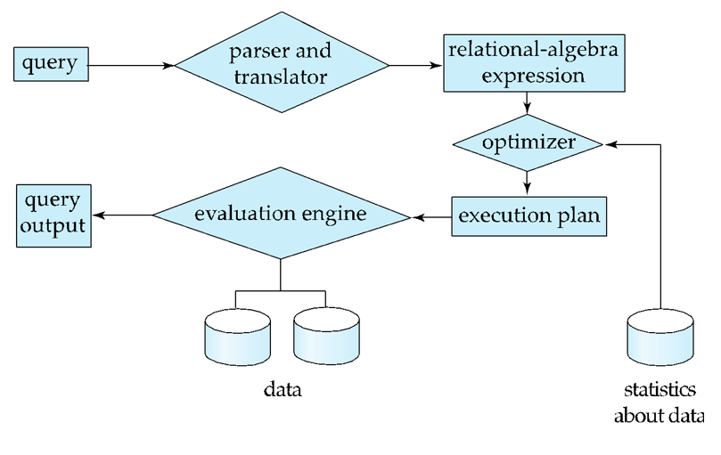


### Query  Optimization
Consider the query

```sql
select salary
from instructor
where salary < 75000;
```

which can be translated into either of the following relational-algebra expressions:

- $\sigma_{salary} < 75000 (\Pi \ salary \ (instructor ))$
- $\Pi \ salary \ (\sigma_{salary} < 75000(instructor))$
- Each relational algebra operation can be evaluated using one of several different algorithms
    - Correspondingly, a relational-algebra expression can be evaluated in many ways
- Annotated expression specifying detailed evaluation strategy is called an **evaluation-plan**.
    - For example, can use an index on salary to find instructors with salary $< 75000$,
    - or can perform complete relation scan and discard instructors with salary $\ge 75000$
- Query Optimization: Amongst all equivalent evaluation plans choose the one with lowest cost
  - Cost is estimated using statistical information from the database catalog. For example, number of tuples in each relation, size of tuples, etc.
- In this module we study
    - How to measure query costs
    - Algorithms for evaluating relational algebra operations
    - How to combine algorithms for individual operations in order to evaluate a complete expression
### Measures of Query Cost
- Cost is generally measured as total elapsed time for answering query
- Many factors contribute to time cost
        - disk accesses, CPU, or even network communication
- Typically disk access is the predominant cost, and is also relatively easy to estimate
- Measured by taking into account
    - Number of seeks * average-seek-cost
    - Number of blocks read * average-block-read-cost
    - Number of blocks written * average-block-write-cost.
      - Cost to write a block is greater than cost to read a block
        - data is read back after being written to ensure that the write was successful
- For simplicity we just use the number of block transfers from disk and the number of seeks as the cost measures
    - $t_T$ : time to transfer one block
    - $t_S$ : time for one seek
    - Cost for $b$ block transfers plus $S$ seeks
    
    $$
    \displaystyle \large b \times t_T + S \times t_S
    $$

- We ignore CPU costs for simplicity
    - Real systems do take CPU cost into account
- We do not include cost to writing output to disk in our cost formula
- Several algorithms can reduce disk IO by using extra buffer space
    - Amount of real memory available to buffer depends on other concurrent queries and OS processes, known only during execution
            - We often use worst case estimates, assuming only the minimum amount of memory needed for the operation is available
- Required data may be buffer resident already, avoiding disk I/O
    - But hard to take into account for cost estimation

### Selection Times

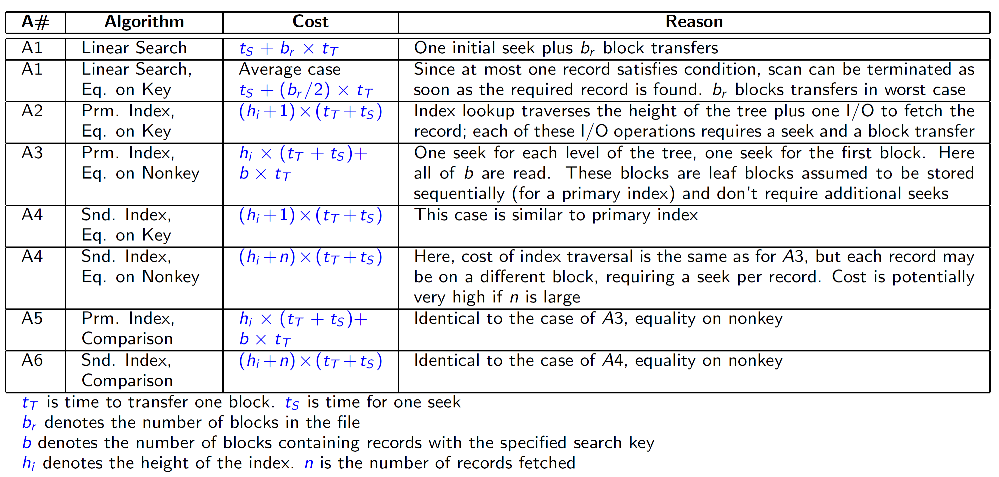


### Conjunction
- Conjunction: $\large \sigma_{\theta_1 \land \theta_2 \land ... \land \theta_n}(r)$
- A7 (conjunctive selection using one index)
    - Select a combination of $\theta_i$ and algorithms A1 through A6 that results in the least cost for $\sigma_{\theta_i}(r)$
    - Test other conditions on tuple after fetching it into memory buffer
- A8 (conjunctive selection using composite index)
    - Use appropriate composite (multiple-key) index if available
- A9 (conjunctive selection by intersection of identifiers)
    - Requires indices with record pointers
    - Use corresponding index for each condition, and take intersection of all the obtained sets of record pointers
    - Then fetch records from file
    - If some conditions do not have appropriate indices, apply test in memory

### Disjunction
- Disjunction: $\large \sigma_{\theta_1 \lor \theta_2 \lor ... \lor \theta_n}(r)$
- A10 (disjunctive selection by union of identifiers)
    - Applicable if all conditions have available indices
        - Otherwise use linear scan
    - Use corresponding index for each condition, and take union of all the obtained sets of record pointers
        - Then fetch records from file
- Negation: $\large \sigma_{\neg \theta}(r)$
    - Use linear scan on file
    - If very few records satisfy : $\neg \theta$, and an index is applicable to $\theta$
        - Find satisfying records using index and fetch from file

### Sorting
- We may **build an index on the relation**, and then use the index to read the relation in sorted order
    - May lead to one disk block access for each tuple
- For relations that fit in memory, techniques like **quicksort** can be used
- For relations that do not fit in memory, **external sort-merge** is a good choice

### External Sort-Merge: Example

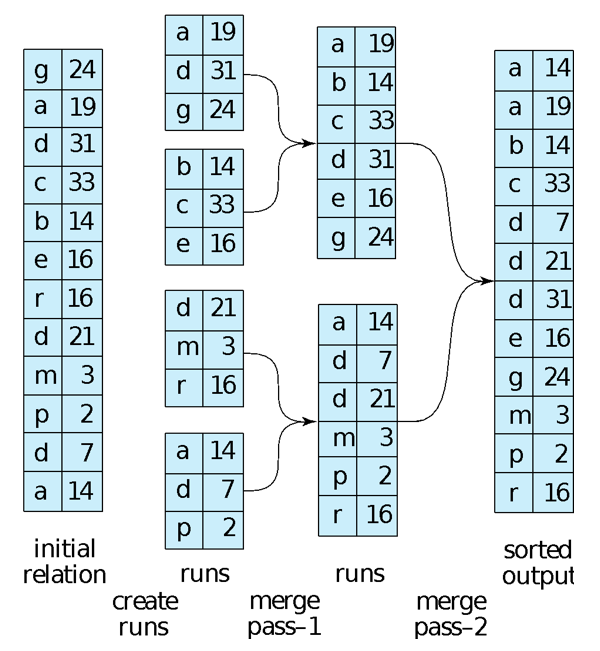


### External Sort-Merge: Algorithm
#### Create sorted runs

Let M denote the number of blocks in the main-memory buffer available for sorting. First, a number of sorted runs are created; each run is sorted, but contains only some of the records of the relation.
```
i = 0;
repeat
    read M blocks of the relation, or the rest of the relation, whichever is smaller;
    sort the in-memory part of the relation;
    write the sorted data to run file Ri;
    i = i + 1;
until the end of the relation
```
#### Merge the runs (N-way merge)

Now, the runs are merged. For the total number of runs, N < M, so that we can allocate one block to each run and have space left to hold one block of output. The merge stage operates as follows:

```
read one block of each of the N files Ri into a buffer block in memory;
repeat
    choose the first tuple (in sort order) among all buffer blocks;
    write the tuple to the output, and delete it from the buffer block;
    if the buffer block of any run Ri is empty and not end-of-file(Ri)
    then read the next block of Ri into the buffer block;
until all input buffer blocks are empty
```

#### Finally
If $N \ge M$, several merge passes are required
- In each pass, contiguous groups of $M-1$ runs are merged.
- A pass reduces the number of runs by a factor of $M-1$, and creates runs longer by the same factor
  - For M=11 and 90 runs, one pass reduces the number of runs to 9, each 10 times the size of the initial runs
- Repeated passes are performed till all runs have been merged into one

### Join Operation
- Several different algorithms to implement joins
    - Nested-loop join
    - Block nested-loop join
    - Indexed nested-loop join
    - Merge-join
    - Hash-join
- Choice based on cost estimate
- Examples use the following information
    - Number of records of student: $n_{students} = 5,000$
    - Number of records of takes: $n_{takes} = 10,000$
    - Number of blocks of student: $b_{students} = 100$
    - Number of blocks of takes: $b_{takes} = 400$

### Nested-Loop Join
- To compute the theta join $\large r \Join_\theta s$
    - **for each** tuple $t_r$ **in** $r$ **do begin**
      - **for each** tuple $t_s$ in s **do begin**
            - test pair (tr ; ts ) to see if they satisfy the join condition $\theta$
            - if they do, add $t_r \cdot ts$ to the result.
        - **end**
    - **end**
- r is called the **outer relation** and s the **inner relation** of the join
- Requires no indices and can be used with any kind of join condition
- Expensive since it examines every pair of tuples in the two relations

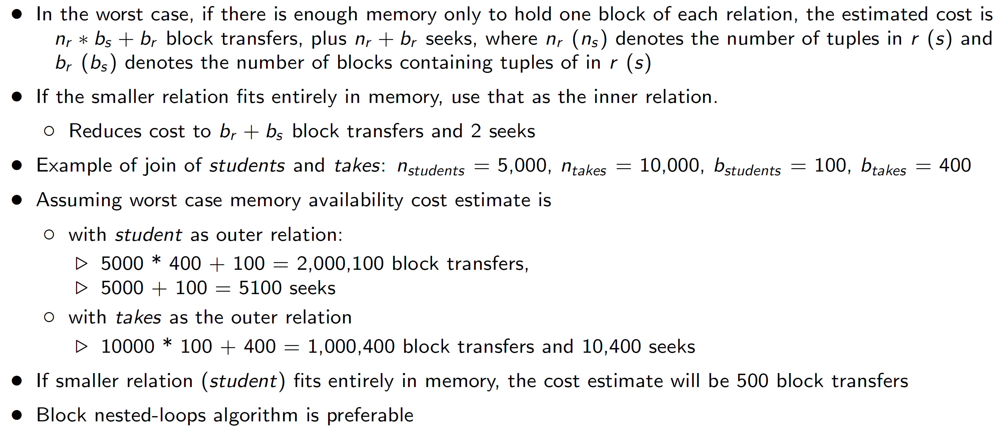

#### Student as outer
  - Block Transfers = $[n_{student} \times b_{takes}] + b_{student}$
  - Seeks = $n_{student} + b_{student}$
#### Takes as outer
  - Block Transfers = $[n_{takes} \times b_{students}] + b_{takes}$
  - Seeks = $n_{takes} + b_{takes}$

**Moral of story: Use the smaller relation in the inner**  

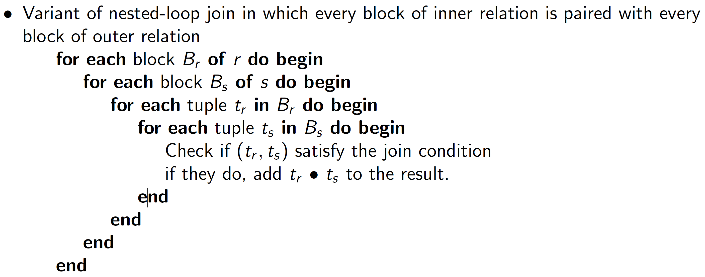  

- Worst case estimate
    - $[b_r \times b_s] + b_r$ block transfers
    - $2 \times b_r$ seeks
    - Each block in the inner relation s is read once for each block in the outer relation
- Best case
  - $b_r + b_s$ block transfers
  - 2 seeks
- Improvements to nested loop and block nested loop algorithms:
    - In block nested-loop, use $M - 2$ disk blocks as blocking unit for outer relations, where M = memory size in blocks; use remaining two blocks to buffer inner relation and output
        - Cost = $\lceil \dfrac{b_r}{(M - 2)} \rceil \times b_s + b_r$ block transfers
        - $2 \times \lceil \dfrac{b_r}{(M - 2)} \rceil$ seeks
        - the performance betters with a factor of $M - 2$
- If equi-join attribute forms a key or inner relation, stop inner loop on fist match
- Scan inner loop forward and backward alternately, to make use of the blocks remaining in buffer (with LRU replacement)
- Use index on inner relation, if available
- Index lookups can replace file scans if
    - join is an equi-join or natural join and
    - an index is available on the inner relation's join attribute
        - Can construct an index just to compute a join.
- For each tuple $t_r$ in the outer relation $r$, use the index to look up tuples in $s$ that satisfy the join condition with tuple $t_r$.
- Worst case: buffer has space for only one page of $r$, and, for each tuple in $r$, we perform an index lookup on $s$.
- Cost of the join
  - $b_r \times (t_T + t_S ) + [n_r \times c]$
        - Where $c$ is the cost of traversing index and fetching all matching $s$ tuples for one tuple or $r$
        - $c$ can be estimated as cost of a single selection on $s$ using the join condition.
- If indices are available on join attributes of both $r$ and $s$, use the relation with fewer tuples as the outer relation.

### Example of Nested-Loop Join Costs
- Compute **student** on **takes**, with student as the outer relation.
- Let **takes** have a primary $B^+$-tree index on the attribute ID, which contains 20 entries in each index node.
- Since takes has 10,000 tuples, the height of the tree is 4, and one more access is needed to find the actual data
  - $\log_{20}{10000} = 3.07 \approx 4$
- **student** has 5000 tuples
- Cost of block nested loops join
    - $n_{takes} = 10^4$, $n_{students} = 5 \times 10^3$
    - 400*100 + 100 = 40,100 block transfers
    - 2 * 100 = 200 seeks
        - assuming worst case memory
        - may be significantly less with more memory
- Cost of indexed nested loops join
  - 100 + 5000 * 5 = 25,100 block transfers and seeks.
  - CPU cost likely to be less than that for block nested loops join

### Other Operations
- Duplicate Elimination
  - can be implemented via hashing or sorting
        - On sorting duplicates will come adjacent to each other, and all but one set of duplicates can be deleted
        - Optimization: duplicates can be deleted during run generation as well as at intermediate merge steps in external sort-merge
        - Hashing is similar - duplicates will come into the same bucket
- Projection
  - perform projection on each tuple
  - followed by duplicate elimination
- Aggregation
  - can be implemented in a manner similar to duplicate elimination
  - Sorting or hashing can be used to bring tuples in the same group together, and then the aggregate functions can be applied on each group
  - Optimization: combine tuples in the same group during run generation and intermediate merges, by computing partial aggregate values
        - For count, min, max, sum: keep aggregate values on tuples found so far in the group
            - When combining partial aggregate for count, add up the aggregates
        - But not for avg.. For avg, keep sum and count, and divide sum by count at the end
- Set Operations
- Outer Join


## [L12.2 Module 57: Query Processing and Optimization/2: Optimization (31:22)](https://youtu.be/pAonkbv10ak)

### Query Optimization

#### Equivalent Expressions

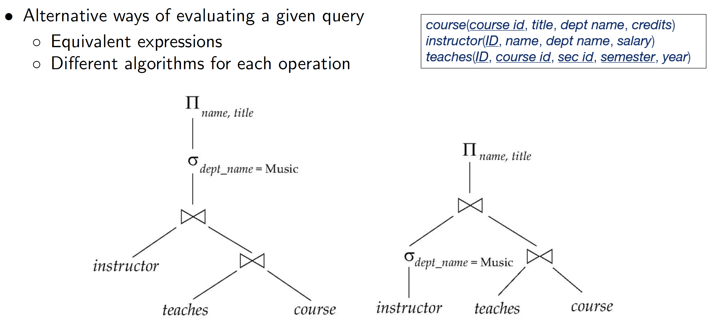


#### Evaluation Plan
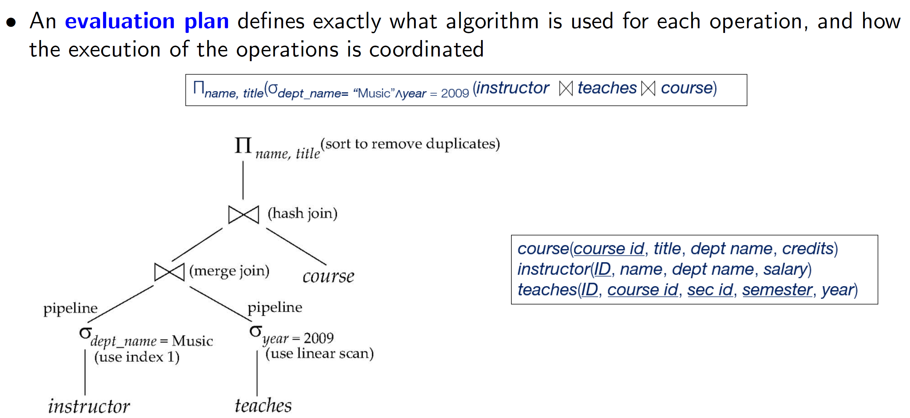


- Cost difference between evaluation plans for a query can be enormous
    - For example, seconds vs. days in some cases
- Steps in **cost-based query optimization**
    - Generate logically equivalent expressions using **equivalence rules**
    - Annotate resultant expressions to get alternative query plans
    - Choose the cheapest plan based on **estimated cost**
- Estimation of plan cost based on:
    - Statistical information about relations.
        - Examples: number of tuples, number of distinct values for an attribute
    - Statistics estimation for intermediate results
        - to compute cost of complex expressions
    - Cost formulae for algorithms, computed using statistics

### Transformation of Relational Expressions
- Two relational algebra expressions are said to be equivalent if the two expressions generate the same set of tuples on every legal database instance
  - Note: order of tuples is irrelevant
    - We do not care if they generate different results on databases that violate integrity constraints
- In SQL, inputs and outputs are multisets of tuples
    - Two expressions in the multiset version of the relational algebra are said to be equivalent if the two expressions generate the same multiset of tuples on every legal database instance.
- An equivalence rule says that expressions of two forms are equivalent
    - Can replace expression of first form by second, or vice versa


### Equivalence Rules

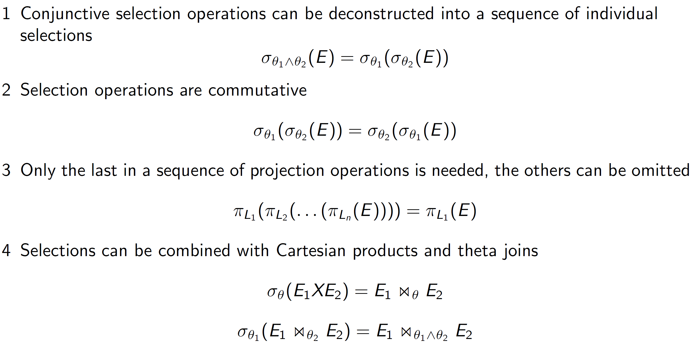   

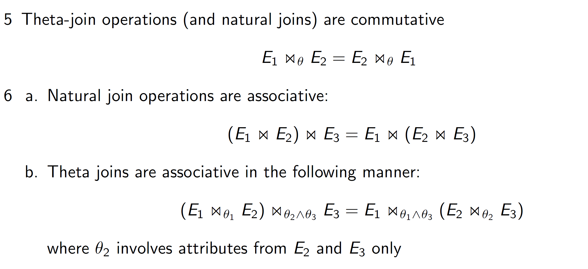   

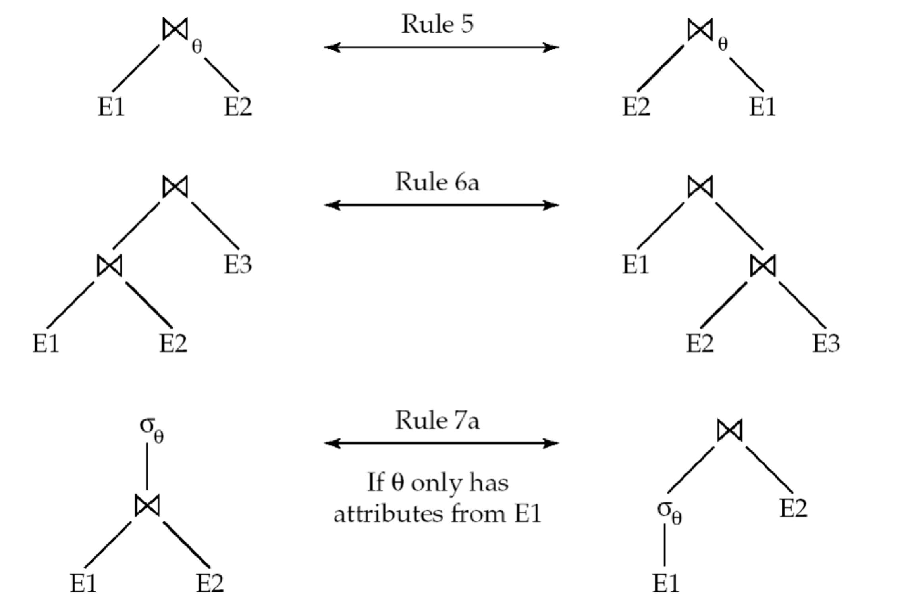  

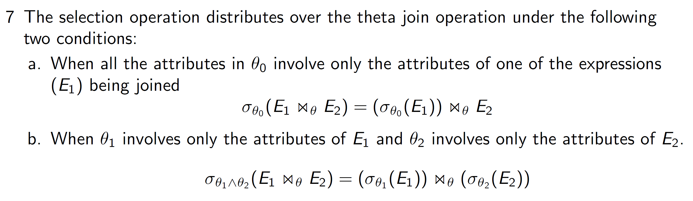

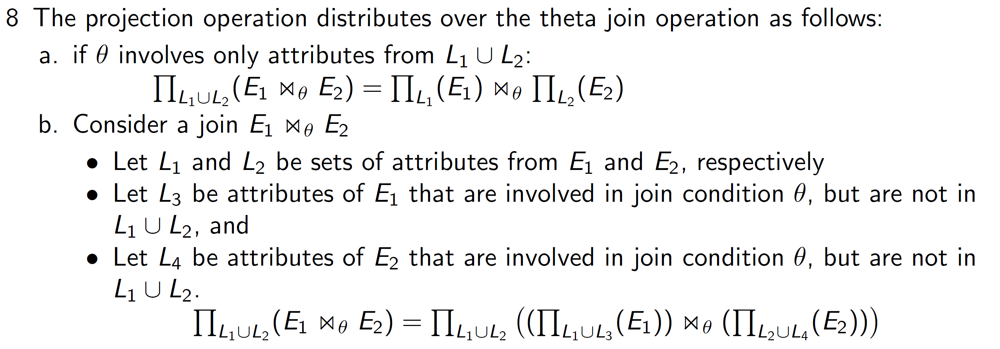  

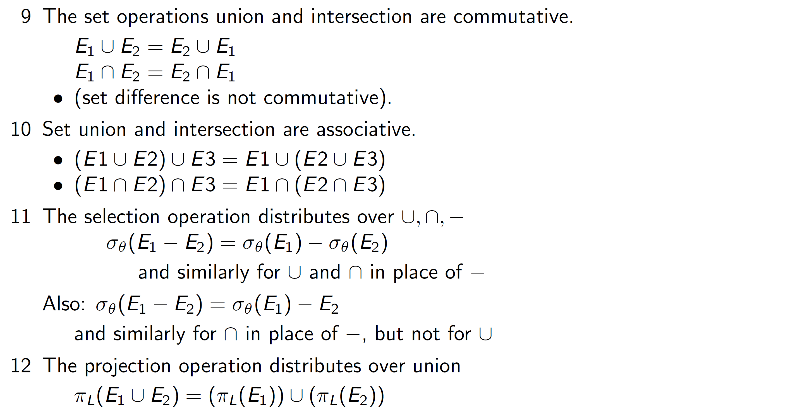


#### Pushing / Grouping Selections

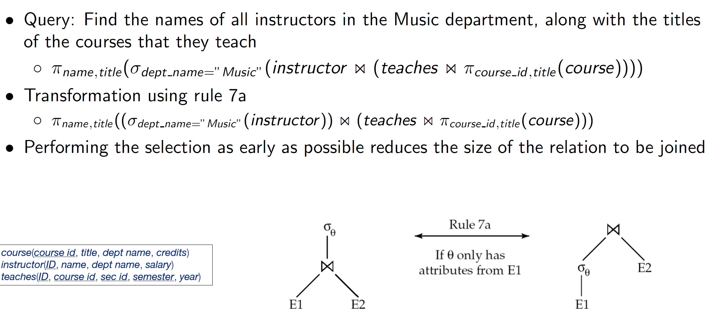

#### Multiple Transformations

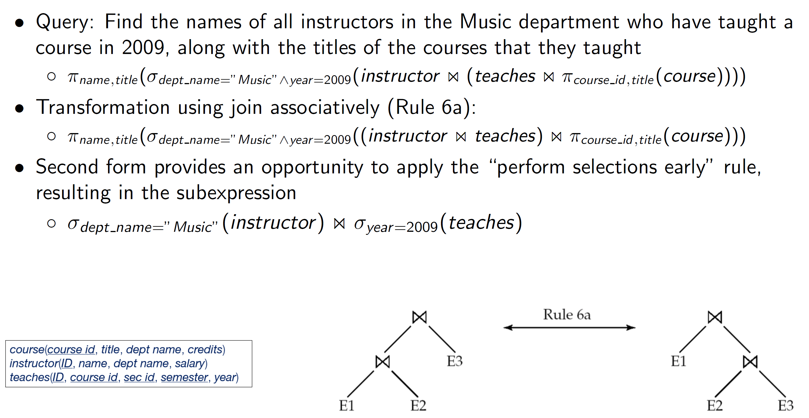

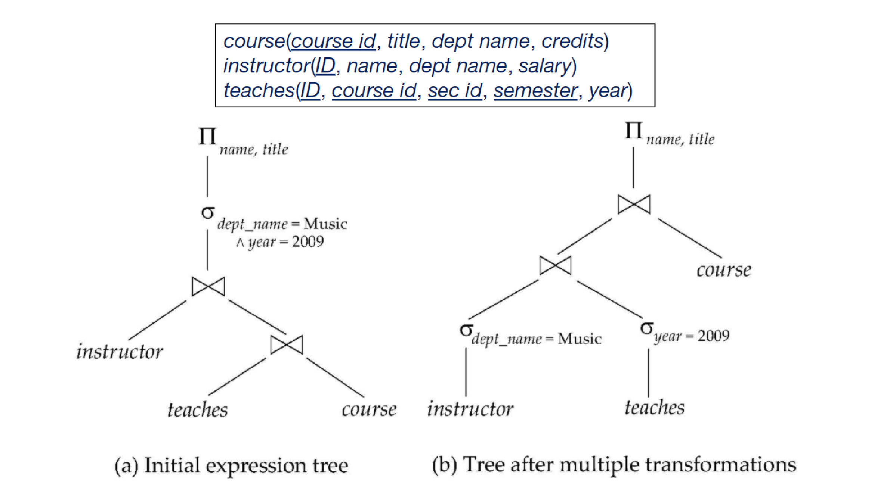  


#### Transformation Example: Pushing Projections
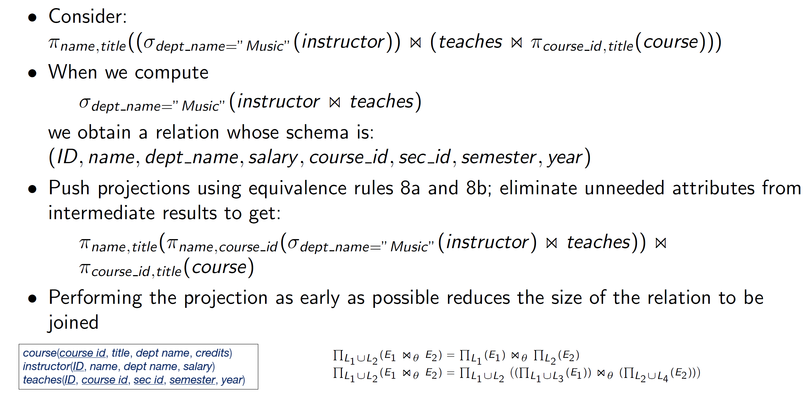 

### Join Ordering Example

- For all relations $r_1$, $r_2$, and $r_3$,
    - $(r_1 \Join r_2) \Join r_3 = r_1 \Join (r_2 \Join r3)$
      - called Join Associativity
- If $r_2 \Join r_3$ is quite large and $r_1 \Join r_2$ is small, we choose
    - $(r_1 \Join r_2) \Join r_3$
    - so that we compute and store a smaller temporary relation 

### Enumeration of Equivalent Expressions
- Query optimizers use equivalence rules to systematically generate expressions equivalent to the given expression
- Can generate all equivalent expressions as follows:
    - Repeat
        - apply all applicable equivalence rules on every sub expression of every equivalent expression found so far
        - add newly generated expressions to the set of equivalent expressions
      - Until no new equivalent expressions are generated above
- The above approach is very expensive in space and time
    - Two approaches
        - Optimized plan generation based on transformation rules
        - Special case approach for queries with only selections, projections and joins

### Implementing Transformation Based Optimization
- Space requirements reduced by sharing common sub-expressions:
        - when E1 is generated from E2 by an equivalence rule, usually only the top level of the two are different, subtrees below are the same and can be shared using pointers
            - E.g. when applying join commutativity
        - Same sub-expression may get generated multiple times
            - Detect duplicate sub-expressions and share one copy
- Time requirements are reduced by not generating all expressions
    - Dynamic programming - find current cost dynamically


## [L12.3 Module 58: RDBMS Performance & Architecture (30:56)](https://youtu.be/MGJaOVjdHvs)

